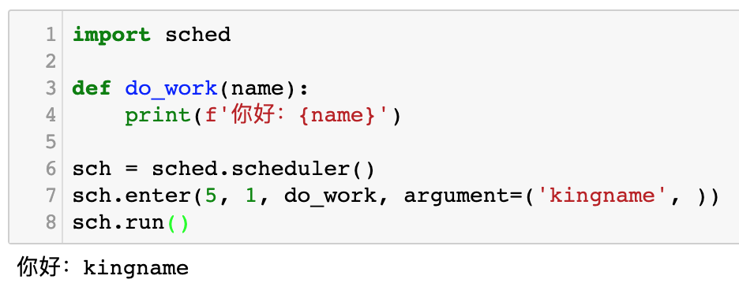
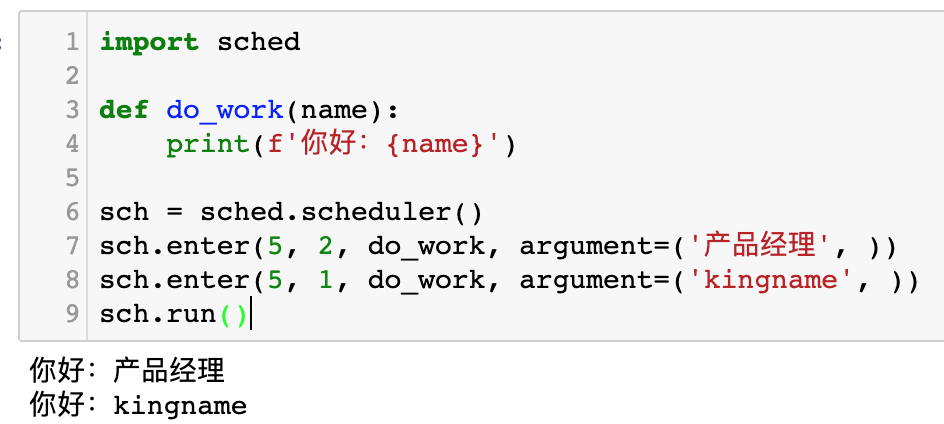
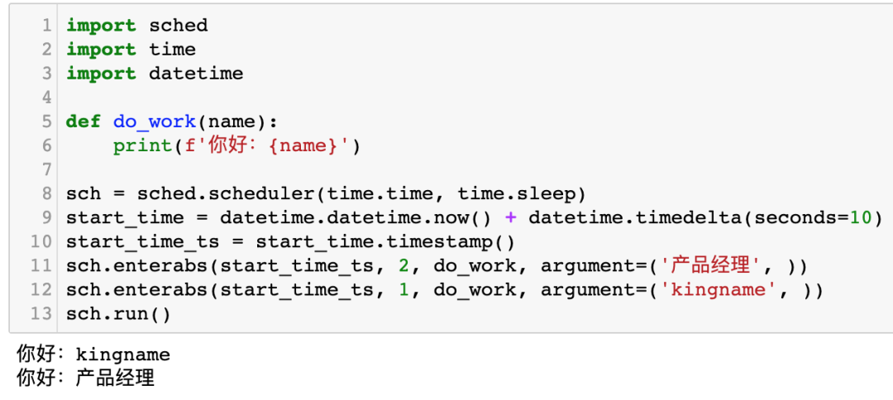

Python 优先级调度器<br />Python 自带一个调度器模块`sched`，它能实现优先级队列/延迟队列和定时队列。<br />这个模块的使用非常简单，首先以延迟队列为例：
```python
import sched

def do_work(name):
    print(f'你好：{name}')

sch = sched.scheduler()
sch.enter(5, 1, do_work, argument=('kingname', ))
sch.run()
```
代码运行以后，会卡在`sch.run()`这里，5秒钟以后执行`do_work('kingname')`，运行效果如下图所示：<br /><br />其中，`sch.enter()`的第一个参数为延迟的时间，单位为秒，第二个参数为优先级，数字越小优先级越高。当两个任务同时要执行时，优先级高的先执行。但需要注意的是，如果这样写：
```python
import sched

def do_work(name):
    print(f'你好：{name}')

sch = sched.scheduler()
sch.enter(5, 2, do_work, argument=('产品经理', ))
sch.enter(5, 1, do_work, argument=('kingname', ))
sch.run()
```
那么先打印出来的是`你好：产品经理`，如下图所示：<br /><br />为什么这里优先级失效了？1的优先级大于2，应该先运行下面的才对啊。<br />这是由于，只有当两个任务同时运行的时候，才会去检查优先级。如果两个任务触发的时间一前一后，那么还轮不到比较优先级。由于延迟队列的延迟是相对于当前运行这一行代码的时间来计算的，后一行代码比前一行代码晚了几毫秒，所以实际上产品经理这一行会先到时间，所以就会先运行。<br />为了使用绝对的精确时间，可以使用另外一个方法：
```python
import sched
import time
import datetime

def do_work(name):
    print(f'你好：{name}')

sch = sched.scheduler(time.time, time.sleep)
start_time = datetime.datetime.now() + datetime.timedelta(seconds=10)
start_time_ts = start_time.timestamp()
sch.enterabs(start_time_ts, 2, do_work, argument=('产品经理', ))
sch.enterabs(start_time_ts, 1, do_work, argument=('kingname', ))
sch.run()
```
运行效果如下图所示：<br /><br />`sch.enterabs()`的第一个参数是任务开始时间的时间戳，这是一个绝对时间，这个时间可以使用`datetime`模块来生成，或者其他熟悉的方式。后面的参数和`sch.enter()`完全一样。<br />如果要运行的函数带有多个参数或者默认参数，那么可以使用下面的方式传入参数：
```python
import sched
import time
import datetime

def do_work(name, place, work='写代码'):
    print(f'你好：{name}，你在：{place}{work}')

sch = sched.scheduler(time.time, time.sleep)
start_time = datetime.datetime.now() + datetime.timedelta(seconds=10)
start_time_ts = start_time.timestamp()
sch.enter(5, 2, do_work, argument=('产品经理', '杭州'), kwargs={'work': '写需求文档'})
sch.enterabs(start_time_ts, 1, do_work, argument=('kingname', '产品经理旁边'), kwargs={'work': '看着她'})
sch.run()
```
`argument`参数对应的元组存放普通参数，`kwargs`对应的字典存放带参数名的参数。
