Python
<a name="JXdEB"></a>
## 🔹 介绍：什么是JSON
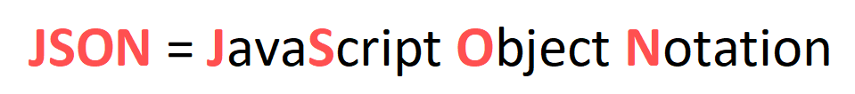<br />JSON格式的产生最初是受到JavaScript（一种用于Web开发的编程语言）语法的启发，但在那之后，它成为一种**独立于语言的数据格式**，并且大多数编程语言都可以生成和读取JSON。
<a name="ODZT7"></a>
### JSON的重要性和使用例子
基本上，JSON是一种用于存储或表示数据的格式。它的常见用例包括Web开发和配置文件。<br />看看原因：

- **Web开发：** 在Web应用程序中，通常用JSON从服务端向客户端发送数据，反之亦然。

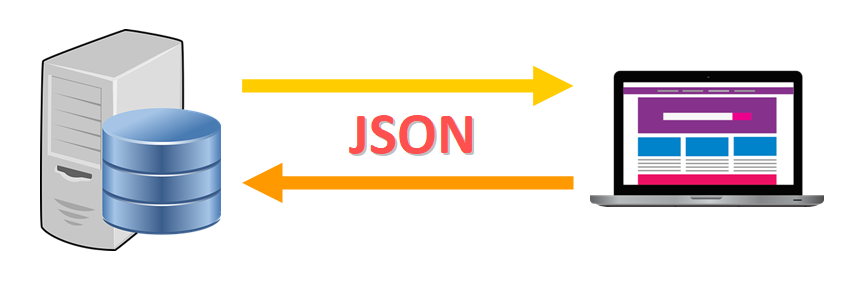

- **配置文件：** JSON还用于存储配置和设置信息。例如，要创建Google Chrome App，则需要一个名为manifest.json的JSON文件，用于指定应用程序的名称、描述、当前版本以及其它属性和设置。


<a name="HaMrs"></a>
## 🔸 JSON的结构和格式
既然已经知道了JSON的用途，那么通过一个比萨饼订单数据的示例来看看它的基本结构：
```json
{ 
  "size": "medium",
  "price": 15.67,
  "toppings": ["mushrooms", "pepperoni", "basil"],
  "extra_cheese": false,
  "delivery": true,
  "client": {
    "name": "Jane Doe",
    "phone": null,
    "email": "janedoe@email.com"
  }
}
```
上面是示例的sample.json文件。<br />以下是JSON格式的主要特征：

- 有一系列用花括号{}括起来的键-值对。
- 每个键都使用以下格式映射到特定值：
```
"key": <value>
```
💡 **提示：**value的内容必须用双引号括起来。

- 键-值对用逗号分隔，只有最后一对后面可以不加逗号。
```json
{
  "size": "medium", # Comma!
  "price": 15.67
}
```
💡 **提示：** 通常使用不同级别的缩进来格式化JSON，以使数据更易于阅读。学习如何使用Python自动添加缩进。
<a name="oWoJX"></a>
### JSON数据类型：键和值
JSON文件具有特定规则，其用于确定哪些数据类型是有效的键和值。

- **键**必须是字符串。
- **值**可以是字符串、数字、数组、布尔值（true/false）、null或JSON对象。

根据Python文档：<br />JSON的键/值对中的键始终是str类型。当字典转换为JSON时，字典中的所有键都被强制转换为字符串。
<a name="Gua8S"></a>
### 风格指南
根据Google JSON Style Guide：

- 始终使用有意义的名称。
- 数组类型的值对应的键名应使用复数形式，所有其它键名应为单数形式。例如：如果对应的值是数组，请使用orders而不是order。
- JSON数据中不应该有注释。
<a name="ANoUc"></a>
## 🔹 JSON vs. Python Dictionaries（字典数据类型）
JSON和字典从显示形式来看可能非常相似，但它们有很大的不同。看看它们是如何“连接（译者：这里意思应该是它们之间的关系）”，以及如何相互补充，来使得Python成为处理JSON文件的强大工具。<br />JSON是用于表示和存储数据的文件格式，而Python字典是Pythons程序运行时保存在内存中的实际数据结构（对象）。
<a name="vtN6Y"></a>
### JSON和Python字典如何协同工作
<br />当在Python中处理JSON文件时，不能直接读取数据并在程序中使用它，这是因为整个文件被表示为单个字符串，无法单独访问键值对。<br />除非······<br />使用JSON文件的键-值对创建一个Python字典，这样就可以在程序中使用它来读取、使用和修改（如果需要的话）数据。<br />这是JSON和Python字典之间的“联系”：JSON是数据的字符串表示，字典是程序运行时在内存中创建的实际数据结构。（译者注：字典转换为JSON叫序列化，反之为反序列化）<br />很好，既然已经对JSON有足够多的了解，那么开始深入了解实际情况中如何在Python里使用JSON的。
<a name="YPSab"></a>
## 🔸 JSON模块
幸运的是，Python自带一个名为json的内置模块，安装Python时会自动安装该模块，这个模块包含一些帮助处理JSON文件和字符串的功能。<br />将在接下来的示例中使用此模块。
<a name="lA2wC"></a>
### 如何导入JSON模块
要在程序中使用json，只需在文件顶部写一个导入语句。（译者注：实际上只要在使用它之前导入就行）<br />就像这样：<br /><br />通过此行就可以使用模块中定义的函数，将在示例中调用其中几个方法。<br />**💡 提示：** 如果写了上面的导入语句，则需要使用下面的语法来调用在json模块中定义的函数：<br />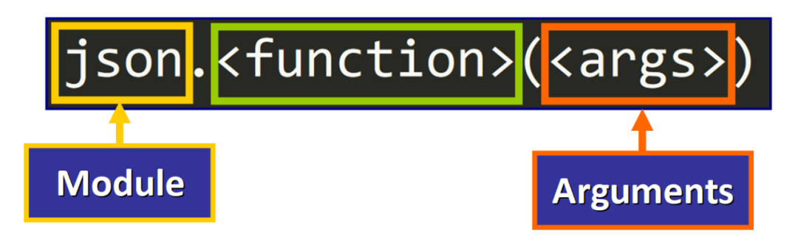
<a name="EpjM7"></a>
## 🔹 Python和JSON字符串
为了说明json模块中最重要的一些函数是如何工作的，使用JSON格式的多行字符串。
<a name="FZ1L6"></a>
### JSON字符串
特别地，这个字符串只是一个普通的遵循JSON格式的多行Python字符串，在示例中使用它。
```python
data_JSON =  """
{
 "size": "Medium",
 "price": 15.67,
 "toppings": ["Mushrooms", "Extra Cheese", "Pepperoni", "Basil"],
 "client": {
  "name": "Jane Doe",
  "phone": "455-344-234",
  "email": "janedoe@email.com"
 }
}
"""
```
JSON字符串

- 使用三重引号在Python中定义多行字符串。
- 然后将字符串赋给变量data_JSON。

💡 **提示：**Python Style Guide建议三重引号字符串使用双引号。
<a name="xiP1G"></a>
### JSON字符串到Python字典
将使用此JSON格式的字符串来创建一个可以访问、使用和修改的Python字典。<br />为此，将使用json模块的`loads()`函数，并将字符串作为参数传递进去。<br />这是基本语法：<br />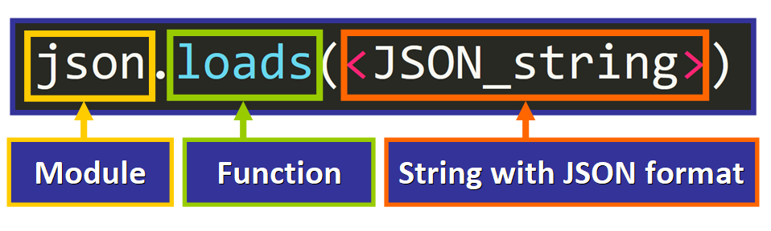<br />这是代码：
```python
# 导入模块
import json

# JSON格式的字符串
data_JSON =  """
{
 "size": "Medium",
 "price": 15.67,
 "toppings": ["Mushrooms", "Extra Cheese", "Pepperoni", "Basil"],
 "client": {
  "name": "Jane Doe",
  "phone": "455-344-234",
  "email": "janedoe@email.com"
 }
}
"""

# 将JSON字符串转换为字典
data_dict = json.loads(data_JSON)
```
注意这行：
```python
data_dict = json.loads(data_JSON)
```

- `json.loads(data_json)`使用JSON字符串的键-值对创建一个新字典，并返回这个字典。
- 然后返回的字典被赋值给变量data_dict。

如果打印这个字典，会看到以下输出：
```json
{'size': 'Medium', 'price': 15.67, 'toppings': ['Mushrooms', 'Extra Cheese', 'Pepperoni', 'Basil'], 'client': {'name': 'Jane Doe', 'phone': '455-344-234', 'email': 'janedoe@email.com'}}
```
字典中已填充了JSON字符串的数据，每个键值对都被成功添加到字典里。<br />现在尝试使用与访问常规Python字典相同的语法，来访问键-值对的值，看看会发生什么：
```python
print(data_dict["size"])
print(data_dict["price"])
print(data_dict["toppings"])
print(data_dict["client"])
```
输出是：
```
Medium
15.67
['Mushrooms', 'Extra Cheese', 'Pepperoni', 'Basil']
{'name': 'Jane Doe', 'phone': '455-344-234', 'email': 'janedoe@email.com'}
```
每个键都可以用来访问其对应的值，正如期望的那样。<br />💡 **提示：** 可以像使用任何其它Python字典一样来使用此字典。例如，可以调用字典的方法，添加、更新和删除键-值对，以及其它等等操作，甚至可以在for循环中使用它。
<a name="svFVo"></a>
### JSON到Python：类型转换
当使用`loads()`从JSON字符串来创建Python字典时，会注意到一些值将被转换为Python中对应的值和数据类型。<br />Python文档上的这个json模块表格总结了JSON数据类型和Python数据类型的对应关系：<br />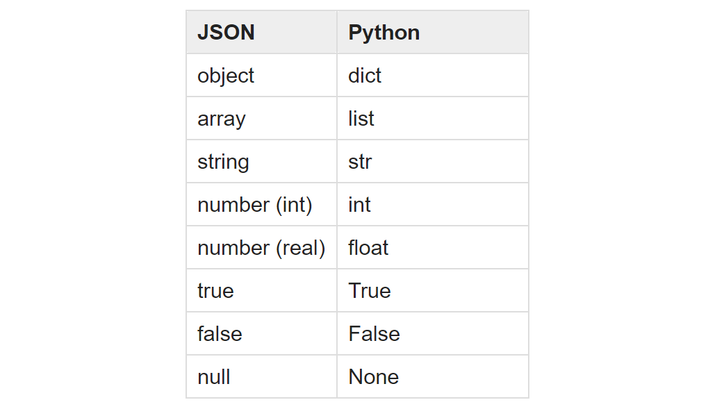<br />**💡 提示：**当处理JSON文件时，转换表同样也适用。
<a name="JsF2v"></a>
### Python字典到JSON字符串
现在知道了如何用JSON格式的字符串创建Python字典。<br />但有时可能需要做相反的事情，即用对象（例如字典）创建JSON格式的字符串，以便打印、显示、存储，或者将其作为字符串使用。<br />为此，可以使用json模块的dumps函数，该函数要求将（要转换的）对象作为参数传递：<br />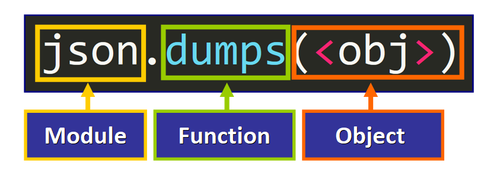<br />**💡 提示：** 此函数将返回一个字符串。<br />这是一个例子，将Python字典`client`转换为JSON格式的字符串，并将其赋值给变量：
```python
# Python Dictionary
client = {
    "name": "Nora",
    "age": 56,
    "id": "45355",
    "eye_color": "green",
    "wears_glasses": False
}

# 获得一个JSON格式的字符串
client_JSON = json.dumps(client)
```
注意这行：
```python
client_JSON = json.dumps(client)
```

- `json.dumps(client)`创建并返回一个包含字典中所有键-值对的JSON格式的字符串。
- 然后将此字符串赋值给client_JSON变量。

如果打印这个字符串，会看到如下输出：
```json
{"name": "Nora", "age": 56, "id": "45355", "eye_color": "green", "wears_glasses": false}
```
💡 **提示：** 请注意，最后一个值（false）已更改。在Python字典中，此值为`False`，但在JSON中等效值为false，这有助于确认原始字典现在确实已经表示为JSON格式的字符串。<br />如果检查此变量（client_JSON）的数据类型，会看到：
```
<class 'str'>
```
所以这个函数的返回值确实是一个字符串。
<a name="WXe4O"></a>
### Python到JSON：类型转换
当字典转换为JSON字符串时，也会发生类型转换过程。来自Python文档的这张表显示了二者相对应的值：<br />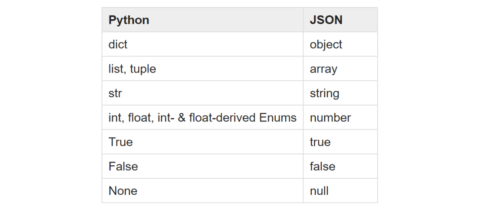<br />表格来自官方json模块文档。
<a name="kPPzo"></a>
### 如何使用缩进打印JSON数据
如果使用`dumps`函数打印上一示例中得到的字符串，会看到：
```json
{"name": "Nora", "age": 56, "id": "45355", "eye_color": "green", "wears_glasses": false}
```
但是这样可读性不是很高，对吧？<br />可以通过添加**缩进**来提高JSON字符串的可读性。<br />只需传递第二个参数来指定要用于JSON字符串缩进的空格数，（`dumps`函数）就会自动执行此操作：<br />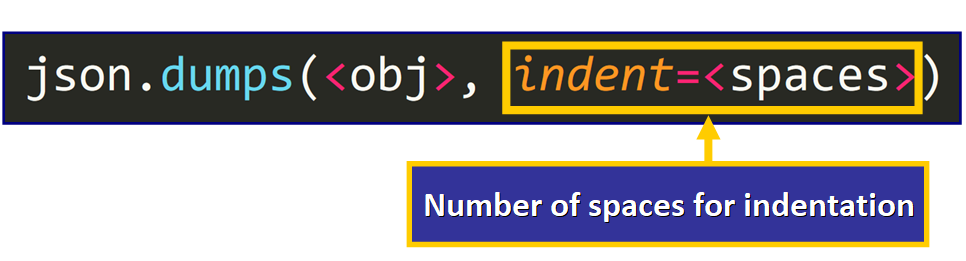<br />**💡 提示：** 第二个参数必须是非负整数（表示空格数）或字符串，如果`indent`是一个字符串（例如`"\t"`），则用该字符串缩进每个级别（帮助文档）。<br />现在，如果使用第二个参数来调用`dumps`：
```python
client_JSON = json.dumps(client, indent=4)
```
打印client_JSON的结果是：
```json
{
  "name": "Nora",
  "age": 56,
  "id": "45355",
  "eye_color": "green",
  "wears_glasses": false
}
```
现在字符串格式很好看，这对处理存储人类可读格式的数据的文件来说将非常有用。
<a name="mAy9y"></a>
### 如何对键排序
如果有需要，还可以按字母顺序对键进行排序，只需写入参数sort_keys并传递值True：<br />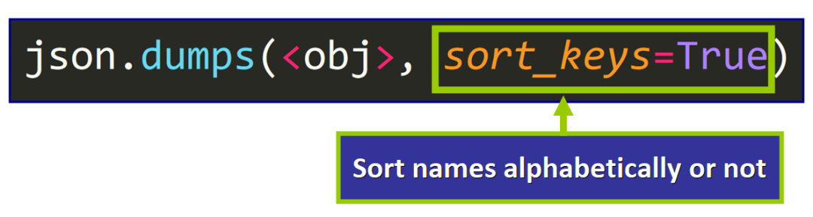<br />💡 **提示：** 如果不传递值，`sort_keys`默认为`False`。<br />例如：
```python
client_JSON = json.dumps(client, sort_keys=True)
```
将会返回键按字母顺序排序的JSON字符串：
```json
{"age": 56, "eye_color": "green", "id": "45355", "name": "Nora", "wears_glasses": false}
```
<a name="UTHcD"></a>
### 如何同时按字母排序和使用缩进
要生成（键）按字母顺序和有缩进的JSON字符串，只需要传递两个参数：<br />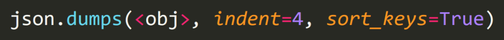<br />在这个例子中，输出是：
```json
{
  "age": 56,
  "eye_color": "green",
  "id": "45355",
  "name": "Nora",
  "wears_glasses": false
}
```
**💡 提示：** 可以按任何顺序（相对于彼此）传递这两个参数，但（要进行转换的）对象必须是第一个参数。<br />现在已经知道如何使用JSON字符串，那就看看如何在Python程序中处理JSON文件。
<a name="jW9C4"></a>
## 🔸 JSON和文件
JSON通常用于将数据存储在文件中，因此Python提供了在程序中读取这些类型的文件、处理文件的数据以及编写新数据所需的工具。<br />**💡 提示：**JSON文件有一个.json扩展名：<br /><br />来看看如何在Python中处理.json文件。
<a name="aIwhI"></a>
### 在Python中如何读取JSON文件
假设创建了一个 orders.json 文件，文件中有披萨店两个订单的数据：
```json
{
  "orders": [ 
    {
      "size": "medium",
      "price": 15.67,
      "toppings": ["mushrooms", "pepperoni", "basil"],
      "extra_cheese": false,
      "delivery": true,
      "client": {
        "name": "Jane Doe",
        "phone": null,
        "email": "janedoe@email.com"
      }
    },
    {
      "size": "small",
      "price": 6.54,
      "toppings": null,
      "extra_cheese": true,
      "delivery": false,
      "client": {
        "name": "Foo Jones",
        "phone": "556-342-452",
        "email": null
      }
    }
  ]
}
```
orders.json<br />请花点时间分析此JSON文件的结构。<br />以下是一些提示：

- 请注意值的数据类型、缩进和文件的整体结构。
- 主键"orders"的值是一个JSON对象数组（这个数组在Python中表示列表），（数组里）每个JSON对象都保存了披萨订单的数据。

如果想在Python中读取此文件，只需要使用`with`语句：<br />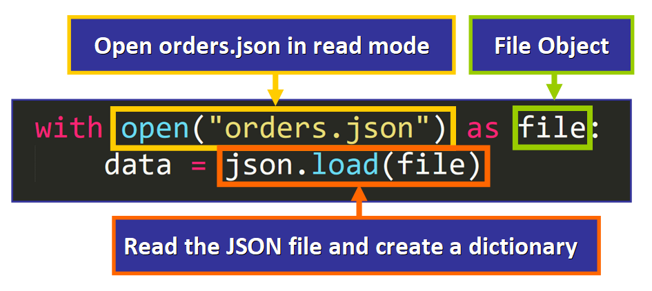<br />💡 **提示：** 在上面的语法中，可以为file（绿色框）指定任何名称，这是一个可以在`with`语句中用来引用文件对象的变量。<br />此语法中的关键代码行是：
```python
data = json.load(file)
```

- `json.load(file)`创建并返回一个新的包含JSON文件中键-值对的Python字典。
- 然后将该字典赋值给data变量。

💡 **提示：** 请注意，使用的是`load()`而不是`loads()`，这是json模块中的不同函数。在本文的末尾了解更多它们的差异。<br />一旦将JSON文件的内容作为字典存储在data变量中，就可以使用它做想要做的任何事情。
<a name="V99yL"></a>
### 例子
例如，如果执行：
```python
print(len(data["orders"]))
```
输出为2，因为主键orders的值是一个包含两个元素的列表。<br />还可以使用键访问其对应的值，即处理JSON文件时通常要做的事情。<br />例如，要访问第一个订单的toppings，执行：
```python
data["orders"][0]["toppings"]
```

- 首先，选择主键"orders"
- 然后，选择列表中的第一个元素（索引0）
- 最后，选择与键"toppings"对应的值

可以在图表中以图形方式看到此“路径”：<br />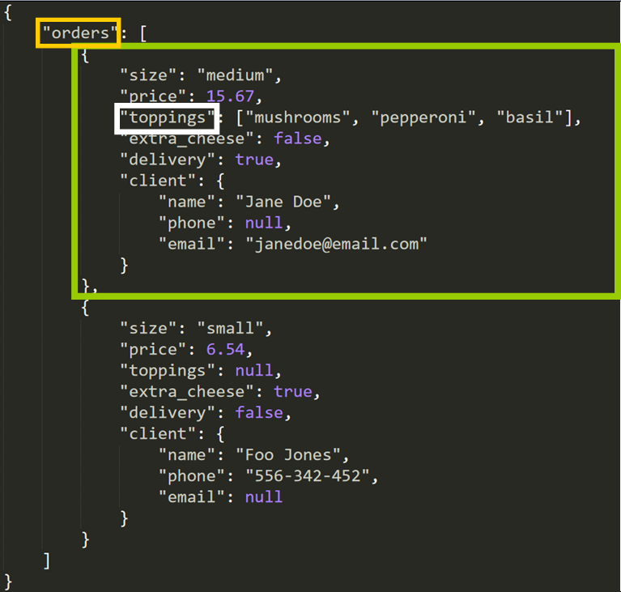<br />如果打印这个值，输出是：
```python
['mushrooms', 'pepperoni', 'basil']
```
这正是期望的。只需要通过使用必要的键和索引来“深入”了解字典的结构（可以使用原始JSON文件或字符串作为视觉参考），就可以访问、修改或删除任何值。<br />**💡 提示：** 请记住，正在使用新创建的字典，对此字典所做的更改不会影响原JSON文件。要更新文件的内容，需要写入文件中。
<a name="JmX8c"></a>
### 如何写一个JSON文件
看看如何写一个JSON文件。<br />第一行的`with`语句（和读JSON文件）非常相似，唯一的改变是需要以`'w'`（即写入）模式打开文件，这样才能修改文件。<br />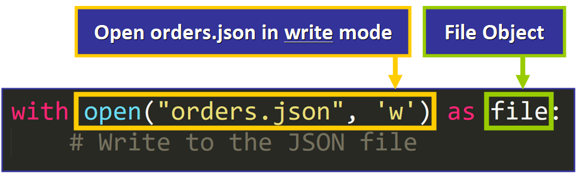<br />**💡 提示：** 如果当前工作目录（文件夹）中文件不存在，则会自动创建该文件。如果文件存在，通过使用`'w'`模式，将替换文件的全部内容。<br />在`with`语句中，有两种写入JSON文件的方法：

- `dump`
- `dumps`

详细看看。
<a name="LJpme"></a>
#### 第一种方法：`dump`
这是一个有两个参数的函数：

- 将以JSON格式存储的对象（例如字典）。
- 将存储该JSON字符串的文件（即文件对象）。

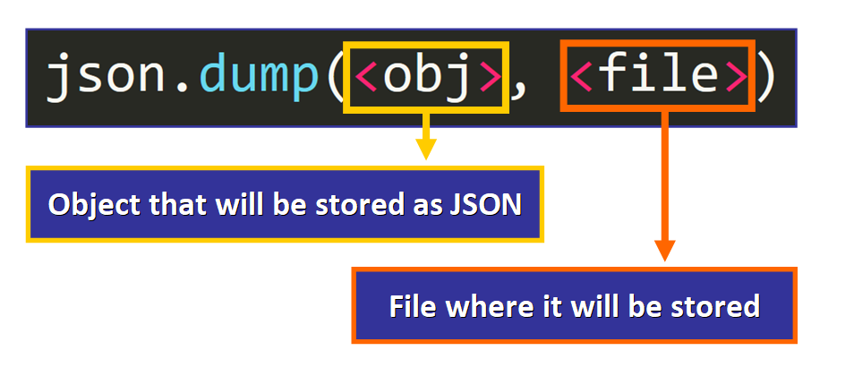<br />如果披萨店想从JSON文件中删除客户的数据，并创建一个新版本的orders_new.json文件。<br />可以通过以下代码完成此操作：
```python
# 打开orders.json文件
with open("orders.json") as file:
    # 加载它的内容并创建一个新字典
    data = json.load(file)

    # 在每个order中删除"client"键-值对
    for order in data["orders"]:
        del order["client"]

# 打开（或者创建）一个orders_new.json文件
# 保存新版本的数据
with open("orders_new.json", 'w') as file:
    json.dump(data, file)
```
这是 orders.json 中数据的原始版本，请注意里面存在"client"键-值对。
```json
{
  "orders": [ 
    {
      "size": "medium",
      "price": 15.67,
      "toppings": ["mushrooms", "pepperoni", "basil"],
      "extra_cheese": false,
      "delivery": true,
      "client": {
        "name": "Jane Doe",
        "phone": null,
        "email": "janedoe@email.com"
      }
    },
    {
      "size": "small",
      "price": 6.54,
      "toppings": null,
      "extra_cheese": true,
      "delivery": false,
      "client": {
        "name": "Foo Jones",
        "phone": "556-342-452",
        "email": null
      }
    }
  ]
}
```
orders.json<br />这是orders_new.json文件里的新版本数据：
```json
{"orders": [{"size": "medium", "price": 15.67, "toppings": ["mushrooms", "pepperoni", "basil"], "extra_cheese": false, "delivery": true}, {"size": "small", "price": 6.54, "toppings": null, "extra_cheese": true, "delivery": false}]}
```
orders_new.json<br />如果仔细分析，会发现"clients"键-值对从所有订单中被删除。<br />然而，这个文件中缺少了一些东西，对吗？<br />请花点时间思考一下…可能是什么？<br />当然是缩进！<br />该文件实际上看起来不像JSON文件，但可以通过将参数`indentation=4`传递给`dump()`来轻松解决这个问题。<br />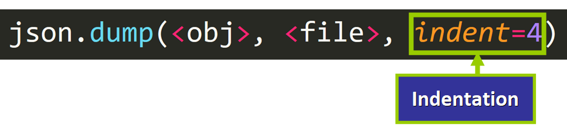

现在文件内容如下所示：
```json
{
  "orders": [
    {
      "size": "medium",
      "price": 15.67,
      "toppings": [
        "mushrooms",
        "pepperoni",
        "basil"
      ],
      "extra_cheese": false,
      "delivery": true
    },
    {
      "size": "small",
      "price": 6.54,
      "toppings": null,
      "extra_cheese": true,
      "delivery": false
    }
  ]
}
```
orders_new.json<br />多么大的变化啊！这正是期望的JSON文件的样子。<br />现在已经知道如何使用`load()`和`dump`来读取和写入JSON文件，就看看这两个函数和用来处理JSON字符串的函数之间的区别。
<a name="Wj7Dv"></a>
## 🔹 `load()` vs. `loads()`
这个表格总结了这两个函数之间的主要区别：<br />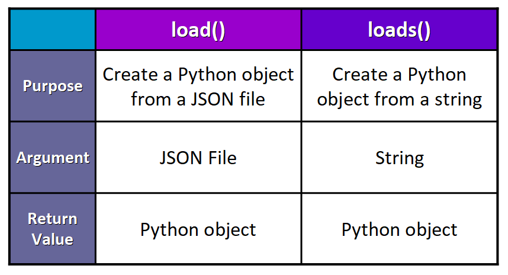<br />💡 **提示：** 将`loads()`视为"load string"，这有助于记住函数处理的目标。
<a name="xZyH2"></a>
## 🔸 `dump()` vs. `dumps()`
这是一个总结了两个函数之间主要差异的表格：<br />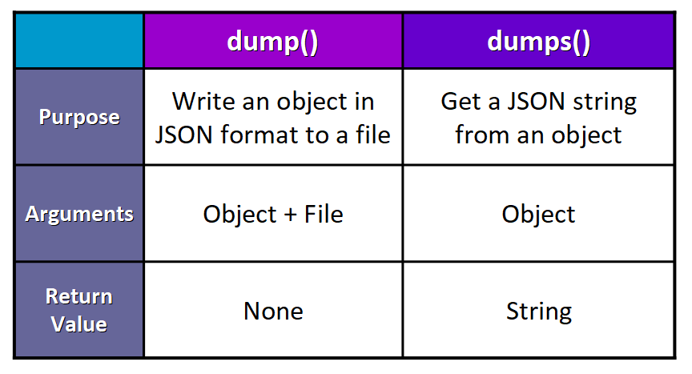<br />💡 **提示：** 将`dumps()`视为"dump string"，这有助于记住函数处理的目标。
<a name="rjKfw"></a>
## 🔹 JSON中的重要术语
最后，使用JSON需要了解两个重要术语：

- **序列化：** 将一个对象转换为JSON字符串
- **反序列化：** 将一个JSON字符串转换为对象
<a name="LclPZ"></a>
## 🔸 总结

- JSON（JavaScript Object Notation）是一种用于表示和存储的数据格式。
- 它通常用于存储配置信息和在网络上传输数据。
- JSON文件有一个.json扩展名。
- 可以将JSON字符串转换为Python对象，反之亦然。
- 可以读取JSON文件并用其键-值对创建Python对象。
- 可以以JSON格式存储Python对象的内容，并将其写入JSON文件。

---

原文链接：[https://www.freecodecamp.org/news/python-read-json-file-how-to-load-json-from-a-file-and-parse-dumps/](https://www.freecodecamp.org/news/python-read-json-file-how-to-load-json-from-a-file-and-parse-dumps/)<br />作者：Estefania Cassingena Navone
