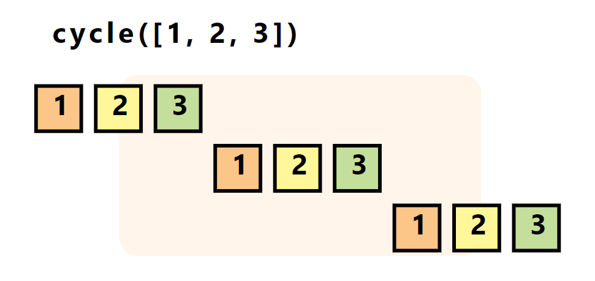

Python用来处理迭代器的工具你想到了啥？itertools 就是一个特别有用的库，它提供了一系列用于创建和操作迭代器的工具，以下是10个常用的操作，可用在实际工作中，熟练掌握这些操作，将极大提升在 Python 中的编程效率。
<a name="JPRgt"></a>
### 1、无限计数器：`count()`
`count(start, step)` 用于创建一个无限的迭代器，从 start 开始，每次增加 step。
```python
import itertools

for num in itertools.count(10, 2):
    if num > 20:
        break
    print(num)
```
<a name="TCo3N"></a>
### 2、循环迭代：`cycle()`
`cycle(iterable)` 会无限重复迭代一个可迭代对象。<br />
```python
counter = 0
for item in itertools.cycle('ABCD'):
    if counter > 7:
        break
    print(item)
    counter += 1
```
<a name="DzzYC"></a>
### 3、重复元素：`repeat()`
`repeat(object, times)` 重复一个对象 `times` 次。
```python
for item in itertools.repeat('Hello', 3):
    print(item)
```
<a name="WUX7c"></a>
### 4、链接迭代器：`chain()`
`chain(*iterables)` 用于链接多个迭代器。
```python
for item in itertools.chain([1, 2, 3], ['a', 'b']):
    print(item)
```
<a name="abSQ0"></a>
### 5、数据过滤：`compress()`
`compress(data, selectors)` 根据 `selectors` 中的布尔值过滤 data。
```python
for item in itertools.compress('ABCDE', [1,0,1,0,1]):
    print(item)
```
<a name="e4Ncb"></a>
### 6、迭代器切片：`islice()`
`islice(iterable, start, stop[, step])` 对迭代器进行切片操作。
```python
for item in itertools.islice(range(10), 2, 8, 2):
    print(item)
```
<a name="kLJ8p"></a>
### 7、笛卡尔积：`product()`
`product(*iterables, repeat=1)` 创建一个迭代器，生成输入迭代器的笛卡尔积。
```python
for item in itertools.product('AB', range(2)):
    print(item)
```
<a name="kkYJE"></a>
### 8、排列组合：`permutations()`
`permutations(iterable, r=None)` 返回可迭代对象的所有长度为 `r` 的排列。
```python
for item in itertools.permutations('ABC', 2):
    print(item)
```
<a name="QW272"></a>
### 9、组合生成：`combinations()`
`combinations(iterable, r)` 返回可迭代对象的所有长度为 `r` 的组合。
```python
for item in itertools.combinations('ABC', 2):
    print(item)
```
<a name="lNyp5"></a>
### 10、组合生成（允许重复）：`combinations_with_replacement()`
`combinations_with_replacement(iterable, r)` 类似于 `combinations`，但允许元素重复。
```python
for item in itertools.combinations_with_replacement('ABC', 2):
    print(item)
```
<a name="DPGXf"></a>
### 结语
itertools 库提供了强大而灵活的工具集，用于处理各种迭代任务。无论是简单的数据重复还是复杂的数据组合，itertools 都能轻松应对。
