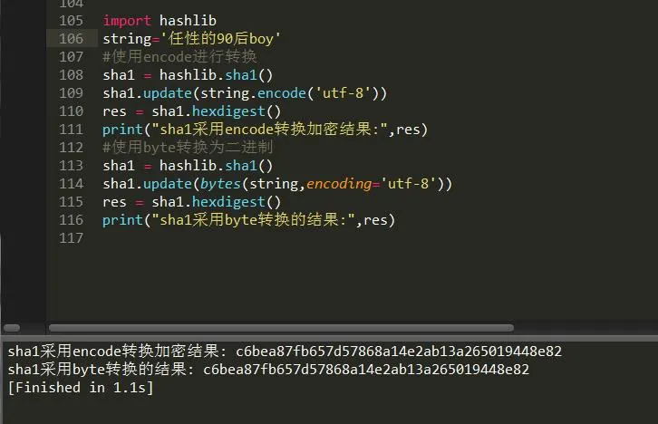

Python 加密解密 hashlib
<a name="sLK8a"></a>
### 前言
在程序中经常可以看到有很多的加密算法，比如说MD5 sha1等，就来了解下这下加密算法的吧，在了解之前需要知道一个模块hashlib，他就是目前Python一个提供字符加密的模块，它加密的字符类型为二进制编码，所以直接加密字符串会报错。
```python
import hashlib
string='任性的90后boy'
#使用encode进行转换
sha1 = hashlib.sha1()
sha1.update(string.encode('utf-8'))
res = sha1.hexdigest()
print("sha1采用encode转换加密结果:",res)
#使用byte转换为二进制
sha1 = hashlib.sha1()
sha1.update(bytes(string,encoding='utf-8'))
res = sha1.hexdigest()
print("sha1采用byte转换的结果:",res)
```
<br />可以使用下列这两种方法任意一种获取到hashlib中所有的散列算法集合：
```python
import hashlib
a=hashlib.algorithms_available 
b=hashlib.algorithms_guaranteed
print(a)
print(b)
```
下面挑选常用的集中算法来进行分析。
<a name="hoUmN"></a>
### 一、MD5
即Message-Digest Algorithm 5(信息-摘要算法5)，用于确保信息传输完整一致。是计算机广泛使用的杂凑算法之一(又译摘要算法、哈希算法)，主流编程语言普遍已有MD5实现。将数据(如汉字)运算为另一固定长度值，是杂凑算法的基础原理，MD5的前身有MD2、MD3和MD4。<br />MD5算法具有以下特点:<br />1、压缩性:任意长度的数据，算出的MD5值长度都是固定的。<br />2、容易计算:从原数据计算出MD5值很容易。<br />3、抗修改性:对原数据进行任何改动，哪怕只修改1个字节，所得到的MD5值都有很大区别。<br />4、强抗碰撞:已知原数据和其MD5值，想找到一个具有相同MD5值的数据(即伪造数据)是非常困难的。<br />MD5的作用是让大容量信息在用数字签名软件签署私人密钥前被"压缩"成一种保密的格式(就是把一个任意长度的字节串变换成一定长的十六进制数字串)。MD5是最常见的摘要算法，速度很快，生成结果是固定的128 bit字节，通常用一个32位的16进制字符串表示。
```python
import hashlib
string='任性的90后boy'
md5 = hashlib.md5() 
md5.update(string.encode('utf-8'))#转码，update里的必须是字节型
res = md5.hexdigest() #返回字符型摘要信息
print(md5.digest())#返回字节型的摘要信息
print("md5加密结果:",res)
```
<a name="MLAWB"></a>
### 二、sha1
安全散列算法，SHA1的结果是160 bit字节，通常用一个40位的16进制字符串表示
```python
import hashlib
string='任性的90后boy'
sha1 = hashlib.sha1()
sha1.update(string.encode('utf-8'))
res = sha1.hexdigest()
print("sha1加密结果:",res)
```
<a name="iKiWL"></a>
### 三、sha224
安全散列算法
```python
import hashlib
string='任性的90后boy'
sha224 = hashlib.sha224()
sha224.update(string.encode('utf-8'))
res = sha224.hexdigest()
print("sha224加密结果:",res)
```
<a name="usxZc"></a>
### 四、sha256
安全散列算法
```python
import hashlib
string='任性的90后boy'
sha256 = hashlib.sha256()
sha256.update(string.encode('utf-8'))
res = sha256.hexdigest()
print("sha256加密结果:",res)
```
<a name="XsFiV"></a>
### 五、sha384
安全散列算法
```python
import hashlib
string='任性的90后boy'
sha384 = hashlib.sha384()
sha384.update(string.encode('utf-8'))
res = sha384.hexdigest()
print("sha384加密结果:",res)
```
<a name="1E4W9"></a>
### 六、sha512
安全散列算法
```python
import hashlib
string='任性的90后boy'
sha512= hashlib.sha512()
sha512.update(string.encode('utf-8'))
res = sha512.hexdigest()
print("sha512加密结果:",res)
```
<a name="3PJZZ"></a>
### 七、高级加密
以上加密算法虽然依然非常厉害，但时候存在缺陷，即：通过撞库可以反解。所以，有必要对加密算法中添加自定义key再来做加密。
```python
md5 = hashlib.md5()
md5.update('md5'.encode('utf-8'))
res = md5.hexdigest()
print("普通加密:",res)
md51 = hashlib.md5(b'md512')
md51.update('md51'.encode('utf-8'))
res = md51.hexdigest()
print("采用key加密:",res)
```
