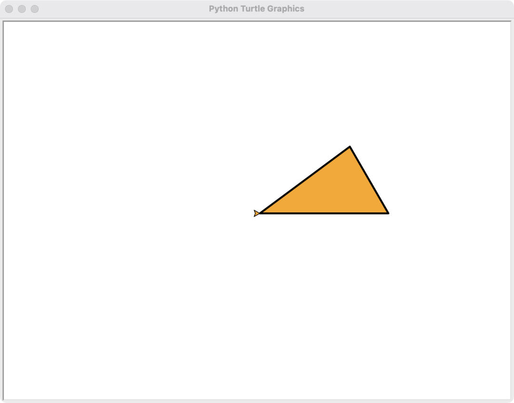

turtle 是 Python 中用来绘图的标准库，它简单且有趣，很多Python初学者都愿意将它作为第一个学习对象。<br />下面的内容主要包含 turtle 的基本用法和一些有趣的turtle 绘图实例。
<a name="t4Vei"></a>
## 1、turtle基本用法
使用 turtle 绘图的时候主要涉及到的内容包括：控制画布、设置画笔、控制画笔的移动、画圆、填充和绘制文字内容。灵活应用这些知识，可以画出各种各样漂亮的图形！<br />使用 turtle 之前需要先在代码的最前面导入turtle这个模块。为了让完成绘图后画布不消失，需要在程序的最后添加 `turtle.mainloop()`：
```python
# 导入turtle
import turtle  

# (--------中间写绘图过程----------)

# 让画布一直存在，这句代码需要放在最后
turtle.mainloop()
```
<a name="tJkhx"></a>
### **1.1 创建画布**

- `turtle.setup(宽度, 高度)` - 设置画布的宽度和高度
- `turtle.title(标题)` - 设置标题
```python
turtle.setup(800, 600)
turtle.title('hello')
```
下面就是mac下画布的效果：<br />
<a name="P8wIy"></a>
### **1.2 设置画笔**
绘图过程中画布上的光标可以看成是画笔，在每次绘图前可以设置画笔的颜色、线的粗细、画笔移动的速度。

- `turtle.pencolor(颜色)` - 设置画笔画出的线的颜色
- `turtle.width(线宽)` - 设置线宽
- `turtle.speed(速度值)` - 设置笔移动的速度(速度值是1-10逐渐变快；0 对应的速度最
```python
turtle.pencolor
turtle.width(5)
turtle.speed(4)
```
<br />画笔对应的光标默认是在画布的中心，方向默认是水平向右。在这儿线宽和移动速度无法体现，只有在移动笔的时候才可以看到效果。
<a name="RaDdS"></a>
### **1.3 控制笔移动**

- `turtle.forward(距离)` / `turtle.fd(距离)` - 控制笔前进指定距离
- `turtle.back(距离)`/`turtle.bk(距离)` - 控制笔后退指定距离
- `turtle.goto(x坐标, y坐标)`/ `turtle.setx(x坐标)` / `turtle.sety(y坐标)` - 控制笔移动到指定位置（坐标原点在画布的中心）
- `turtle.home()` - 笔回到初始状态（回到初始位置和初始方向）
```python
turtle.pencolor('green') 
turtle.width(2)          

turtle.back(200)         

turtle.sety(150)         
turtle.setx(250)  
turtle.goto(-100, -200)       
turtle.home()
```

<a name="PdjE4"></a>
### **1. 4 控制笔的方向**
笔的方向默认水平向右，所以前进的时候笔是往右移动的，后退笔向左移动。在移动之前改变笔的方向，前进和后退的代码就会改变移动轨迹。

- `turtle.left(角度)` - 向左旋转指定角度
- `turtle.right(角度)` - 向右旋转指定角度
- `turtle.setheading(角度)` - 设置绝对角度值指定度数
```python
turtle.pencolor('red')
turtle.left(45)
turtle.forward(100)

turtle.pencolor('green')
turtle.right(90)
turtle.forward(200)

turtle.pencolor('purple')
turtle.setheading(10)
turtle.forward(100)
```

<a name="OJs0d"></a>
### **1.5 抬起笔和放下笔**
有的时候移动笔不需要在画布上留下痕迹，那在移动笔之前需要先抬起笔。

- `turtle.up()` - 抬起笔
- `turtle.down()` - 放下笔


<a name="jpEgO"></a>
### **1.6 画圆**
turtle画圆的时候可以画圆环，也可以直接画实心圆
<a name="LybPa"></a>
#### 1、画圆环

- `turtle.circle(半径)` - 画一个完整的圆环
- `turtle.circle(半径, 角度)` - 画指定角度对应的圆弧


```python
turtle.pencolor('red')
turtle.circle(60)

turtle.up()
turtle.goto(100, -100)

turtle.down()
turtle.pencolor('green')
turtle.circle(80, 120)
```
<a name="zOOOR"></a>
#### 2、画实心圆

- `turtle.dot(直径)` - 直径为指定值的画实心圆
```python
turtle.dot(200, 'orange')
```

<a name="CAijV"></a>
### **1.7 填充**
在使用填充的时候需要注意，写代码的时候先写需要填充的轮廓对应的代码。再在轮廓代码前面开始填充，轮廓代码的后面结束填充。

- `turtle.fillcolor(颜色)` - 设置填充颜色
- `turtle.begin_fill()` - 开始填充
- `turtle.end_fill()` - 结束填充
```python
# 设置填充颜色
turtle.fillcolor('orange')
# 开始填充
turtle.begin_fill()

# ========以下代码是画需要填充的轮廓对应的代码（一个三角形）========
turtle.width(3)
turtle.forward(200)
turtle.left(120)
turtle.forward(120)
turtle.home()
# ==========================================================

# 结束填充
turtle.end_fill()
```

<a name="w4zHZ"></a>
### **1.8 画文字**
画文字指的是直接将字符串渲染到画布上。

- `turtle.write(文字内容, font=(字体名称, 字体大小, 文字类型))`
```python
# 字体类型：normal、bold、italic
turtle.goto(-100, 0)
turtle.pencolor('pink')
turtle.write('你输入的文字', font=('宋体', 40, 'bold'))
```

