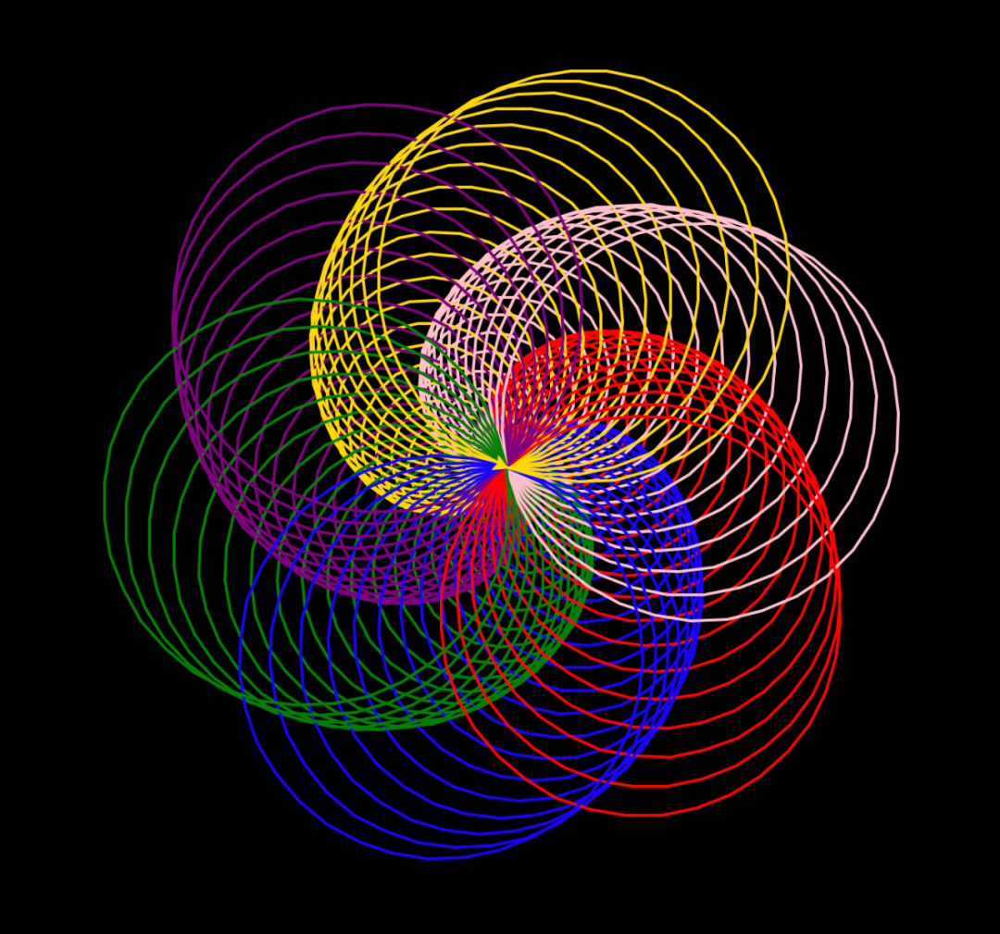
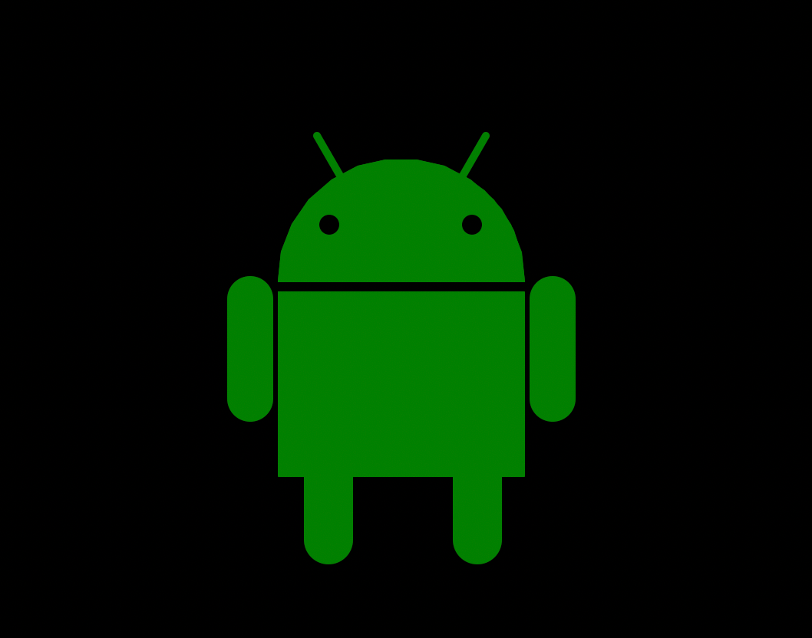
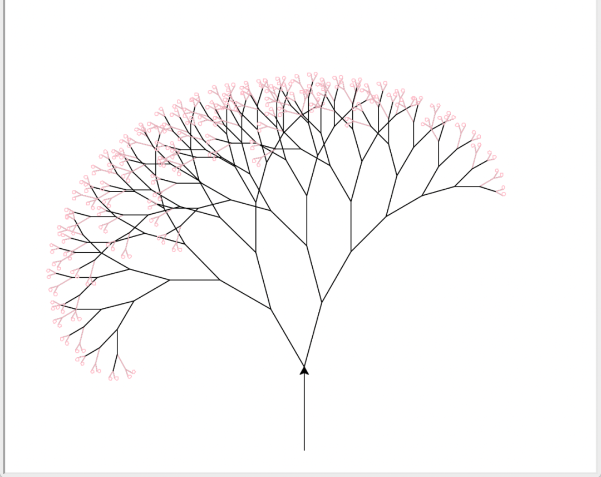
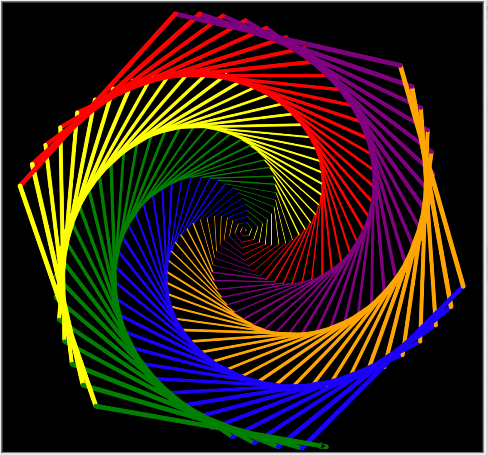
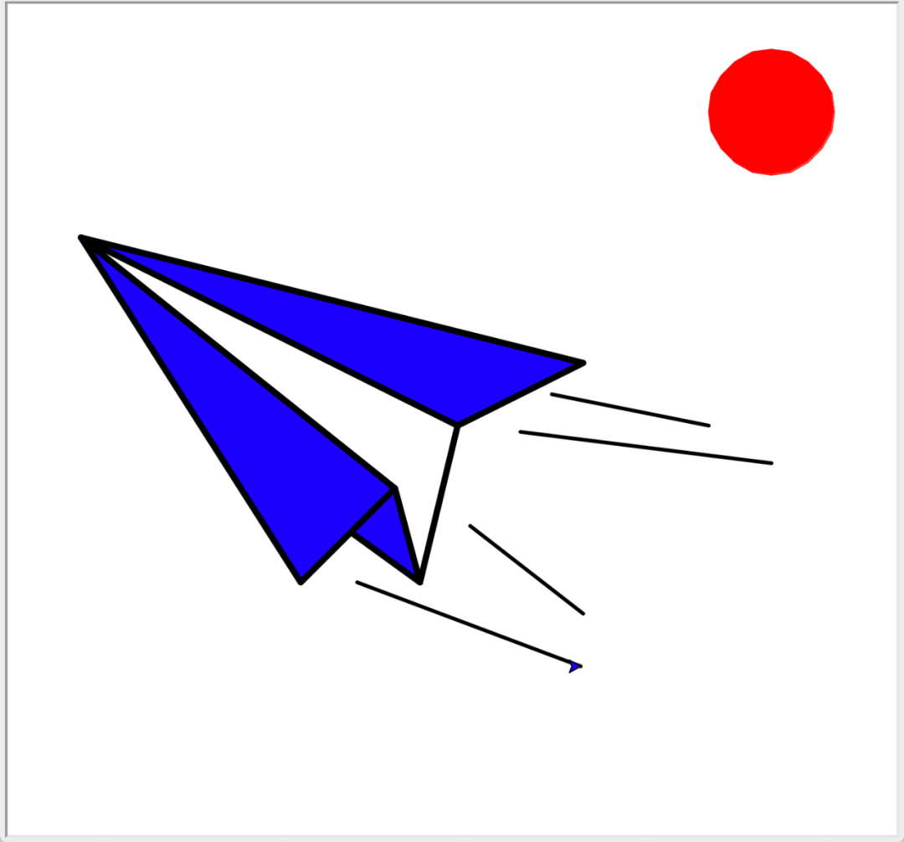

Python
<a name="q0iXp"></a>
## 1、视觉冲击
```python
import turtle as t
from turtle import *

angle = 60  # 通过改变角度，绘制出各种多边形
t.bgcolor('black')
t.pensize(2)
randomColor = ['red', 'blue', 'green', 'purple', 'gold', 'pink']
...
```
效果图如下：<br />
<a name="HzUCm"></a>
## 2、安卓机器人
```python
import turtle
aj = turtle.Pen()
y = 0
aj.speed(100)
turtle.bgcolor("black")

# aj.shape("turtle")
def head():
    aj.color("green")
    aj.fd(160)
    x = aj.xcor()
...
```
效果图如下：<br />
<a name="Qwb2g"></a>
## 3、樱桃树
```python
import turtle

toplevel = 8
angle = 30
rangle = 15

def drawTree(length, level):
    turtle.left(angle)  # 绘制左枝
    turtle.color("black")
    turtle.forward(length)
...
```
效果图如下：<br />
<a name="IMFix"></a>
## 4、旋转动画
```python
import turtle

t = turtle.Pen()
t.speed(100)
turtle.bgcolor("black")
sides = 6
...
```
效果图如下：<br />
<a name="MlLMg"></a>
## 5、纸飞机
```python
import turtle

# 太阳
turtle.color('red')
turtle.penup()
turtle.goto(250,200)
turtle.pendown()
...
```
效果图如下：<br />
