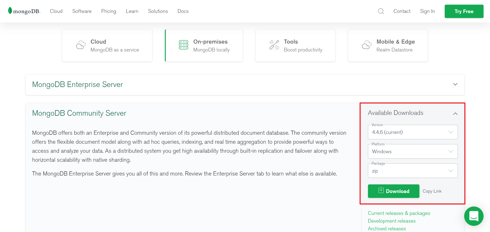

Python MongoDB<br />爬虫中也会使用MongoDB数据库吗？答案是肯定的。<br />MongoDB在爬虫中主要的使用场景是什么？答：1. 可以存储数据 2.分布式爬虫中通过MongoDB创建集群。<br />MongoDB数据库是通过什么与Python程序建立联系的？答：通过pymongo。<br />MongoDB数据库也是要单独安装的是吗？答：Yes！
<a name="YLvAi"></a>
## 简介
<a name="GooJg"></a>
### MongoDB的基础使用介绍
MongoDB是一个基于分布式文档存储的NoSQL（Not Only SQL，泛指非关系型数据库）数据库，也是一个面向文档（document-oriented）的数据库。<br />MongoDB旨在解决海量数据的访问效率问题，在爬虫开发中使用MongoDB来存储大规模的数据是不错的选择。<br />MongoDB支持的数据结构非常松散，是类似JSON的BSON（是一种类JSON的一种二进制形式的存储格式，简称Binary JSON）格式，因此可以存储比较复杂的数据类型。<br />MongoDB的一些概念与MySQL等关系型数据库大不相同。MongoDB中基本的概念是文档、集合和数据库。<br />来看下表：

| SQL术语/概念 | MongoDB术语/概念 | 解释/说明 |
| --- | --- | --- |
| database | database | 数据库 |
| table | collection | 数据库表/集合 |
| row | document | 数据记录行/文档 |
| column | field | 数据字段/域 |
| index | index | 索引 |
| table joins |  | 表连接/mongodb不支持 |
| primary key | primary key | 主键/mongodb自动将_id设置主键 |

<a name="Xw5Rb"></a>
## 安装
可以去官方下载，链接：[https://www.mongodb.com/try/download/community](https://www.mongodb.com/try/download/community)<br /><br />下载文件后，以Window为例，选择双击开始安装，建议选择custom安装(自定义方式)，可以指定路径进行一些配置。设定好路径之后<br />点击next，新版的MongoDB会自动在安装目录下创建log和data文件夹，这相比较早期版本有了改善 ，**但仍然需要在data文件夹下创建db文件夹，在C:\MongoDB\data\db（记住一定要再建个db文件夹）**
:::danger
重重之重（compass是客户端可视化界面如果需要后期可以再去单独下载，但是安装时需要取消安装，要是选中了，那就是安装了一天也完成不了）
:::
最后安装成功会弹出一个警告框，选中 Ignore 就好，至此，MongoDB客户端已经安装完毕。<br />打开命令行窗口windows+R，输入cmd开启命令行。切换到MongoDB的安装目录：C:\MongoDB\bin目录下，然后执行命令：
```bash
mongod -dbpath C:\MongoDB\data\db
```
这命令是开启服务，它会一直运行，只要使用Mongodb，这个窗口就不能关。然后仍然是在bin目录下，执行mongo命令。<br />如果命令行没有特殊错误提示，打开浏览器输入：127.0.0.1:27017<br />至此安装完成！当然就可以在执行mongo的命令行页面写一些操作命令了。
<a name="LSdTR"></a>
## 基础语法
<a name="AYdtB"></a>
### 数据库操作

1. 查看当前数据库名字：`db`
2. 查看当前数据状态：`db.stats()`
3. 显示所有数据库：`show dbs`
4. 切换数据库：`use 数据库名` 数据库存在则直接切换到指定的数据库，如果数据库不存在，则创建数据库，那么必须插入一条数据，才能保证数据库创建成功。数据库中不能直接插入数据，只能往集合(collections)中插入数据。
5. 删除数据库：`db.dropDatabase()`
<a name="c02Uj"></a>
### 集合操作：集合即操作的表

1. 手动创建集合：`db.createCollection(name, options)`

举例：<br />a. `db.createCollection("comments", {capped:true, size:10, max:2})`<br />b. `db.createCollection("comments")` （capped默认false，即无上限；size指大小，单位字节；max指数量上限）**只有在用了size的情况下才能用max**

2. 查看当前所有集合：`show collections`
3. 删除集合：`db.集合名.drop()`

注意：集合的命名规则如下：<br />（1）集合名不能是空串。<br />（2）不能含有空字符\0。<br />（3）不能以“`system.`”开头，这是系统集合保留的前缀。<br />（4）集合名不能含保留字符`$`。<br />当然也可以不用手动创建集合，只需要声明集合并插入数据就会创建成功(以下示例均已user集合为例)。<br />`db.user.insert({"name":"Lucy"});`<br />系统发现 user 是一个陌生的集合名字，所以就自动创建了。可以使用`show collections` 进行查看是否有user存在。
<a name="i8A7h"></a>
### 数据操作：即向集合中添加数据
<a name="Nt5Nu"></a>
#### 增
```sql
db.集合名.insert(document)
```
document是构建的一个json文件（可以类比python中的字典）
```sql
db.user.insert({"name":"Lucy","age":25});
```
<a name="Mgyxd"></a>
#### 删

1. `db.集合名.remove({条件})`
2. `db.集合名.remove({条件}, {justOne:true})`以上都不能对创建集合时设置了`capped:true`的集合删除；对于`capped:true`的集合，只能删除文档

以user为例：<br />删除年龄为32的所有用户
```sql
db.user.remove({age: 32});
```
删除年龄为32的一个用户
```sql
db.user.remove( { "age": "32" }, { justOne: true } )
```
<a name="HUtBu"></a>
#### 改

1. 更新数据：`db.集合名.update({原属性}, {修改属性}, {multi:true})`（默认`multi`值为`false`，只更新一条；如果`true`，表示更新匹配到的整个文档）

**如果原属性存在，但修改属性里没写，这个属性在修改后就不存在了；相反，如果原属性不存在，但修改属性里有，修改后增加相应的属性**<br />仍然以user为例：<br />查找名字为小明的，把年龄更改为 16 岁
```sql
db.user.update({"name":"小明"},{$set:{"age":16}});
```
查找name为Lucy的用户,将其年龄减少5岁
```sql
db.user.update({name: 'Lucy'}, {$inc: {age: 5}}, false, true);
```
<a name="tNcF2"></a>
#### 查
使用`find()`进行查询。其中会使用到条件语句和操作符。具体如下

| 操作 | 格式 | 示例 | 说明 |
| --- | --- | --- | --- |
| 等于 | `{<key>:<value>}` | `db.python.find({"likes":100}).pretty()` | 从python集合中找到likes 等于100的文档 |
| 小于 | `{<key>:{$lt:<value>}}` | `db.python.find({"likes": { $lt:100}}).pretty()` | 从python集合中找到likes小于100的文档 |
| 小于或等于 | `{<key>:{ $lte:<value>}}  ` | `db.python.find({"likes":{ $Ite:100}}).pretty()` | 从python集合中找到likes小于或等于100 的文档 |
| 大于 | `{<key>: {$gt:<value>}}` | `db.python.find({"likes": {$gt:100}}).pretty()` | 从python集合中找到likes 大于或等于100 的档 |
| 大于或等于 | `{<key>:{$gte:<value>}}` | `db.python.find({"likes":{ $gte:100}}).pretty()` | 从python集合中找到likes 大于或等于100 的文档 |
| 不等于 | `{<key>:{$ne:<value>}}` | `db.python.find({"likes": { $ne:100}}).pretty()` | 从python集合中找到likes不等于100的文档 |

比如：<br />查询所有记录
```sql
db.user.find(); 
```
就类似 
```sql
SELECT * FROM user;
```
查询 age = 20 的记录
```sql
db.user.find({"age": 20});
```
查询 age >= 25 并且 age <= 30
```sql
db.user.find({age: {lte: 30}});
```
查询前 10条数据
```sql
db.user.find().limit(10);
```
使用OR查询年龄是18岁或者年龄是22岁的
```sql
db.user.find({$or: [{age: 18}, {age: 22}]});
```
<a name="c3Pvu"></a>
## 在Python中操作MongoDB
在Python中操作MongoDB首先需要安装pymongo模块。
<a name="Ct7HM"></a>
### 安装pymongo 
使用pip命令安装pymongo，具体如下所示：
```sql
pip install pymongo
```
`pymongo`安装成功后，使用时直接`import`即可。
<a name="wAGxP"></a>
### 建立连接
`pymongo`模块使用`MongoClient`对象来描述一个数据库客户端，创建对象所需的参数主要是host和port。<br />第一种方式默认连接的是主机的IP和端口，第二种方式是显式地连接指定IP和端口，第三种是使用URL格式进行连接。
<a name="OPTFl"></a>
### 获取数据库
一个MongoDB可以有多个独立的数据库。使用pymongo时，可以通过访问`MongoClient`属性的方式来访问数据库，具体如下所示：
```python
db = client.数据库名
```
当然也可以使用字典的方式：
```python
db = client['数据库名']
```
<a name="oO1es"></a>
### 获取集合
一个collection即一组存在于MongoDB中的文档，获取`collection`的方法与获取数据库方法一致，具体如下所示：
```python
collection = db.集合名
```
或者字典方式
```python
collection = db['集合名']
```
值得注意的是，MongoDB中的collection和数据库都是惰性创建的。即前面介绍的命令实际并没有对MongoDB Server进行任何操作，直到第一个文档插入后，collection和数据库才会被创建，这也是在不插入文档之前使用“`show dbs`”命令查看不到之前创建的数据库的原因。
<a name="yPvrB"></a>
### 插入文档
MongoDB中的数据以JSON类文件的形式保存。在pymongo中使用字典来代表文档，使用`insert()`方法插入文档，具体如下所示：
```python
User1 = {"name":"Lucy","age":25,'addr':'北京'}
collection.insert(user1)
```
文档被插入后，如果文档中没有_id键值，系统会自动为文档添加。_id是一个特殊键值，该值在整个collection中是唯一的。使用`insert()`方法会返回这个文档的_id值。<br />当然使用`insert`也可以进行批量添加文档；
```python
users = [{"name":"Tom","age":20,'addr':'北京'},{"name":"Lily","age":19,'addr':'上海'} ]
collection, insert(users)
```
<a name="qCdR4"></a>
### 查询文档
MongoDB中查询一个文档时可使用`find_one()`函数，该函数会返回一个符合查询条件的文件，在没有匹配出结果时返回None.<br />使用在`find_one()`查找，返回文件中已经存在_id键值，该键值是由数据库自动添加。`find_one()`还支持对特定元素进行匹配查询，比如筛选出name为Tom的文档，具体如下所示：
```python
collection.find({'name':'Tom'})
```
若需要查询多个文档，可以使用`find()`方法。`find()`方法返回一个Cursor实例，通过该实例可获取每个符合查询条件的文档。具体如下所示：
```python
for user in collection.find():
print(user)
```
<a name="xrlUG"></a>
### 修改文档
MongoDB中使用`update()`和`save()`方法来更新文档，具体如下所示：<br />表示查找名字叫Tom的将其age修改为21
```sql
collection.update({'name':'Tom'},{"$set":{"age":21}})
```
<a name="ZtdLh"></a>
### 删除文档
MongoDB中使用`remove()`方法删除文档，具体如下所示：
```python
collection.remove({"name":"Lily"})
```
<a name="oQaIn"></a>
## MongoDB在爬虫中的应用
直接上代码：
```python
import pymongo
import csv
import random
import ssl
import time
from urllib import request

from bs4 import BeautifulSoup


def getComment(url):
    # 火狐 谷歌  Safari 的头部
    header1 = {
        "User-Agent": "Mozilla/5.0 (Windows NT 10.0; Win64; x64) AppleWebKit/537.36 (KHTML, like Gecko) Chrome/73.0.3683.103 Safari/537.36",
        "Host": "movie.douban.com"
    }
    # ie浏览器的请求头
    header2 = {
        "User-Agent": "Mozilla / 5.0(Windows NT 10.0;WOW64;Trident / 7.0;rv: 11.0) like Gecko",
        "Host": "movie.douban.com"
    }
    headlist = [header1, header2]
    # 定义随机下标
    index = random.randint(0, 1)
    # 确定访问的请求头
    # index  是一个随机数
    realHeader = headlist[index]
    req = request.Request(url, headers=realHeader)
    # 处理https协议的，http，https（更加安全协议）可以解决ssl报错问题
    context = ssl._create_unverified_context()
    # 获取 网页的 文本对象
    html = request.urlopen(req, context=context)
    #  获取网页源码
    contents = html.read().decode("utf-8")
    return contents


def read_data(contents):
    soup = BeautifulSoup(contents, 'lxml')
    # 找到了大的容器，里面包含很多item项
    comments_div = soup.select_one('#comments')  # id   返回Tag类型
    # print(comments_div)
    # 获取大的容器中的每个小项，返回一个结果集列表
    comment_list = comments_div.select('.comment-item')  # 返回ResultSet
    # print(comment_list)
    comment_dict_list = []
    # 遍历每个item项，
    for comment in comment_list:
        # find 与 find_all
        # attribute:属性
        comment_div = comment.find('div', attrs={'class': 'comment'})
        # print(comment_div)
        comment_info = comment_div.find('span', attrs={'class': 'comment-info'})
        # 评价的用户名
        username = comment_info.find('a').text
        # 获取星级
        star = comment_info.find_all('span')[1].get('title')
        # 评论内容
        comment_text = comment_div.find('span', attrs={'class': 'short'}).text
        # 字典存放
        comment_dict = {'username': username, 'star': star, 'comment': comment_text}
        # 将字典存到列表中
        comment_dict_list.append(comment_dict)
        # [{},{},{},{},{}]
    # 返回字典
    return comment_dict_list

def get_collection():
 client=MongoClient('mongodb://localhost:27017/')
 db=client['douban']
 collection=db.movies
 return collection


# 将其保存到csv文件中
def save_comment_csv(comment_dict_list,collection):
 for comment_dict in comment_dict_list:
  collection.insert(comment_dict)


if __name__ == '__main__':
  collection = get_collection()
    for i in range(20):
        start = str(i * 20)  # 20 40 60 80 100
        url = 'https://movie.douban.com/subject/34841067/comments?start=' + start + '&limit=20&sort=new_score&status=P'
        # 将 新的url以参数的形式赋值给getComment()
        contents = getComment(url)
        # 解析爬取到的数据
        comment_dict_list = read_data(contents)
        # 保存到一个csv文件中
        save_comment_csv(comment_dict_list,collection)
        print('保存成功第' + str(i + 1) + '页内容')
        # 延时
        time.sleep(5)
```

