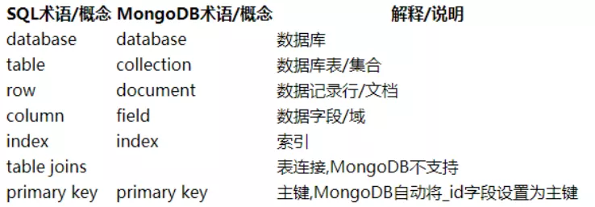

Python MongoDB<br />MongoDB是一个介于关系数据库和非关系数据库之间的产品，是非关系数据库当中功能最丰富，最像关系数据库的。<br />先来看看MySQL与MongoDB 概念区别：<br /><br />今天的重点，就是要为大家讲述如何使用Python操作MongoDB数据库。<br />在正式进行增删改查之前，需要先获取一个叫做集合的东西，它就像是mysql数据库中的表。
```python
# 安装该库后，这里才能导入
from pymongo import MongoClient
# 连接服务器
conn = MongoClient("localhost",27017)
# 连接数据库
db = conn.mydb
# 获取集合
collection = db.student

... 中间进行一系列操作：增删改查 ...

# 断开连接【最后一步】
conn.close()
```
注意：Python 中写MongoDB代码和在MongoDB客户端写的代码格式一样。<br />区别在于：在Python中写MongoDB代码，所有“键”都需要添加引号。
<a name="WcQ6o"></a>
## 插入文档
<a name="bSDff"></a>
### ① 一次性插入一个文档
```python
collection.insert_one({"name"： "abc","age"： 19,"gender"： 1,"adress"： "北京","isDelete"： 0})
```
<a name="JZUZ1"></a>
### ② 一次性插入多个文档
```python
collection.insert_many([{"name"： "abc1","age"： 19,"gender"： 1,"adress"： "北京
","isDelete"： 0},{"name"： "abc2","age"： 19,"gender"： 1,"adress"： "北京","isDelete"：0}])
```
<a name="fmovQ"></a>
## 删除文档
```python
# 删除某条文档
collection.remove({"name"： "lilei"})

# 不写条件，代表全部删除。不要轻易用
collection.remove()
```
<a name="PRjfo"></a>
## 修改文档
```python
# 修改文档
collection.update({"name"： "lilei"},{"$set"： {"age"： 25}})
```
<a name="NpWCJ"></a>
## 查询文档
这里一共列出了7条。
<a name="anutj"></a>
### ① 查询部分文档
```python
res = collection.find({"age"： {"$gte"： 19}})
for row in res：
   print(row)
```
<a name="eQJd9"></a>
### ② 查询所有文档
```python
res = collection.find()
for row in res：
   print(row)
```
<a name="tOmjL"></a>
### ③ 统计查询
```python
res = collection.find().count()
print(res)
```
<a name="ZrE8W"></a>
### ④ 根据 id 查询（这需要引入第三方库）
```python
from bson.objectid import ObjectId
res = collection.find({"_id"：ObjectId("5cc506289e1d88c95465488e")})
print(res[0])
```
<a name="NykiF"></a>
### ⑤ 升序排序
```python
res = collection.find().sort("age")
for row in res：
   print(row)
```
<a name="HmcRZ"></a>
### ⑥ 降序排序（也需要引入第三方库）
```python
import pymongo
res = collection.find().sort("age",pymongo.DESCENDING)
for row in res：
   print(row)
```
<a name="GEejK"></a>
### ⑦ 分页查询
```python
res = collection.find().limit(3).skip(5)
for row in res：
   print(row)
```
