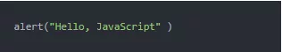
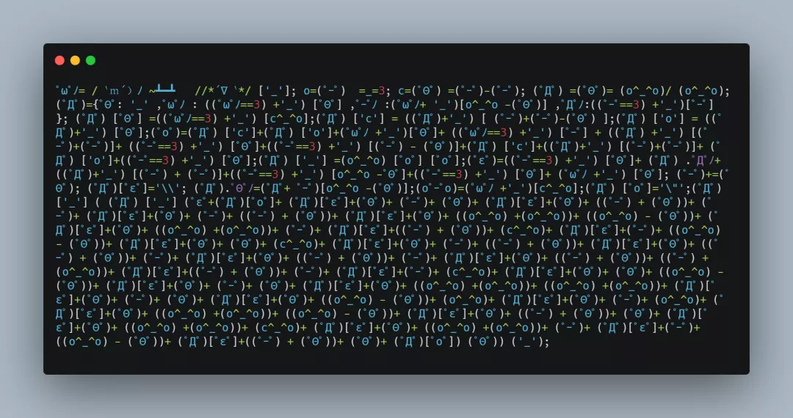
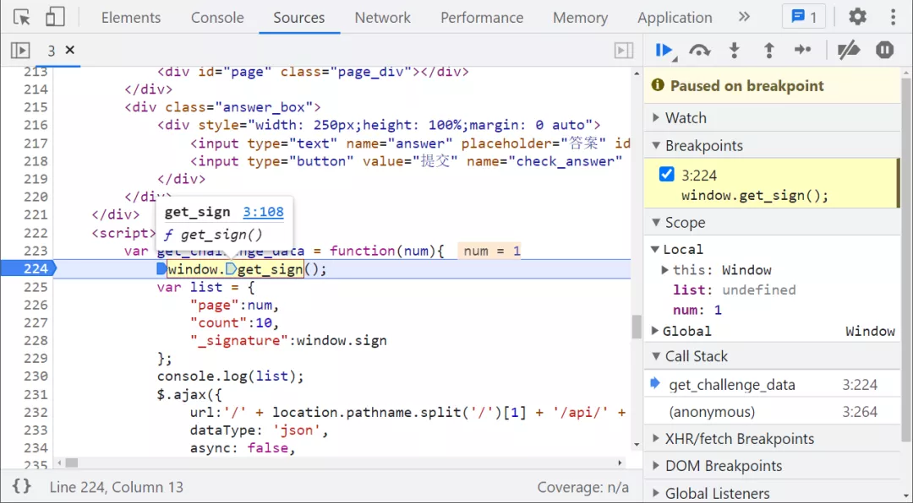
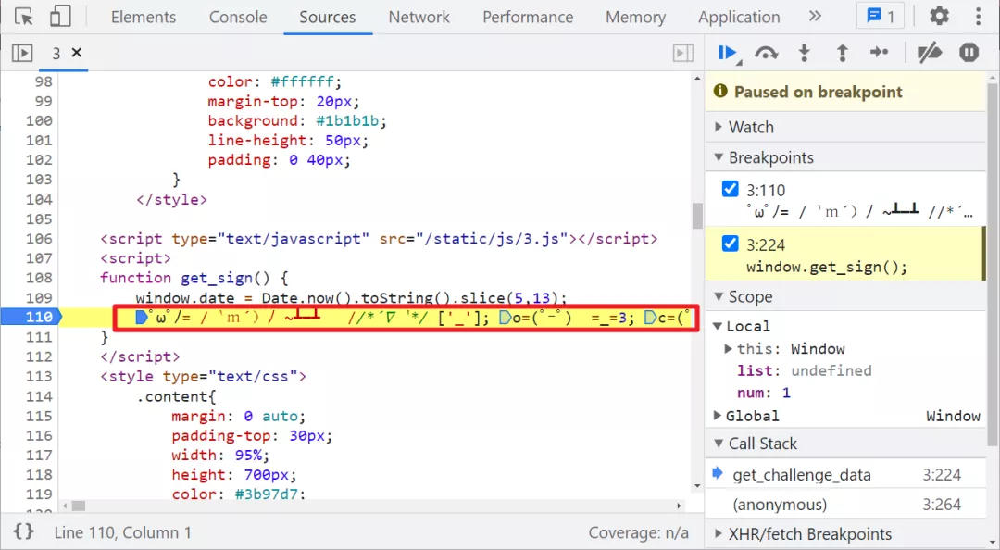
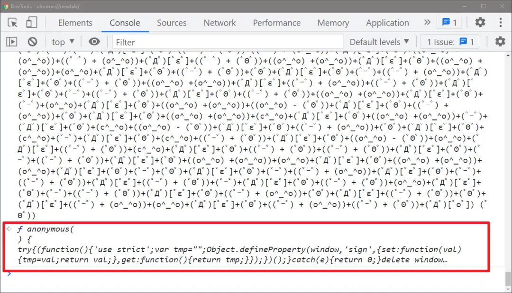
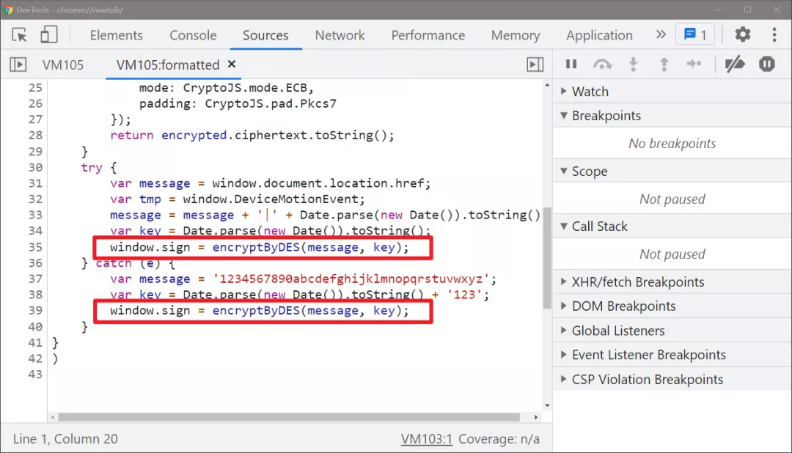
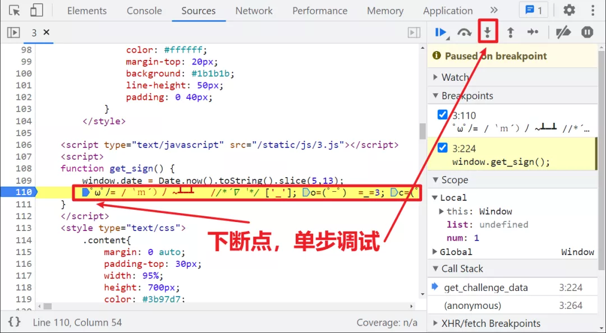
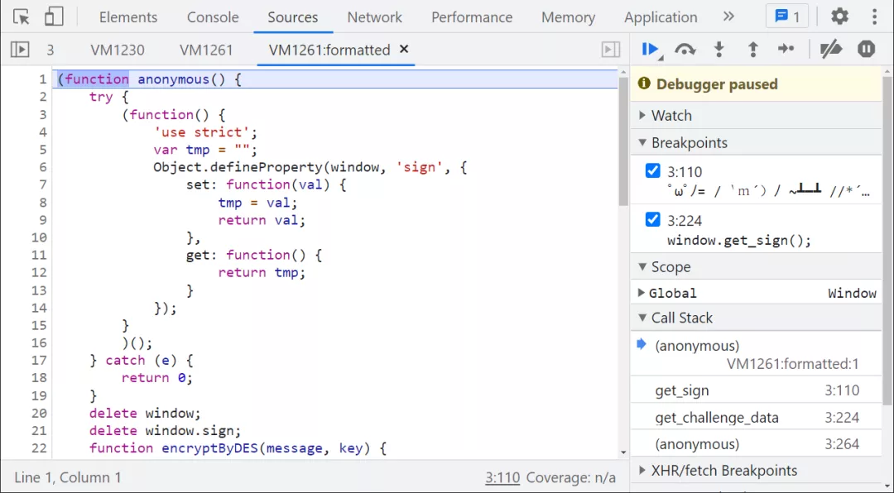
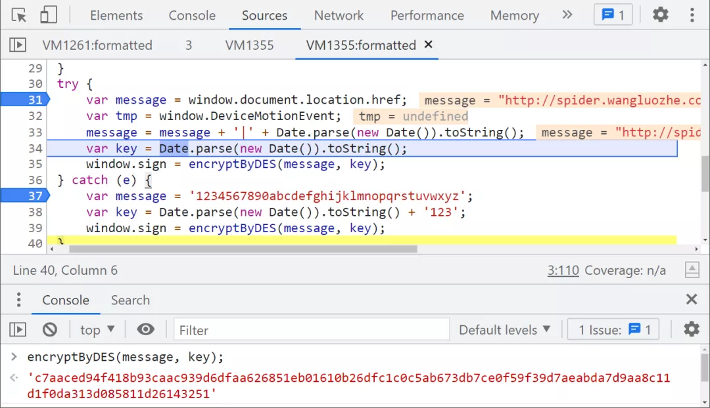
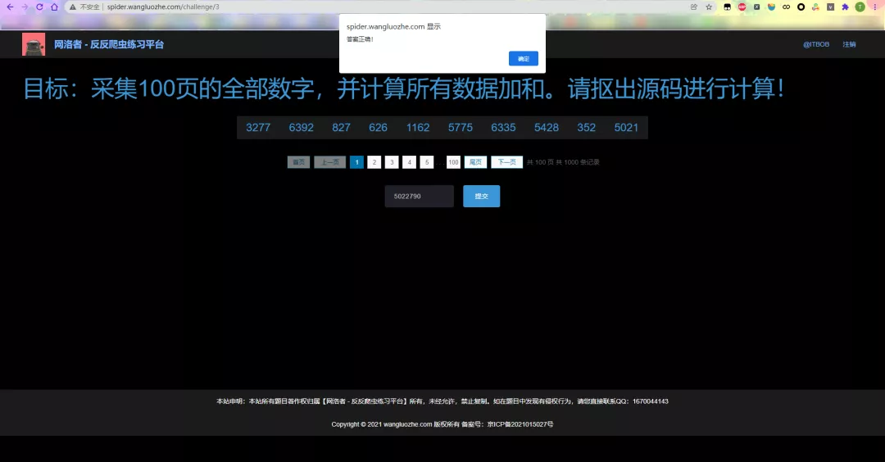

Python 爬虫
<a name="sPUhv"></a>
## AAEncode 简介
AAEncode 和 JJEncode 都是同一个作者：日本的 Yosuke HASEGAWA ，AAEncode 可以将任何 JavaScript 代码编码为日式表情符号，在线体验地址：[https://utf-8.jp/public/aaencode.html](https://utf-8.jp/public/aaencode.html) 。<br />正常的一段 JS 代码：<br /><br />经过 AAEncode 混淆之后的代码：<br /><br />AAEncode 解混淆的方式和 JJEncode 类似，很简单，以下介绍几种常见的方法：

1. 使用在线工具直接解密，比如：[http://www.hiencode.com/aaencode.html](http://www.hiencode.com/aaencode.html) ；
2. 去掉代码最后一个符号 `('_')` 后，放到浏览器里面去直接执行就可以看到源码
3. 在线调试，在 AAEncode 代码第一行下断点，然后一步一步执行，最终也会在虚拟机（VM）里看到源码；
<a name="LzgxY"></a>
## 逆向参数
逆向的目标主要是翻页接口 `_signature` 参数，调用的加密方法仍然是 `window.get_sign()`。<br /><br />继续跟进，会发现是一个颜文字的 AAEncode 混淆：<br /><br />将这段代码复制出来，去掉末尾的 `('_')`，直接放到浏览器控制台运行一下（建议单开一个无痕窗口，有时候可能会有影响），就可以看到源码了，点击源码来到虚拟机（VM），整个源码就展现出来了：<br /><br /><br />除了直接去掉 `('_')` 运行以外，还可以在混淆代码第一行下断点，然后单步跟进，最后同样也会得到源码，如下图所示：<br /><br /><br />观察一下代码，有一个 Hook `window.sign` 操作，还有 delete 操作，然后接着是一个 DES 加密的函数，后面的 try-catch 语句设置一些 key 之类的参数，重点是 try-catch 语句，下断点看看实际是走的哪条语句：<br /><br />其他逻辑并不用关心，直接把 try 语句 copy 出来，不让它走异常即可，DES 直接调用 crypto-js 即可，本地改写之后，配合 Python 代码携带 `_signature` 挨个计算每一页的数据，最终提交成功：<br />
<a name="virSb"></a>
## 完整代码
以下只演示部分关键代码，不能直接运行！ 完整代码仓库地址：[https://github.com/kgepachong/crawler/](https://github.com/kgepachong/crawler/)
<a name="C7jKm"></a>
### JavaScript 加密代码
```javascript
var CryptoJS = require('crypto-js')

function encryptByDES(message, key) {
    var keyHex = CryptoJS.enc.Utf8.parse(key);
    var encrypted = CryptoJS.DES.encrypt(message, keyHex, {
        mode: CryptoJS.mode.ECB,
        padding: CryptoJS.pad.Pkcs7
    });
    return encrypted.ciphertext.toString();
}

function getSign() {
    var message = "http://spider.wangluozhe.com/challenge/3";
    message = message + '|' + Date.parse(new Date()).toString();
    var key = Date.parse(new Date()).toString();
    return encryptByDES(message, key);
}

// 测试输出
// console.log(getSign())
```
<a name="it4r5"></a>
### Python 计算关键代码
```python
import execjs
import requests


challenge_api = "http://spider.wangluozhe.com/challenge/api/3"
headers = {
    "Content-Type": "application/x-www-form-urlencoded; charset=UTF-8",
    "Cookie": "将 cookie 值改为你自己的！",
    "Host": "spider.wangluozhe.com",
    "Origin": "http://spider.wangluozhe.com",
    "Referer": "http://spider.wangluozhe.com/challenge/2",
    "User-Agent": "Mozilla/5.0 (Windows NT 10.0; Win64; x64) AppleWebKit/537.36 (KHTML, like Gecko) Chrome/96.0.4664.45 Safari/537.36",
    "X-Requested-With": "XMLHttpRequest"
}


def get_signature():
    with open('challenge_3.js', 'r', encoding='utf-8') as f:
        ppdai_js = execjs.compile(f.read())
    signature = ppdai_js.call("getSign")
    print("signature: ", signature)
    return signature


def main():
    result = 0
    for page in range(1, 101):
        data = {
            "page": page,
            "count": 10,
            "_signature": get_signature()
        }
        response = requests.post(url=challenge_api, headers=headers, data=data).json()
        for d in response["data"]:
            result += d["value"]
    print("结果为: ", result)


if __name__ == '__main__':
    main()
```
