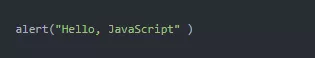
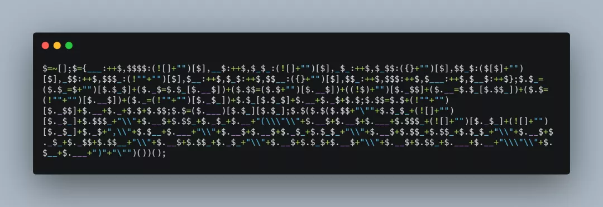
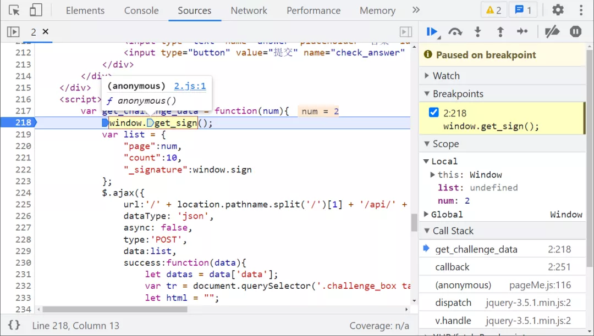
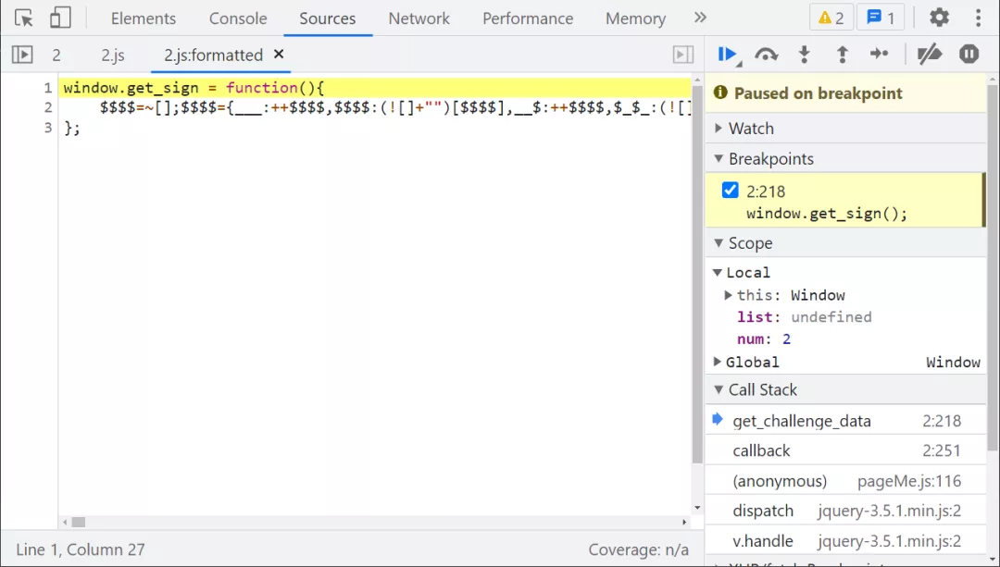
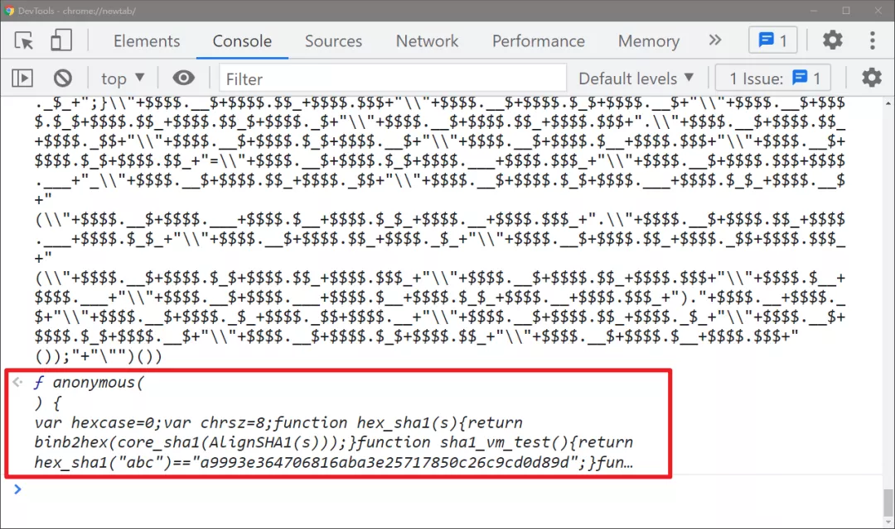
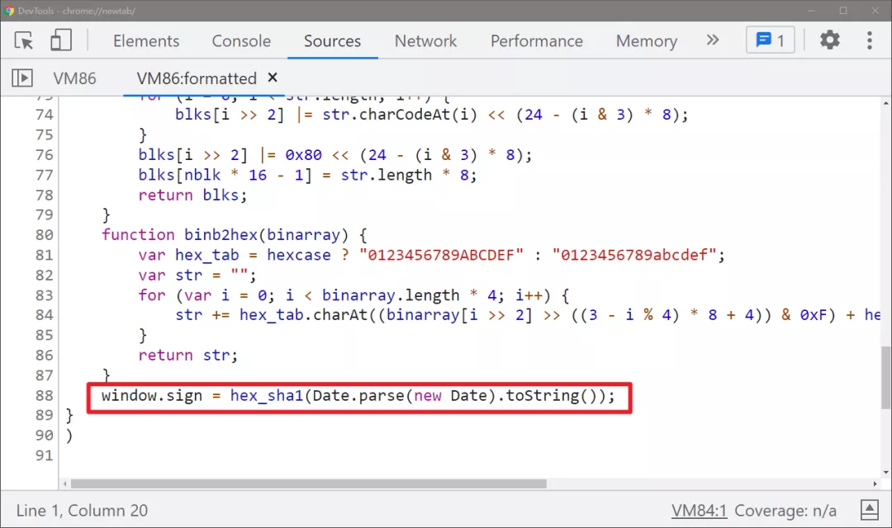
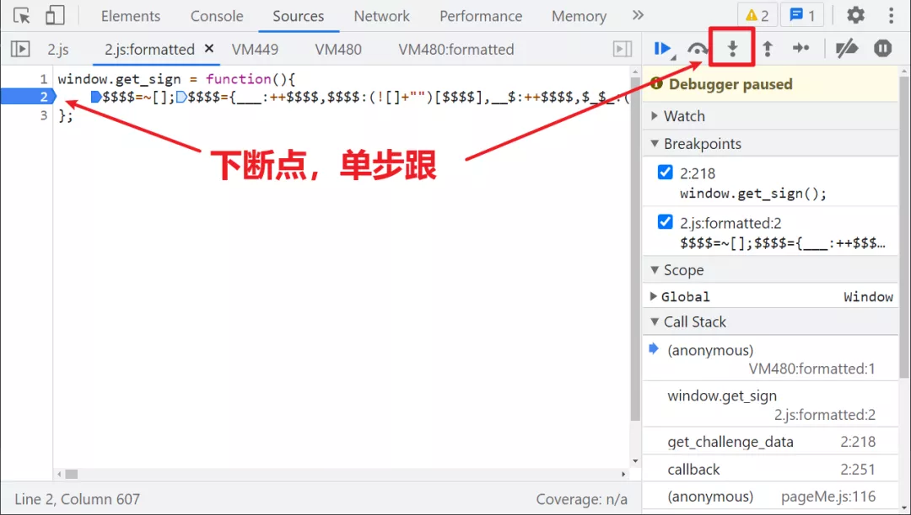
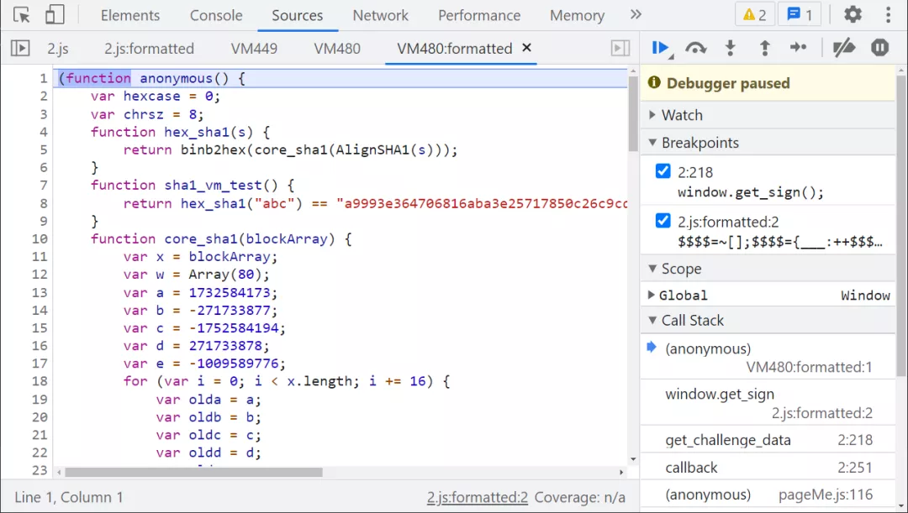
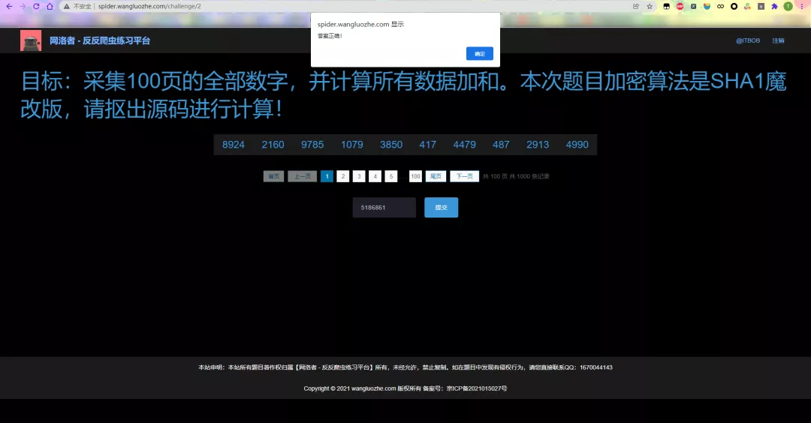

Python 爬虫
<a name="bxLBL"></a>
## JJEncode 简介
JJEncode 最初是由日本作者 Yosuke HASEGAWA 于 2009 年开发的一个 web 程序，它可以将任意 JavaScript 编码为仅使用 18 个符号的混淆形式 `[]()!+,\"$.:;_{}~=`，在线体验地址：[https://utf-8.jp/public/jjencode.html](https://utf-8.jp/public/jjencode.html) 。<br />作者有提示：JJEncode 易于解码，它不是实用的混淆，只是一个编码器，JJEncode 太有特点了，很容易被检测，而且还浏览器依赖，代码不能在某种浏览器上运行。它的缺点是压栈很严重，如果 JS 很大，去做加密可能内存溢出，所以只适合核心功能加密，事实上 JJEncode 商用的还是很少，不过认识一下并没有什么坏处。<br />正常的一段 JS 代码：<br /><br />经过 JJEncode 混淆（自定义变量名为 $）之后的代码：<br /><br />JJEncode 解混淆的方式很简单，以下介绍几种常见的方法：

1. 使用在线工具直接解密，比如：[http://www.hiencode.com/jjencode.html](http://www.hiencode.com/jjencode.html)
2. JJEncode 的代码通常是一个自执行方法（IIFE），去掉代码最后面的 `()` 后，放到浏览器里面去直接执行就可以看到源码
3. 在线调试，在 JJEncode 代码第一行下断点，然后一步一步执行，最终也会在虚拟机（VM）里看到源码
<a name="bMlfA"></a>
## 逆向参数
逆向的目标主要是翻页接口 `_signature` 参数，调用的加密方法仍然是 `window.get_sign()`。<br /><br />跟进 2.js 之后会发现是一个 JJEncode 混淆：

<br />将其中混淆的部分，去掉最后的 `()` 放到浏览器控制台运行一下（建议单开一个无痕窗口，有时候可能会有影响），就可以看到源码了，点击源码来到虚拟机（VM），整个源码就展现出来了：<br /><br /><br />除了直接去掉 `()` 运行以外，还可以在混淆代码第一行下断点，然后单步跟进，最后同样也会得到源码，如下图所示：<br /><br /><br />看源码就很简单了，就是一个魔改的 SHA1 匿名函数，将其代码 copy 下来改写一下即可，配合 Python 代码携带 `_signature` 挨个计算每一页的数据，最终提交成功：<br />
<a name="hS1rX"></a>
## 完整代码
以下只演示部分关键代码，不能直接运行！ 完整代码仓库地址：[https://github.com/kgepachong/crawler/](https://github.com/kgepachong/crawler/)
<a name="acXkG"></a>
### JavaScript 加密代码
```javascript
var hexcase = 0;
var chrsz = 8;

function hex_sha1(s) {
    return binb2hex(core_sha1(AlignSHA1(s)));
}

function sha1_vm_test() {
    return hex_sha1("abc") == "a9993e364706816aba3e25717850c26c9cd0d89d";
}

function core_sha1(blockArray) {
    var x = blockArray;
    var w = Array(80);
    var a = 1732584173;
    var b = -271733877;
    var c = -1752584194;
    var d = 271733878;
    var e = -1009589776;
    for (var i = 0; i < x.length; i += 16) {
        var olda = a;
        var oldb = b;
        var oldc = c;
        var oldd = d;
        var olde = e;
        for (var j = 0; j < 80; j++) {
            if (j < 16)
                w[j] = x[i + j];
            else
                w[j] = rol(w[j - 3] ^ w[j - 8] ^ w[j - 14] ^ w[j - 16], 1);
            var t = safe_add(safe_add(rol(a, 5), sha1_ft(j, b, c, d)), safe_add(safe_add(e, w[j]), sha1_kt(j)));
            e = d;
            d = c;
            c = rol(b, 30);
            b = a;
            a = t;
        }
        a = safe_add(a, olda);
        b = safe_add(b, oldb);
        c = safe_add(c, oldc);
        d = safe_add(d, oldd);
        e = safe_add(e, olde);
    }
    return new Array(a, b, c, d, e);
}

function sha1_ft(t, b, c, d) {
    if (t < 20) {
        return (b & c) | ((~b) & d);
    }
    if (t < 40) {
        return b ^ c ^ d;
    }
    if (t < 60) {
        return (b & c) | (b & d) | (c & d);
    }
    return b ^ c ^ d;
}

function sha1_kt(t) {
    return (t < 20) ? 1518500249 : (t < 40) ? 1859775393 : (t < 60) ? -1894007588 : -899497514;
}

function safe_add(x, y) {
    var lsw = (x & 0xFFFF) + (y & 0xFFFF);
    var msw = (x >> 16) + (y >> 16) + (lsw >> 16);
    return (msw << 16) | (lsw & 0xFFFF);
}

function rol(num, cnt) {
    return (num << cnt) | (num >>> (32 - cnt));
}

function AlignSHA1(str) {
    var nblk = ((str.length + 8) >> 6) + 1;
    var blks = new Array(nblk * 16);
    for (var i = 0; i < nblk * 16; i++) {
        blks[i] = 0;
    }
    for (i = 0; i < str.length; i++) {
        blks[i >> 2] |= str.charCodeAt(i) << (24 - (i & 3) * 8);
    }
    blks[i >> 2] |= 0x80 << (24 - (i & 3) * 8);
    blks[nblk * 16 - 1] = str.length * 8;
    return blks;
}

function binb2hex(binarray) {
    var hex_tab = hexcase ? "0123456789ABCDEF" : "0123456789abcdef";
    var str = "";
    for (var i = 0; i < binarray.length * 4; i++) {
        str += hex_tab.charAt((binarray[i >> 2] >> ((3 - i % 4) * 8 + 4)) & 0xF) + hex_tab.charAt((binarray[i >> 2] >> ((3 - i % 4) * 8)) & 0xF);
    }
    return str;
}

function getSign() {
    return hex_sha1(Date.parse(new Date).toString());
}

// 测试输出
// console.log(getSign())
```
<a name="vrkKr"></a>
### Python 计算关键代码
```python
import execjs
import requests


challenge_api = "http://spider.wangluozhe.com/challenge/api/2"
headers = {
    "Content-Type": "application/x-www-form-urlencoded; charset=UTF-8",
    "Cookie": "将 cookie 值改为你自己的！",
    "Host": "spider.wangluozhe.com",
    "Origin": "http://spider.wangluozhe.com",
    "Referer": "http://spider.wangluozhe.com/challenge/2",
    "User-Agent": "Mozilla/5.0 (Windows NT 10.0; Win64; x64) AppleWebKit/537.36 (KHTML, like Gecko) Chrome/96.0.4664.45 Safari/537.36",
    "X-Requested-With": "XMLHttpRequest"
}


def get_signature():
    with open('challenge_2.js', 'r', encoding='utf-8') as f:
        ppdai_js = execjs.compile(f.read())
    signature = ppdai_js.call("getSign")
    print("signature: ", signature)
    return signature


def main():
    result = 0
    for page in range(1, 101):
        data = {
            "page": page,
            "count": 10,
            "_signature": get_signature()
        }
        response = requests.post(url=challenge_api, headers=headers, data=data).json()
        for d in response["data"]:
            result += d["value"]
    print("结果为: ", result)


if __name__ == '__main__':
    main()
```
