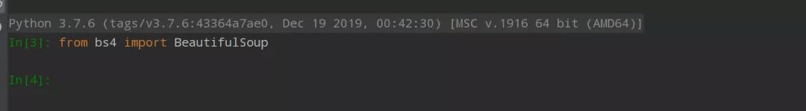
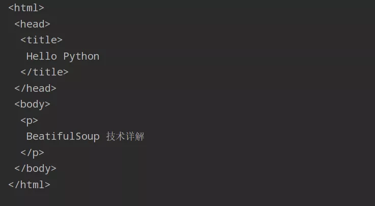
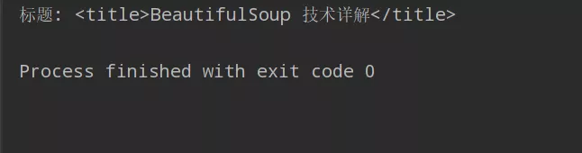

Python 爬虫 BeautifulSoup
<a name="JPNQ0"></a>
## 1、BeautifulSoup简介
BeautifulSoup 是一个可以从 HTML 或 XML 文件中提取数据的 Python 扩展库。BeautifulSoup 通过合适的转换器实现文档导航、查找、修改文档等。它可以很好的处理不规范标记并生成剖析树（Parse Tree）；它提供的导航功能（Navigating），可以简单又快速地搜索剖析树以及修改剖析树。BeautifulSoup 技术通常用来分析网页结构，抓取相应的 Web 文档，对于不规则的 HTML 文档，它提供了一定的补全功能，从而节省了开发者的时间和精力。
<a name="kFOtK"></a>
## 2、包安装
<a name="ZUvFF"></a>
### 安装 BeautifulSoup
BeautifulSoup 主要通过 pip 指令进行安装，在命令提示符 CMD 环境下或者在 PyCharm 的命令行窗口进行安装都可，即调用 `pip install bs4` 命令进行安装，bs4 即 BeautifulSoup4。<br />当 BeautifulSoup 扩展包安装成功后，就可以在命令行输入`from bs4 import BeautifulSoup` 语句导入该扩展包，测试安装是否成功，如果没有异常报错即安装成功，如下所示:<br />
<a name="pFqBs"></a>
## 3、BeautifulSoup 解析 HTML 获取网页信息
<a name="eOpf5"></a>
### BeautifulSoup 解析 HTML
BeautifulSoup 解析 HTML 的原理是创建一个 BeautifulSoup 对象，然后调用 BeautifulSoup 包的 `prettify()` 函数格式化输出网页信息。<br />实例如下：
```python
from bs4 import BeautifulSoup

html = """
<html>
 <head>
  <title>Hello Python</title>
 </head>
 <body>
    <p>BeatifulSoup 技术详解</p>
 </body>
</html>
"""
# 结果会按照标准的缩进格式的结构输出
soup = BeautifulSoup(html)
print(soup.prettify())
```
使用 BeautifulSoup 解析网页输出结果如下：<br /><br />BeatifulSoup 解析会把 HTMl 网页的所有标签信息和内容按照 HTML 标签的缩进全部输出。<br />用 BeautifulSoup 解析 HTML 文档时，它会将 HTML 文档类似 DOM 文档树一样处理，使用 `prettify()` 函数输出结果时会自动补齐标签，这是 BeautifulSoup 的一个优点，即使 BeautifulSoup 得到了一个损坏的标签，它也产生一个转换 DOM 树，并尽可能和原文档内容含义一致，这种措施通常能够帮助更正确地搜集数据。<br />实例如下： 将一个网址输入后直接用 `prettify()` 函数获取
```python
from bs4 import BeautifulSoup

html = 'https://www.baidu.com/'
# 结果会按照标准的缩进格式的结构输出
soup = BeautifulSoup(html)
print(soup.prettify())
```
输出内容如下：
```html
<html>
 <body>
  <p>
   https://www.baidu.com/
  </p>
 </body>
</html>
```
输出的内容自动补齐了标签，并按照 HTML 格式输出。
<a name="CQu1K"></a>
### BeautifulSoup 获取网页标签信息
上面的知识讲解如何用 BeautifulSoup 解析了网页，在解析完网页之后，如果想获取某个标签的内容信息，怎么实现呢？比如获取以下超文本的 标题，接下来将教大家如何使用 BeautifulSoup 技术获取网页标签信息。获取网页标题代码如下：
```python
from bs4 import BeautifulSoup

# 获取标题
def get_title():
    #创建本地文件soup对象
    soup = BeautifulSoup(open('test.html','rb'), "html.parser")

    #获取标题
    title = soup.title
    print('标题:', title)

if __name__ == '__main__':
    get_title()
```
输出内容如下:<br /><br />同样的获取其他标签的内容也一样，如 HTML 的头部 a 标签
```python
# 获取a标签内容
def get_a():
    #创建本地文件soup对象
    soup = BeautifulSoup(open('test.html','rb'), "html.parser")

    #获取a标签内容
    a = soup.a
    print('a标签的内容是:', a)
```
输出内容如下：
```
a标签的内容是: <a href="https://www.baidu.com">ddd</a>
```
<a name="mOjMW"></a>
## 4、定位标签并获取内容
前面的内容简单介绍了 BeautifulSoup 获取title、a等标签，但是如何定位标签并获取到相应标签的内容呢，这里就需要使用 BeatifulSoup 的 `find_all()`函数，详细使用方式如下：
```python
def get_all():
    soup = BeautifulSoup(open('test.html', 'rb'), "html.parser")
    # 从文档中找到<a>的所有标签链接
    for a in soup.find_all('a'):
        print(a)
    # 获取<a>的超链接
    for link in soup.find_all('a'):
        print(link.get('href'))

if __name__ == '__main__':
    get_all()
```
输出内容如下：
```
<a href="https://www.baidu.com">ddd</a>
https://www.baidu.com
ddd
```
以上是关于 BeautifulSoup 如何定位标签并获取内容的方式。
<a name="HCIYF"></a>
## 5、BeautifulSoup 对象
BeautifulSoup 将复杂的 HTML 文档转换成一个树形结构，每个节点都是 Python 对象，BeautifulSoup 官方文档将所有的对象归纳为以下四种：

- Tag
- NavigableString
- BeautifulSoup
- Comment

接下来详细介绍 BeautifulSoup 的四个对象：
<a name="HwART"></a>
### Tag
Tag 对象表示 XML 或 HTML 文档中的标签，通俗地讲就是 HTML 中的一个个标签，该对象与 HTML 或 XML 原生文档中的标签相同。Tag 有很多方法和属性，BeautifulSoup 中定义为 `soup.Tag`，其中 Tag 为 HTML 中的标签，比如 a、title 等，其结果返回完整的标签内容，包括标签的属性和内容等。例如以下实例就是 Tag:
```
<title>BeautifulSoup 技术</title>
<p class="title">Hello</p>
<p class="con">Python 技术</p>
```
以上的 HTML 代码中，title、p 都是标签，起始标签和结束标签之间加上内容就是 Tag。标签获取方法代码如下：
```python
#创建本地文件soup对象
soup = BeautifulSoup(open('test.html','rb'), "html.parser")
#获取a标签
a = soup.a  #Tag
print('a标签的内容是:', a)
```
除此之外，Tag 中最重要的属性是 name 和 attrs 。

- name

name 属性用于获取文档树的标签名字，如果想获取 title 标签的名字，只要使用 `soup.title.name` 代码即可，对于内部标签，输出的值便为标签本身的名称。

- attrs

attrs是属性（attributes）的英文简称，属性是网页标签的重要内容。一个标签（Tag）可能有很多个属性，例如：
```html
<a href="https://www.baidu.com" class="xiaodu" id="l1">ddd</a>
```
以上实例存在两个属性，一个是class属性，对应的值为“xiaodu”；一个是id属性，对应的值为“l1”。Tag属性操作方法与Python字典相同，获取p标签的所有属性代码如下，得到一个字典类型的值，它获取的是第一个段落 p 的属性及属性值。
```python
# 获取属性
print(soup.p.attrs)

# 获取属性值
print(soup.a['class'])
#[u'xiaodu']
print(soup.a.get('class'))
#[u'l1']
```
BeautifulSoup 每个标签 tag 可能有很多个属性，可以通过 “`.attrs`” 获取属性，tag 的属性可以被修改、删除或添加。
<a name="YFCYc"></a>
### NavigableString
NavigableString 也叫可遍历的字符串，字符串常被包含在 tag 内，BeautifulSoup 用 NavigableString 类来包装tag中的字符串，<br />BeautifulSoup 用 NavigableString 类来包装 tag 中的字符串，NavigableString 表示可遍历的字符串。一个 NavigableString 字符串与 Python 中的 Unicode 字符串相同，并且支持包含在遍历文档树和搜索文档树中的一些特性。下述代码可查看 NavigableString 的类型。
```python
# coding=utf-8
from bs4 import BeautifulSoup
soup = BeautifulSoup(open('test.html','rb'), "html.parser")
tag = soup.title
print(type(tag.string))
```
输出结果如下：
```
<class 'bs4.element.NavigableString'>
```
<a name="oiRVf"></a>
### BeautifulSoup
BeautifulSoup 对象表示的是一个文档的全部内容，通常情况下把它当作 Tag 对象，该对象支持遍历文档树和搜索文档树中描述的大部分的方法，下面代码是输出 soup 对象的类型，输出结果就是 BeautifulSoup  对象类型。
```python
# coding=utf-8
from bs4 import BeautifulSoup
soup = BeautifulSoup(open('test.html','rb'), "html.parser")
tag = soup.title

print(type(soup))
```
输出结果如下：
```
<class 'bs4.BeautifulSoup'>
```
因为 BeautifulSoup 对象并不是真正的 HTML 或 XML 的标签 tag，所以它没有 name 和 attribute 属性。但有时查看它的`.name` 属性是很方便的，故 BeautifulSoup 对象包含了一个值为`[document]`的特殊属性`soup.name`。下述代码即是输出 BeautifulSoup 对象的 name 属性，其值为 [document]。
<a name="aYWxz"></a>
### Comment
Comment 对象是一个特殊类型的 NavigableString 对象，它用于处理注释对象。下面这个示例代码用于读取注释内容，代码如下：
```python
markup = "<b><!-- hello comment code --></b>"
    soup = BeautifulSoup(markup, "html.parser")
    comment = soup.b.string
    print(type(comment))
    print(comment)
    
if __name__ == '__main__':
    mark()
```
输出结果如下：
```
<class 'bs4.BeautifulSoup'>
<class 'bs4.element.Comment'>
 hello comment code 
```
<a name="ir9RK"></a>
## 6、遍历文档树
以上内容讲解完 4 个对象后，下面的知识讲解遍历文档树和搜索文档树以及 BeatifulSoup 常用的函数。在 BeautifulSoup 中，一个标签（Tag）可能包含多个字符串或其它的标签，这些称为这个标签的子标签。<br />咱们继续用以下超文本协议来讲解：
```html
<!DOCTYPE html>
<html lang="en">
<head>
    <title>BeautifulSoup 技术</title>
</head>
<body>
  <p class="title">Hello</p>
  <p class="con">Python 技术</p>

  <a href="https://www.baidu.com" class="xiaodu" id="l1">ddd</a>

</body>
</html>
```
<a name="pPOKW"></a>
### 子节点
一个Tag可能包含多个字符串或其它的Tag，这些都是这个Tag的子节点，Beautiful Soup 提供了许多操作和遍历子节点的属性。<br />例如获取标签子节点内容：
```python
# coding=utf-8
from bs4 import BeautifulSoup
soup = BeautifulSoup(open('test.html','rb'), "html.parser")
tag = soup.title

print(soup.head.contents)
```
输出结果如下：
```html
['\n', <title>BeautifulSoup 技术</title>, '\n']
```
注意: Beautiful Soup中字符串节点不支持这些属性，因为字符串没有子节点。
<a name="fMOjE"></a>
### 节点内容
如果标签只有一个子节点，需要获取该子节点的内容，则需要使用 string 属性，以此输出节点的内容：
```python
# coding=utf-8
from bs4 import BeautifulSoup
soup = BeautifulSoup(open('test.html','rb'), "html.parser")
tag = soup.title

print(soup.head.string)

print(soup.title.string)
```
输出结果如下：
```html
None
BeautifulSoup 技术
```
<a name="Qz9nk"></a>
### 父节点
调用 parent 属性定位父节点，如果需要获取节点的标签名则使用 `parent.name`。实例如下：
```python
# coding=utf-8
from bs4 import BeautifulSoup
soup = BeautifulSoup(open('test.html','rb'), "html.parser")
tag = soup.title

p = soup.p
print(p.parent)
print(p.parent.name)

content = soup.head.title.string
print(content.parent)
print(content.parent.name)
```
输出结果如下：
```html
<body>
<p class="title">Hello</p>
<p class="con">Python 技术</p>
<a class="xiaodu" href="https://www.baidu.com" id="l1">ddd</a>
</body>
body
<title>BeautifulSoup 技术</title>
title
```
<a name="yTGT5"></a>
### 兄弟节点
兄弟节点是指和本节点位于同一级的节点，其中 `next_sibling` 属性是获取该节点的下一个兄弟节点，`previous_sibling` 则与之相反，取该节点的上一个兄弟节点，如果节点不存在，则返回 `None`。
```python
print(soup.p.next_sibling)
print(soup.p.prev_sibling)
```
<a name="DSj4P"></a>
### 前后节点
调用属性 `next_element` 可以获取下一个节点，调用属性 `previous_element` 可以获取上一个节点，代码举例如下：
```python
print(soup.p.next_element)
print(soup.p.previous_element)
```
<a name="mwxCP"></a>
## 7、搜索文档树
BeautifulSoup 定义了很多搜索方法，例如  `find()` 和 `find_all();` 但`find_all()`是最常用的一种方法，而更多的方法与遍历文档树类似，包括父节点、子节点、兄弟节点等，使用`find_all()`方法的代码如下：
```python
# coding=utf-8
from bs4 import BeautifulSoup
soup = BeautifulSoup(open('test.html','rb'), "html.parser")
tag = soup.title

urls = soup.find_all('p')
for u in urls:
    print(u)
```
输出结果如下：
```html
<p class="title">Hello</p>
<p class="con">Python 技术</p>
```
使用 `find_all()` 可以查找到想要查找的文档内容。
