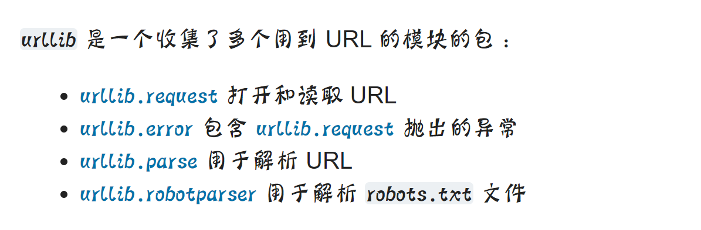
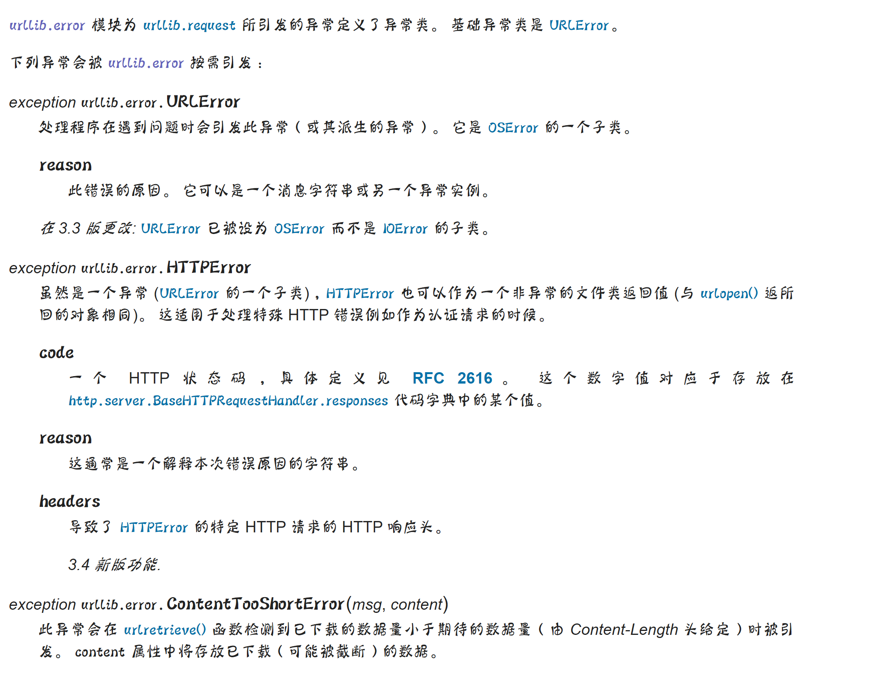
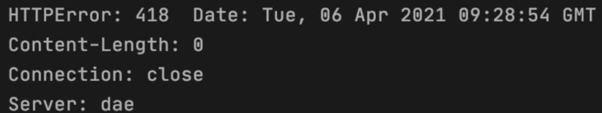
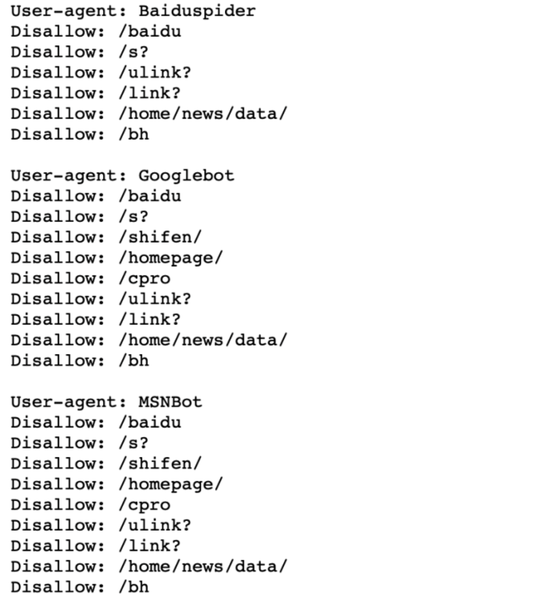

Python urllib<br />使用浏览器访问一些网站就是使用了HTTP协议。那同理网络爬虫也是要使用HTTP协议才可以发出请求和获取响应。电脑或者笔记本是使用了浏览器（比如IE、Chrom、Safari等），通过浏览器就可以看到丰富多彩、包罗万象的网络信息。那如果使用网络爬虫来去访问Web服务器，Python编程是用什么发出了请求，又获取的响应呢？在Python中，可以使用urllib模块和requests模块。<br />首先`urllib`是Python自带的标准库，无需安装，可以直接使用。如果想系统性的学习urllib库，可以直接看它的官方文档。官方文档:<br />[https://docs.python.org/zh-cn/3.7/library/urllib.html](https://docs.python.org/zh-cn/3.7/library/urllib.html)<br />首先，看一下urllib库的官方文档：<br /><br />可以发现文档是把urllib分成了4部分：

1. `urllib.request`请求模块
2. `urllib.error` 异常处理模块
3. `urllib.parse` 解析模块
4. `urllib.robotparser` 文件解析模块
<a name="XbtSe"></a>
## `urllib.request`请求模块
`urllib.request` 模块提供了最基本的构造 HTTP 请求的方法，利用它可以模拟浏览器的一个请求发起过程，同时它还带有处理 authenticaton （授权验证）， redirections （重定向)， cookies (浏览器Cookies）以及其它内容。
> `urllib.request.urlopen(_url_, _data=None_, [_timeout_, ]*, _context=None_)`
> 打开统一资源定位地址 url，url可以是一个字符串或一个Request对象，返回一个HTTPResponse对象
> 参数说明：
> 1. `url`就是要访问的网页的地址
> 2. `data` （附加参数）可选的，如果要添加 data ，它要求是字节流编码格式的内容即 bytes 类型，通过 bytes() 函数可以进行转化，另外如果传递了这个 data 参数，它的请求方式就不再是 GET 方式请求，而是 POST 。
> 3. `timeout` （超时时间） 设置网站访问超时时间
> 4. `context`，必须是 `ssl.SSLContext` 类型，用来指定 SSL 设置

来看一段通过`urllib.request.urlopen`访问百度首页的代码。
```python
# 导包
import urllib.request
# 通过urllib.request.urlopen向百度发出请求，并获取响应
response = urllib.request.urlopen('http://www.baidu.com/')
# 查看返回的response的类型
print("查看 response 响应信息类型: ",type(response))
# 获取响应码
print(response.getcode())
# 读取响应内容
page = response.read()
# 打印响应内容
print(page)
```
通过运行结果可以发现返回的是HTTPResponse类型的对象，此对象可以调用的方法有：

1. `read()` ：方法的使用方式与文件对象完全一样;
2. `info()`：返回一个`httplib.HTTPMessage`对象，表示远程服务器返回的头信息；
3. `getcode()`：返回Http状态码。如果是http请求，200表示请求成功完成;404表示网址未找到；
4. `geturl()`：返回获取页面的真实 URL。在 urlopen（或 opener 对象）可能带一个重定向时，此方法很有帮助。获取的页面 URL 不一定跟真实请求的 URL 相同。

上例中就使用到了`getcode()`获取状态码和`read()`读取响应内容。由上可以知道使用 `urlopen()` 方法可以实现最基本的请求发起，但这几个简单的参数并不足以构建一个完整的请求。完整的请求是要有请求头等信息的。所以如果需要在请求中添加请求头，就必须使用更加强大的Reuqest类完成。所以在级别上Reuqest类比`urlopen()`升级了一个level。看一下Request类的官方文档给出的解释
> `urllib.request.Request(url, data=None, headers={}, origin_req_host=None, unverifiable=False, method=None)`
> 参数：
> 1. `url`:要请求的`url`
> 2. `data`: `data`必须是bytes(字节流）类型，如果是字典，可以用urllib.parse模块里的urlencode()编码
> 3. `headers`:headers是一个字典类型，是请求头。可以在构造请求时通过headers参数直接构造，也可以通过调用请求实例的add_header()方法添加。可以通过请求头伪装浏览器，默认User-Agent是Python-urllib。要伪装火狐浏览器，可以设置User-Agent为Mozilla/5.0 (x11; U; Linux i686) Gecko/20071127 Firefox/2.0.0.11
> 4. `origin_req_host`: 指定请求方的host名称或者ip地址
> 5. `unverifiable`: 设置网页是否需要验证，默认是False，这个参数一般也不用设置。
> 6. `method`: 是一个字符串，用来指定请求使用的方法，比如GET，POST和PUT等

其实Request对象的本质是：使用`request()`来包装请求，再通过`urlopen()`获取页面。单纯使用 urlopen 并不能足以构建一个完整的请求，例如 对拉勾网的请求如果不加上 headers 等信息，就无法正常解析访问网页内容。下面代码是访问[http://httpbin.org/](http://httpbin.org/)这个测试网站通过post的请求方式，并携带了参数和请求头的信息。
```python
from urllib import request, parse
url = 'http://httpbin.org/post'
# 请求头设置
headers = {
 'User-Agent': 'Mozilla/5.0 (Macintosh; Intel Mac OS X 10_14_3) AppleWebKit/605.1.15 (KHTML, like Gecko) Version/12.0.3 Safari/605.1.15',
 'Host': 'httpbin.org'
}
# 参数设置
dict = {
 'name': 'Germey'
}
# 将参数转成字节形式
data = bytes(parse.urlencode(dict), encoding='utf8')
# 创建Request对象
response = request.Request(url=url, data=data, headers=headers, method='POST')
# 使用urlopen发出请求
response = request.urlopen(req)
# 读取并打印结果
print(response.read())
```
urllib库的`response`对象是先创建http，`request`对象，装载到`reques.urlopen`里完成http请求。<br />返回的是http，`response`对象，实际上是html属性。使用`.read().decode()`解码后转化成了str字符串类型，`decode`解码后中文字符能够显示出来。<br />例
```python

from urllib import request
#请求头
headers = {
    "User-Agent": 'Mozilla/5.0 (Windows NT 10.0; Win64; x64) AppleWebKit/537.36 (KHTML, like Gecko) Chrome/64.0.3282.186 Safari/537.36'
}
wd = {"wd": "中国"}
url = "http://www.baidu.com/s?"
req = request.Request(url, headers=headers)
response = request.urlopen(req)
print(type(response))
print(response)
res = response.read().decode()
print(type(res))
print(res)
```
<a name="mbPAo"></a>
## `urllib.error`
`urllib.error`可以接收有`urllib.request`产生的异常。`urllib.error`有两个方法，URLError和HTTPError。<br /><br />URLError是OSError的一个子类，HTTPError是URLError的一个子类，服务器上HTTP的响应会返回一个状态码，根据这个HTTP状态码，可以知道请求访问是否成功。例如第二个笔记中提到的200状态码，表示请求成功，再比如常见的404错误等。
<a name="EWCxq"></a>
### URLError
URLError异常只有属性reason，表示错误原因 。看一下URLError的异常，代码如下：
```python
from urllib import request, error
# 一个不存在的网址链接
url = "http://www.nonepython.com"
req = request.Request(url)
try:
    response = request.urlopen(req)
    print('状态码：'+str(response.getcode()))
    html = response.read().decode('utf-8')
    print(html)
except error.URLError as e:
    print('错误：',e.reason)
```
运行结果：
> 错误：[Errno 8] nodename nor servname provided, or not known

在通过urlopen访问这个网址的时候，无法到达服务器，所以报错。因此URLError是url不对或者不存在的时候会产生的错误。
<a name="HTTPError"></a>
### HTTPError
HTTPError是URLError的子类，它的异常有3个属性：
> 1. `code`:返回状态码404表示不存在，500表示服务器错误
> 2. `reason`:返回错误原因
> 3. `headers`:返回请求头

看一下HTTPError异常，代码如下(可以尝试修改一下url地址观察一下)：
```python
from urllib import request, error
try:
    response = request.urlopen('http://www.douban.com/374838/')
except error.HTTPError as e:
    print('HTTPError:', e.code, e.reason, e.headers)
else:
    print('请求成功！')
```
请求结果如下：<br /><br />418是错误编码，reason没有，剩下的都是headers的内容。最后值得注意的一点是，如果想用HTTPError和URLError一起捕获异常，那么需要将HTTPError放在URLError的前面，因为HTTPError是URLError的一个子类。如果URLError放在前面，出现HTTP异常会先响应URLError，这样HTTPError就捕获不到错误信息了。
```python
from urllib import request, error
try:
    response = request.urlopen('http://www.douban.com/374838/')
except error.HTTPError as e:
    print('HTTPError:', e.code, e.reason, e.headers)
except error.URLError as e:
    print('URLError:', e.reason)
else:
    print('请求成功！')
```
<a name="5XytL"></a>
## `urllib.parse`
urllib库里还有parse模块，用于解析链接。定义了处理URL的标准接口，例如实现URL各部分的抽取、合并以及链接转换。urllib.parse 分为 URL parsing (网址解析）和URL quoting（地址引用）
<a name="c2KP1"></a>
### 网址解析
URL 解析函数专注于将 URL 字符串拆分为其组件，或将 URL 组件组合到 URL 字符串中。
> 定义：
> `urllib.parse.urlparse(urlstring, scheme="", allow_fragments=True)`
> 作用特点：将 URL 拆分成 6 大组件，如：
> [http://www.baidu.com/index.html?name=mo&age=25#dowell](http://www.baidu.com/index.html?name=mo&age=25#dowell)
> 1、传输协议：http，https
> 2、域名：例www.baidu.com为网站名字。baidu.com为一级域名，www是服务器
> 3、端口：不填写的话默认走的是80端口号
> 4、路径 [http://www.baidu.com/index.html](http://www.baidu.com/index.html)。/表示分层路径
> 5、携带的参数：？问号传参（可有可无） 如：?name=mo
> 6、哈希值：HASH值（可有可无）#dowell

主要记住：urlencode<br />对于构造GET请求参数时非常有用，首先声明一个字典将参数表示出来，然后调用urlencode的方法将其序列化为GET请求参数。
```python
from urllib.parse import urlencode
params = {'name':'小明','age':20}
base_url = 'http://baidu.com?'
base_url += urlencode(params)
print(base_url)
# 结果：http://baidu.com?name=%E5%B0%8F%E6%98%8E&age=20
```
<a name="AcEJc"></a>
### 地址引用（URL Quoting)
URL引用函数侧重于获取程序数据，并通过引用特殊字符和适当地编码非ASCII文本来使其作为URL组件安全使用。它们还支持逆转这些操作，以使URL组件的内容重新创建原始数据，如果上述URL解析函数未覆盖该任务的话。
<a name="quote"></a>
#### quote
该方法将内容转化为URL编码格式，此方法可以将中文字符串转化为URL编码
```python
from urllib.parse import quote
keyword = '美女'
url = 'http://www.baidu.com?wd=' +quote(keyword)
print(url)
# 结果：http://www.baidu.com?wd=%E7%BE%8E%E5%A5%B3
```
<a name="ZW6PO"></a>
#### unquote：利用unquote进行还原
```python
from urllib.parse import quote,unquote
print(unquote('%E7%BE%8E%E5%A5%B3'))
# 结果：美女
```
<a name="0c63q"></a>
## urllib.robotparser
先说一下网站文件 `robots.txt`。每个网站都会定义 `robots.txt` 文件，这个文件可以告诉网络爬虫爬取该网站时存在哪些限制。作为良好网民以及其他人利益，一般上遵从这些限制。如何查看这个文件？可以通过在目标网站站点或域名后面加上 `robots.txt` 进行访问。例如 目标网站站点 `[https://www.baidu.com](https://www.baidu.com)` 的 `robots.txt` 文件就是 `[https://www.baidu.com/robots.txt](https://www.baidu.com/robots.txt)`<br /><br />**关于这个 **`**robots.txt**`** 文件内容**：<br />section 1：定义了 `Sitemap` 文件，即所谓的网站地图。网站提供的 Sitemap 文件（即 网站地图）提供了该网站站点里面所有页面的链接，这些链接组成了这个 Sitemap 文件，所以叫做地图并不过分。<br />section 2：如果这被注释掉的部分，如果没有被注释且指明了跳转链接，那么，表明每个用户两次爬虫之间的时间间隔不能小于 5s 否则所访问的网站网页会自动跳转到指定的链接页面。此时，相当于网站服务器禁封了 IP ，禁封时间依据各网站的情况。<br />section 3：这部分表示，`robots.txt` 文件禁止那些代理为 MSNBot 的爬虫访问网站。理解过来，就是禁止MSNBot爬虫代理访问网站。Disallow表示不允许访问的路径，allow表示允许访问的路径。
```python
import ssl
ssl._create_default_https_context = ssl._create_unverified_context
rp = robotparser.RobotFileParser()
rp.set_url('https://www.baidu.com/robots.txt')
rp.read()
url = 'https://www.baidu.com'
user_agent = 'YoudaoBot'
wsp_info = rp.can_fetch(user_agent, url)
print("Wandoujia Spider 代理用户访问情况：", wsp_info)
user_agent = 'Other Spider'
osp_info = rp.can_fetch(user_agent, url)
print("Other Spider 代理用户访问情况：", osp_info)
```
当 `urllib.urlopen`一个 https 的时候会验证一次 SSL 证书，当目标使用的是自签名的证书时就会出现一个URLError，如果是这样可以在开头加上
```python
import ssl
ssl._create_default_https_context = ssl._create_unverified_context
```
运行下看看上面的结果是什么？当然这四个分类中有的内容比较多，只是提及比较常用的内容！最后附加一个，就是`urllib.urlretrieve()`是直接将远程数据下载到本地。这个函数可以方便的将网页上的一个文件保存到本地。文件类型可以是网页的html文件、图片、视频等媒体文件。
> `urlretrieve(url, filename=None, reporthook=None, data=None)`
> 1. 参数 url 指定了要下载的文件的url
> 2. 参数 finename 指定了保存本地路径（如果参数未指定，urllib会生成一个临时文件保存数据。）
> 3. 参数 reporthook 是一个回调函数，当连接上服务器、以及相应的数据块传输完毕时会触发该回调，可以利用这个回调函数来显示当前的下载进度。
> 4. 参数 data 指 post 到服务器的数据，该方法返回一个包含两个元素的(filename, headers)元组，filename 表示保存到本地的路径，header 表示服务器的响应头。

```python
from urllib import request
image_url = 'https://gimg2.baidu.com/image_search/src=http%3A%2F%2Fdingyue.nosdn.127.net%2FwFdkoX0pkLJoS1Ued6ou7dgUMaiZfAy93RiVXhz3iy7QU1542769981593compressflag.jpeg&refer=http%3A%2F%2Fdingyue.nosdn.127.net&app=2002&size=f9999,10000&q=a80&n=0&g=0n&fmt=jpeg?sec=1620297676&t=0b3443d8c5b502c8134079e0e131ef3f'
request.urlretrieve(image_url,'liying.jpg')
```
该方法主要用于文件的保存。路径是相对当前py文件来说，保存liying.jpg
