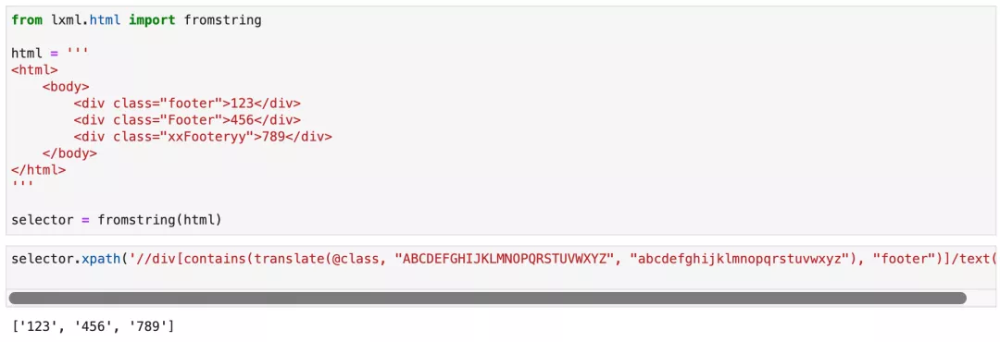

Python 爬虫 XPath 一般来说，网页的版权信息，页尾信息，会放在一个叫做`

`的标签里面。所以，要用 XPath 找到这种版权信息，本来应该非常简单：`//div[@class="footer"]`。但实际场景中，可能有两种情况：`

`和`
`。 `footer`前后都有字符的时候，可以使用 XPath 的关键词`contains：//div[contains(@class, "footer")]`，运行效果如下图所示：  但如果想忽略大小写的时候怎么办呢？实际上，在 XPath 2.0的标准里面，有一个关键字叫做`lower-case`就可以实现这个需求，XPath 写为： `//div[lower-case(@class)="footer"]/text()`。可以在一些在线 XPath 检查的工具里面看到提取效果，如下图所示：  但坏就坏在，Python 的第三方库`lxml`使用的是 XPath 1.0标准，因此没有`lower-case`这个关键字。所以要实现这个需求，需要使用另一个关键字`translate`：`//div[translate(@class, "ABCDEFGHIJKLMNOPQRSTUVWXYZ", "abcdefghijklmnopqrstuvwxyz")="footer"]/text()`。 运行效果如下图所示：  这里的`translate`效果就跟 Python 字符串的`translate`差不多。 XPath 的`translate`的语法为：`translate(目标属性, 需要替换的字符, 替换成字符)`。这样就可以把节点的目标属性值转成小写再来对比。 那么，如果HTML 标签的属性值是`xxxFooteryyy`怎么办呢？其实也可以像函数嵌套一样再套一层`contains：//div[contains(translate(@class, "ABCDEFGHIJKLMNOPQRSTUVWXYZ", "abcdefghijklmnopqrstuvwxyz"), "footer")]` 运行效果如下图所示： 
