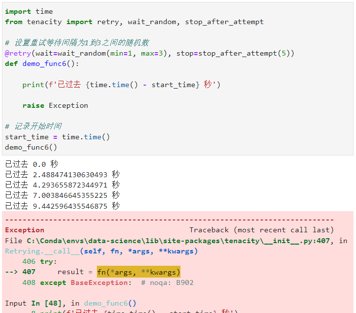

Python
<a name="t5y0f"></a>
## 1、简介
在编写程序尤其是与网络请求相关的程序，如调用web接口、运行网络爬虫等任务时，经常会遇到一些偶然发生的请求失败的状况，这种时候如果仅仅简单的捕捉错误然后跳过对应任务，肯定是不严谨的，尤其是在网络爬虫中，会存在损失有价值数据的风险。<br />这类情况下就很有必要为程序逻辑添加一些**「错误重试」**的策略，Python中的retry库，但它功能较为单一，只能应对基本的需求。
<a name="VsjxR"></a>
## 2、tenacity中的常用功能
作为一个第三方Python库，可以使用`pip install tenacity`对其进行安装，安装完成后，下面来学习一下tenacity的主要使用方法和特性：
<a name="gOCLK"></a>
### 2.1 tenacity的基础使用
tenacity的错误重试核心功能由其retry装饰器来实现，默认不给retry装饰器传参数时，它会在其所装饰的函数运行过程抛出错误时不停地重试下去，譬如下面这个简单的例子：
```python
import random
from tenacity import retry

@retry
def demo_func1():

    a = random.random()
    print(a)
    
    if a >= 0.1:
        raise Exception

demo_func1()
```
<br />可以看到，函数体内每次生成0到1之间的随机数，当这个随机数不超过0.1时才会停止抛出错误，否则则会被tenacity捕捉到每次的错误抛出行为并立即重试。
<a name="SLGss"></a>
### 2.2 设置最大重试次数
有些时候对某段函数逻辑错误重试的忍耐是有限度的，譬如当调用某个网络接口时，如果连续n次都执行失败，可能就会认为这个任务本身就存在缺陷，不是通过重试就能有朝一日正常的。<br />这种时候可以利用tenacity中的`stop_after_attempt`函数，作为`retry()`中的`stop`参数传入，从而“无尽”的错误重试过程添加一个终点，其中`stop_after_attempt()`接受一个整数输入作为**「最大重试」**的次数：
```python
from tenacity import retry, stop_after_attempt

@retry(stop=stop_after_attempt(3))
def demo_func2():
    
    print('函数执行')
    
    raise Exception
    
demo_func2()
```
<br />可以看到，函数在限制了最大重试次数后，经过3次重试，在第4次继续执行依然抛出错误后，正式地抛出了函数中对应的Exception错误结束了重试过程。
<a name="l0gXV"></a>
### 2.3 设置重试最大超时时长
除了像上一小节中那样设置最大错误重试的次数之外，tenacity还提供了`stop_after_delay()`函数来设置整个重试过程的最大耗时，超出这个时长也会结束重试过程：
```python
import time
from tenacity import retry, stop_after_delay

# 设置重试最大超时时长为5秒
@retry(stop=stop_after_delay(5))
def demo_func3():
    
    time.sleep(1)
    print(f'已过去 {time.time() - start_time} 秒')
    
    raise Exception

# 记录开始时间
start_time = time.time()
demo_func3()
```

<a name="YZAEU"></a>
### 2.4 组合重试停止条件
如果任务同时需要添加最大重试次数以及最大超时时长限制，在tenacity中仅需要用|运算符组合不同的限制条件再传入`retry()`的`stop`参数即可，譬如下面的例子，当函数执行重试超过3秒或次数大于5次时均可以结束重试：
```python
import time
import random
from tenacity import retry, stop_after_delay, stop_after_attempt

@retry(stop=(stop_after_delay(3) | stop_after_attempt(5)))
def demo_func4():
    
    time.sleep(random.random())
    print(f'已过去 {time.time() - start_time} 秒')
    
    raise Exception

# 记录开始时间
start_time = time.time()
demo_func4()
```
<br />可以看到，在上面的演示中，先达到了“最大重试5次”的限制从而结束了重试过程。
<a name="TM57z"></a>
### 2.5 设置相邻重试之间的时间间隔
有些情况下并不希望每一次重试抛出错误后，立即开始下一次的重试，譬如爬虫任务中为了更好地伪装程序，tenacity中提供了一系列非常实用的函数，配合`retry()`的`wait`参数，妥善处理相邻重试之间的时间间隔，其中较为实用的主要有以下两种方式：
<a name="PAvCZ"></a>
#### 2.5.1 设置固定时间间隔
通过使用tenacity中的`wait_fixed()`可以为相邻重试之间设置固定的等待间隔秒数，就像下面的简单示例那样：
```python
import time
from tenacity import retry, wait_fixed, stop_after_attempt

# 设置重试等待间隔为1秒
@retry(wait=wait_fixed(1), stop=stop_after_attempt(3))
def demo_func5():
    
    print(f'已过去 {time.time() - start_time} 秒')
    
    raise Exception
    
# 记录开始时间
start_time = time.time()
demo_func5()
```

<a name="Fu4ma"></a>
#### 2.5.2 设置随机时间间隔
除了设置固定的时间间隔外，tenacity还可以通过`wait_random()`为相邻重试设置均匀分布随机数，只需要设置好均匀分布的范围即可：
```python
import time
from tenacity import retry, wait_random, stop_after_attempt

# 设置重试等待间隔为1到3之间的随机数
@retry(wait=wait_random(min=1, max=3), stop=stop_after_attempt(5))
def demo_func6():
    
    print(f'已过去 {time.time() - start_time} 秒')
    
    raise Exception

# 记录开始时间
start_time = time.time()
demo_func6()
```
<br />可以观察到，每一次重试后的等待时长都是随机的~
<a name="wcjqv"></a>
### 2.6 自定义是否触发重试
tenacity中`retry()`的默认策略是当其所装饰的函数执行过程“抛出任何错误”时即进行重试，但有些情况下需要的可能是对特定错误类型的捕捉/忽略，亦或是对异常计算结果的捕捉。<br />tenacity中同样内置了相关的实用功能：
<a name="ON8mP"></a>
#### 2.6.1 捕捉或忽略特定的错误类型
使用tenacity中的`retry_if_exception_type()`和`retry_if_not_exception_type()`，配合`retry()`的`retry`参数，可以对特定的错误类型进行捕捉或忽略：
```python
from tenacity import retry, retry_if_exception_type, retry_if_not_exception_type

@retry(retry=retry_if_exception_type(FileExistsError))
def demo_func7():
    
    raise TimeoutError
    
@retry(retry=retry_if_not_exception_type(FileNotFoundError))
def demo_func8():

    raise FileNotFoundError
```
<br />
<a name="lZvCO"></a>
#### 2.6.2 自定义函数结果条件判断函数
可以编写额外的条件判断函数，配合tenacity中的`retry_if_result()`，实现对函数的返回结果进行自定义条件判断，返回True时才会触发重试操作：
```python
import random
from tenacity import retry, retry_if_result

@retry(retry=retry_if_result(lambda x: x >= 0.1))
def demo_func9():
    a = random.random()
    print(a)
    return a

# 记录开始时间
demo_func9()
```

<a name="Wz5Eb"></a>
### 2.7 对函数的错误重试情况进行统计
被tenacity的`retry()`装饰的函数，可以打印其`retry.statistics`属性查看其历经的错误重试统计记录结果，譬如这里对前面执行过的示例函数`demo_func9()`的统计结果进行打印：
```python
demo_func9.retry.statistics
```
<br />除了上述的功能之外，tenacity还具有很多特殊的特性，可以结合logging模块、异步函数、协程等其他Python功能实现更高级的功能，感兴趣的朋友可以前往[https://github.com/jd/tenacity](https://github.com/jd/tenacity)了解更多。
