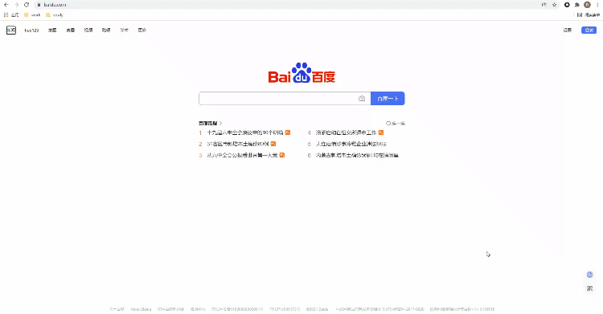
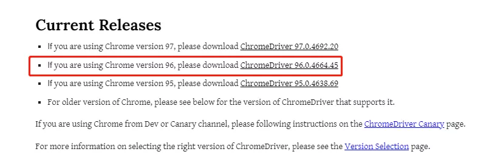
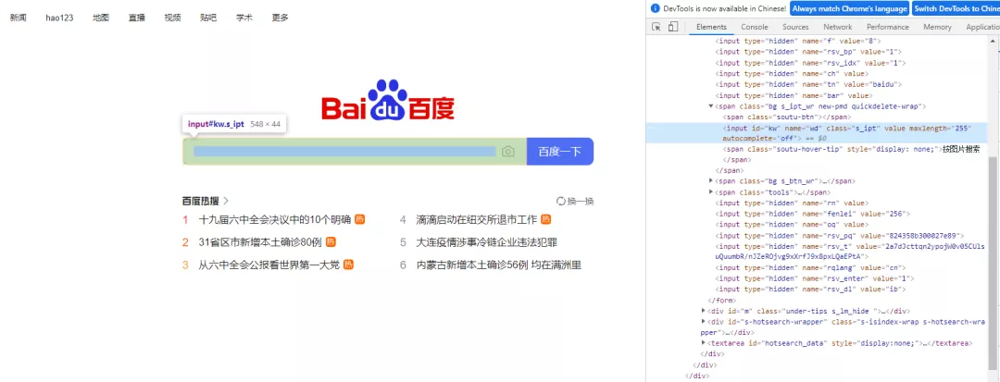
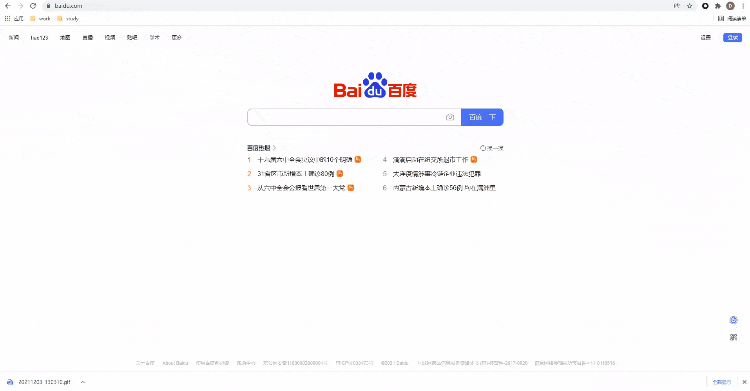
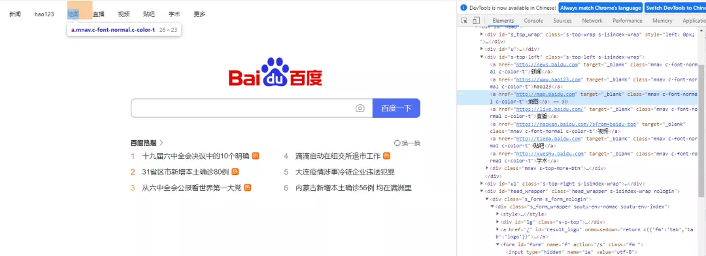

Python 爬虫 Selenium
<a name="vHwbj"></a>
## selenium的简介与安装
selenium是最广泛使用的开源Web UI自动化测试套件之一，它所支持的语言包括C++、Java、Perl、PHP、Python和Ruby，在数据抓取方面也是一把利器，能够解决大部分网页的反爬措施，当然它也并非是万能的，一个比较明显的一点就在于是它速度比较慢，如果每天数据采集的量并不是很高，倒是可以使用这个框架。<br />那么说到安装，可以直接使用pip在安装
```bash
pip install selenium
```
与此同时呢，还需要安装一个浏览器驱动，不同的浏览器需要安装不同的驱动，这边小编主要推荐的以下这两个

- Firefox浏览器驱动：geckodriver
- Chrome浏览器驱动：chromedriver

平常使用的是selenium+chromedriver比较多，所以这里就以Chrome浏览器为示例，由于要涉及到`chromedriver`的版本需要和浏览器的版本一致，因此先来确认一下浏览器的版本是多少？看下图<br /><br />在“关于Chrome”当中找到浏览器的版本，然后下载对应版本的`chromedriver`，当然也要对应自己电脑的操作系统<br />
<a name="hhMrb"></a>
## 页面元素的定位
在谈到页面元素的定位时，默认各位朋友具备了最最基本的前端知识，例如HTML，CSS等
<a name="MDM7P"></a>
### ID标签的定位
在HTML当中，ID属性是唯一标识一个元素的属性，因此在selenium当中，通过ID来进行元素的定位也作为首选，以百度首页为例，搜索框的HTML代码如下，其ID为“kw”，而“百度一下”这个按钮的ID为“su”，用Python脚本通过ID的标签来进行元素的定位
```python
driver.find_element_by_id("kw")
driver.find_element_by_id("su")
```
<a name="qOvPt"></a>
### NAME标签的定位
在HTML当中，Name属性和ID属性的功能基本相同，只是Name属性并不是唯一的，如果遇到没有ID标签的时候，可以考虑通过Name标签来进行定位，代码如下
```python
driver.find_element_by_name("wd")
```
<a name="Xqsph"></a>
### Xpath定位
使用Xpath方式来定位几乎涵盖了页面上的任意元素，那什么是Xpath呢？Xpath是一种在XML和HTML文档中查找信息的语言，当然通过Xpath路径来定位元素的时候也是分绝对路径和相对路径。<br />绝对路径是以单号/来表示，相对路径是以`//`来表示，而涉及到Xpath路径的编写，小编这里偷个懒，直接选择复制/粘贴的方式，例如针对下面的HTML代码
```html
<!DOCTYPE html>
<html lang="en">
<head>
    <meta charset="UTF-8">
    <title>Test</title>
</head>
<body>
<form id="loginForm">
    <input name="username" type="text" />
    <input name="password" type="password" />
    <input name="continue" type="submit" value="Login" />
    <input name="continue" type="button" value="Clear" />
</form>

</body>
</html>
```
可以这么来做，打开浏览器的开发者工具，鼠标移到选中的元素，然后右击检查，具体看下图<br /><br />还是以百度首页为例，看一下如何通过`Xpath`来进行页面元素的定位，代码如下
```python
driver.find_element_by_xpath('//*[@id="kw"]')
```
<a name="YCre6"></a>
### `className`标签定位
也可以基于class属性来定位元素，尤其是当看到有多个并列的元素如list表单，class用的都是共用同一个，如：
```python
driver.find_element_by_class_name("classname")
```
这个时候，就可以通过class属性来定位元素，该方法返回的是一个`list`列表，而当想要定位列表当中的第n个元素时，则可以这样来安排
```python
driver.find_elements_by_class_name("classname")[n]
```
需要注意的是，这里使用的是`find_elements_by_class_name()`方法而不是`find_element_by_class_name()`方法，这里还是通过百度首页的例子，通过`className`标签来定位搜索框这个元素
```python
driver.find_element_by_class_name('s_ipt')
```
<a name="SeCeT"></a>
### `CssSelector()`方法定位
其实在Selenium官网当中是更加推荐`CssSelector()`方法来进行页面元素的定位的，原因在于相比较于`Xpath`定位速度更快，`Css`定位分为四类：ID值、Class属性、TagName值等等，依次来看

- ID方式来定位

大概有两种方式，一种是在ID值前面添加TagName的值，另外一种则是不加，代码如下
```python
driver.find_element_by_css_selector("#id_value")  # 不添加前面的`TagName`值
driver.find_element_by_css_selector("tag_name.class_value")  # 不添加前面的`TagName`值
```
当然有时候这个TagName的值非常的冗长，中间可能还有空格，那么这当中的空格就需要用点“.”来替换
```python
driver.find_element_by_css_selector("tag_name.class_value1.calss_value2.class_value3")  # 不添加前面的`TagName`值
```
仍然以百度首页的搜索框为例，它的HTML代码如下<br /><br />要是用`CssSelector`的`.class()`方式来实现元素的定位的话，Python代码该这样来实现，和上面`Xpath()`的方法一样，可以稍微偷点懒，通过复制/粘贴的方式从开发者工具当中来获取元素的位置<br /><br />代码如下
```python
driver.find_element_by_css_selector('#kw')
```
<a name="nxaNS"></a>
### `linkText()`方式来定位
这个方法直接通过链接上面的文字来定位元素，案例如下<br /><br />通过`linkText()`方法来定位“地图”这个元素，代码如下
```python
driver.find_element_by_link_text("地图").click()
```
<a name="Ez22v"></a>
## 浏览器的控制
<a name="DG2sV"></a>
### 修改浏览器窗口的大小
可以通过使用`set_window_size()`这个方法来修改浏览器窗口的大小，代码如下
```python
# 修改浏览器的大小
driver.set_window_size(500, 900)
```
同时还有`maxmize_window()`方法是用来实现浏览器全屏显示，代码如下
```python
# 全屏显示
driver.maximize_window()
```
<a name="FCpK3"></a>
### 浏览器的前进与后退
前进与后退用到的方法分别是`forward()`和`back()`，代码如下
```python
# 前进与后退
driver.forward()
driver.back()
```
<a name="XOkn2"></a>
### 浏览器的刷新
刷新用到的方法是`refresh()`，代码如下
```python
# 刷新页面
driver.refresh()
```
除了上面这些，`webdriver`的常见操作还有

- 关闭浏览器：`get()`
- 清除文本：`clear()`
- 单击元素：`click()`
- 提交表单：`submit()`
- 模拟输入内容：`send_keys()`

可以尝试着用上面提到的一些方法来写段程序
```python
from selenium import webdriver
from time import sleep

driver = webdriver.Chrome(executable_path="chromedriver.exe")
driver.get("https://www.baidu.com")
sleep(3)
driver.maximize_window()
sleep(1)
driver.find_element_by_xpath('//*[@id="s-top-loginbtn"]').click()
sleep(3)
driver.find_element_by_xpath('//*[@id="TANGRAM__PSP_11__userName"]').send_keys('12121212')
sleep(1)
driver.find_element_by_xpath('//*[@id="TANGRAM__PSP_11__password"]').send_keys('testtest')
sleep(2)
driver.refresh()
sleep(3)
driver.quit()
```
output<br />
<a name="JmtFh"></a>
## 鼠标的控制
鼠标的控制都是封装在`ActionChains`类当中，常见的有以下几种
```python
# 引入action_chains类
from selenium.webdriver.common.action_chains import ActionChains
# 右击
ActionChains(driver).context_click(element).perform()
# 双击
ActionChains(driver).double_click(element).perform()
# 拖放
ActionChains(driver).drag_and_drop(Start, End).perform()
# 悬停
ActionChains(driver).move_to_element(Above).perform()
# 按下
ActionChains(driver).click_and_hold(leftclick).perform()
# 执行指定的操作
```
<a name="haCLp"></a>
## 键盘的控制
webdriver中的`Keys()`类，提供了几乎所有按键的方法，常用的如下
```python
# 删除键
driver.find_element_by_id('xxx').send_keys(Keys.BACK_SPACE)
# 空格键
driver.find_element_by_id('xxx').send_keys(Keys.SPACE)
# 回车键
driver.find_element_by_id('xxx').send_keys(Keys.ENTER)
# Ctrl + A 全选内容
driver.find_element_by_id('xxx').send_keys(Keys.CONTROL, 'a')
# Ctrl + C/V 复制/粘贴内容
driver.find_element_by_id('xxx').send_keys(Keys.CONTROL, 'c')
driver.find_element_by_id('xxx').send_keys(Keys.CONTROL, 'v')
```
其他的一些键盘操作

- 向上箭头：`Keys.ARROW_UP`
- 向下箭头：`Keys.ARROW_DOWN`
- 向左/向右箭头：`Keys.ARROW_LEFT`/`Keys.ARROW_RIGHT`
- Shift键：`Keys.SHIFT`
- F1键：`Keys.F1`
<a name="d2nYj"></a>
## 元素的等待
有显示等待和隐式等待两种
<a name="Pc2jH"></a>
### 显示等待
显示等待指的是设置一个超时时间，每隔一段时间去查看一下该元素是否存在，如果存在则执行后面的内容，要是超过了最长的等待时间，则抛出异常(`TimeoutException`)，需要用到的是`WebDriverWait()`方法，同时配合`until`和`not until`方法
```python
WebDriverWait(driver, timeout, poll_frequency=0.5, ignored_exceptions=None)
```
其中的参数：

- `timeout`: 最长超时时间，默认以秒为单位
- `poll_frequency`: 检测的时间间隔，默认是0.5s
- `ignored_exceptions`: 指定忽略的异常，默认忽略的有NoSuchElementException这个异常

来看下面的案例
```python
driver = webdriver.Chrome()
driver.get("http://somedomain/url_that_delays_loading")
try:    
    element = WebDriverWait(driver, 10).until(           
        EC.presence_of_element_located((By.ID, "myDynamicElement")))
finally:    
    driver.quit()
```
上面的代码最多等待10秒，超时后就抛出异常，但是假设在等了3秒之后就找到了这个元素，那么也就不会多等下剩下的7秒钟时间，而是继续执行后续的代码
<a name="iJPyW"></a>
### 隐式等待
主要使用的是`implicitly_wait()`来实现
```python
browser = webdriver.Chrome(path)
# 隐式等待3秒
browser.implicitly_wait(3)
```
<a name="GAZ7j"></a>
## 获取Cookie
Cookie是用来识别用户身份的关键，通常也是通过selenium先模拟登录网页获取Cookie，然后再通过`requests`携带Cookie来发送请求。<br />webdriver提供了cookies的几种操作，挑选几个常用的来说明

- `get_cookies()`：以字典的形式返回当前会话中可见的cookie信息
- `get_cookies(name)`: 返回cookie字典中指定的的cookie信息
- `add_cookie(cookie_dict)`: 将cookie添加到当前会话中

下面看一个简单的示例代码
```python
driver=webdriver.Chrome(executable_path="chromedriver.exe")
driver.get(url=url)
time.sleep(1)

cookie_list=driver.get_cookies()
cookies =";".join([item["name"] +"=" + item["value"] + "" for item in cookie_list])
session=requests.session()

headers = {
    'User-Agent':'Mozilla/5.0 (Windows NT 10.0; Win64; x64) AppleWebKit/537.36 (KHTML, like Gecko) Chrome/83.0.4103.106 Safari/537.36',
    'cookie': cookies
}

response=session.get(url=url,headers=headers)
soup=BeautifulSoup(response.text,'lxml')
```
<a name="hY8oQ"></a>
## 调用JavaScript
在webdriver当中可以使用`execut_script()`方法来实现JavaScript的执行，下面来看一个简单的例子
```python
from selenium import webdriver
import time
bro=webdriver.Chrome(executable_path='./chromedriver')
bro.get("https://www.baidu.com")

# 执行js代码
bro.execute_script('alert(10)')
time.sleep(3)
bro.close()
```
除此之外，还可以通过selenium执行JavaScript来实现屏幕上下滚动
```python
from selenium import webdriver
bro=webdriver.Chrome(executable_path='./chromedriver')
bro.get("https://www.baidu.com")
# 执行js代码
bro.execute_script('window.scrollTo(0,document.body.scrollHeight)')
```
<a name="jTCiD"></a>
## selenium进阶
selenium启动的浏览器，会非常容易的被检测出来，通常可以通过`window.navigator.webdriver`的值来查看，如果是`true`则说明是使用了selenium模拟浏览器，如果是`undefined`则通常会被认为是正常的浏览器。<br />那么似乎可以执行下面这段代码来强行更改`window.navigator.webdriver`最后返回的值
```python
driver.execute_script(
    'Object.defineProperties(navigator,{webdriver:{get:()=>false}})'
)
```
当然这种方法也有一定的缺陷，毕竟这段代码是在网页已经加载完毕之后才运行的，此时网页自身的JavaScript程序已经通过读取`window.navigator.webdriver`知道你使用的是模拟浏览器了。所以有两种办法来解决这个缺陷。

- 在Chrome当中添加实验性功能参数

代码如下
```python
from selenium.webdriver import Chrome
from selenium.webdriver import ChromeOptions

option = ChromeOptions()
option.add_experimental_option('excludeSwitches',['enable-automation'])
driver=Chrome(options=option)
```

- 调用chrome当中的开发工具协议的命令

核心思想就是让Chrome浏览器在打开页面，还没有运行网页自带的JavaScript代码时，先来执行给定的代码，通过`execute_cdp_cmd()`方法，
```python
driver.execute_cdp_cmd("Page.addScriptToEvaluateOnNewDocument", {
    "source": """
        Object.defineProperty(navigator, 'webdriver', {
            get: () => undefined
        })
    """
})
```
当然为了更好隐藏指纹特征，可以将上面两种方法想结合
```python
from selenium import webdriver
options = webdriver.ChromeOptions()
options.add_experimental_option("excludeSwitches", ["enable-automation"])
options.add_experimental_option('useAutomationExtension', False)
driver = webdriver.Chrome(options=options, executable_path='./chromedriver')
driver.execute_cdp_cmd("Page.addScriptToEvaluateOnNewDocument", {
  "source": """
    Object.defineProperty(navigator, 'webdriver', {
      get: () => undefined
    })
  """
})
driver.get(url)
```
最后的最后，也可以通过运行stealth.min.js文件来实现隐藏selenium模拟浏览器的特征，这个文件之前是给`puppeteer`用的，使得其隐藏浏览器的指纹特征，而让Python使用时，需要先导入这份JS文件<br />[stealth.min.js](https://www.yuque.com/attachments/yuque/0/2021/js/396745/1638511316996-21edf2bf-50cf-487c-93f2-c06738411a57.js?_lake_card=%7B%22src%22%3A%22https%3A%2F%2Fwww.yuque.com%2Fattachments%2Fyuque%2F0%2F2021%2Fjs%2F396745%2F1638511316996-21edf2bf-50cf-487c-93f2-c06738411a57.js%22%2C%22name%22%3A%22stealth.min.js%22%2C%22size%22%3A161324%2C%22ext%22%3A%22js%22%2C%22source%22%3A%22%22%2C%22status%22%3A%22done%22%2C%22download%22%3Atrue%2C%22type%22%3A%22text%2Fjavascript%22%2C%22taskId%22%3A%22uc00399e4-c83a-49e5-b32b-6d6ab0f6ab3%22%2C%22taskType%22%3A%22upload%22%2C%22mode%22%3A%22title%22%2C%22id%22%3A%22uc9f542b8%22%2C%22card%22%3A%22file%22%7D)
```python
import time
from selenium.webdriver import Chrome

option = webdriver.ChromeOptions()
option.add_argument("--headless")

# 无头浏览器需要添加user-agent来隐藏特征
option.add_argument('user-agent=.....')
driver = Chrome(options=option)
driver.implicitly_wait(5)

with open('stealth.min.js') as f:
    js = f.read()

driver.execute_cdp_cmd("Page.addScriptToEvaluateOnNewDocument", {
  "source": js
})

driver.get(url)
```
