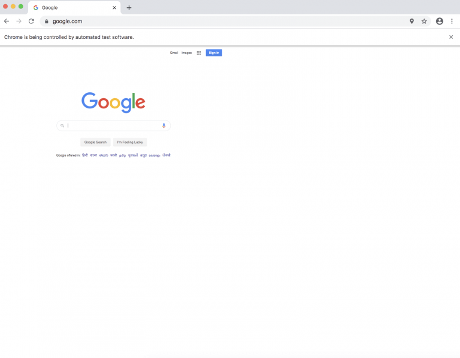

Python爬虫Selenium
<a name="oqS9u"></a>
## Chrome DevTools 简介
Chrome DevTools 是一组直接内置在基于 Chromium 的浏览器（如 Chrome、Opera 和 Microsoft Edge）中的工具，用于帮助开发人员调试和研究网站。<br />借助 Chrome DevTools，开发人员可以更深入地访问网站，并能够：

- 检查 DOM 中的元素
- 即时编辑元素和 CSS
- 检查和监控网站的性能
- 模拟用户的地理位置
- 模拟更快/更慢的网络速度
- 执行和调试 JavaScript
- 查看控制台日志
- 等等
<a name="tKj3K"></a>
## Selenium 4 Chrome DevTools API
<br />Selenium 是支持 web 浏览器自动化的一系列工具和库的综合项目。Selenium 4 添加了对 Chrome DevTools API 的原生支持。借助这些新的 API，测试现在可以：

- 捕获和监控网络流量和性能
- 模拟地理位置，用于位置感知测试、本地化和国际化测试
- 更改设备模式并测试应用的响应性

这只是冰山一角！<br />Selenium 4 引入了新的 ChromiumDriver 类，其中包括两个方法用于访问 Chrome DevTools：`getDevTools()` 和 `executeCdpCommand()`。<br />`getDevTools()` 方法返回新的 DevTools 对象，允许使用 `send()` 方法发送针对 CDP 的内置 Selenium 命令。这些命令是包装方法，使调用 CDP 函数更加清晰和简便。<br />`executeCdpCommand()` 方法也允许执行 CDP 方法，但更加原始。它不使用包装的 API，而是允许直接传入 Chrome DevTools 命令和该命令的参数。如果某个 CDP 命令没有 Selenium 包装 API，或者希望以与 Selenium API 不同的方式进行调用，则可以使用 `executeCdpCommand()`。<br />像 ChromeDriver 和 EdgeDriver 这样的基于 Chromium 的驱动程序现在继承自 ChromiumDriver，因此也可以从这些驱动程序中访问 Selenium CDP API。<br />探索如何利用这些新的 Selenium 4 API 来解决各种使用案例。
<a name="p2LlB"></a>
## 模拟设备模式
如今构建的大多数应用都是响应式的，以满足来自各种平台、设备（如手机、平板、可穿戴设备、桌面）和屏幕方向的终端用户的需求。<br />作为测试人员，可能希望将应用程序放置在不同的尺寸中，以触发应用程序的响应性。<br />如何使用 Selenium 的新 CDP 功能来实现这一点呢？<br />用于修改设备度量的 CDP 命令是 `Emulation.setDeviceMetricsOverride`，并且此命令需要输入宽度、高度、移动设备标志和设备缩放因子。这四个键在此场景中是必需的，但还有一些可选的键。<br />在 Selenium 测试中，可以使用 `DevTools::send()` 方法并使用内置的 `setDeviceMetricsOverride()` 命令，但是这个 Selenium API 接受 12 个参数 - 除了 4 个必需的参数外，还有 8 个可选的参数。对于不需要发送的这 8 个可选参数中的任何一个，可以传递 `Optional.empty()`。<br />然而，为了简化这个过程，只传递所需的参数，将使用下面代码中的原始 `executeCdpCommand()` 方法。
```java
package com.devtools;

import org.openqa.selenium.chrome.ChromeDriver;
import org.openqa.selenium.devtools.DevTools;
import java.util.HashMap;
import java.util.Map;

public class SetDeviceMode {

    final static String PROJECT_PATH = System.getProperty("user.dir");

    public static void main(String[] args){
        System.setProperty("webdriver.chrome.driver", PROJECT_PATH + "/src/main/resources/chromedriver");
        ChromeDriver driver;
        driver = new ChromeDriver();

        DevTools devTools = driver.getDevTools();
        devTools.createSession();
        Map deviceMetrics = new HashMap()
        {{
            put("width", 600);
            put("height", 1000);
            put("mobile", true);
            put("deviceScaleFactor", 50);
        }};
        driver.executeCdpCommand("Emulation.setDeviceMetricsOverride", deviceMetrics);
        driver.get("https://www.google.com");
    }
}
```
在第19行，创建了一个包含此命令所需键的映射。<br />然后在第26行，调用 `executeCdpCommand()` 方法，并传递两个参数：命令名称为 "Emulation.setDeviceMetricsOverride"，以及包含参数的设备度量映射。<br />在第27行，打开了渲染了提供的规格的 "Google" 首页，如下图所示。<br /><br />借助像 Applitools Eyes 这样的解决方案，不仅可以使用这些新的 Selenium 命令在不同的视口上快速进行测试，还可以在规模上保持任何不一致性。Eyes 足够智能，不会对由于不同的浏览器和视口导致的 UI 中微小且难以察觉的变化报告错误的结果。
<a name="xw1in"></a>
## 模拟地理位置
在许多情况下，需要测试特定的基于位置的功能，例如优惠、基于位置的价格等。为此，可以使用DevTools API来模拟位置。
```java
@Test
public void mockLocation(){
    devTools.send(Emulation.setGeolocationOverride(
        Optional.of(48.8584),
        Optional.of(2.2945),
        Optional.of(100)));
    driver.get("https://mycurrentlocation.net/");
    try {
        Thread.sleep(30000);
    } catch (InterruptedException e) {
        e.printStackTrace();
    }
}
```
<a name="UpYyD"></a>
## 模拟网络速度
许多用户通过连接到 Wi-Fi 或蜂窝网络的手持设备访问 Web 应用程序。遇到信号弱的网络信号，因此互联网连接速度较慢是很常见的。<br />在互联网连接速度较慢（2G）或间歇性断网的情况下，测试应用程序在这种条件下的行为可能很重要。<br />伪造网络连接的 CDP 命令是 `Network.emulateNetworkConditions`。关于此命令的必需和可选参数的信息可以在文档中找到。<br />通过访问 Chrome DevTools，就可以模拟这些场景。看看如何做到这一点。
```java
package com.devtools;

import org.openqa.selenium.chrome.ChromeDriver;
import org.openqa.selenium.devtools.DevTools;
import org.openqa.selenium.devtools.network.Network;
import org.openqa.selenium.devtools.network.model.ConnectionType;

import java.util.HashMap;
import java.util.Map;
import java.util.Optional;

public class SetNetwork {

    final static String PROJECT_PATH = System.getProperty("user.dir");

    public static void main(String[] args){
        System.setProperty("webdriver.chrome.driver", PROJECT_PATH + "/src/main/resources/chromedriver");
        ChromeDriver driver;
        driver = new ChromeDriver();

        DevTools devTools = driver.getDevTools();
        devTools.createSession();
        devTools.send(Network.enable(Optional.empty(), Optional.empty(), Optional.empty()));
        devTools.send(Network.emulateNetworkConditions(
            false,
            20,
            20,
            50,
            Optional.of(ConnectionType.CELLULAR2G)
        ));
        driver.get("https://www.google.com");
    }
}
```
在第21行，通过调用 `getDevTools()` 方法获取 DevTools 对象。然后调用 `send()` 方法来启用 Network，并再次调用 `send()` 方法来传递内置命令 `Network.emulateNetworkConditions()` 和与此命令一起发送的参数。<br />最后，使用模拟的网络条件打开 Google 首页。
<a name="HkmZ5"></a>
## 捕获HTTP请求
使用 DevTools，可以捕获应用程序发起的 HTTP 请求，并访问方法、数据、头信息等等。<br />看看如何使用示例代码捕获 HTTP 请求、URI 和请求方法。
```java
package com.devtools;

import org.openqa.selenium.chrome.ChromeDriver;
import org.openqa.selenium.devtools.DevTools;
import org.openqa.selenium.devtools.network.Network;

import java.util.Optional;

public class CaptureNetworkTraffic {

    private static ChromeDriver driver;
    private static DevTools chromeDevTools;

    final static String PROJECT_PATH = System.getProperty("user.dir");

    public static void main(String[] args){
        System.setProperty("webdriver.chrome.driver", PROJECT_PATH + "/src/main/resources/chromedriver");
        driver = new ChromeDriver();
        chromeDevTools = driver.getDevTools();
        chromeDevTools.createSession();

        chromeDevTools.send(Network.enable(Optional.empty(), Optional.empty(), Optional.empty()));
        chromeDevTools.addListener(Network.requestWillBeSent(),
                                   entry -> {
                                       System.out.println("Request URI : " + entry.getRequest().getUrl()+"\n"
                                                          + " With method : "+entry.getRequest().getMethod() + "\n");
                                       entry.getRequest().getMethod();
                                   });
        driver.get("https://www.google.com");
        chromeDevTools.send(Network.disable());
    }
}
```
开始捕获网络流量的 CDP 命令是 `Network.enable`。关于此命令的必需和可选参数的信息可以在文档中找到。<br />在代码中，第22行使用 `DevTools::send()` 方法发送 `Network.enable` CDP 命令以启用网络流量捕获。<br />第23行添加了一个监听器，用于监听应用程序发送的所有请求。对于应用程序捕获的每个请求，使用 `getRequest().getUrl()` 提取 URL，并使用 `getRequest().getMethod()` 提取 HTTP 方法。<br />第29行，打开了 Google 的首页，并在控制台上打印了此页面发出的所有请求的 URI 和 HTTP 方法。<br />一旦完成了请求的捕获，可以发送 `Network.disable` 的 CDP 命令以停止捕获网络流量，如第30行所示。
<a name="y9yGU"></a>
## 拦截HTTP响应
为了拦截响应，将使用`Network.responseReceived`事件。当HTTP响应可用时触发此事件，可以监听URL、响应头、响应代码等。要获取响应正文，请使用`Network.getResponseBody`方法。
```java
@Test
public void validateResponse() {
    final RequestId[] requestIds = new RequestId[1];
    devTools.send(Network.enable(Optional.of(100000000), Optional.empty(), Optional.empty()));
    devTools.addListener(Network.responseReceived(), responseReceived -> {
        if (responseReceived.getResponse().getUrl().contains("api.zoomcar.com")) {
            System.out.println("URL: " + responseReceived.getResponse().getUrl());
            System.out.println("Status: " + responseReceived.getResponse().getStatus());
            System.out.println("Type: " + responseReceived.getType().toJson());
            responseReceived.getResponse().getHeaders().toJson().forEach((k, v) -> System.out.println((k + ":" + v)));
            requestIds[0] = responseReceived.getRequestId();
            System.out.println("Response Body: \n" + devTools.send(Network.getResponseBody(requestIds[0])).getBody() + "\n");
        }
    });
    driver.get("https://www.zoomcar.com/bangalore");
    driver.findElement(By.className("search")).click();
}
```
<a name="wCtpY"></a>
## 访问控制台日志
依赖日志来进行调试和分析故障。在测试和处理具有特定数据或特定条件的应用程序时，日志可以帮助调试和捕获错误消息，提供更多在 Chrome DevTools 的控制台选项卡中发布的见解。<br />可以通过调用 CDP 日志命令来通过 Selenium 脚本捕获控制台日志，如下所示。
```java
package com.devtools;

import org.openqa.selenium.chrome.ChromeDriver;
import org.openqa.selenium.devtools.DevTools;
import org.openqa.selenium.devtools.log.Log;

public class CaptureConsoleLogs {

    private static ChromeDriver driver;
    private static DevTools chromeDevTools;
    final static String PROJECT_PATH = System.getProperty("user.dir");

    public static void main(String[] args){
        System.setProperty("webdriver.chrome.driver", PROJECT_PATH + "/src/main/resources/chromedriver");
        driver = new ChromeDriver();
        chromeDevTools = driver.getDevTools();
        chromeDevTools.createSession();

        chromeDevTools.send(Log.enable());
        chromeDevTools.addListener(Log.entryAdded(),
                                   logEntry -> {
                                       System.out.println("log: "+logEntry.getText());
                                       System.out.println("level: "+logEntry.getLevel());
                                   });
        driver.get("https://testersplayground.herokuapp.com/console-5d63b2b2-3822-4a01-8197-acd8aa7e1343.php");
    }
}
```
在代码中，第19行使用 `DevTools::send()` 来启用控制台日志捕获。<br />然后，添加一个监听器来捕获应用程序记录的所有控制台日志。对于应用程序捕获的每个日志，使用 `getText()` 方法提取日志文本，并使用 `getLevel()` 方法提取日志级别。<br />最后，打开应用程序并捕获应用程序发布的控制台错误日志。
<a name="IZ3s0"></a>
## 捕获性能指标
在当今快节奏的世界中，以如此快的速度迭代构建软件，也应该迭代性地检测性能瓶颈。性能较差的网站和加载较慢的页面会让客户感到不满。<br />能够在每次构建时验证这些指标吗？是的，可以！<br />捕获性能指标的 CDP 命令是 `Performance.enable`。关于这个命令的信息可以在文档中找到。<br />看看如何在 Selenium 4 和 Chrome DevTools API 中完成这个过程。
```java
package com.devtools;

import org.openqa.selenium.chrome.ChromeDriver;
import org.openqa.selenium.devtools.DevTools;
import org.openqa.selenium.devtools.performance.Performance;
import org.openqa.selenium.devtools.performance.model.Metric;
import java.util.Arrays;
import java.util.List;
import java.util.stream.Collectors;

public class GetMetrics {

    final static String PROJECT_PATH = System.getProperty("user.dir");

    public static void main(String[] args){
        System.setProperty("webdriver.chrome.driver", PROJECT_PATH + "/src/main/resources/chromedriver");
        ChromeDriver driver = new ChromeDriver();
        DevTools devTools = driver.getDevTools();
        devTools.createSession();
        devTools.send(Performance.enable());

        driver.get("https://www.google.org");

        List<Metric> metrics = devTools.send(Performance.getMetrics());
        List<String> metricNames = metrics.stream()
        .map(o -> o.getName())
        .collect(Collectors.toList());

        devTools.send(Performance.disable());

        List<String> metricsToCheck = Arrays.asList(
            "Timestamp", "Documents", "Frames", "JSEventListeners",
            "LayoutObjects", "MediaKeySessions", "Nodes",
            "Resources", "DomContentLoaded", "NavigationStart");

        metricsToCheck.forEach( metric -> System.out.println(metric +
                                                             " is : " + metrics.get(metricNames.indexOf(metric)).getValue()));
    }
}
```
首先，通过调用 DevTools 的 `createSession()` 方法创建一个会话，如第19行所示。<br />接下来，通过将 `Performance.enable()` 命令发送给 `send()` 来启用 DevTools 来捕获性能指标，如第20行所示。<br />一旦启用了性能捕获，可以打开应用程序，然后将 `Performance.getMetrics()` 命令发送给 `send()`。这将返回一个 Metric 对象的列表，可以通过流式处理来获取捕获的所有指标的名称，如第25行所示。<br />然后，通过将 `Performance.disable()` 命令发送给 `send()` 来禁用性能捕获，如第29行所示。<br />为了查看感兴趣的指标，定义了一个名为 `metricsToCheck` 的列表，然后通过循环遍历该列表来打印指标的值。
<a name="KcPPC"></a>
## 基本身份验证
在 Selenium 中，无法与浏览器弹出窗口进行交互，因为它只能与 DOM 元素进行交互。这对于身份验证对话框等弹出窗口构成了挑战。<br />可以通过使用 CDP API 直接与 DevTools 处理身份验证来绕过此问题。设置请求的附加标头的 CDP 命令是 `Network.setExtraHTTPHeaders`。<br />以下是在 Selenium 4 中调用此命令的方法。
```java
package com.devtools;

import org.apache.commons.codec.binary.Base64;
import org.openqa.selenium.By;
import org.openqa.selenium.chrome.ChromeDriver;
import org.openqa.selenium.devtools.DevTools;
import org.openqa.selenium.devtools.network.Network;
import org.openqa.selenium.devtools.network.model.Headers;
import java.util.HashMap;
import java.util.Map;
import java.util.Optional;

public class SetAuthHeader {

    private static final String USERNAME = "guest";
    private static final String PASSWORD = "guest";
    final static String PROJECT_PATH = System.getProperty("user.dir");

    public static void main(String[] args){
        System.setProperty("webdriver.chrome.driver", PROJECT_PATH + "/src/main/resources/chromedriver");
        ChromeDriver driver = new ChromeDriver();

        //Create DevTools session and enable Network
        DevTools chromeDevTools = driver.getDevTools();
        chromeDevTools.createSession();
        chromeDevTools.send(Network.enable(Optional.empty(), Optional.empty(), Optional.empty()));

        //Open website
        driver.get("https://jigsaw.w3.org/HTTP/");

        //Send authorization header
        Map<String, Object> headers = new HashMap<>();
        String basicAuth ="Basic " + new String(new Base64().encode(String.format("%s:%s", USERNAME, PASSWORD).getBytes()));
        headers.put("Authorization", basicAuth);
        chromeDevTools.send(Network.setExtraHTTPHeaders(new Headers(headers)));

        //Click authentication test - this normally invokes a browser popup if unauthenticated
        driver.findElement(By.linkText("Basic Authentication test")).click();

        String loginSuccessMsg = driver.findElement(By.tagName("html")).getText();
        if(loginSuccessMsg.contains("Your browser made it!")){
            System.out.println("Login successful");
        }else{
            System.out.println("Login failed");
        }

        driver.quit();
    }
}
```
首先使用 DevTools 对象创建一个会话，并启用 Network。这在第25-26行中展示。<br />接下来，打开网站，然后创建用于发送的身份验证标头。<br />在第35行，将 `setExtraHTTPHeaders` 命令发送到 `send()`，同时发送标头的数据。这部分将进行身份验证并允许绕过浏览器弹出窗口。<br />为了测试这个功能，点击了基本身份验证测试链接。如果手动尝试这个操作，会看到浏览器弹出窗口要求进行登录。但由于发送了身份验证标头，所以脚本中不会出现这个弹出窗口。<br />相反，会收到消息“您的浏览器登录成功！”。
<a name="HggVX"></a>
## 总结
通过添加 CDP API，Selenium 已经变得更加强大。现在，可以增强测试，捕获 HTTP 网络流量，收集性能指标，处理身份验证，并模拟地理位置、时区和设备模式。以及在 Chrome DevTools 中可能出现的任何其他功能！
