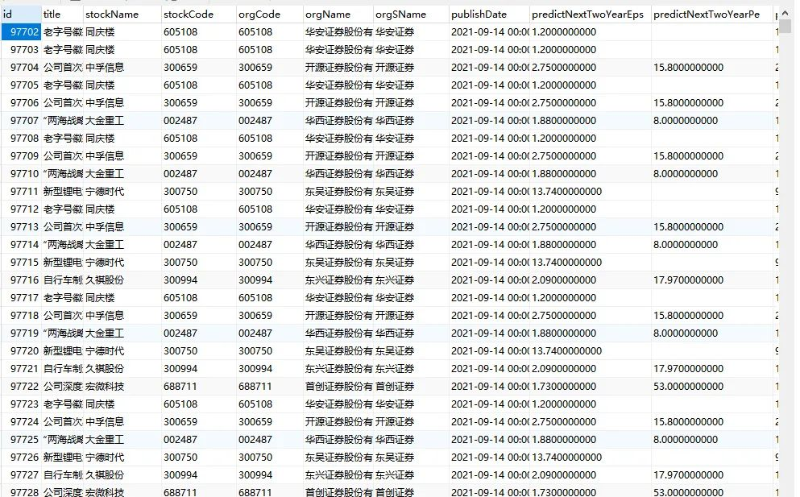

Python 爬虫 feapder<br />Python 最流行的爬虫框架是 Scrapy，它主要用于爬取网站结构性数据。<br />这里推荐一款更加简单、轻量级，且功能强大的爬虫框架：feapder<br />项目地址：[https://github.com/Boris-code/feapder](https://github.com/Boris-code/feapder)
<a name="jsFss"></a>
## 1、介绍及安装
和 Scrapy 类似，feapder 支持轻量级爬虫、分布式爬虫、批次爬虫、爬虫报警机制等功能<br />内置的 3 种爬虫如下：

- `AirSpider`轻量级爬虫，适合简单场景、数据量少的爬虫
- `Spider`分布式爬虫，基于 Redis，适用于海量数据，并且支持断点续爬、自动数据入库等功能
- `BatchSpider`分布式批次爬虫，主要用于需要周期性采集的爬虫

在虚拟环境下安装对应的依赖库
```bash
# 安装依赖库——通用版
pip3 install feapder
# 完整版
pip3 install feapder[all]
```
通用版与完整版区别在于完整版支持基于内存去重。
<a name="llDz0"></a>
## 2、AirSpider 使用
通过爬取东方财富网的股票研报数据（http://data.eastmoney.com/report/stock.jshtml）来讲解怎样使用 AirSpider 进行数据爬取。
<a name="wxRot"></a>
### 创建爬虫
创建爬虫的语句跟 Scrapy 类似：
```bash
feapder create -s report_spider
```
运行完成后，就会在当前目录下生成一个 report_spider.py 的文件，打开文件后，可以看到一个初始化的代码：
```python
import feapder


class ReportSpider(feapder.AirSpider):
    def start_requests(self):
        yield feapder.Request("https://www.baidu.com")

    def parse(self, request, response):
        print(response)


if __name__ == "__main__":
    ReportSpider().start()
```
这代码是可以直接运行的，运行之后，可以看到控制台信息：<br /><br />默认生成的代码继承了`feapder.AirSpider`，包含 start_requests 及 parser 两个函数，含义如下：

1. `feapder.AirSpider`：轻量爬虫基类。
2. `start_requests`：初始任务下发入口。
3. `feapder.Request`：基于requests库类似，表示一个请求，支持requests所有参数，同时也可携带些自定义的参数。
4. `parser`：数据解析函数。
5. `response`：请求响应的返回体，支持xpath、re、css等解析方式。
<a name="VZq4J"></a>
### 自定义解析函数
开发过程中解析函数往往不止有一个，除了系统默认的parser外，还支持自定义解析函数，比如要写一个自己的解析函数，写法如下：
```python
def start_requests(self):
    yield feapder.Request("http://reportapi.eastmoney.com/report/list?cb=datatable1351846&industryCode=*&pageSize=50&industry=*&rating=&ratingChange=&beginTime=2021-09-13&endTime=2021-09-14&pageNo=1&fields=&qType=0&orgCode=&code=*&rcode=&p=2&pageNum=2&_=1603724062679",
                          callback=self.parse_report_info)

def parse_report_info(self, request, response):
    html = response.content.decode("utf-8")
    if len(html):
        content = html.replace('datatable1351846(', '')[:-1]
        content_json = json.loads(content)
        print(content_json)
```
只需要在 Request 请求中加个 callback 参数，将自定义解析函数名放进去即可。
<a name="HBzB4"></a>
### 携带参数
如果需要将请求中的一些参数带到解析函数中，可以这样做：
```python
def start_requests(self):
    yield feapder.Request("http://reportapi.eastmoney.com/report/list?cb=datatable1351846&industryCode=*&pageSize=50&industry=*&rating=&ratingChange=&beginTime=2021-09-13&endTime=2021-09-14&pageNo=1&fields=&qType=0&orgCode=&code=*&rcode=&p=2&pageNum=2&_=1603724062679",
                          callback=self.parse_report_info, pageNo=1)

def parse_report_info(self, request, response):
    print(request.pageNo)
    html = response.content.decode("utf-8")
    if len(html):
        content = html.replace('datatable1351846(', '')[:-1]
        content_json = json.loads(content)
        print(content_json)
```
在 Request 里面添加需要携带的参数，在解析函数中通过 request.xxx 就可以获取到（本例中将请求的页码 pageNo 作为携带参数传递到解析函数中，运行程序就可以看到打印了1）。
<a name="rAI6f"></a>
### 下载中间件
下载中间件用于在请求之前，对请求做一些处理，如添加cookie、header等。写法如下：
```python
def download_midware(self, request):
    request.headers = {
        "Connection": "keep-alive",
        "Cookie": "qgqp_b_id=0f1ac887e1e3e484715bf0e3f148dbd8; intellpositionL=1182.07px; st_si=32385320684787; st_asi=delete; cowCookie=true; intellpositionT=741px; st_pvi=73966577539485; st_sp=2021-03-22%2009%3A25%3A40; st_inirUrl=https%3A%2F%2Fwww.baidu.com%2Flink; st_sn=4; st_psi=20210914160650551-113300303753-3491653988",
        "User-Agent": "Mozilla/5.0 (Macintosh; Intel Mac OS X 10_13_6) AppleWebKit/537.36 (KHTML, like Gecko) Chrome/78.0.3904.70 Safari/537.36",
        "Host": "reportapi.eastmoney.com"
    }
    return request
```
这里主要添加了一些请求头信息，模拟真实浏览器访问场景。
<a name="P3FZQ"></a>
### 校验
校验函数, 可用于校验 response 是否正确。若函数内抛出异常，则重试请求。若返回 True 或 None，则进入解析函数，若返回 False，则抛弃当前请求。可通过 `request.callback_name` 区分不同的回调函数，编写不同的校验逻辑。
```python
def validate(self, request, response):
    if response.status_code != 200:
        raise Exception("response code not 200") # 重试
```
<a name="SEX50"></a>
### 失败重试机制
框架支持重试机制，下载失败或解析函数抛出异常会自动重试请求。默认最大重试次数为100次，可以引入配置文件或自定义配置来修改重试次数。上面的校验中，抛出异常，就可以触发重试机制。
<a name="qFpOs"></a>
### 爬虫配置
爬虫配置支持自定义配置或引入配置文件 setting.py 的方式。只需要在当前目录下映入 setting.py 就可以了。可以在配置里面配置 数据库信息、Redis 信息、日志信息等等。<br />这里给出一份最全的配置：
```python
import os


# MYSQL
MYSQL_IP = ""
MYSQL_PORT = 3306
MYSQL_DB = ""
MYSQL_USER_NAME = ""
MYSQL_USER_PASS = ""

# REDIS
# IP:PORT
REDISDB_IP_PORTS = "xxx:6379"
REDISDB_USER_PASS = ""
# 默认 0 到 15 共16个数据库
REDISDB_DB = 0

# 数据入库的pipeline，可自定义，默认MysqlPipeline
ITEM_PIPELINES = ["feapder.pipelines.mysql_pipeline.MysqlPipeline"]

# 爬虫相关
# COLLECTOR
COLLECTOR_SLEEP_TIME = 1  # 从任务队列中获取任务到内存队列的间隔
COLLECTOR_TASK_COUNT = 100  # 每次获取任务数量

# SPIDER
SPIDER_THREAD_COUNT = 10  # 爬虫并发数
SPIDER_SLEEP_TIME = 0  # 下载时间间隔 单位秒。 支持随机 如 SPIDER_SLEEP_TIME = [2, 5] 则间隔为 2~5秒之间的随机数，包含2和5
SPIDER_MAX_RETRY_TIMES = 100  # 每个请求最大重试次数

# 浏览器渲染下载
WEBDRIVER = dict(
    pool_size=2,  # 浏览器的数量
    load_images=False,  # 是否加载图片
    user_agent=None,  # 字符串 或 无参函数，返回值为user_agent
    proxy=None,  # xxx.xxx.xxx.xxx:xxxx 或 无参函数，返回值为代理地址
    headless=False,  # 是否为无头浏览器
    driver_type="CHROME",  # CHROME 或 PHANTOMJS,
    timeout=30,  # 请求超时时间
    window_size=(1024, 800),  # 窗口大小
    executable_path=None,  # 浏览器路径，默认为默认路径
    render_time=0, # 渲染时长，即打开网页等待指定时间后再获取源码
)

# 重新尝试失败的requests 当requests重试次数超过允许的最大重试次数算失败
RETRY_FAILED_REQUESTS = False
# request 超时时间，超过这个时间重新做（不是网络请求的超时时间）单位秒
REQUEST_LOST_TIMEOUT = 600  # 10分钟
# 保存失败的request
SAVE_FAILED_REQUEST = True

# 下载缓存 利用redis缓存，由于内存小，所以仅供测试时使用
RESPONSE_CACHED_ENABLE = False  # 是否启用下载缓存 成本高的数据或容易变需求的数据，建议设置为True
RESPONSE_CACHED_EXPIRE_TIME = 3600  # 缓存时间 秒
RESPONSE_CACHED_USED = False  # 是否使用缓存 补采数据时可设置为True

WARNING_FAILED_COUNT = 1000  # 任务失败数 超过WARNING_FAILED_COUNT则报警

# 爬虫是否常驻
KEEP_ALIVE = False

# 设置代理
PROXY_EXTRACT_API = None  # 代理提取API ，返回的代理分割符为\r\n
PROXY_ENABLE = True

# 随机headers
RANDOM_HEADERS = True
# requests 使用session
USE_SESSION = False

# 去重
ITEM_FILTER_ENABLE = False  # item 去重
REQUEST_FILTER_ENABLE = False  # request 去重

# 报警 支持钉钉及邮件，二选一即可
# 钉钉报警
DINGDING_WARNING_URL = ""  # 钉钉机器人api
DINGDING_WARNING_PHONE = ""  # 报警人 支持列表，可指定多个
# 邮件报警
EMAIL_SENDER = ""  # 发件人
EMAIL_PASSWORD = ""  # 授权码
EMAIL_RECEIVER = ""  # 收件人 支持列表，可指定多个
# 时间间隔
WARNING_INTERVAL = 3600  # 相同报警的报警时间间隔，防止刷屏; 0表示不去重
WARNING_LEVEL = "DEBUG"  # 报警级别， DEBUG / ERROR

LOG_NAME = os.path.basename(os.getcwd())
LOG_PATH = "log/%s.log" % LOG_NAME  # log存储路径
LOG_LEVEL = "DEBUG"
LOG_COLOR = True  # 是否带有颜色
LOG_IS_WRITE_TO_CONSOLE = True # 是否打印到控制台
LOG_IS_WRITE_TO_FILE = False  # 是否写文件
LOG_MODE = "w"  # 写文件的模式
LOG_MAX_BYTES = 10 * 1024 * 1024  # 每个日志文件的最大字节数
LOG_BACKUP_COUNT = 20  # 日志文件保留数量
LOG_ENCODING = "utf8"  # 日志文件编码
OTHERS_LOG_LEVAL = "ERROR"  # 第三方库的log等级
```
可以从这些配置中选一些自己需要的进行配置。
<a name="riqlc"></a>
### 数据入库
框架内封装了MysqlDB、RedisDB，与pymysql不同的是，MysqlDB 使用了线程池，且对方法进行了封装，使用起来更方便。RedisDB 支持 哨兵模式、集群模式。<br />如果在 setting 文件中配置了数据库信息，就可以直接使用：
```python
def __init__(self, *args, **kwargs):
    super().__init__(*args, **kwargs)
    self.db = MysqlDB()
```
如果没有配置，也可以在代码里面进行配置：
```python
db = MysqlDB(
        ip="localhost",
        port=3306,
        user_name="feapder",
        user_pass="feapder123",
        db="feapder"
    )
```
建立数据库连接后，就可以使用这个框架内置的数据库增删改查函数进行数据库操作了。具体方法可以根据代码提示来查看：<br /><br />示例程序，运行之后，就可以在数据表中看到数据了：<br />
<a name="qu2tP"></a>
## 3、实战一下
以最简单的 AirSpider 来爬取一些简单的数据<br />详细实现步骤如下（ 5 步）
<a name="juE9Y"></a>
### 3-1  创建爬虫项目
首先，使用「 `feapder create -p` 」命令创建一个爬虫项目
```bash
# 创建一个爬虫项目
feapder create -p tophub_demo
```
<a name="nIrJU"></a>
### 3-2  创建爬虫 AirSpider
命令行进入到 spiders 文件夹目录下，使用「 `feapder create -s` 」命令创建一个爬虫
```bash
cd spiders

# 创建一个轻量级爬虫
feapder create -s tophub_spider 1
```
其中

- 1 为默认，表示创建一个轻量级爬虫 `AirSpider`
- 2 代表创建一个分布式爬虫 `Spider`
- 3 代表创建一个分布式批次爬虫 `BatchSpider`
<a name="QI2jt"></a>
### 3-3  配置数据库、创建数据表、创建映射 Item
以 MySQL 为例，首先在数据库中创建一张数据表
```sql
# 创建一张数据表
create table topic
(
    id         int auto_increment
        primary key,
    title      varchar(100)  null comment '文章标题',
    auth       varchar(20)   null comment '作者',
    like_count     int default 0 null comment '喜欢数',
    collection int default 0 null comment '收藏数',
    comment    int default 0 null comment '评论数'
);
```
然后，打开项目根目录下的 settings.py 文件，配置数据库连接信息
```python
MYSQL_IP = "localhost"
MYSQL_PORT = 3306
MYSQL_DB = "xag"
MYSQL_USER_NAME = "root"
MYSQL_USER_PASS = "root"
```
最后，创建映射 Item（ 可选 ）<br />进入到 items 文件夹，使用「 `feapder create -i` 」命令创建一个文件映射到数据库
:::warning
PS：由于 AirSpider 不支持数据自动入库，所以这步不是必须
:::
<a name="mLmwt"></a>
### 3-4  编写爬虫及数据解析
<a name="Z17Fn"></a>
#### 第一步，首先使「 MysqlDB 」初始化数据库
```python
from feapder.db.mysqldb import MysqlDB

class TophubSpider(feapder.AirSpider):

    def __init__(self, *args, **kwargs):
        super().__init__(*args, **kwargs)
        self.db = MysqlDB()
```
<a name="wEJOv"></a>
#### 第二步，在 `start_requests` 方法中，指定爬取主链接地址，使用关键字「`download_midware`」配置随机 UA
```python
import feapder
from fake_useragent import UserAgent

def start_requests(self):
    yield feapder.Request("https://tophub.today/", download_midware=self.download_midware)

def download_midware(self, request):
    # 随机UA
    # 依赖：pip3 install fake_useragent
    ua = UserAgent().random
    request.headers = {'User-Agent': ua}
    return request
```
<a name="Mo6Oj"></a>
#### 第三步，爬取首页标题、链接地址
使用 feapder 内置方法 `xpath` 去解析数据即可
```python
def parse(self, request, response):
    # print(response.text)
    card_elements = response.xpath('//div[@class="cc-cd"]')

    # 过滤出对应的卡片元素【什么值得买】
    buy_good_element = [card_element for card_element in card_elements if
                        card_element.xpath('.//div[@class="cc-cd-is"]//span/text()').extract_first() == '什么值得买'][0]

    # 获取内部文章标题及地址
    a_elements = buy_good_element.xpath('.//div[@class="cc-cd-cb nano"]//a')

    for a_element in a_elements:
        # 标题和链接
        title = a_element.xpath('.//span[@class="t"]/text()').extract_first()
        href = a_element.xpath('.//@href').extract_first()

        # 再次下发新任务，并带上文章标题
        yield feapder.Request(href, download_midware=self.download_midware, callback=self.parser_detail_page,
                              title=title)
```
<a name="lZ0gm"></a>
#### 第四步，爬取详情页面数据
上一步下发新的任务，通过关键字「 `callback`」指定回调函数，最后在 `parser_detail_page` 中对详情页面进行数据解析
```python
def parser_detail_page(self, request, response):
    """
    解析文章详情数据
    :param request:
    :param response:
    :return:
    """
    title = request.title

    url = request.url

    # 解析文章详情页面，获取点赞、收藏、评论数目及作者名称
    author = response.xpath('//a[@class="author-title"]/text()').extract_first().strip()

    print("作者：", author, '文章标题:', title, "地址：", url)

    desc_elements = response.xpath('//span[@class="xilie"]/span')

    print("desc数目:", len(desc_elements))

    # 点赞
    like_count = int(re.findall('\d+', desc_elements[1].xpath('./text()').extract_first())[0])
    # 收藏
    collection_count = int(re.findall('\d+', desc_elements[2].xpath('./text()').extract_first())[0])
    # 评论
    comment_count = int(re.findall('\d+', desc_elements[3].xpath('./text()').extract_first())[0])

    print("点赞：", like_count, "收藏:", collection_count, "评论:", comment_count)
```
<a name="IQRtb"></a>
### 3-5  数据入库
使用上面实例化的数据库对象执行 SQL，将数据插入到数据库中即可
```python
# 插入数据库
sql = "INSERT INTO topic(title,auth,like_count,collection,comment) values('%s','%s','%s','%d','%d')" % (
title, author, like_count, collection_count, comment_count)

# 执行
self.db.execute(sql)
```
<a name="a7Uhv"></a>
## 
