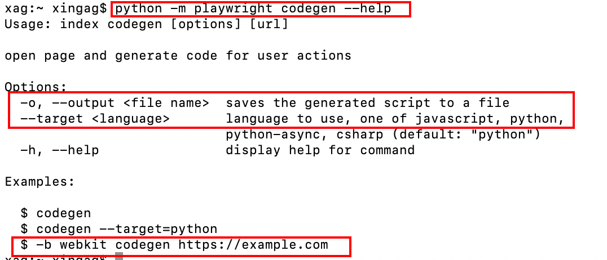

<a name="lgw7A"></a>
## 1、前言
最近，微软开源了一款非常强大的 Python 自动化依赖库：playwright-python<br />它支持主流的浏览器，包含：Chrome、Firefox、Safari、Microsoft Edge 等，同时支持以无头模式、有头模式运行<br />playwright-python 提供了同步、异步的 API，可以结合 Pytest 测试框架使用，并且支持浏览器端的自动化脚本录制<br />项目地址：[https://github.com/microsoft/playwright-python](https://github.com/microsoft/playwright-python)
<a name="E1KvG"></a>
## 2、准备
在实战之前，只需要 2 步<br />第 1 步，安装 playwright-python 依赖库 
```bash
# 安装依赖库
pip3 install playwright
```
第 2 步，安装主流的浏览器驱动<br />这样，会将 Chromeium、Firefox、Webkit 浏览器驱动下载到本地
```bash
# 安装浏览器驱动
python -m playwright install
```
<a name="FPyT4"></a>
## 3、实战一下
<a name="f12c7"></a>
### 3-1 录制脚本
先查看录制脚本的命令说明<br /><br />其中
```bash
python -m playwright codegen  录制脚本

--help  帮助文档

-o  生成自动化脚本的目录

--target 脚本语言，包含 JS 和 Python，分别对应值为：python 和 javascript

-b  指定浏览器驱动
```
比如
```bash
# 通过下面命令打开 Chrome 浏览器开始录制脚本
# 指定生成语言为:Python（默认Python，可选）
# 保存的文件名：1.py（可选）
# 浏览器驱动：webkit（默认webkit，可选）
# 最后跟着要打开的目标网站（默认仅仅是打开浏览器，可选）
python -m playwright codegen --target python -o '1.py' -b webkit https://www.baidu.com
```
接着，在浏览器模拟搜索一次的操作，然后关闭浏览器。<br />最后，自动化脚本会自动生成，保存到文件中
```python
from playwright import sync_playwright

def run(playwright):
    browser = playwright.webkit.launch(headless=False)
    context = browser.newContext()

    # Open new page
    page = context.newPage()

    # Go to https://www.baidu.com/
    page.goto("https://www.baidu.com/")

    # Fill input[name="wd"]
    page.fill("input[name=\"wd\"]", "AirPython")

    # Press Enter
    # with page.expect_navigation(url="https://www.baidu.com/s?ie=utf-8&f=8&rsv_bp=1&rsv_idx=1&tn=baidu&wd=AirPython&fenlei=256&rsv_pq=a1739d870005eec3&rsv_t=e640wwS33ra1Koivxvy1WyTxyknRwnllWiw4JBqIYd/KUN/WKpWLtL2b2+0&rqlang=cn&rsv_enter=1&rsv_dl=tb&rsv_sug3=21&rsv_sug1=18&rsv_sug7=100&rsv_sug2=0&rsv_btype=i&inputT=6199&rsv_sug4=6199"):
    with page.expect_navigation():
        page.press("input[name=\"wd\"]", "Enter")

    # Close page
    page.close()

    # ---------------------
    context.close()
    browser.close()

with sync_playwright() as playwright:
    run(playwright)
```
<a name="kKUQK"></a>
### 3-2 同步
同步的关键字为：sync_playwright<br />比如，依次使用三个浏览器内核打开浏览器，然后百度一下，接着对在搜索界面截图，最后关闭浏览器
```python
from time import sleep

from playwright import sync_playwright

# 注意：默认是无头模式

with sync_playwright() as p:
    # 分别对应三个浏览器驱动
    for browser_type in [p.chromium, p.firefox, p.webkit]:

        # 指定为有头模式，方便查看
        browser = browser_type.launch(headless=False)
        page = browser.newPage()
        page.goto('http://baidu.com')

        # 执行一次搜索操作
        page.fill("input[name=\"wd\"]", "AirPython")
        with page.expect_navigation():
            page.press("input[name=\"wd\"]", "Enter")

        # 等待页面加载完全
        page.waitForSelector("text=百度热榜")

        # 截图
        page.screenshot(path=f'example-{browser_type.name}.png')

        # 休眠5s
        sleep(5)

        # 关闭浏览器
        browser.close()
```
需要指出的是，playwright-python 内置的 API 基本上囊括常见的自动化操作
<a name="Zas9Y"></a>
### 3-3 异步
异步的关键字为：async_playwright<br />结合 asyncio，同时执行上面的操作
```python
import asyncio

from playwright import async_playwright

# 异步执行
async def main():
    async with async_playwright() as p:
        for browser_type in [p.chromium, p.firefox, p.webkit]:
            # 指定为有头模式，方便查看
            browser = await browser_type.launch(headless=False)
            page = await browser.newPage()

            await page.goto('http://baidu.com')

            # 执行一次搜索操作
            await page.fill("input[name=\"wd\"]", "AirPython")
            await page.press("input[name=\"wd\"]", "Enter")

            # 等待页面加载完全
            await page.waitForSelector("text=百度热榜")

            # 截图
            await page.screenshot(path=f'example-{browser_type.name}.png')

            await browser.close()


asyncio.get_event_loop().run_until_complete(main())
```
<a name="yKCby"></a>
## 4、最后
事实上，Playwright 是一个跨语言的自动化框架，支持 Python、Java、JS 等<br />Playwright 相比传统的自动化框架 Selenium 来说，在 Context 上下文及 API 使用上，显得更简洁且强大。
