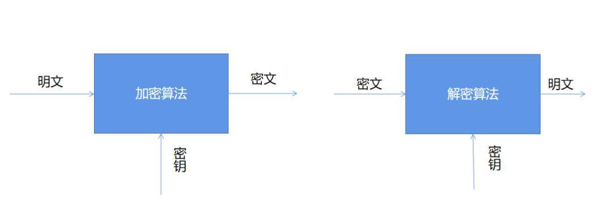
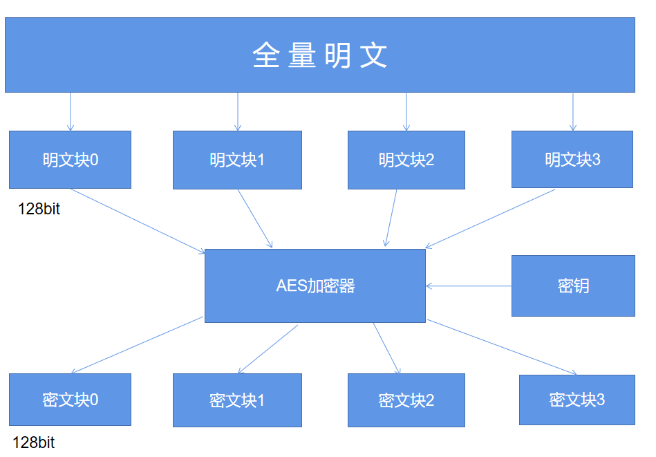

Python
<a name="xyG7A"></a>
## 基础常识
首先需要明白的是，什么是**加密和解密**？顾名思义

- 加密(Encryption): 将明文数据变换为密文的过程
- 解密(Decryption): 加密的逆过程，即由密文恢复出原明文的过程。

加密和解密算法的操作通常都是在一组密钥的控制下进行的，分别成为是加密密钥(Encryption Key)和解密密钥(Decryption Key)，如下图所示<br /><br />而加密算法当中又分为是对称加密和非对称加密以及散列算法，其中

- 对称加密：即加密与解密时使用的是相同的密钥，例如RC4、AES、DES等加密算法
- 非对称加密：即加密与解密时使用不相同的密钥，例如RSA加密算法等
- 散列算法：又称为是哈希函数。对不同长度的输入消息产生固定的输出，该输出值就是散列值
<a name="XDBGC"></a>
## Base64伪加密
Base64严格意义上来说不算做事加密的算法，只是一种编码的方式，它是一种用64个字符，分别是A-Z、a-z、0-9、+、/这64个字符，实现对数据的编码，可用于在HTTP环境下传递较长的标识信息。采用Base64编码具有不可读性，需要解码后才能阅读。使用Python来对任意网址进行Base64的编码操作，代码如下
```python
import base64

# 想将字符串转编码成base64,要先将字符串转换成二进制数据
url = "www.baidu.com"
bytes_url = url.encode("utf-8")
str_url = base64.b64encode(bytes_url)  # 被编码的参数必须是二进制数据
print(str_url)
```
output
```python
b'd3d3LmJhaWR1LmNvbQ=='
```
那么同样地，也可以对其进行解码的操作，代码如下
```python
url = "d3d3LmJhaWR1LmNvbQ=="
str_url = base64.b64decode(url).decode("utf-8")
print(str_url)
```
output
```python
www.baidu.com
```
<a name="AaAiM"></a>
## MD5加密
MD5是一种被广泛使用的线性散列算法，且加密之后产生的是一个固定长度(32位或者是16位)的数据，由字母和数字组成，大小写统一。其最后加密生成的数据**是不可逆的**，也就是说不能够轻易地通过加密后的数据还原到原始的字符串，除非是通过暴力破解的方式。<br />在Python当中来实现一下MD5加密
```python
import hashlib

str = 'this is a md5 demo.'
hl = hashlib.md5()
hl.update(str.encode(encoding='utf-8'))
print('MD5加密前为 ：' + str)
print('MD5加密后为 ：' + hl.hexdigest())
```
output
```python
MD5加密前为 ：this is a md5 demo.
MD5加密后为 ：b2caf2a298a9254b38a2e33b75cfbe75
```
就像上文提到的，针对MD5加密可以通过暴力破解的方式来降低其安全性，因此在实操过程当中，会添加盐值(Salt)或者是双重MD5加密等方式来增加其可靠性，代码如下
```python
# post传入的参数
params = "123456"  
# 加密后需拼接的盐值(Salt) 
salt = "asdfkjalksdncxvm"

def md5_encrypt():
    m = md5()
    m.update(params.encode('utf8'))
    sign1 = m.hexdigest()
    return sign1

def md5_encrypt_with_salt():
    m = md5()
    m.update((md5_encrypt() + salt).encode('utf8'))
    sign2 = m.hexdigest()
    return sign2
```
<a name="lQmXk"></a>
## AES/DES对称加密
首先来讲DES加密，全称是Data Encryption Standard，即数据加密标准，在对称性加密当中比较常见的一种，也就是加密和解密过程当中使用的密钥是相同的，因此想要破解的话，通过暴力枚举的方式，只要计算的能力足够强还是可以被破解的。<br />AES的全称是Advanced Encryption Standard，是DES算法的替代者，也是当今最流行的对称加密算法之一。想要弄清楚AES算法，首先就得弄明白三个基本的概念：**密钥、填充和模式**。
<a name="JPIZs"></a>
### 密钥
密钥之前已经说了很多了，大家可以将其想象成是一把钥匙，既可以用其来进行上锁，可以用其来进行解锁。AES支持三种长度的密钥：128位、192位以及256位。
<a name="aT8N3"></a>
### 填充
而至于填充这一概念，AES的分组加密的特性需要了解，具体如下图所示<br /><br />简单来说，AES算法在对明文加密的时候，并不是把整个明文一股脑儿地加密成一整段密文，而是把明文拆分成一个个独立的明文块，每一个明文块的长度为128比特。<br />这些明文块经过AES加密器的复杂处理之后，生成一个个独立的密文块，将这些密文块拼接到一起就是最终的AES加密的结果了。<br />那么这里就有一个问题了，要是有一段明文的长度是196比特，如果按照每128比特一个明文块来拆分的话，第二个明文块只有64比特了，不足128比特该怎么办呢？这个时候就轮到填充来发挥作用了，默认的填充方式是PKCS5Padding以及ISO10126Padding。<br />不过在AES加密的时候使用了某一种填充方式，解密的时候也必须采用同样的填充方式。
<a name="oqFzY"></a>
### 模式
AES的工作模式，体现在了把明文块加密成密文块的处理过程中，主要有五种不同的工作模式，分别是CBC、ECB、CTR、CFB以及OFB模式，同样地，如果在AES加密过程当中使用了某一种工作模式，解密的时候也必须采用同样地工作模式。最后用Python来实现一下AES加密
```python
import base64
from Crypto.Cipher import AES

def AES_encrypt(text, key):
    pad = 16 - len(text) % 16
    text = text + pad * chr(pad)
    text = text.encode("utf-8")
    encryptor = AES.new(key.encode('utf-8'), AES.MODE_ECB)
    encrypt_text = encryptor.encrypt(text)
    encrypt_text = base64.b64encode(encrypt_text)
    return encrypt_text.decode('utf-8')
```
或者大家也可以看一下网上其他的AES加密算法的实现过程，基本上也都是大同小异的。
