Python 爬虫<br />爬取某某点评店铺信息时，遇到了『字体』反爬。比如这样的：<br />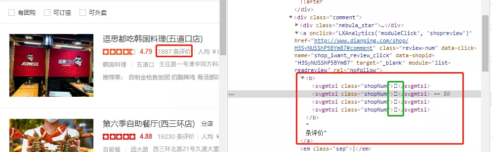<br />还有这样的：<br />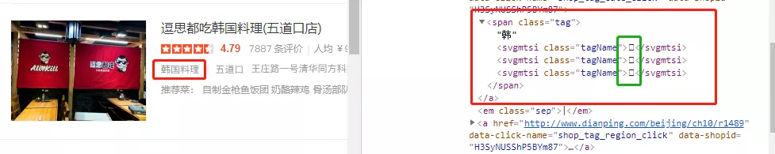<br />可以看到这些字体已经被加密（反爬）<br />如何去解决这类反爬（字体反爬类）

<a name="AR6BQ"></a>
## 网页分析
在开始分析反爬之前，先简单的介绍一下背景（爬取的网页）<br />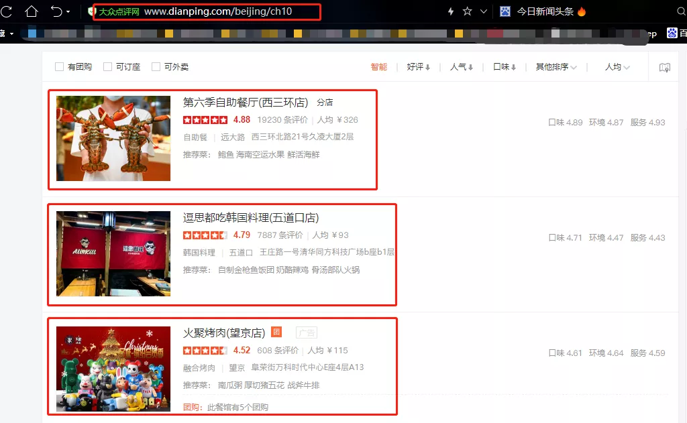<br />爬取的某某点评的店铺信息。一开始查看网页源码是这样的<br /><br />这种什么也看不到，换另一种方式：通过程序直接把整个网页源代码保存下来<br />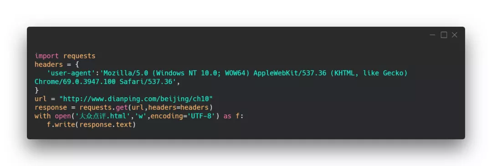<br />获取到的网页源码如下：<br />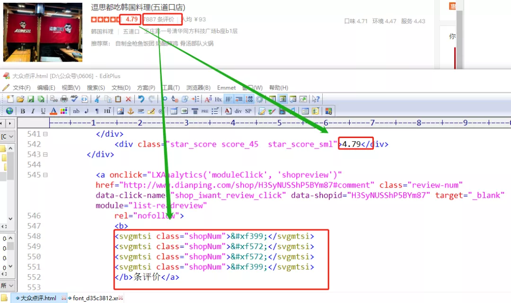<br />比如这里看到评论数（4位数）都有对应着一个编号（相同的数字编号相同），应该是对应着网站的字体库。<br />下一步，需要找到这个网站的字体库。
<a name="Bd0j6"></a>
## 获取字体库
这里的字体库建议在目标网站里面去获取，因为不同的网站的字体库是不一样，导致解码还原的字体也会不一样。
<a name="x1F3V"></a>
### 1、抓包获取字体库
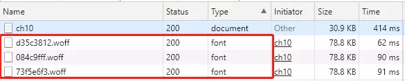<br />在浏览器network里面可以看到一共有三种字体库。（三种字体库各有不同的妙用，后面会有解释）<br />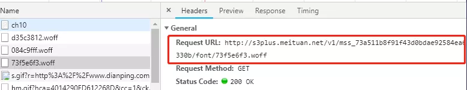<br />把字体库链接复制在浏览器里面打开，就可以把字体库下载到本地。
<a name="UUZHa"></a>
### 2、查看字体库
这里使用FontCreator的工具查看字体库。<br />下载地址：[https://www.high-logic.com/font-editor/fontcreator/download](https://www.high-logic.com/font-editor/fontcreator/download)<br />[FontCreatorSetup-x64.zip](https://www.yuque.com/attachments/yuque/0/2021/zip/396745/1624169279345-40e83c3d-1ed8-49dc-b8b6-ce581e31cc27.zip?_lake_card=%7B%22src%22%3A%22https%3A%2F%2Fwww.yuque.com%2Fattachments%2Fyuque%2F0%2F2021%2Fzip%2F396745%2F1624169279345-40e83c3d-1ed8-49dc-b8b6-ce581e31cc27.zip%22%2C%22name%22%3A%22FontCreatorSetup-x64.zip%22%2C%22size%22%3A21041359%2C%22type%22%3A%22application%2Fx-zip-compressed%22%2C%22ext%22%3A%22zip%22%2C%22status%22%3A%22done%22%2C%22taskId%22%3A%22u492081b6-a8e0-424f-b1a7-5905bfe3617%22%2C%22taskType%22%3A%22upload%22%2C%22id%22%3A%22u73a3c5fd%22%2C%22card%22%3A%22file%22%7D)<br />安装之后，把刚刚下载的字体库在FontCreator中打开<br />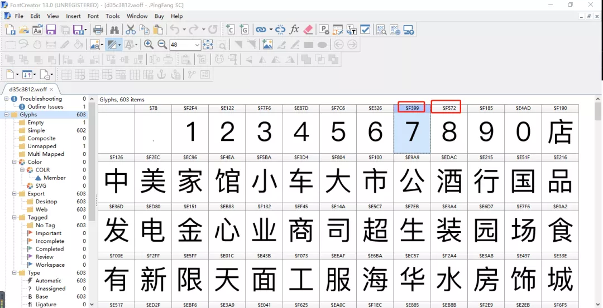<br />可以看到字体的内容以及对应的编号。<br />比如数字7对应F399、数字8对应F572 ，在原网页和源码对比，是否如此？？？<br /><br />可以看到，真是一模一样对应着解码就可以还原字体。
<a name="QfA3R"></a>
### 3、为什么会有三个字体库
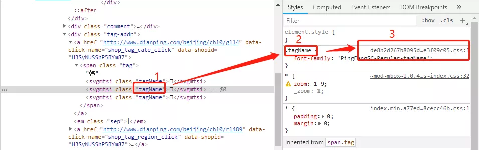<br />在查看加密字体的CSS样式时，方式有css内容是这样的<br />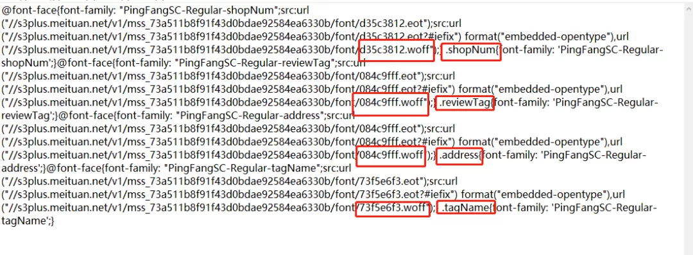<br />字体库1：d35c3812.woff 对应解码class为 shopNum<br />字体库2：084c9fff.woff 对应解码class为 reviewTag和address<br />字体库3：73f5e6f3.woff  对应解码class为 tagName<br />也就是说，字体所属的不同class标签，对应的解密字体库是不一样的。<br /><br />这里获取的评论数，clas为shopNum，需要用到字体库d35c3812.woff
<a name="ubctR"></a>
## 代码实现解密
<a name="Tx53i"></a>
### 1、加载字体库
既然已经知道了字体反爬的原理，那么就可以开始编程实现解密还原。<br />加载字体库的Python库包是：fontTools ，安装命令如下：
```bash
pip install fontTools
```
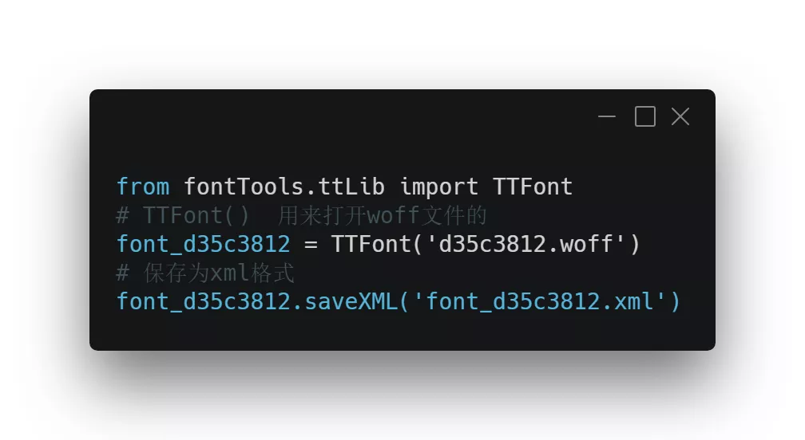<br />将字体库的内容对应关系保存为xml格式<br />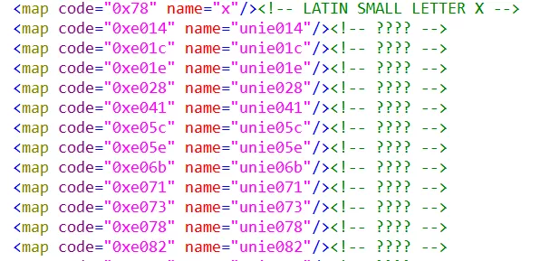<br />code和name是一一对应关系<br />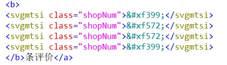<br />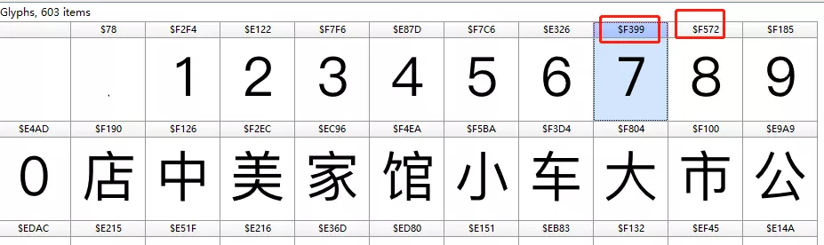<br />可以看到网页源码中的编号后四位对应着字体库的编号。<br />因此可以建立应该字体对应集合<br />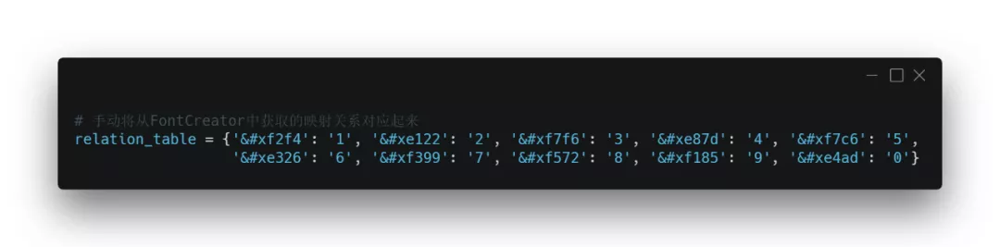<br />建立好映射关系好，到网页源码中去进行替换<br />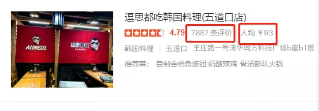<br />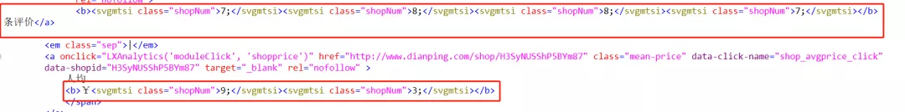<br />这样就成功的将字体反爬处理完毕。后面提取内容基本都没问题。
<a name="cMdNb"></a>
### 2、完整代码
```python
import requests
from lxml import etree
from fontTools.ttLib import TTFont

headers = {
   'user-agent' :'Mozilla/5.0 (Windows NT 10.0; WOW64) AppleWebKit/537.36 (KHTML, like Gecko) Chrome/69.0.3947.100 Safari/537.36',
}
# from fontTools.ttLib import TTFont
# TTFont()  用来打开woff文件的
# font_d35c3812 = TTFont('d35c3812.woff')
# 保存为xml格式
# font_d35c3812.saveXML('font_d35c3812.xml')


# 手动将从FontCreator中获取的映射关系对应起来
relation_table = {'&#xf2f4': '1', '&#xe122': '2', '&#xf7f6': '3', '&#xe87d': '4', '&#xf7c6': '5',
                  '&#xe326': '6', '&#xf399': '7', '&#xf572': '8', '&#xf185': '9', '&#xe4ad': '0'}

url = "http://www.dianping.com/beijing/ch10"
response = requests.get(url ,headers=headers)
text = response.text
for i in relation_table:
   if str(i) in text:
       text = text.replace(str(i) ,relation_table[i].replace(";" ,""))

selector = etree.HTML(text)
lists = selector.xpath('//*[@id="shop-all-list"]/ul/li')
for i in lists:
    st = i.xpath('.//svgmtsi[@class="shopNum"]/text()')
    print(st)
    print("-----------")

print(len(lists))
```
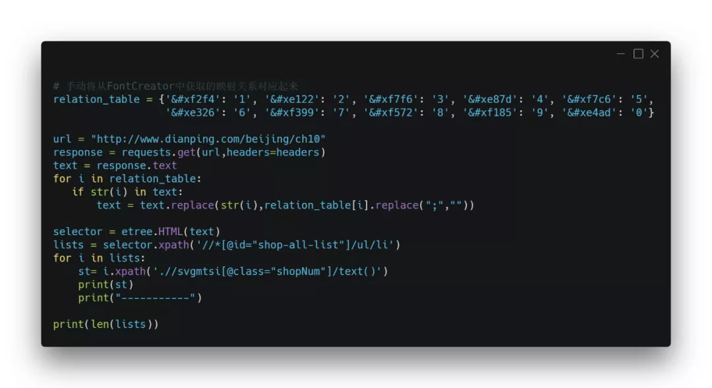<br />输出结果：<br />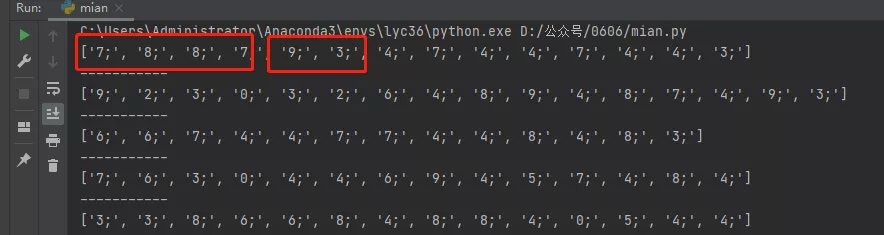<br />可以看到加密的数字全部都还原了。
