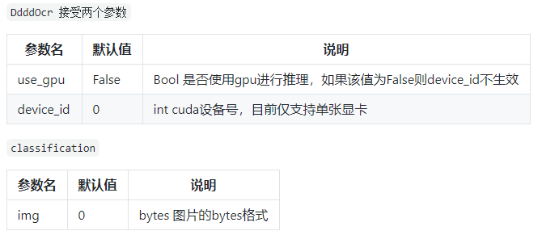
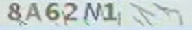
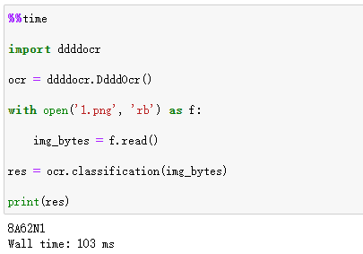
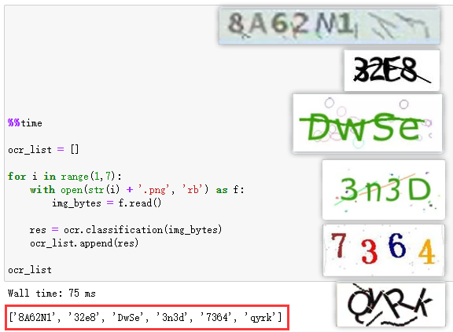

Python<br />采用pillow+pytesseract进行验证码识别，优点是免费，较为易用。但其识别精度一般，若想要更高要求的验证码识别，初学者就只能去选择使用百度API接口了。<br />但其实百度API接口和pytesseract其实都需要进行前期配置，对于初学者来说就不太友好了。<br />而且百度API必须要联网，对于某些机器不能联网的朋友而言，就得pass了<br />Github地址：[https://github.com/sml2h3/ddddocr](https://github.com/sml2h3/ddddocr)<br />该库名也是非常有趣 —— ddddocr（谐音带带弟弟OCR）
<a name="J5twL"></a>
## 环境要求：
python >= 3.8<br />Windows/Linux/Macox..<br />可以通过以下命令安装
```bash
pip install ddddocr
```
<a name="TYQkc"></a>
## 参数说明：
<br />在网上随机寻找了一个验证码图片，使用这个库来实战一下。<br />
```python
import ddddocr

ocr = ddddocr.DdddOcr()
with open('1.png', 'rb') as f:
    img_bytes = f.read()
res = ocr.classification(img_bytes)

print(res)
```
<br />成功识别出来了验证码文字！<br />而且优点也非常明显：首先代码非常精简，对比前文提到的两种方法，不需要额外设置环境变量等等，5行代码即可轻松识别验证码图片。另一方面，使用魔法命令`%%time`也可以测试出来，这段代码识别速度非常快。<br />下面用更多的验证码图片继续测试：<br /><br />又找了6个验证码图片来测试，观察结果，发现这类简单的验证码基本可以进行快速识别。但也有部分结果有问题——字母大小写没有进行区分（比如第6张图片）。<br />总而言之，如果需要进行验证码识别，且对精度要求不是过高。那么，带带弟弟OCR（ddddocr）这个库是一个不错的选择~
