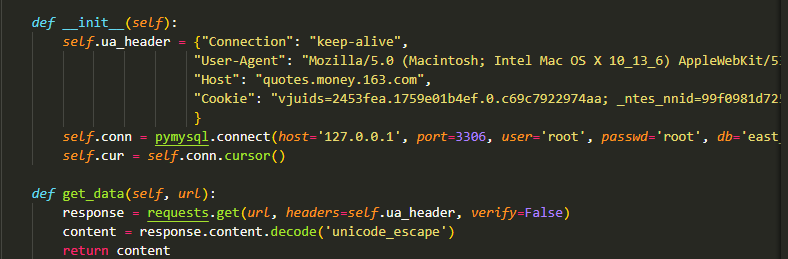
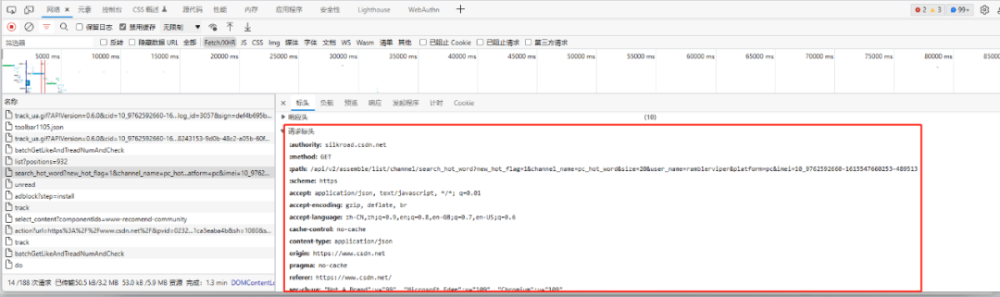
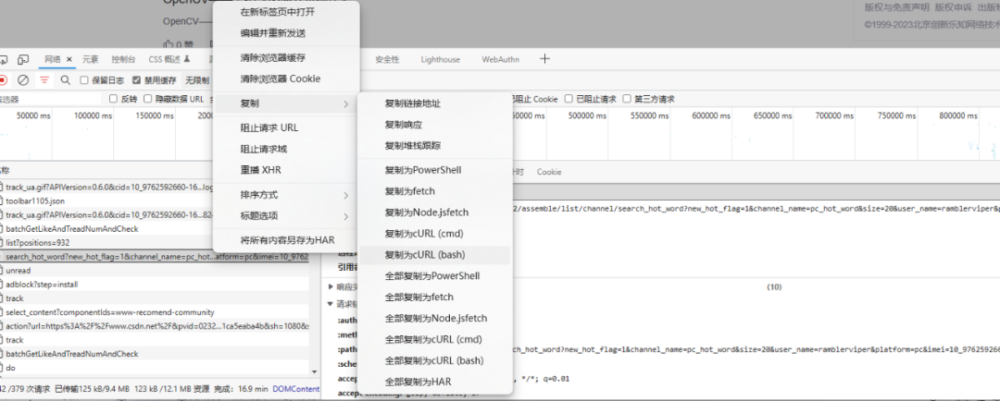

Python<br />简单的爬虫只需要使用 requests 即可。遇到复杂的爬虫，就需要在程序里面加上请求头和参数信息。类似这种：<br /><br />一般的步骤是，先到浏览器的网络请求中找到需要的请求，然后将请求头和参数信息一项项复制到程序中：<br /><br />每次都需要这样操作，比较麻烦，而且有时候还容易搞错。<br />介绍一个神器，可以自动地将浏览器的请求头信息解析为爬虫需要的代码。
<a name="SUgnX"></a>
### 安装
首先，需要安装这个神器：
```bash
pip install filestools -U
```
也可以使用阿里云加速:
```bash
pip install filestools --index-url=http://mirrors.aliyun.com/pypi/simple -U
```
当然，如果想下载最新版本，可以用下面命令：
```bash
pip install filestools --index-url https://pypi.org/simple/ -U
```
<a name="cmpo4"></a>
### 使用
这款神器的使用也很简单。<br />第一步是利用浏览器的功能从网络里面复制需要的请求头信息：<br /><br />接着将复制的内容粘贴到转换程序里面：
```python
from curl2py.curlParseTool import curlCmdGenPyScript

curl_cmd = """curl 'http://www.shixi.com/search/index?key=python'
-H 'Connection: keep-alive'
-H 'Cache-Control: max-age=0'
-H 'Upgrade-Insecure-Requests: 1'
-H 'User-Agent: Mozilla/5.0 (Windows NT 10.0; Win64; x64) AppleWebKit/537.36 (KHTML, like Gecko) Chrome/91.0.4472.124 Safari/537.36'
-H 'Accept: text/html,application/xhtml+xml,application/xml;q=0.9,image/avif,image/webp,image/apng,*/*;q=0.8,application/signed-exchange;v=b3;q=0.9'
-H 'Referer: http://www.shixi.com/'
-H 'Accept-Language: zh-CN,zh;q=0.9'
-H 'Cookie: UM_distinctid=17a50a2c8ea537-046c01e944e72f-6373267-100200-17a50a2c8eb4ff; PHPSESSID=rpprvtdrcrvt54fkr7msgcde17; CNZZDATA1261027457=1711789791-1624850487-https%253A%252F%252Fwww.baidu.com%252F%7C1627741311; Hm_lvt_536f42de0bcce9241264ac5d50172db7=1627741268; Hm_lpvt_536f42de0bcce9241264ac5d50172db7=1627741334'
--compressed
--insecure"""

output = curlCmdGenPyScript(curl_cmd)
print(output)
```
就是放到 curl_cmd 这里。<br />最后运行程序，就可以在输出窗口获得代码如下：
```python
#######################################
#      The generated by curl2py.      
#######################################

import requests
import json

headers = {
    "Connection": "keep-alive",
    "Cache-Control": "max-age=0",
    "Upgrade-Insecure-Requests": "1",
    "User-Agent": "Mozilla/5.0 (Windows NT 10.0; Win64; x64) AppleWebKit/537.36 (KHTML, like Gecko) Chrome/91.0.4472.124 Safari/537.36",
    "Accept": "text/html,application/xhtml+xml,application/xml;q=0.9,image/avif,image/webp,image/apng,*/*;q=0.8,application/signed-exchange;v=b3;q=0.9",
    "Referer": "http://www.shixi.com/",
    "Accept-Language": "zh-CN,zh;q=0.9"
}
cookies = {
    "UM_distinctid": "17a50a2c8ea537-046c01e944e72f-6373267-100200-17a50a2c8eb4ff",
    "PHPSESSID": "rpprvtdrcrvt54fkr7msgcde17",
    "CNZZDATA1261027457": "1711789791-1624850487-https%253A%252F%252Fwww.baidu.com%252F%7C1627741311",
    "Hm_lvt_536f42de0bcce9241264ac5d50172db7": "1627741268",
    "Hm_lpvt_536f42de0bcce9241264ac5d50172db7": "1627741334"
}
params = {
    "key": "python"
}

res = requests.get(
    "http://www.shixi.com/search/index",
    params=params,
    headers=headers,
    cookies=cookies
)
print(res.text)
```
将这些代码根据需要复制到爬虫程序即可。
