Python爬虫
<a name="kvXEh"></a>
## HCaptcha介绍
HCaptcha是国外知名的验证码服务商，其主要功能就是为网站提供验证码服务，避免网站被恶意爬虫肆意爬取信息。相比于HCaptcha，大家可能更加熟悉Google reCaptcha（Google提供的验证码服务），但因为某些原因，国内是无法使用Google reCaptcha的，所以HCaptcha便成为多数国际型网站更优的一个选择。<br />本文会介绍一种优雅的方式来突破HCaptcha验证码，在介绍突破方式前，先简单介绍与体验一下HCaptch。<br />HCaptcha的交互形式如下，首先需要点击复选框，如下图：<br />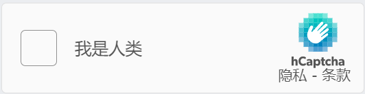<br />点点击复选框时，验证码会先通过其风险分析引擎判断当前用户的风险，如果是低风险用户，便可以直接通过，反之，验证码会弹出对话框，回答对话框中的问题，如下图：<br />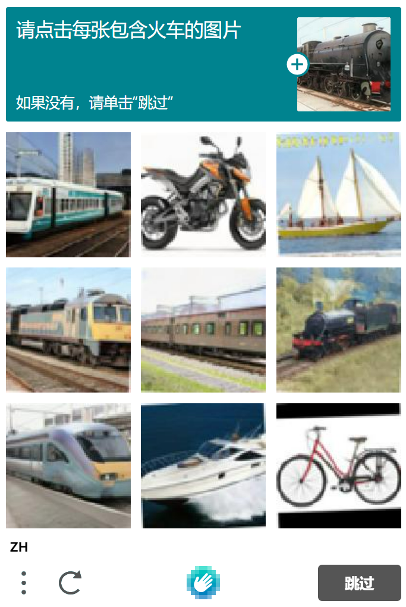<br />HCaptcha验证码会给一个问题，比如上图的问题是【请点击每张包含火车的图片】，需要从下面的九张图中选择出含有火车的图片，如果九张图片中，没有火车，则点击【跳过】按钮，如果有，则将所有带有火车的图片都选择上，跳过按钮会变成【检查】按钮，如下图：<br />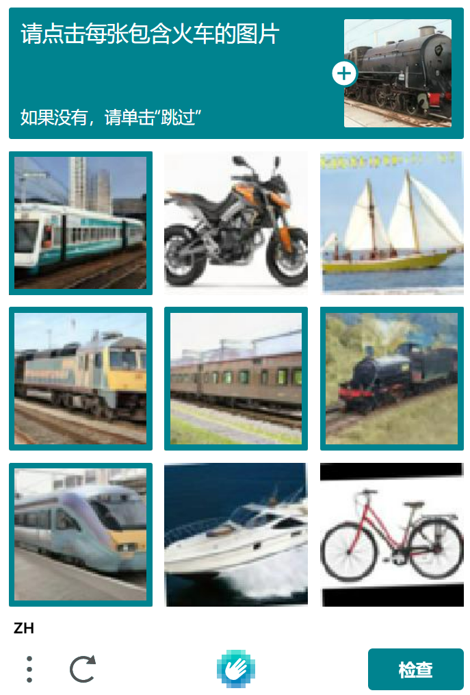通过验证后，便会出现如下结果：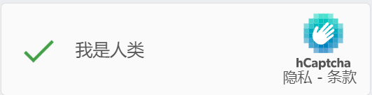
<a name="P6KI5"></a>
## 体验HCaptcha
可以通过[https://democaptcha.com/demo-form-eng/hcaptcha.html](https://democaptcha.com/demo-form-eng/hcaptcha.html)网站来体验HCaptcha，为了避免历史数据的影响，建议使用Chrome的无痕模式来访问该网站，如下图所示：<br />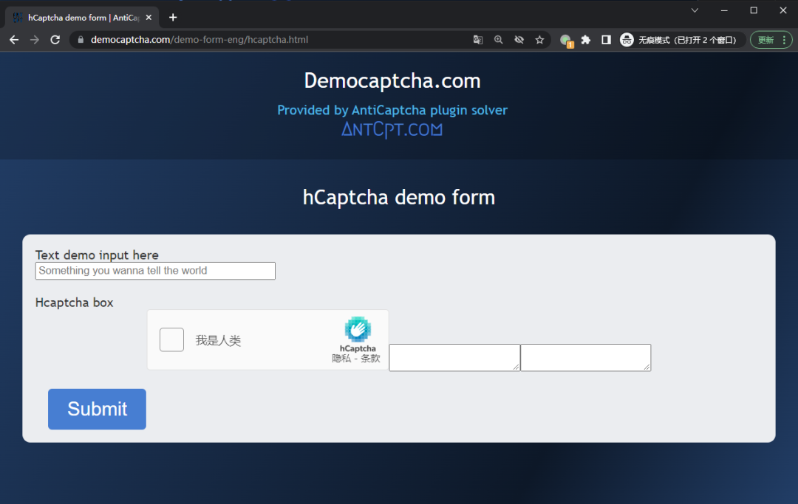<br />点击图中的HCaptcha，便可以体验HCaptcha验证码的完整流程了。<br />至此，HCaptcha的大体情况已经熟悉了，那么要怎么突破该验证码呢？当然是使用机器学习相关的技术啦，下面介绍一款简单好用的平台。
<a name="YOrVU"></a>
## 解决方案
对于HCaptcha验证码，可以使用YesCaptcha服务来破解，该服务使用起来非常简单，访问其主页：[http://www.yescaptcha.com/](http://www.yescaptcha.com/)，通过邮箱注册一个账户。<br />YesCaptcha不止支持HCaptcha，还支持Google reCaptcha V2/V3版本的破解，这里先关注其对HCaptch的破解。<br />注册完YesCaptcha后，会获得一个clientKey，基于该clientKey便可以使用YesCaptcha提供的破解服务了。<br />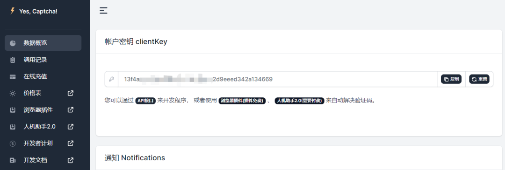<br />对于HCaptcha相关破解，需要在YesCaptcha中创建破解验证码服务的API，相关文档为：[https://yescaptcha.atlassian.net/wiki/spaces/YESCAPTCHA/pages/24543233/HCaptchaClassification+Hcaptcha](https://yescaptcha.atlassian.net/wiki/spaces/YESCAPTCHA/pages/24543233/HCaptchaClassification+Hcaptcha)<br />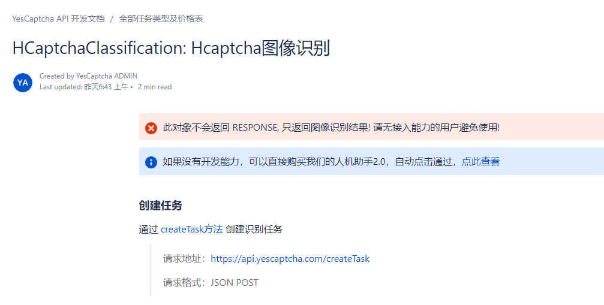<br />阅读文档后，发现只需要构建出下面表格中的参数并请求创建任务的API，便可以实现验证码的破解了。

| **属性** | **类型** | **必须** | **说明** |
| --- | --- | --- | --- |
| type | string | 是 | **HCaptchaClassification 10 点数** |
| queries | list[string] | 是 | Base64 编码的图片，不要包含 "data:image/***;base64," |
| 以列表形式拼合1到9张图片：[base64, base64,base64,……] | 

 | 

 | 

 |
| question | String | 是 | 问题 ID, 请查表，支持中英文，其他语言请自行转换 |

<a name="hUopD"></a>
## 代码实现
通过文档可知，需要HCaptcha验证码九宫格中图片对应的Base64以及验证码中的问题，通过Chrome的Network可知，HCaptcha会通过[https://hcaptcha.com/getcaptcha](https://hcaptcha.com/getcaptcha)获得验证码图片，该接口会返回JSON格式的数据，其中就包含了验证码的问题以及九宫格中的图片，如下图所示：<br />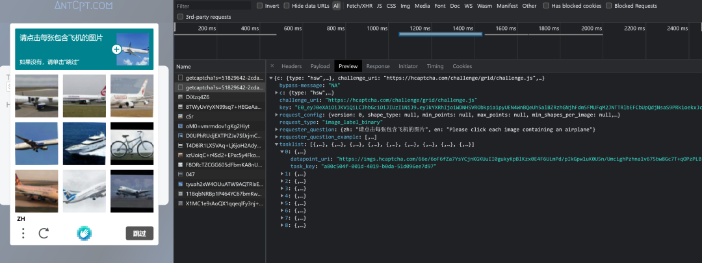<br />通过Selenium自动化浏览器，获得上图所示的数据，随后配合requests库和base64库，将图片转为相应的base64编码，具体代码如下：
```python
headers = {
	'user-agent': 'Mozilla/5.0 (Windows NT 10.0; Win64; x64) AppleWebKit/537.36 (KHTML, like Gecko) Chrome/100.0.4896.127 Safari/537.36'
}

def get_as_base64(url):
	return base64.b64encode(requests.get(url).content)

def get_captcha_image_base64(data):
	image_result = []
	for d in data:
		img_base64 = get_as_base64(d['datapoint_uri'])
		img_base64 = img_base64.decode('utf-8')
		image_result.append({
			'url': d['datapoint_uri'],
			'task_key': d['task_key'],
			'base64': img_base64
		})
    return image_result
```
有了验证码九宫格图片对于的base64后，结合获得的问题，便可以请求YesCaptcha创建破解任务的服务了，代码如下：
```python
def create_task(question, queries):
    url = 'https://api.yescaptcha.com/createTask'

    data = {
        "clientKey": clientKey,
        "task": {
            "type": "HCaptchaClassification",
            "question": question,
            "queries": queries,
        }
    }

    r = requests.post(url, json=data, timeout=60)

    return r.json()
```
将上述代码整合起来，便可得到一个完整的流程：
```python
if __name__ == '__main__':
    with open('data.json', encoding='utf8') as f:
        data = f.read()
    data = json.loads(data)
    question = data.get('requester_question', {}).get('zh')
    tasklist = data.get('tasklist')
    images = get_captcha_image_base64(tasklist)
    queries = [d['base64'] for d in images]
    result = create_task(question=question, queries=queries)
    pprint.pprint(result)
```
以下图为例，通过上述代码进行破解。<br />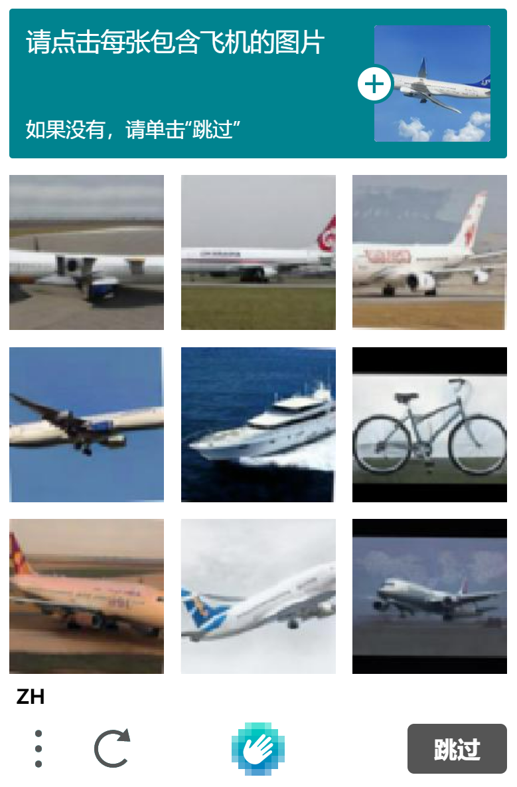<br />运行上述代码后，获得结果如下：
```python
{'errorCode': '',
 'errorId': 0,
 'solution': {'objects': [True,
                          True,
                          True,
                          True,
                          False,
                          False,
                          True,
                          True,
                          True]},
 'status': 'ready',
 'taskId': '13463c20-d031-11ec-b16d-c664134fc872'}
```
其中solution便是此次破解任务的结果，它的顺序与请求时queries参数的顺序一致，基于solution的结果，利用Selenium便可完成相应的点击操作，如下图所示<br />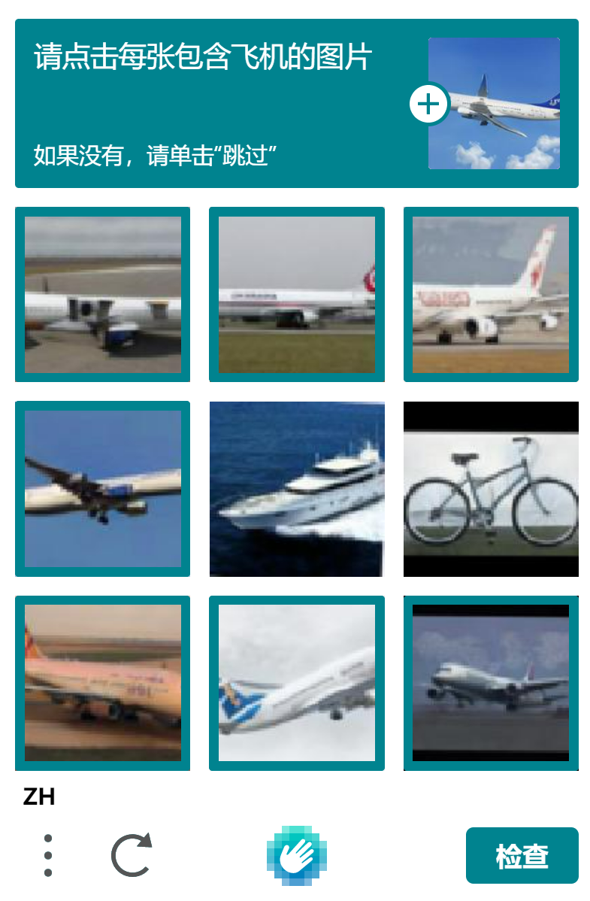<br />点击【检查】按钮，完成HCaptcha验证码的破解<br />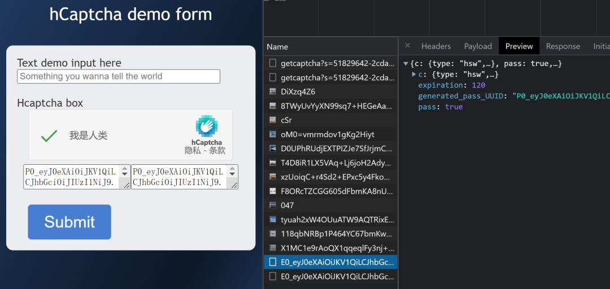<br />这里侧重于如何破解HCaptcha，所以没讨论如何使用Selenium去自动化浏览器获得数据，但这个内容非常简单，网上相关内容也比较多。
