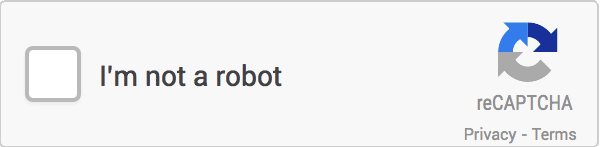
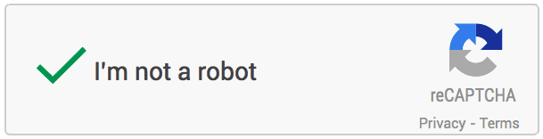
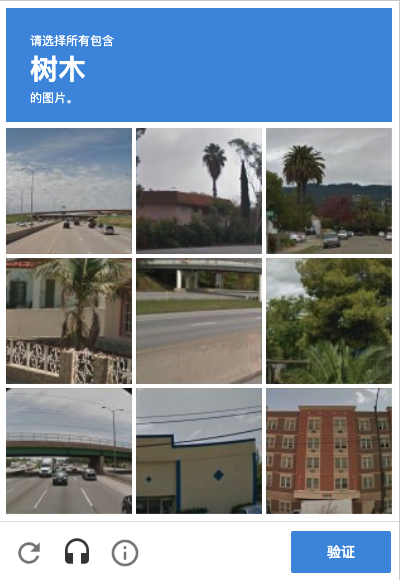
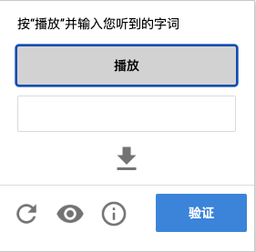
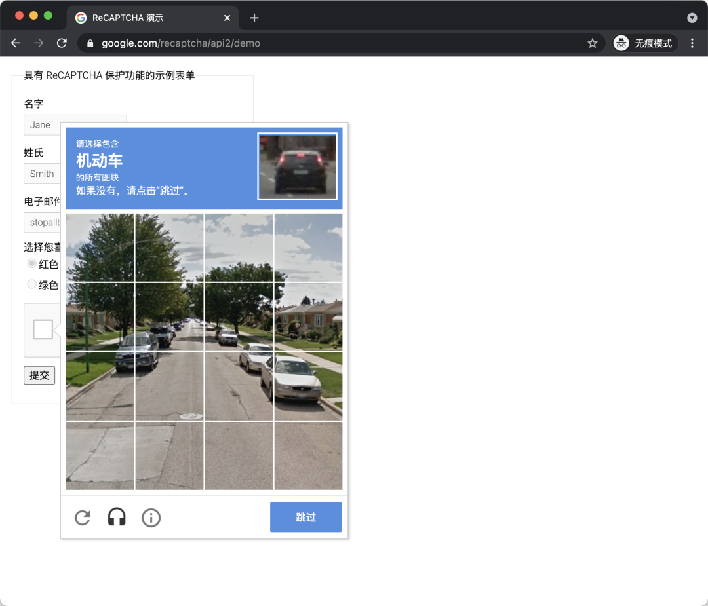
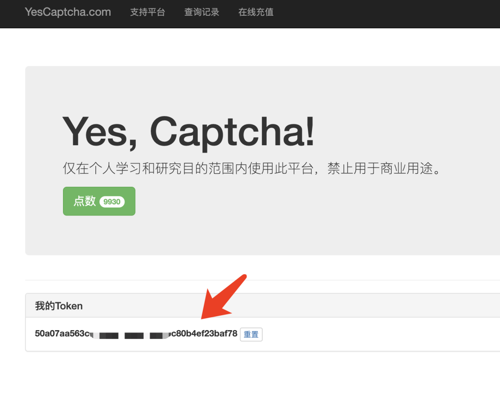
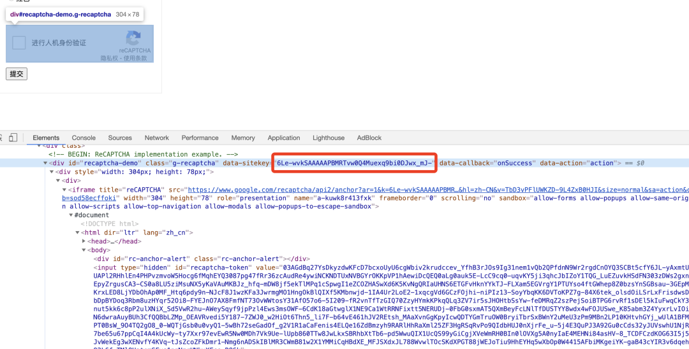
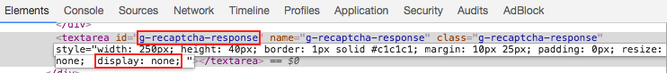
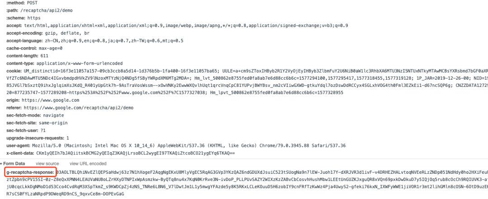
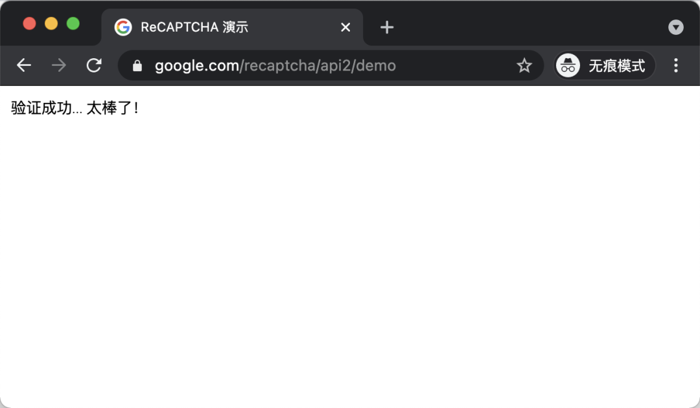

Python爬虫
<a name="KFxx0"></a>
## ReCAPTCHA 介绍
可能大家还没听说过什么是 ReCAPTCHA，可能由于某些原因，这个验证码在国内出现不多，不过想必大家应该多多少少见过或用过。它长这个样子：<br /><br />这时候，只要点击最前面的复选框，验证码算法会首先利用其「风险分析引擎」做一次安全检测，如果直接检验通过的话，会直接得到如下的结果：<br /><br />如果算法检测到当前系统存在风险，比如可能是陌生的网络环境，可能是模拟程序，会需要做二次校验。它会进一步弹出类似如下的内容：<br /><br />比如上面这张图，验证码页面会出现九张图片，同时最上方出现文字「树木」，需要点选下方九张图中出现「树木」的图片，点选完成之后，可能还会出现几张新的图片，需要再次完成点选，最后点击「验证」按钮即可完成验证。 或者可以点击下方的「耳机」图标，这时候会切换到听写模式，验证码会变成这样：<br /><br />这时候如果能填写对验证码读的音频内容，同样可以通过验证。 这两种方式都可以通过验证，验证完成之后，才能完成表单的提交，比如完成登录、注册等操作。 这种验证码叫什么名字？ 这个验证码就是 Google 的 ReCAPTCHA V2 验证码，它就属于行为验证码的一种，这些行为包括点选复选框、选择对应图片、语音听写等内容，只有将这些行为校验通过，此验证码才能通过验证。相比于一般的图形验证码来说，此种验证码交互体验更好、安全性会更高、破解难度更大。<br />其实上文所介绍的验证码仅仅是 ReCAPTCHA 验证码的一种形式，是 V2 的显式版本，另外其 V2 版本还有隐式版本，隐式版本在校验的时候不会再显式地出现验证页面，它是通过 JavaScript 将验证码和提交按钮进行绑定，在提交表单的时候会自动完成校验。除了 V2 版本，Google 又推出了最新的 V3 版本，reCAPTCHA V3 验证码会为根据用户的行为来计算一个分数，这个分数代表了用户可能为机器人的概率，最后通过概率来判断校验是否可以通过。其安全性更高、体验更好。
<a name="ML7UK"></a>
## 体验
那哪里可以体验到 ReCAPTCHA 呢？可以打开这个网站：[https://www.google.com/recaptcha/api2/demo](https://www.google.com/recaptcha/api2/demo)，建议科学上网，同时用匿名窗口打开，这样的话测试不会受到历史 Cookies 的干扰，如图所示：<br /><br />这时候，可以看到下方有个 ReCAPTCHA 的窗口，然后点击之后就出现了一个验证图块。<br />当然靠人工是能解的，但对于爬虫来说肯定不行啊，那怎么自动化解呢？<br />接下来就来介绍一个简单好用的平台。
<a name="diQXH"></a>
## 解决方案
这里介绍的一个 ReCAPTCHA 破解服务叫做 YesCaptcha，主页是 [http://yescaptcha.365world.com.cn/](http://yescaptcha.365world.com.cn/)，它现在同时可以支持 V2 和 V3版本的破解。<br />这次就用它来尝试解一下刚才的 ReCAPTCHA 上的 V2 类型验证码：[https://www.google.com/recaptcha/api2/demo](https://www.google.com/recaptcha/api2/demo)。<br />简单注册之后，可以找到首页有一个 Token。可以复制下来以备后面使用，如图所示：<br /><br />它有两个关键的 API，一个是创建验证码服务任务，另一个是查询任务状态，API 如下：

- 创建任务：[http://api.yescaptcha.365world.com.cn/v3/recaptcha/create](http://api.yescaptcha.365world.com.cn/v3/recaptcha/create)
- 查询状态：[http://api.yescaptcha.365world.com.cn/v3/recaptcha/status](http://api.yescaptcha.365world.com.cn/v3/recaptcha/status)

API 文档可以参考这里：[http://docs.yescaptcha.365world.com.cn/](http://docs.yescaptcha.365world.com.cn/)<br />经过 API 文档可以看到使用的时候可以配置如下参数：

| 参数名 | 是否必须 | 说明 |
| --- | --- | --- |
| token | 是 | 请在个人中心获取 (Token) |
| siteKey | 是 | ReCaptcha SiteKey （固定参数） |
| siteReferer | 是 | ReCaptcha Referer （一般也为固定参数） |
| captchaType | 否 | ReCaptchaV2(默认) / ReCaptchaV3 |
| siteAction | 否 | ReCaptchaV3 选填 Action动作 默认verify |
| minScore | 否 | ReCaptchaV3 选填 最小分数（0.1-0.9） |

这里就有三个关键信息了：

- token：就是刚才在 YesCaptcha 上复制下来的参数
- siteKey：这个是 ReCAPACHA 的标志字符串，稍后会演示怎么找。
- siteReferer，一般是 ReCAPTCHA 的来源网站的 Referer，比如对于当前的案例，该值就是 [https://www.google.com/recaptcha/api2/demo](https://www.google.com/recaptcha/api2/demo)

那 siteKey 怎么找呢？其实很简单，看下当前 ReCAPTCHA 的 HTML 源码，从源码里面找一下就好了：<br /><br />这里可以看到每个 ReCAPTCHA 都对应一个 div，div 有个属性叫做 date-sitekey，看这里的值就是：
```
6Le-wvkSAAAAAPBMRTvw0Q4Muexq9bi0DJwx_mJ-
```
万事俱备了，只差代码了！
<a name="j9MLj"></a>
## 开工
就用最简单 requests 来实现下吧，首先把常量定义一下：
```python
TOKEN = '50a07xxxxxxxxxxxxxxxxxxxxxxxxxf78'  # 请替换成自己的TOKEN
REFERER = 'https://www.google.com/recaptcha/api2/demo'
BASE_URL = 'http://api.yescaptcha.365world.com.cn'
SITE_KEY = '6Le-wvkSAAAAAPBMRTvw0Q4Muexq9bi0DJwx_mJ-' # 请替换成自己的SITE_KEY
```
这里定义了这么几个常量：

- TOKEN：就是网站上复制来的 token
- REFERER：就是 Demo 网站的链接
- API_BASE_URL：就是 YesCaptcha 的 API 网址
- SITE_KEY：就是刚才找到的 data-sitekey

然后定义一个创建任务的方法：
```python
def create_task():
    url = f"{BASE_URL}/v3/recaptcha/create?token={TOKEN}&siteKey={SITE_KEY}&siteReferer={REFERER}"
    try:
        response = requests.get(url)
        if response.status_code == 200:
            data = response.json()
            print('response data:', data)
            return data.get('data', {}).get('taskId')
    except requests.RequestException as e:
        print('create task failed', e)
```
这里就是调 API 来创建任务，没什么好说的。<br />如果创建成功之后会得到一个 task_id，接下来就需要用这个 task_id 来轮询查看任务的状态，定义如下的这么一个方法：
```python
def polling_task(task_id):
    url = f"{BASE_URL}/v3/recaptcha/status?token={TOKEN}&taskId={task_id}"
    count = 0
    while count < 120:
        try:
            response = requests.get(url)
            if response.status_code == 200:
                data = response.json()
                print('polling result', data)
                status = data.get('data', {}).get('status')
                print('status of task', status)
                if status == 'Success':
                    return data.get('data', {}).get('response')
        except requests.RequestException as e:
            print('polling task failed', e)
        finally:
            count += 1
            time.sleep(1)
```
这里就是设置了最长轮询次数 120 次，请求的 API 就是查询任务状态的 API，会得到一个任务状态的结果，如果结果是 Success，那就证明任务成功了，解析其中的 response 结果就是验证码破解之后得到的 token。<br />两个方法调用一下：
```python
if __name__ == '__main__':
    task_id = create_task()
    print('create task successfully', task_id)
    response = polling_task(task_id)
    print('get response:', response[0:40]+'...')
```
运行结果类似如下：
```python
response data: {'status': 0, 'msg': 'ok', 'data': {'taskId': '1479436991'}}
create task successfully 1479436991
polling result {'status': 0, 'msg': 'ok', 'data': {'status': 'Working'}}
status of task Working
polling result {'status': 0, 'msg': 'ok', 'data': {'status': 'Working'}}
status of task Working
polling result {'status': 0, 'msg': 'ok', 'data': {'status': 'Working'}}
status of task Working
polling result {'status': 0, 'msg': 'ok', 'data': {'status': 'Success', 'response': '03AGdBq27-ABqvNmgq96iuprN8Mvzfq6_8noknIed5foLb15oWvWVksq9KesDkDd7dgMMr-UmqULZduXTWr87scJXl3djhl2btPO721eFAYsVzSk7ftr4uHBdJWonnEemr9dNaFB9qx5pnxr3P24AC7cCfKlOH_XARaN4pvbPNxx_UY5G5fzKUPFDOV14nNkCWl61jwwC0fuwetH1q99r4hBQxyI6XICD3PiHyHJMZ_-wolcO1R9C90iGQyjzrSMiNqErezO24ODCiKRyX2cVaMwM9plbxDSuyKUVaDHqccz8UrTNNdJ4m2WxKrD9wZDWaSK10Ti1LgsqOWKjKwqBbuyRS_BkSjG6OJdHqJN4bpk_jAcPMO13wXrnHBaXdK4FNDR9-dUvupHEnr7QZEuNoRxwl8FnO2Fgwzp2sJbGeQkMbSVYWdAalE6fzJ8NwsFJxCdDyeyO817buBtvTJ4C06C1uZ92fpPTeYGJwbbicOuqbGfHNTyiSJeRNmt-5RKz0OUiPJOPnmVKGlWBOqwbwCW1WZt-E-hH4FEg4En5TITmmPb_feS9dWKUxudn1U0hHk2vV9PerjZLtI7F67KtgmcqRrARPbwnc6KyAi3Hy1hthP92lv4MRIcO2jx0Llvsja-G2nhjZB0ZoJwkb9106pmqldiwlXxky4Dcg7VPStiCYJvhQpRYol7Iq1_ltU2tyhMqsu_Xa8Z6Mr5ykRCLnmlLb8DV8isndrdwp84wo_vPARGRj7Up9ov-ycb5lDKTf1XRaHiMCa8d2WLy0Pjco9UnsRAPw0FW3MsBJah6ryHUUDho7ffhUUgV1k86ryJym6xbWch1sVC4D5owzrCFn6L-rSLc5SS1pza2zU5LK4kAZCmbXNRffiFrhUY8nP4T1xaR2KMhIaN8HhJQpR8sQh1Azc-QkDy4rwbYmxUrysYGMrAOnmDx9z7tWQXbJE4IgCVMx5wihSiE-T8nbF5y1aJ0Ru9zqg1nZ3GSqsucSnvJA8HV5t9v0QSG5cBC1x5HIceA-2uEGSjwcmYOMw8D_65Dl-d6yVk1YN2FZCgMWY5ewzB1RAFN1BMqKoITQJ64jq3lKATpkc5i7aTA2bRGQyXrbDyMRIrVXKnYMHegfMbDn0l4O81a8vxmevLspKkacVPiqLsAe-73jAxMvsOqaG7cKxMQO9CY3qbtD55YgN0W4p2jyNSVz3aEpffHRqYyWMsRI5LddLgaZQDoHHgGUhV580PSIdZJ5eKd0gOjxIYxKlr0IgbMWRmsG_TgDNImy1c5oey8ojl-zWpOQW7bnfq5Z4tZ10_sCTfoOZVLqRuOsqB1OOO9pLRQojLBP0HUiGhRAr_As9EIDu6F9NIQfdAmCaVvavJbi1CZITFjcywP-tBrHsxpwkCXlwl996MK_XyEDuyWnJVGiVSthUMY306tIh1Xxj93W3KQJCzsfJQcjN-3lGLLeDFddypHyG4yrpRqRHHBNyiNJHgxSk5SaShEhXvByjkepvhrKX3kJssCU04biqqmkrQ49GqBV9OsWIy0nN3OJTx8v05MP8aU8YYkYBF01UbSff4mTfLAhin6iWk84Y074mRbe2MbgFAdU58KnCrwYVxcAR8voZsFxbxNwZXdVeexNx5HlIlSgaAHLWm2kFWmGPPW-ZA7R8Wst-mc7oIKft5iJl8Ea0YFz8oXyVgQk1rd9nDR3xGe5mWL1co0MiW1yvHg'}}
```
如果其返回的是如上格式的数据，就代表 ReCAPTCHA 验证码已经识别成功了，其返回的 response 字段的内容就是识别的 token，直接拿着这个 token 放到表单里面提交就成功了。<br />那这个 token 怎么来用呢？ 其实如果用浏览器验证验证成功之后，点击表单提交的时候，在其表单里面会把一个 name 叫做 g-recaptcha-response 的 textarea 赋值，如果验证成功，它的 value 值就是验证之后得到的 token，这个会作为表单提交的一部分发送到服务器进行验证。如果这个字段校验成功了，那就没问题了。<br /><br />所以，如上的过程相当于模拟了点选验证码的过程，其最终得到的这个 token 其实就是应该赋值给 name 为 g-recaptcha-response 的内容。 那么怎么赋值呢？ 很简单，用 JavaScript 就好了。可以用 JavaScript 选取到这个 textarea，然后直接赋值即可，代码如下：
```javascript
document.getElementById("g-recaptcha-response").innerHTML="TOKEN_FROM_YESCAPTCHA";
```
注意这里的 TOKEN_FROM_YESCAPTCHA 需要换成刚才所得到的 token 值。做爬虫模拟登录的时候，假如是用 Selenium、Puppeteer 等软件，在模拟程序里面，只需要模拟执行这段 JavaScript 代码，就可以成功赋值了。 执行之后，直接提交表单，查看下 Network 请求：<br /><br />可以看到其就是提交了一个表单，其中有一个字段就是 g-recaptcha-response，它会发送到服务端进行校验，校验通过，那就成功了。 所以，如果借助于 YesCaptcha 得到了这个 token，然后把它赋值到表单的 textarea 里面，表单就会提交，如果 token 有效，就能成功绕过登录，而不需要再去点选验证码了。 最后得到如下成功的页面：<br /><br />当然也可以使用 requests 来模拟完成表单提交：
```python
def verify(response):
    url = "https://www.google.com/recaptcha/api2/demo"
    data = {"g-recaptcha-response": response}
    response = requests.post(url, data=data)
    if response.status_code == 200:
        return response.text
```
最后完善一下调用：
```python
if __name__ == '__main__':
    task_id = create_task()
    print('create task successfully', task_id)
    response = polling_task(task_id)
    print('get response:', response[0:40]+'...')
    result = verify(response)
    print(result)
```
运行结果如下：
```python
response data: {'status': 0, 'msg': 'ok', 'data': {'taskId': '1479436991'}}
create task successfully 1479436991
polling result {'status': 0, 'msg': 'ok', 'data': {'status': 'Working'}}
status of task Working
polling result {'status': 0, 'msg': 'ok', 'data': {'status': 'Working'}}
status of task Working
polling result {'status': 0, 'msg': 'ok', 'data': {'status': 'Working'}}
status of task Working
polling result {'status': 0, 'msg': 'ok', 'data': {'status': 'Success', 'response': '03AGdBq27-ABqvNmgq96iuprN8Mvzfq6_8noknIed5foLb15oWvWVksq9KesDkDd7dgMMr-UmqULZduXTWr87scJXl3djhl2btPO721eFAYsVzSk7ftr4uHBdJWonnEemr9dNaFB9qx5pnxr3P24AC7cCfKlOH_XARaN4pvbPNxx_UY5G5fzKUPFDOV14nNkCWl61jwwC0fuwetH1q99r4hBQxyI6XICD3PiHyHJMZ_-wolcO1R9C90iGQyjzrSMiNqErezO24ODCiKRyX2cVaMwM9plbxDSuyKUVaDHqccz8UrTNNdJ4m2WxKrD9wZDWaSK10Ti1LgsqOWKjKwqBbuyRS_BkSjG6OJdHqJN4bpk_jAcPMO13wXrnHBaXdK4FNDR9-dUvupHEnr7QZEuNoRxwl8FnO2Fgwzp2sJbGeQkMbSVYWdAalE6fzJ8NwsFJxCdDyeyO817buBtvTJ4C06C1uZ92fpPTeYGJwbbicOuqbGfHNTyiSJeRNmt-5RKz0OUiPJOPnmVKGlWBOqwbwCW1WZt-E-hH4FEg4En5TITmmPb_feS9dWKUxudn1U0hHk2vV9PerjZLtI7F67KtgmcqRrARPbwnc6KyAi3Hy1hthP92lv4MRIcO2jx0Llvsja-G2nhjZB0ZoJwkb9106pmqldiwlXxky4Dcg7VPStiCYJvhQpRYol7Iq1_ltU2tyhMqsu_Xa8Z6Mr5ykRCLnmlLb8DV8isndrdwp84wo_vPARGRj7Up9ov-ycb5lDKTf1XRaHiMCa8d2WLy0Pjco9UnsRAPw0FW3MsBJah6ryHUUDho7ffhUUgV1k86ryJym6xbWch1sVC4D5owzrCFn6L-rSLc5SS1pza2zU5LK4kAZCmbXNRffiFrhUY8nP4T1xaR2KMhIaN8HhJQpR8sQh1Azc-QkDy4rwbYmxUrysYGMrAOnmDx9z7tWQXbJE4IgCVMx5wihSiE-T8nbF5y1aJ0Ru9zqg1nZ3GSqsucSnvJA8HV5t9v0QSG5cBC1x5HIceA-2uEGSjwcmYOMw8D_65Dl-d6yVk1YN2FZCgMWY5ewzB1RAFN1BMqKoITQJ64jq3lKATpkc5i7aTA2bRGQyXrbDyMRIrVXKnYMHegfMbDn0l4O81a8vxmevLspKkacVPiqLsAe-73jAxMvsOqaG7cKxMQO9CY3qbtD55YgN0W4p2jyNSVz3aEpffHRqYyWMsRI5LddLgaZQDoHHgGUhV580PSIdZJ5eKd0gOjxIYxKlr0IgbMWRmsG_TgDNImy1c5oey8ojl-zWpOQW7bnfq5Z4tZ10_sCTfoOZVLqRuOsqB1OOO9pLRQojLBP0HUiGhRAr_As9EIDu6F9NIQfdAmCaVvavJbi1CZITFjcywP-tBrHsxpwkCXlwl996MK_XyEDuyWnJVGiVSthUMY306tIh1Xxj93W3KQJCzsfJQcjN-3lGLLeDFddypHyG4yrpRqRHHBNyiNJHgxSk5SaShEhXvByjkepvhrKX3kJssCU04biqqmkrQ49GqBV9OsWIy0nN3OJTx8v05MP8aU8YYkYBF01UbSff4mTfLAhin6iWk84Y074mRbe2MbgFAdU58KnCrwYVxcAR8voZsFxbxNwZXdVeexNx5HlIlSgaAHLWm2kFWmGPPW-ZA7R8Wst-mc7oIKft5iJl8Ea0YFz8oXyVgQk1rd9nDR3xGe5mWL1co0MiW1yvHg'}}
status of task Success
get response: 03AGdBq27-ABqvNmgq96iuprN8Mvzfq6_8noknIe...
<!DOCTYPE HTML><html dir="ltr"><head><meta http-equiv="content-type" content="text/html; charset=UTF-8"><meta name="viewport" content="width=device-width, user-scalable=yes"><title>ReCAPTCHA demo</title><link rel="stylesheet" href="https://www.gstatic.com/recaptcha/releases/TbD3vPFlUWKZD-9L4ZxB0HJI/demo__ltr.css" type="text/css"></head><body><div class="recaptcha-success">Verification Success... Hooray!</div></body></html>
```
最后就可以发现，模拟提交之后，结果会有一个 Verification Success... Hooray! 的文字，就代表验证成功了！<br />至此，就成功完成了 ReCAPTCHA 的破解。<br />上面介绍的是 requests 的实现，当然使用 Selenium 等工具也可以实现，具体的 Demo 在文档也写好了，参考文档的说明使用即可。
<a name="EtfuP"></a>
## 小福利
现在 YesCaptcha 的价格觉得相比 2Captcha 实惠很多了，它破解一次是花费 10 点数，10 块钱是 10000 点数，所以平均破解一次验证码一分钱，新用户是送 1000 点数，可以破解 100 次。<br />大家有需要的话可以试试看！网址是： [http://yescaptcha.365world.com.cn/](http://yescaptcha.365world.com.cn/)
