Python爬虫
<a name="eNyK5"></a>
## ReCAPTCHA 介绍
在开始之前，这里先简单提下什么是 ReCAPTCHA，可能见的不多，因为这个验证码在国内并没有那么普及。<br />验证码是类似这样子的：<br />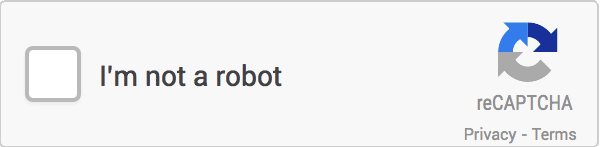<br />这时候需要点击验证码上的小框来触发验证，通常情况下，验证码会呈现如下的点选图：<br />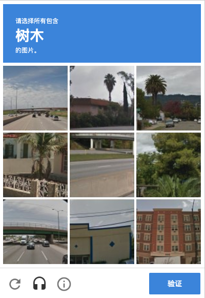<br />比如上面这张图，验证码页面会出现九张图片，同时最上方出现文字「树木」，需要点选下方九张图中出现「树木」的图片，点选完成之后，可能还会出现几张新的图片，需要再次完成点选，最后点击「验证」按钮即可完成验证。<br />ReCAPTCHA 也有体验地址，大家可以打开 [https://www.google.com/recaptcha/api2/demo](https://www.google.com/recaptcha/api2/demo) 查看，打开之后，可以发现有如上图所示的内容，然后点选图片进行识别即可。
<a name="LTpuU"></a>
## 整体识别思路
这种验证码其实主要就是一些格子的点选，只要把一些相应的位置点击对了，最后就能验证通过了。<br />经过观察可以发现，其实主要是 3x3 和 4x4  方格的验证码，比如 3x3 的就是这样的：<br />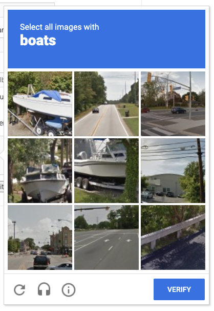<br />4x4 的就是这样的：<br />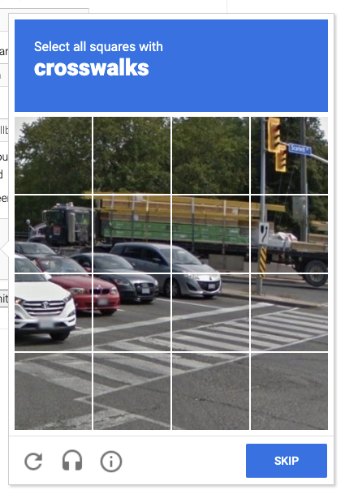<br />然后验证码上面还有一行加粗的文字，这就是要点选的目标。<br />所以，关键点就来了：

- 第一就是把上面的文字内容找出来，以便于知道要点击的内容是什么。
- 第二就是要知道哪些目标图片和上面的文字是匹配的，找到了依次模拟点击就好了。

听起来似乎很简单的对吧，但第二点是一个难点，怎么知道哪些图片和文字匹配的呢？这就难搞了。<br />其实，这个靠深度学习是能做到的，但要搞出这么一个模型是很不容易的，需要大量的数据来训练，需要收集很多验证码图片和标注结果，这总的工作量是非常大的。<br />那怎么办呢？这里介绍一个服务网站 YesCaptcha，这个服务网站已经做好了识别服务，只需要把验证码的大图提交上去，然后同时告诉服务需要识别的内容是什么，这个服务就可以返回对应识别结果了。<br />下面来借助 YesCaptcha 来试试识别过程。
<a name="HI7O8"></a>
## YesCaptcha
在使用之前需要先注册下这个网站，网站地址是 [https://yescaptcha.com/i/CnZPBu](https://yescaptcha.com/i/CnZPBu)，注册个账号之后大家可以在后台获取一个账户密钥，也就是 ClientKey，保存备用。<br />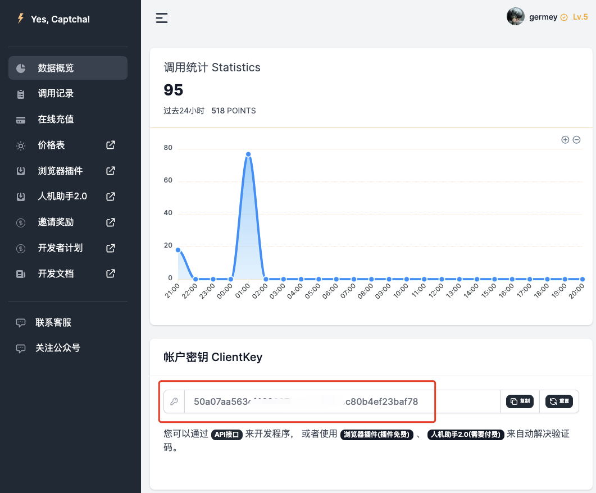<br />然后可以查看下这里的官方文档：[https://yescaptcha.atlassian.net/wiki/spaces/YESCAPTCHA/pages/18055169/ReCaptchaV2Classification+reCaptcha+V2](https://yescaptcha.atlassian.net/wiki/spaces/YESCAPTCHA/pages/18055169/ReCaptchaV2Classification+reCaptcha+V2)，这里介绍介绍了一个 API，大致内容是这样的。<br />首先有一个创建任务的 API，API 地址为 [https://api.yescaptcha.com/createTask](https://api.yescaptcha.com/createTask)，然后看下请求参数：<br />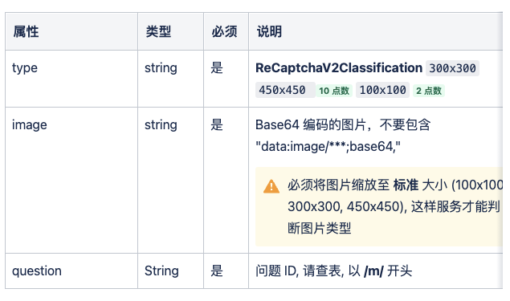<br />这里需要传入这么几个参数：

- type：内容就是 RecaptchaV2Classification
- image：是验证码对应的 Base64 编码
- question：对应的问题 ID，也就是识别目标的代号。

比如这里可以 POST 这样的一个内容给服务器，结构如下：
```json
{
	"clientKey": "cc9c18d3e263515c2c072b36a7125eecc078618f",
	"task": {
		"type": "ReCaptchaV2Classification",
		"image": "/9j/4AAQSkZJRgABAQEAYABgAAD/2wBDAAgGBgcGBQgHBwcJCQgKDBQNDAsLDBkSEw8UHRofHh0aHBwgJC4nICIsIxwcKDc....",
		"question": "/m/0k4j"
	}
}
```
其中这里 image 就可以是一个 3x3 或者 4x4 的验证码截图对应的 Base64 编码的字符串。<br />然后服务器就会返回类似这样的响应：
```json
{
    "errorId": 0,
    "errorCode": "",
    "errorDescription": "null",
    "status": "ready",
    "taskId": "3a9e8cb8-3871-11ec-9794-94e6f7355a0b",
    "solution": {
        "objects": [1,5,8], // 图像需要点击的位置
        "type": "multi"
    }
}
```
可以看到，返回结果的 solution 字段中的 objects 字段就包含了一些代号，比如这里是 1, 5, 8，什么意思呢？这个就是对应的目标点击代号。<br />对于 3x3 的图片来说，对应的代号就是这样的：<br />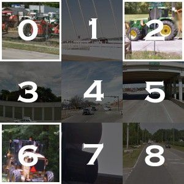<br />对于 4x4 的图片来说，对应的代号就是这样的：<br />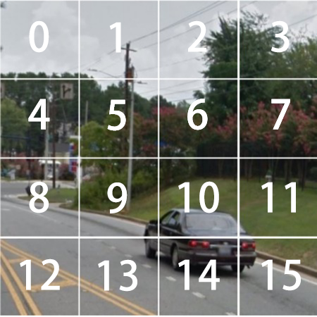<br />知道了代号之后，模拟点击就好办多了，用一些模拟点击操作就可以完成了。
<a name="WJ57t"></a>
## 代码基础实现
行，那有了基本思路之后，那就开始用 Python 实现下整个流程吧，这里就拿 [https://www.google.com/recaptcha/api2/demo](https://www.google.com/recaptcha/api2/demo) 这个网站作为样例来讲解下整个识别和模拟点击过程。
<a name="p2hHU"></a>
### 识别封装
首先对上面的任务 API 实现一下封装，来先写一个类：
```json
from loguru import logger
from app.settings import CAPTCHA_RESOLVER_API_KEY, CAPTCHA_RESOLVER_API_URL
import requests

class CaptchaResolver(object):

    def __init__(self, api_url=CAPTCHA_RESOLVER_API_URL, api_key=CAPTCHA_RESOLVER_API_KEY):
        self.api_url = api_url
        self.api_key = api_key

    def create_task(self, image_base64_string, question_id):
        logger.debug(f'start to recognize image for question {question_id}')
        data = {
            "clientKey": self.api_key,
            "task": {
                "type": "ReCaptchaV2Classification",
                "image": image_base64_string,
                "question": question_id
            }
        }
        try:
            response = requests.post(self.api_url, json=data)
            result = response.json()
            logger.debug(f'captcha recogize result {result}')
            return result
        except requests.RequestException:
            logger.exception(
                'error occurred while recognizing captcha', exc_info=True)
```
这里先定义了一个类 `CaptchaResolver`，然后主要接收两个参数，一个就是 api_url，这个对应的就是 [https://api.yescaptcha.com/createTask](https://api.yescaptcha.com/createTask) 这个 API 地址，然后还有一个参数是 api_key，这个就是前文介绍的那个 ClientKey。<br />接着定义了一个 create_task 方法，接收两个参数，第一个参数 image_base64_string 就是验证码图片对应的 Base64 编码，第二个参数 question_id 就是要识别的目标是什么，这里就是将整个请求用 requests 模拟实现了，最后返回对应的 JSON 内容的响应结果就好了。
<a name="zGZwM"></a>
### 基础框架
那么接下来用 Selenium 来模拟打开这个实例网站，然后模拟点选来触发验证码，接着识别验证码就好了。<br />首先写一个大致框架：
```json
import time
from selenium import webdriver
from selenium.webdriver.support.wait import WebDriverWait
from selenium.webdriver.remote.webelement import WebElement
from selenium.webdriver.common.action_chains import ActionChains
from app.captcha_resolver import CaptchaResolver


class Solution(object):
    def __init__(self, url):
        self.browser = webdriver.Chrome()
        self.browser.get(url)
        self.wait = WebDriverWait(self.browser, 10)
        self.captcha_resolver = CaptchaResolver()

    def __del__(self):
        time.sleep(10)
        self.browser.close()
```
这里先在构造方法里面初始化了一个 Chrome 浏览器操作对象，然后调用对应的 get 方法打开实例网站，接着声明了一个 WebDriverWait 对象和 CaptchaResolver 对象，以分别应对节点查找和验证码识别操作，留作备用。
<a name="fF9Bx"></a>
### iframe 切换支持
接着，下一步就该来模拟点击验证码的入口，来触发验证码。<br />通过观察可以发现这个验证码入口其实是在 iframe 里面加载的，对应的 iframe 是这样的：<br />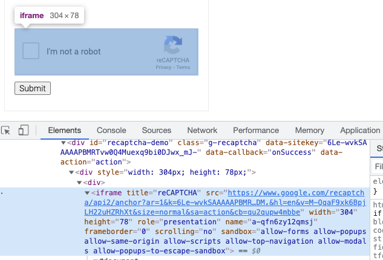<br />另外弹出的验证码图片又在另外一个 iframe 里面，如图所示：<br />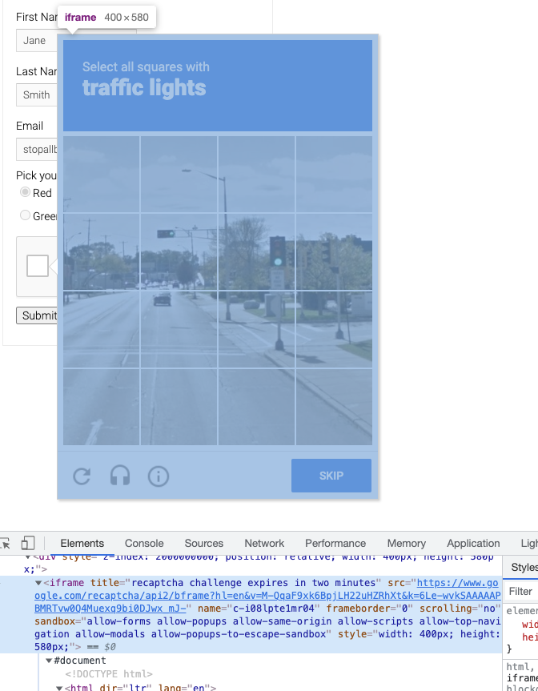<br />Selenium 查找节点是需要切换到对应的 iframe 里面才行的，不然是没法查到对应的节点，也就没法模拟点击什么的了。<br />所以这里定义几个工具方法，分别能够支持切换到入口对应的 iframe 和验证码本身对应的 iframe，代码如下：
```json
    def get_captcha_entry_iframe(self) -> WebElement:
        self.browser.switch_to.default_content()
        captcha_entry_iframe = self.browser.find_element_by_css_selector(
            'iframe[title="reCAPTCHA"]')
        return captcha_entry_iframe

    def switch_to_captcha_entry_iframe(self) -> None:
        captcha_entry_iframe: WebElement = self.get_captcha_entry_iframe()
        self.browser.switch_to.frame(captcha_entry_iframe)

    def get_captcha_content_iframe(self) -> WebElement:
        self.browser.switch_to.default_content()
        captcha_content_iframe = self.browser.find_element_by_xpath(
            '//iframe[contains(@title, "recaptcha challenge")]')
        return captcha_content_iframe
        
    def switch_to_captcha_content_iframe(self) -> None:
        captcha_content_iframe: WebElement = self.get_captcha_content_iframe()
        self.browser.switch_to.frame(captcha_content_iframe)
```
这样的话，只需要调用 switch_to_captcha_content_iframe 就能查找验证码图片里面的内容，调用 switch_to_captcha_entry_iframe 就能查找验证码入口里面的内容。
<a name="Vxxjc"></a>
### 触发验证码
那么接下来的一步就是来模拟点击验证码的入口，然后把验证码触发出来了对吧，就是模拟点击这里：<br />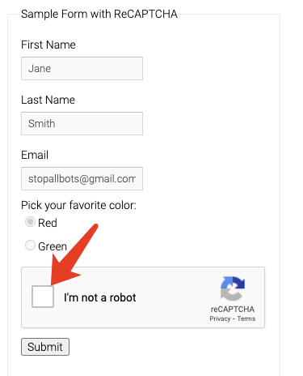<br />实现很简单，代码如下：
```json
    def trigger_captcha(self) -> None:
        self.switch_to_captcha_entry_iframe()
        captcha_entry = self.wait.until(EC.presence_of_element_located(
            (By.ID, 'recaptcha-anchor')))
        captcha_entry.click()
        time.sleep(2)
        self.switch_to_captcha_content_iframe()
        entire_captcha_element: WebElement = self.get_entire_captcha_element()
        if entire_captcha_element.is_displayed:
            logger.debug('trigged captcha successfully')
```
这里首先首先调用 switch_to_captcha_entry_iframe 进行了 iframe 的切换，然后找到那个入口框对应的节点，然后点击一下。<br />点击完了之后再调用 switch_to_captcha_content_iframe 切换到验证码本身对应的 iframe 里面，查找验证码本身对应的节点是否加载出来了，如果加载出来了，那么就证明触发成功了。
<a name="JzD6O"></a>
### 找出识别目标
那么现在验证码可能就长这样子了：<br />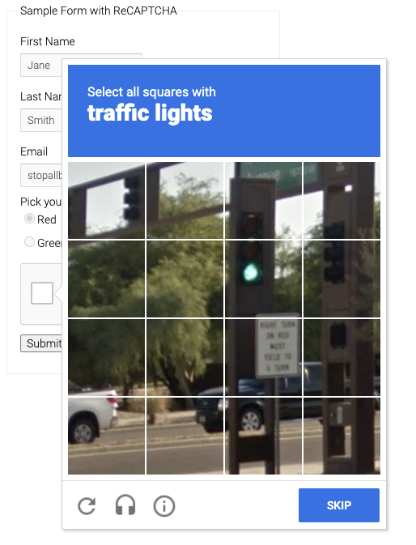<br />那接下来要做的就是两件事了，一件事就是把匹配目标找出来，就是上图中的加粗字体，第二件事就是把验证码的图片保存下来，然后转成 Base64 编码，提交给 CaptchaResolver 来识别。<br />好，那么怎么查找匹配目标呢？也就是上图中的 traffice lights，用 Selenium 常规的节点搜索就好了：
```python
def get_captcha_target_name(self) -> WebElement:
	captcha_target_name_element: WebElement = self.wait.until(EC.presence_of_element_located(
		(By.CSS_SELECTOR, '.rc-imageselect-desc-wrapper strong')))
	return captcha_target_name_element.text
```
通过调用这个方法，就能得到上图中类似 traffic lights 的内容了。
<a name="uqGCI"></a>
### 验证码识别
接着，对验证码图片进行下载，然后转 Base64 进行识别吧，整体代码如下：
```python
def verify_entire_captcha(self):
	self.entire_captcha_natural_width = self.get_entire_captcha_natural_width()
	logger.debug(
		f'entire_captcha_natural_width {self.entire_captcha_natural_width}'
	)
	self.captcha_target_name = self.get_captcha_target_name()
	logger.debug(
		f'captcha_target_name {self.captcha_target_name}'
	)
	entire_captcha_element: WebElement = self.get_entire_captcha_element()
	entire_captcha_url = entire_captcha_element.find_element_by_css_selector(
		'td img').get_attribute('src')
	logger.debug(f'entire_captcha_url {entire_captcha_url}')
	with open(CAPTCHA_ENTIRE_IMAGE_FILE_PATH, 'wb') as f:
		f.write(requests.get(entire_captcha_url).content)
		logger.debug(
			f'saved entire captcha to {CAPTCHA_ENTIRE_IMAGE_FILE_PATH}')
		resized_entire_captcha_base64_string = resize_base64_image(
			CAPTCHA_ENTIRE_IMAGE_FILE_PATH, (self.entire_captcha_natural_width,
											 self.entire_captcha_natural_width))
		logger.debug(
			f'resized_entire_captcha_base64_string, {resized_entire_captcha_base64_string[0:100]}...')
		entire_captcha_recognize_result = self.captcha_resolver.create_task(
			resized_entire_captcha_base64_string,
			get_question_id_by_target_name(self.captcha_target_name)
		)
```
这里首先获取了一些验证码的基本信息：

- `entire_captcha_natural_width`：验证码图片对应的图片真实大小，这里如果是 3x3 的验证码图片，那么图片的真实大小就是 300，如果是 4x4 的验证码图片，那么图片的真实大小是 450
- `captcha_target_name`：识别目标名称，就是刚才获取到的内容
- `entire_captcha_element`：验证码图片对应的节点对象。

这里先把 entire_captcha_element 里面的 img 节点拿到，然后将 img 的 src 内容获取下来，赋值为 entire_captcha_url，这样其实就得到了一张完整的验证码大图，然后将其写入到文件中。<br />结果就类似这样的：<br />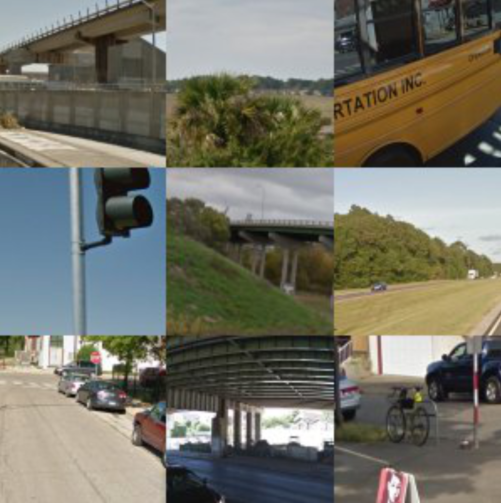<br />接着把这个图片发给 YesCaptcha 进行识别就好了。
<a name="iixxH"></a>
### Base64 编码
接着，把这张图片转下 Base64 编码，定义这样一个方法：
```python
def resize_base64_image(filename, size):
	width, height = size
	img = Image.open(filename)
	new_img = img.resize((width, height))
	new_img.save(CAPTCHA_RESIZED_IMAGE_FILE_PATH)
	with open(CAPTCHA_RESIZED_IMAGE_FILE_PATH, "rb") as f:
		data = f.read()
		encoded_string = base64.b64encode(data)
		return encoded_string.decode('utf-8')
```
这里值得注意的是，由于 API 对图片大小有限制，如果是 3x3 的图片，那么需要将图片调整成 300x300 才可以，如果是 4x4 的图片，那么需要将图片调整成 450x450，所以这里先调用了 Image 的 resize 方法调整了大小，接着再转成了 Base64 编码。
<a name="yzc9B"></a>
### 问题 ID 处理
那问题 ID 怎么处理呢？通过 API 文档 [https://yescaptcha.atlassian.net/wiki/spaces/YESCAPTCHA/pages/18055169](https://yescaptcha.atlassian.net/wiki/spaces/YESCAPTCHA/pages/18055169) 可以看到如下映射表：<br />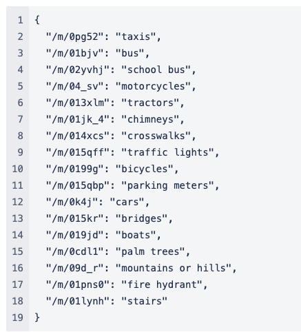<br />所以，比如假如验证码里面得到的是 traffic lights，那么问题 ID 就是 /m/015qff，行，那反向查找就好了，定义这么个方法：
```python
CAPTCHA_TARGET_NAME_QUESTION_ID_MAPPING = {
    "taxis": "/m/0pg52",
    "bus": "/m/01bjv",
    "school bus": "/m/02yvhj",
    "motorcycles": "/m/04_sv",
    "tractors": "/m/013xlm",
    "chimneys": "/m/01jk_4",
    "crosswalks": "/m/014xcs",
    "traffic lights": "/m/015qff",
    "bicycles": "/m/0199g",
    "parking meters": "/m/015qbp",
    "cars": "/m/0k4j",
    "vehicles": "/m/0k4j",
    "bridges": "/m/015kr",
    "boats": "/m/019jd",
    "palm trees": "/m/0cdl1",
    "mountains or hills": "/m/09d_r",
    "fire hydrant": "/m/01pns0",
    "fire hydrants": "/m/01pns0",
    "a fire hydrant": "/m/01pns0",
    "stairs": "/m/01lynh",
}


def get_question_id_by_target_name(target_name):
    logger.debug(f'try to get question id by {target_name}')
    question_id = CAPTCHA_TARGET_NAME_QUESTION_ID_MAPPING.get(target_name)
    logger.debug(f'question_id {question_id}')
    return question_id
```
这样传入名称，就可以得到问题 ID 了。<br />最后将上面的参数直接调用 CaptchaResovler 对象的 create_task 方法就能得到识别结果了。
<a name="nP8c0"></a>
### 模拟点击
得到结果之后，知道返回结果的 objects 就是需要点击的验证码格子的列表，下面进行模拟点击即可：
```python
single_captcha_elements = self.wait.until(EC.visibility_of_all_elements_located(
	(By.CSS_SELECTOR, '#rc-imageselect-target table td')))
for recognized_index in recognized_indices:
	single_captcha_element: WebElement = single_captcha_elements[recognized_index]
	single_captcha_element.click()
	# check if need verify single captcha
	self.verify_single_captcha(recognized_index)
```
这里首先得到了 recognized_indices 就是识别结果对应的标号，然后逐个遍历进行模拟点击。<br />对于每次点击，可以直接获取所有的验证码格子对应的节点，然后调用其 click 方法就可以完成点击了，其中格子的标号和返回结果的对应关系如图：<br /><br />当然也可以通过执行 JavaScript 来对每个节点进行模拟点击，效果是类似的。<br />这样就可以实现验证码小图的逐个识别了。
<a name="b7IHR"></a>
### 小图识别
等等，在识别过程中还发现了一个坑，那就是有时候点击完一个小格子之后，这个小格子就消失了！然后在原来的小格子的位置出现了一个新的小图，需要对新出现的图片进行二次识别才可以。<br />这个怎么处理呢？<br />其实可以在每点击完一个格子之后就来校验下当前小格子有没有图片刷新，如果有图片刷新，那么对应的 HTML 的 class 就会变化，如果不变，class 就会包含 selected 字样。根据这个信息，如果图片刷新了，然后再继续对小格子对应的图进行二次识别就好了。<br />这里再定义一个方法：
```python
def verify_single_captcha(self, index):
    time.sleep(3)
    elements = self.wait.until(EC.visibility_of_all_elements_located(
        (By.CSS_SELECTOR, '#rc-imageselect-target table td')))
    single_captcha_element: WebElement = elements[index]
    class_name = single_captcha_element.get_attribute('class')
    logger.debug(f'verifiying single captcha {index}, class {class_name}')
    if 'selected' in class_name:
        logger.debug(f'no new single captcha displayed')
        return
    logger.debug('new single captcha displayed')
    single_captcha_url = single_captcha_element.find_element_by_css_selector(
            'img').get_attribute('src')
    logger.debug(f'single_captcha_url {single_captcha_url}')
    with open(CAPTCHA_SINGLE_IMAGE_FILE_PATH, 'wb') as f:
        f.write(requests.get(single_captcha_url).content)
    resized_single_captcha_base64_string = resize_base64_image(
        CAPTCHA_SINGLE_IMAGE_FILE_PATH, (100, 100))
    single_captcha_recognize_result = self.captcha_resolver.create_task(
        resized_single_captcha_base64_string, get_question_id_by_target_name(self.captcha_target_name))
    if not single_captcha_recognize_result:
        logger.error('count not get single captcha recognize result')
        return
    has_object = single_captcha_recognize_result.get(
        'solution', {}).get('hasObject')
    if has_object is None:
        logger.error('count not get captcha recognized indices')
        return
    if has_object is False:
        logger.debug('no more object in this single captcha')
        return
    if has_object:
        single_captcha_element.click()
        # check for new single captcha
        self.verify_single_captcha(index)
```
这里定义了一个 verify_single_captcha 方法，然后传入了格子对应的序号。接着首先尝试查找格子对应的节点，然后找出对应的 HTML 的 class 属性。如果没有出现新的小图，那就是这样的选中状态，对应的 class 就包含了 selected 字样，如图所示：<br />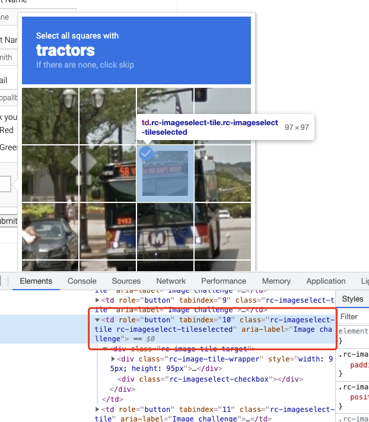<br />对于这样的图片，就不需要进行二次验证，否则就需要对这个格子进行截图和二次识别。<br />二次识别的步骤也是一样的，需要将小格子对应的图片单独获取其 url，然后下载下来，接着调整大小并转化成 Base64 编码，然后发给 API，API 会通过一个 hasObject 字段说明这个小图里面是否包含想要识别的目标内容，如果是，那就接着点击，然后递归进行下一次检查，如果不是，那就跳过。
<a name="muDIC"></a>
### 点击验证
那么有了上面的逻辑，就能完成整个 ReCAPTCHA 的识别和点选了。<br />最后，模拟点击验证按钮就好了：
```python
def get_verify_button(self) -> WebElement:
    verify_button = self.wait.until(EC.presence_of_element_located(
        (By.CSS_SELECTOR, '#recaptcha-verify-button')))
    return verify_button
        
# after all captcha clicked
verify_button: WebElement = self.get_verify_button()
if verify_button.is_displayed:
    verify_button.click()
    time.sleep(3)
```
<a name="Xh95k"></a>
### 校验结果
点击完了之后，可以尝试检查网页变化，看看有没有验证成功。<br />比如验证成功的标志就是出现一个绿色小对勾：<br />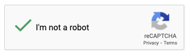<br />检查方法如下：
```python
def get_is_successful(self):
    self.switch_to_captcha_entry_iframe()
    anchor: WebElement = self.wait.until(EC.visibility_of_element_located((
        By.ID, 'recaptcha-anchor'
    )))
    checked = anchor.get_attribute('aria-checked')
    logger.debug(f'checked {checked}')
    return str(checked) == 'true'
```
这里先切换了 iframe，然后检查了对应的 class 是否是符合期望的。<br />最后如果 get_is_successful 返回结果是 True，那就代表识别成功了，那就整个完成了。<br />如果返回结果是 False，可以进一步递归调用上述逻辑进行二次识别，直到识别成功即可。
<a name="gMBsN"></a>
## 代码
以上代码可能比较复杂，这里将代码进行了规整，然后放到 GitHub 上了，如有需要可以自取：[https://github.com/Python3WebSpider/RecaptchaResolver](https://github.com/Python3WebSpider/RecaptchaResolver)
<a name="qMbvH"></a>
## 注册地址
最后需要说明一点，上面的验证码服务是收费的，每验证一次可能花一定的点数，比如识别一次 3x3 的图要花 10 点数，而充值一块钱就能获得 1000 点数，所以识别一次就一分钱，还是比较便宜的。<br />这里充值了好几万点数，然后就变成了 VIP5级的账号。研究了下发现大家如果用这个邀请链接 [https://yescaptcha.com/i/CnZPBu](https://yescaptcha.com/i/CnZPBu) 注册大家可以直接变成 VIP4，然后 VIP4 可以获取首充赠送 10% 的优惠，还不错～
