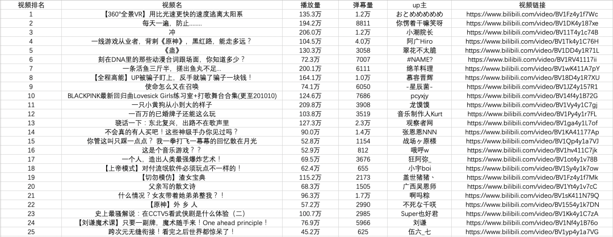

Python 爬虫<br />爬虫是Python的一个重要的应用，使用Python爬虫可以轻松的从互联网中抓取想要的数据，
<a name="szYdf"></a>
### 第一步：尝试请求
首先进入b站首页，点击排行榜并复制链接
```http
https://www.bilibili.com/ranking?spm_id_from=333.851.b_7072696d61727950616765546162.3
```
现在启动`Jupyter notebook`，并运行以下代码
```python
import requests
url = 'https://www.bilibili.com/ranking?spm_id_from=333.851.b_7072696d61727950616765546162.3'
res = requests.get('url')
print(res.status_code)
#200
```
在上面的代码中，完成了下面三件事

- 导入`requests`
- 使用`get`方法构造请求
- 使用`status_code`获取网页状态码

可以看到返回值是`200`，表示服务器**正常响应**，这意味着可以继续进行。
<a name="ToKL0"></a>
### 第二步：解析页面
在上一步通过requests向网站请求数据后，成功得到一个包含服务器资源的Response对象，现在可以使用`.text`来查看其内容<br /><br />可以看到返回一个字符串，里面有需要的热榜视频数据，**但是直接从字符串中提取内容是比较复杂且低效的**，因此需要对其进行**解析**，将字符串转换为网页**结构化数据**，这样可以很方便地查找HTML标签以及其中的属性和内容。<br />在Python中解析网页的方法有很多，可以使用`正则表达式`，也可以使用`BeautifulSoup`、`pyquery`或`lxml`，这里使用**BeautifulSoup**.<br />**Beautiful Soup**是一个可以从HTML或XML文件中提取数据的第三方库.安装也很简单，使用`pip install bs4`安装即可，下面用一个简单的例子说明它是怎样工作的
```python
from bs4 import BeautifulSoup
page = requests.get(url)
soup = BeautifulSoup(page.content, 'html.parser')
title = soup.title.text 
print(title)
# 热门视频排行榜 - 哔哩哔哩 (゜-゜)つロ 干杯~-bilibili
```
在上面的代码中，通过bs4中的BeautifulSoup类**将上一步得到的html格式字符串转换为一个BeautifulSoup对象**，注意在使用时需要制定一个解析器，这里使用的是`html.parser`。<br />接着就可以获取其中的某个结构化元素及其属性，比如使用`soup.title.text`获取页面标题，同样可以使用`soup.body`、`soup.p`等获取任意需要的元素。
<a name="ORt2v"></a>
### 第三步：提取内容
在上面两步中，分别使用requests向网页请求数据并使用bs4解析页面，现在来到最关键的步骤：**如何从解析完的页面中提取需要的内容**。<br />在**Beautiful Soup**中，可以使用`find/find_all`来定位元素，更习惯使用CSS选择器`.select`，因为可以像使用CSS选择元素一样向下访问DOM树。<br />现在用代码解释如何从解析完的页面中提取B站热榜的数据，首先需要找到存储数据的标签，在榜单页面按下F12并按照下图指示找到<br /><br />可以看到每一个视频信息都被包在`class="rank-item"`的**li标签**下，那么代码就可以这样写👇
```python
all_products = []
products = soup.select('li.rank-item')
for product in products:
    rank = product.select('div.num')[0].text
    name = product.select('div.info > a')[0].text.strip()
    play = product.select('span.data-box')[0].text
    comment = product.select('span.data-box')[1].text
    up = product.select('span.data-box')[2].text
    url = product.select('div.info > a')[0].attrs['href']
    all_products.append({
        "视频排名":rank,
        "视频名": name,
        "播放量": play,
        "弹幕量": comment,
        "up主": up,
        "视频链接": url
    })
```
在上面的代码中，先使用`soup.select('li.rank-item')`，此时**返回一个list**包含每一个视频信息，接着遍历每一个视频信息，依旧使用CSS选择器来提取要的字段信息，并以字典的形式存储在开头定义好的空列表中。<br />可以注意到用了多种选择方法提取去元素，**这也是select方法的灵活之处**。<br />**第四步：存储数据**<br />通过前面三步，成功的使用requests+bs4从网站中提取出需要的数据，最后只需要将数据写入Excel中保存即可。<br />如果对pandas不熟悉的话，可以使用`csv`模块写入，需要注意的是设置好编码`encoding='utf-8-sig'`，否则会出现中文乱码的问题
```python
import csv
keys = all_products[0].keys()
with open('B站视频热榜TOP100.csv', 'w', newline='', encoding='utf-8-sig') as output_file:
    dict_writer = csv.DictWriter(output_file, keys)
    dict_writer.writeheader()
    dict_writer.writerows(all_products)
```
如果熟悉pandas的话，更是可以轻松将字典转换为DataFrame，一行代码即可完成
```javascript
import pandas as pd
keys = all_products[0].keys()
pd.DataFrame(all_products,columns=keys).to_csv('B站视频热榜TOP100.csv', encoding='utf-8-sig')
```

<a name="dMKKv"></a>
### 小结
至此就成功使用Python将b站热门视频榜单数据存储至本地，大多数基于requests的爬虫基本都按照上面四步进行。<br />不过虽然看上去简单，但是在真实场景中每一步都没有那么轻松，**从请求数据开始目标网站就有多种形式的反爬、加密，到后面解析、提取甚至存储数据都有很多需要进一步探索、学习。**<br />最后附上完整代码
```python
import requests
from bs4 import BeautifulSoup
import csv
import pandas as pd
url = 'https://www.bilibili.com/ranking?spm_id_from=333.851.b_7072696d61727950616765546162.3'
page = requests.get(url)
soup = BeautifulSoup(page.content, 'html.parser')
all_products = []
products = soup.select('li.rank-item')
for product in products:
    rank = product.select('div.num')[0].text
    name = product.select('div.info > a')[0].text.strip()
    play = product.select('span.data-box')[0].text
    comment = product.select('span.data-box')[1].text
    up = product.select('span.data-box')[2].text
    url = product.select('div.info > a')[0].attrs['href']
    all_products.append({
        "视频排名":rank,
        "视频名": name,
        "播放量": play,
        "弹幕量": comment,
        "up主": up,
        "视频链接": url
    })
keys = all_products[0].keys()
with open('B站视频热榜TOP100.csv', 'w', newline='', encoding='utf-8-sig') as output_file:
    dict_writer = csv.DictWriter(output_file, keys)
    dict_writer.writeheader()
    dict_writer.writerows(all_products)
### 使用pandas写入数据
pd.DataFrame(all_products,columns=keys).to_csv('B站视频热榜TOP100.csv', encoding='utf-8-sig')
```
