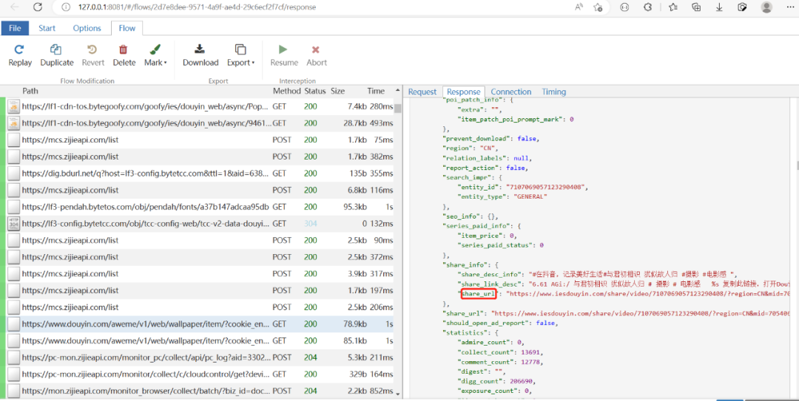

Python<br /><br />每天换着花样欣赏一波波动态壁纸<br /><br />桌面立刻拥有了高颜值，简直跟刷美女短视频一样啊。<br />这些动态壁纸就是短视频！<br /><br />启动mitmweb， 下图的share_url就是我桌面上那个动态壁纸，在浏览器中打开就是短视频页面<br /><br />所谓的动态壁纸不过是用户上传的好看的短视频！某音的产品MM精心挑选
<a name="r4bqq"></a>
### 获取下载链接
这些壁纸（短视频）的MP4地址怎么获取呢？<br /><br />很简单，都不用Python去模拟请求了。<br />下载某音windows版本进行安装，<br />命令行启动mitmweb，点击下图红框内的五角星进入动态壁纸页面<br /><br />mitmproxy会出现https://www.douyin.com/aweme/v1/web/wallpaper/开头的链接，选好它然后点击“Download”按钮，会下载一个“content.data”的文件，里面包含动态壁纸的MP4下载地址！<br /><br />可以用python来处理它，然后去重，放入列表中
```python
import json

url_list = []
url_dict = {}
with open('content.data', 'r',encoding='utf-8') as f:
    x = json.load(f)
    for i in x['aweme_list']:
        #去掉特殊的
        if 'anchor_info' in i:
            continue
        else:
            for i in i['video']['bit_rate']:
                #url_list有3个url，但视频内容相同，取最后一个
                url = i['play_addr']['url_list'][2]
                #video_id相同的是同一个视频，取出video_id，用字典去重
                a = url.split('video_id=')[1].split('&line=')[0]
                print(a)
                url_dict[a] = url

#去重后的视频添加到列表中
for k,v in url_dict.items():
    url_list.append(v)

print(len(url_list))
print(url_list)
```
输出得到前18个壁纸视频的下载链接，而且顺序跟某音上看到的一模一样
```json
['https://www.douyin.com/aweme/v1/play/?video_id=v0d00fg10000cagm35rc77u3k4nb0430&line=0&file_id=fec3f8eeb45e48a18f30dfd96922f659&sign=4450c5609c69d0a5c1100e6801cf25dd&is_play_url=1&source=PackSourceEnum_AWEME_DETAIL', ...]
```
<a name="oAIHM"></a>
### 下载壁纸短视频
有链接就简单了
```python
import os
import requests
from tqdm import tqdm

VIDEO_PATH = r'videos'
def download(url,fname):
    # 用流stream的方式获取url的数据
    resp = requests.get(url, stream=True,verify=False)
    total = int(resp.headers.get('content-length', 0))
    with open(fname, 'wb') as file, tqdm(
        desc=fname,
        total=total,
        unit='iB',
        unit_scale=True,
        unit_divisor=1024,
    ) as bar:
        for data in resp.iter_content(chunk_size=1024):
            size = file.write(data)
            bar.update(size)


if __name__ == "__main__":
    url_list = ['https://www.douyin.com/aweme/v1/play/?video_id=v0d00fg10000cagm35rc77u3k4nb0430&line=0&file_id=fec3f8eeb45e48a18f30dfd96922f659&sign=4450c5609c69d0a5c1100e6801cf25dd&is_play_url=1&source=PackSourceEnum_AWEME_DETAIL', 'https://www.douyin.com/aweme/v1/play/?video_id=v0200fg10000c9glhfrc77u0fbj4iqs0&line=0&file_id=e330ce20f5f245e9b1923f8cd26b6ef9&sign=0ee1a91a52645237a4d1382c22a0b540&is_play_url=1&source=PackSourceEnum_AWEME_DETAIL', ...]
    for url in url_list:
        video_name = url[47:67]
        video_full_path = os.path.join(VIDEO_PATH,"%s.mp4" % video_name)
        download(url, video_full_path)
```
<br />666，动态壁纸色香味，简直不要太飒<br />
