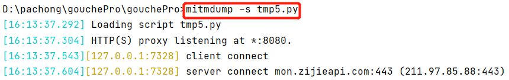
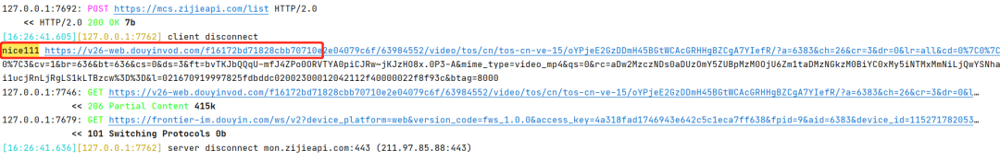
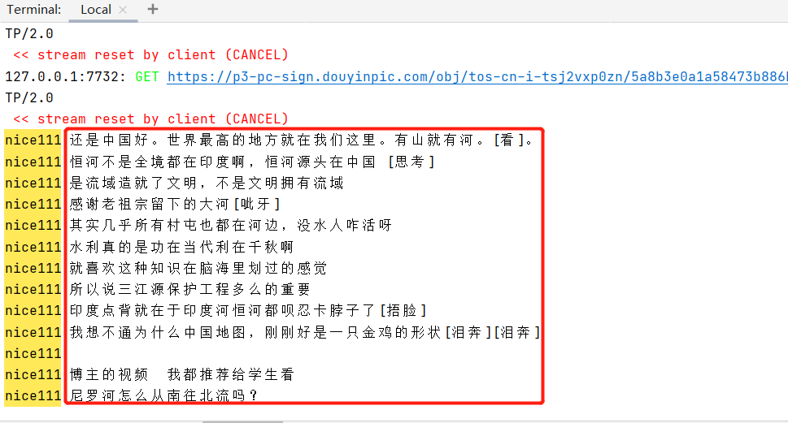
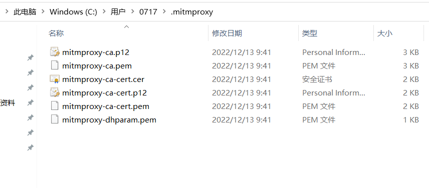
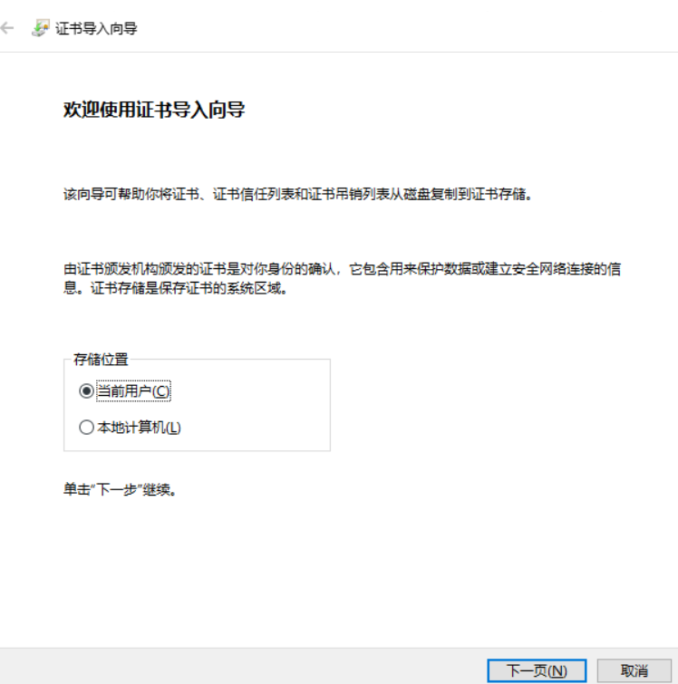
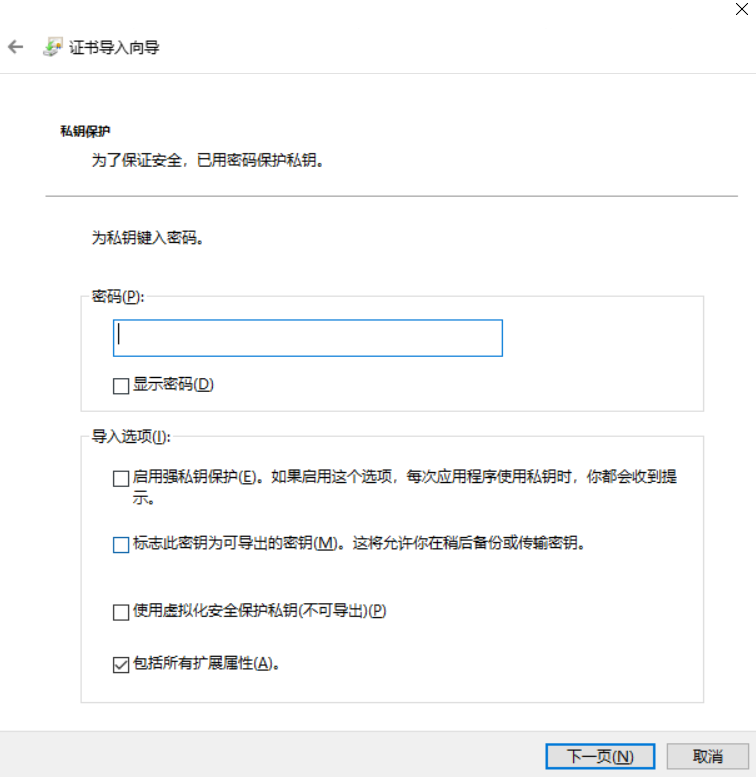
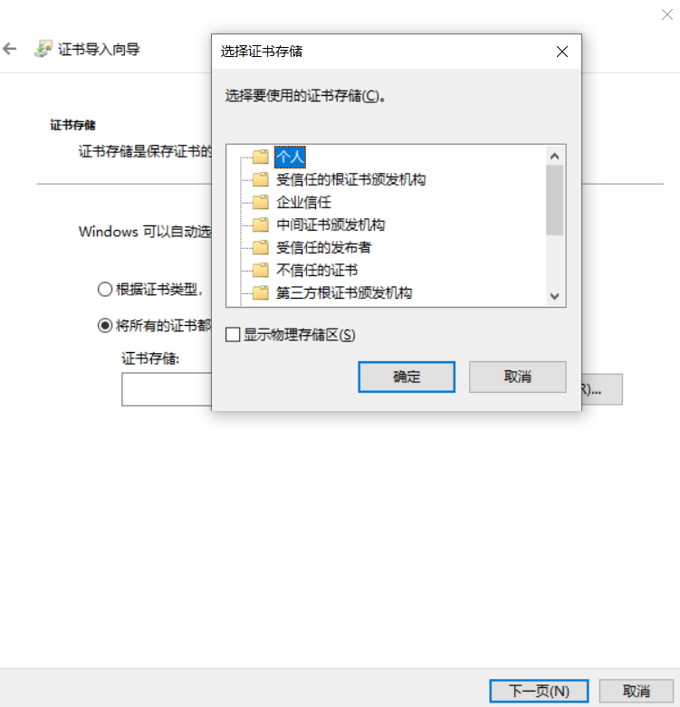
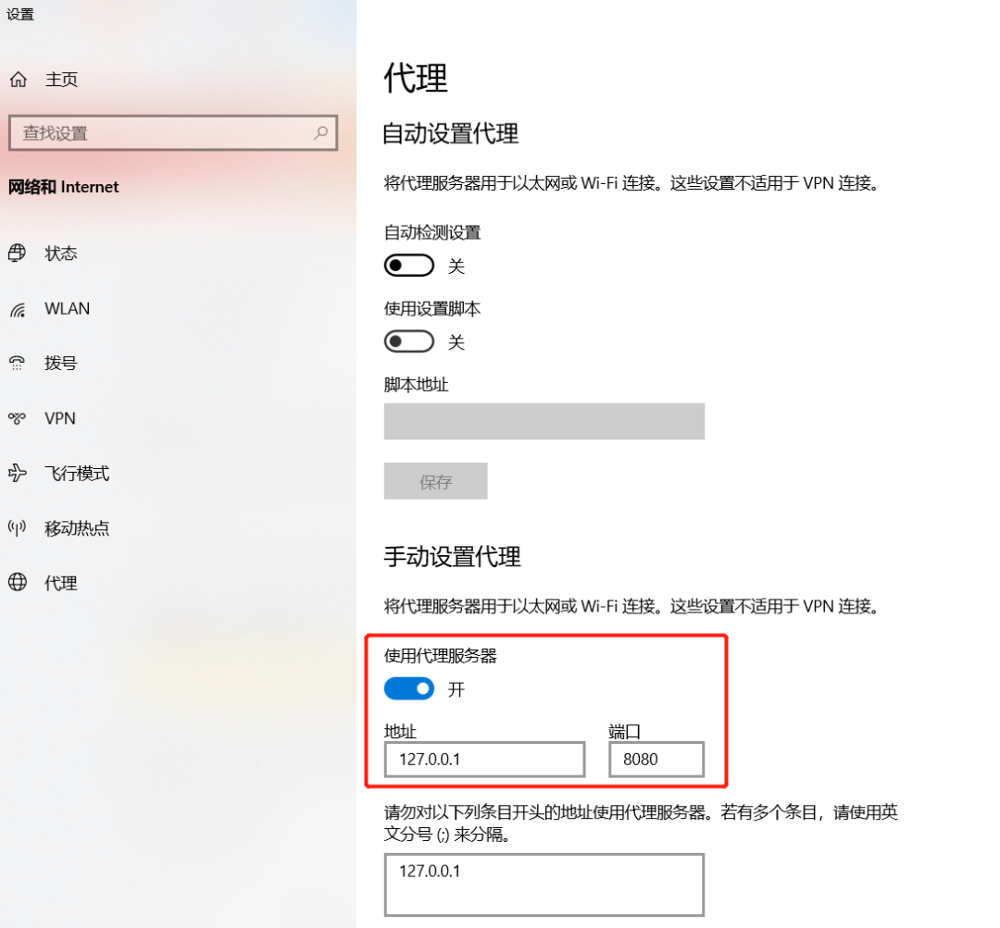
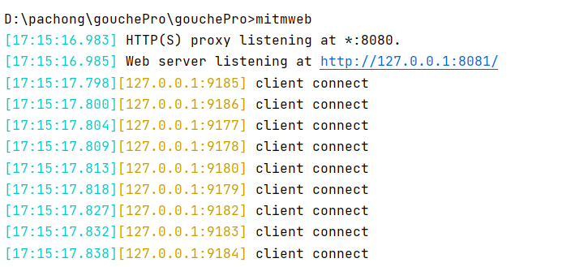
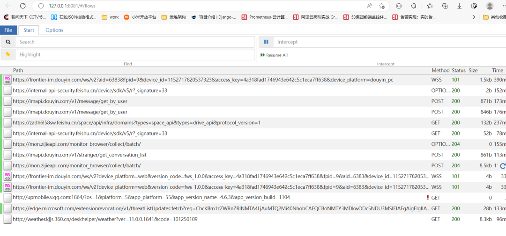

Python<br />众所周知，某音短视频是没有提供下载链接的，<br />微信视频号也没下载链接，但就想下载下来，还有视频下面的评论也想拿到，那要怎么办呢？<br />其实播放链接和评论是可以拿到的
<a name="UZhVZ"></a>
### 抓包
通过 mitmproxy 进行抓包<br />在 windows 上直接使用 pip 安装即可
> 先看效果，代理配置和证书安装放到最后。

它是一个抓包工具，支持python脚本：
```bash
mitmdump -s test.py
#安装mitmproxy完就有mitmdump命令
```
通过该抓包工具，可以获取所有链接。<br />链接是有特征的，比如

- 某音视频链接一般匹配web.douyinvod.com
- 微信视频号匹配video.qq.com
- 某音视频下的评论匹配v1/web/comment/list

所以要下载哪个，替换 if 中的匹配条件就好了：
```python
#匹配某音短视频的评论
import json
def response(flow):
    if 'v1/web/comment/list' in flow.request.url:
        for comment in json.loads(flow.response.text)['comments']:
            print('nice111',comment['text'])
```
在某音发布了一个视频，一直想把它下载下来<br /><br />那就执行脚本
```python
def response(flow):
    if 'web.douyinvod.com' in flow.request.url:
        print('nice111',flow.request.url)
```
<br />刷新视频，就会出现视频链接<br /><br />可以使用 you-get 下载，或者通过脚本把链接写入文件，刷一个视频，脚本就自动把链接存储好。<br />这样就下载到本地了：<br /><br />微信公众号里的视频下载方法同样如此，换个条件即可
<a name="lJrXA"></a>
### 获取评论
同理，换汤不换药，替换 if 条件
```python
import json
def response(flow):
    if 'v1/web/comment/list' in flow.request.url:
        for comment in json.loads(flow.response.text)['comments']:
            print('nice111',comment['text'])
```
选择一个短视频，打开评论，出现数据<br /><br /><br />好了，剩下的就简单了！<br />最后再介绍环境配置，证书安装和配置代理的内容
<a name="ylfpb"></a>
### 安装证书
pip 安装 MitmProxy 后，还不能拦截到数据，这是因为没有安装证书和打开对应的监听窗口。<br />windows 平台的证书其实在装 mitmproxy 的时候系统已经自动下载了。<br />安装路径在 C:\Users\用户名\ .mitmproxy 下，p12 结尾的证书就是 windows 平台下的<br /><br />双击mitmproxy-ca.p12,进入证书导入向导。<br /><br />傻瓜式安装，下一步就行<br /><br />注意这里的密码填空就行了。<br />下一步将证书放入下列存储选项中，选择受信任的根证书颁发机构<br /><br />点击完成，证书就导入到当前用户\计算机的根证书存储里面了
<a name="OK6ak"></a>
### 设置代理
<br />打开代理，并且端口号为Proxy监听的端口号8080(手机端的安装配置与其类似)，这时候重启mitmweb，可以看到下图所示，抓到本机发出的请求flow(流)了<br /><br />
