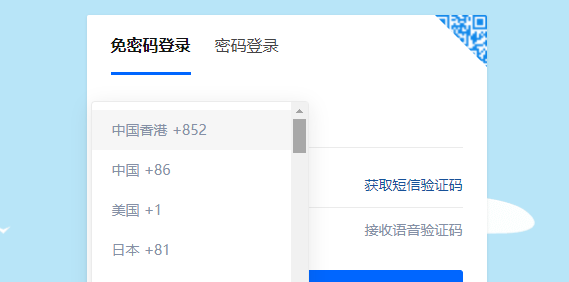
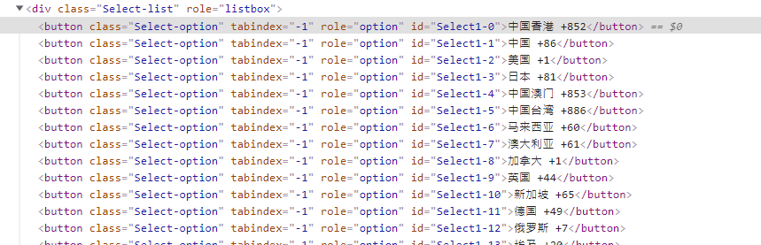
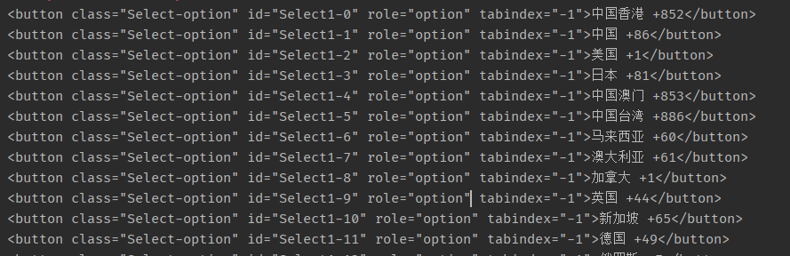

Python 爬虫<br />有这样的一个需求，收到国外手机号发来的信息，要知道这是哪个国家的手机号，这个国家的区号是多少？怎么批量操作？
```python
"phone":"+79000381454"
```
如何快速解决这个问题呢？<br />有那么几种方法，直接去网上搜，看看有没有现成的库可以用。手里如果有几十几百个手机号要确认， 那种在线的服务临时逐个手动查肯定不现实。不过你倒是可以做这样的一个在线服务，肯定有需求。<br />第二个能想到的是，直接爬。很多主流网站都提供有手机号注册功能， 他们一般都支持国外手机号注册。<br />第一个能想到的就是知乎<br /><br />它的注册页面有所有国家的区号<br />怎么爬最高效呢？<br />这有方法讲究，不需要去下载他的整个页面。因为只是需要这一部分的数据而已。就不要再去发个请求把整个页面下载下来解析了。<br />打开他的页面审查元素，直接拷贝父元素 `<div class="Select-list" role="listbox">`<br /><br />用 BeautifulSoup 去解析这个html文档字符串<br />先找到所有buttons元素，因为国家名和区号都是放在button里面。
```python
html = """ <div class="Select-list" role="listbox">..."""
from bs4 import BeautifulSoup
    soup = BeautifulSoup(html)
    buttons = soup.findAll("button")
    for button in buttons:
        print(button)
```

```python
text = button.text
country_name, area_code = text.split(" ")
print(country_name, area_code[1:] )
```
第二步直接提取里面的文本，并进行解析清洗
```python
text = button.text
country_name, area_code = text.split(" ")
print(country_name, area_code[1:] )
```
因为每一行都是统一规律的结构化数据，国家和区号之间有空格，所有直接通过空格将字符串进行分割成两部分。 区号前面都有一个“+”，我直接用切片从1个字符开始切，得到真正的区号。<br />最后输出
```python
中国香港 852
中国 86
美国 1
日本 81
中国澳门 853
中国台湾 886
马来西亚 60
澳大利亚 61
加拿大 1
英国 44
新加坡 65
德国 49
俄罗斯 7
埃及 20
南非 27
希腊 30
....
```
<a name="iZAPp"></a>
## 完整代码
```python
def extract_area_code():
	"""
	提取国家区号
	"""
	html = """
	div class="Select-list" role="listbox"><button class= 太长省略了。。。
	"""
	from bs4 import BeautifulSoup
	soup = BeautifulSoup(html)
	buttons = soup.findAll("button")
	area_codes = dict()
	for button in buttons:
		text = button.text
		country_name, area_code = text.split(" ")
		area_codes[country_name] = area_code[1:]
		
	import pprint
	pprint.pprint(area_codes)
	return area_codes
```
把他转换成json
```json
{
  '中国': '86',
  '中国台湾': '886',
  '中国澳门': '853',
  '中国香港': '852',
  '中非共和国': '236',
  '丹麦': '45',
  '乌克兰': '380',
  '乌兹别克斯坦': '998',
  '乌干达': '256',
  '乌拉圭': '598',
  '乍得': '235',
  '也门': '967',
  '亚美尼亚': '374',
  '以色列': '972',
  '伊拉克': '964',
  '伊朗': '98',
  '伯利兹': '501',
  '俄罗斯': '7',
  '保加利亚': '359',
  '关岛': '1671',
  '冈比亚': '220',
  '冰岛': '354',
  '几内亚': '224',
  '列支敦士登': '423',
  '刚果民主共和国': '243',
  '利比亚': '218',
  '利比里亚': '231',
  '加拿大': '1',
  '加纳': '233',
  '加蓬': '241',
  '匈牙利': '36',
  '南非': '27',
  '博茨瓦纳': '267',
  '卡塔尔': '974',
  '卢森堡': '352',
  '印度': '91',
  '印度尼西亚': '62',
  '厄瓜多尔': '593',
  '叙利亚': '963',
  '古巴': '53',
  '吉尔吉斯斯坦': '996',
  '吉布提': '253',
  '哈萨克斯坦': '7',
  '哥伦比亚': '57',
  '哥斯达黎加': '506',
  '喀麦隆': '237',
  '土库曼斯坦': '993',
  '土耳其': '90',
  '圣多美和普林西比': '239',
  '圣露西亚': '1758',
  '圣马力诺': '378',
  '圭亚那': '592',
  '坦桑尼亚': '255',
  '埃及': '20',
  '埃塞俄比亚': '251',
  '塔吉克斯坦': '992',
  '塞内加尔': '221',
  '塞尔维亚共和国': '381',
  '塞拉利昂': '232',
  '塞浦路斯': '357',
  '塞舌尔': '248',
  '墨西哥': '52',
  '多哥': '228',
  '多明尼加共和国': '1809',
  '奥地利': '43',
  '委内瑞拉': '58',
  '孟加拉国': '880',
  '安哥拉': '244',
  '安圭拉岛': '1264',
  '安提瓜和巴布达': '1268',
  '安道尔共和国': '376',
  '尼加拉瓜': '505',
  '尼日利亚': '234',
  '尼日尔': '227',
  '尼泊尔': '977',
  '巴哈马': '1242',
  '巴基斯坦': '92',
  '巴巴多斯': '1246',
  '巴布亚新几内亚': '675',
  '巴拉圭': '595',
  '巴拿马': '507',
  '巴林': '973',
  '巴西': '55',
  '布基纳法索': '226',
  '布隆迪': '257',
  '希腊': '30',
  '库克群岛': '682',
  '开曼群岛': '1345',
  '德国': '49',
  '意大利': '39',
  '所罗门群岛': '677',
  '拉脱维亚': '371',
  '挪威': '47',
  '捷克': '420',
  '摩尔多瓦': '373',
  '摩洛哥': '212',
  '摩纳哥': '377',
  '文莱': '673',
  '斐济': '679',
  '斯威士兰': '268',
  '斯洛伐克': '421',
  '斯洛文尼亚': '386',
  '斯里兰卡': '94',
  '新加坡': '65',
  '新西兰': '64',
  '日本': '81',
  '智利': '56',
  '柬埔寨': '855',
  '格林纳达': '1473',
  '格鲁吉亚': '995',
  '比利时': '32',
  '毛里塔尼亚': '222',
  '毛里求斯': '230',
  '汤加': '676',
  '沙特阿拉伯': '966',
  '法国': '33',
  '法属圭亚那': '594',
  '法属波利尼西亚': '689',
  '波兰': '48',
  '波多黎各': '1787',
  '泰国': '66',
  '津巴布韦': '263',
  '洪都拉斯': '504',
  '海地': '509',
  '澳大利亚': '61',
  '爱尔兰': '353',
  '爱沙尼亚': '372',
  '牙买加': '1876',
  '特立尼达和多巴哥': '1868',
  '玻利维亚': '591',
  '瑞典': '46',
  '瑞士': '41',
  '瓜地马拉': '502',
  '白俄罗斯': '375',
  '百慕大群岛': '1441',
  '直布罗陀': '350',
  '科威特': '965',
  '科特迪瓦': '225',
  '秘鲁': '51',
  '突尼斯': '216',
  '立陶宛': '370',
  '索马里': '252',
  '约旦': '962',
  '纳米比亚': '264',
  '缅甸': '95',
  '罗马尼亚': '40',
  '美国': '1',
  '老挝': '856',
  '肯尼亚': '254',
  '芬兰': '358',
  '苏丹': '249',
  '苏里南': '597',
  '英国': '44',
  '荷兰': '31',
  '莫桑比克': '258',
  '莱索托': '266',
  '菲律宾': '63',
  '萨尔瓦多': '503',
  '葡萄牙': '351',
  '蒙古': '976',
  '蒙特塞拉特岛': '1664',
  '西班牙': '34',
  '贝宁': '229',
  '赞比亚': '260',
  '越南': '84',
  '阿塞拜疆': '994',
  '阿富汗': '93',
  '阿尔及利亚': '213',
  '阿尔巴尼亚': '355',
  '阿拉伯联合酋长国': '971',
  '阿曼': '968',
  '阿根廷': '54',
  '阿森松岛': '247',
  '韩国': '82',
  '马尔代夫': '960',
  '马拉维': '265',
  '马提尼克': '596',
  '马来西亚': '60',
  '马耳他': '356',
  '马达加斯加': '261',
  '马里': '223',
  '黎巴嫩': '961'
 }
```
