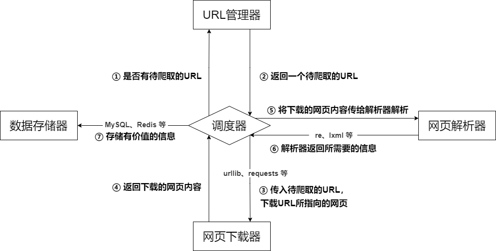
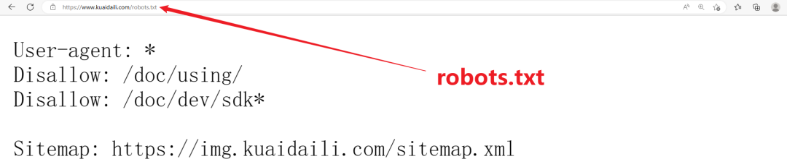

<a name="GumNm"></a>
## 爬虫概述
爬虫又称网络蜘蛛、网络机器人，网络爬虫按照系统结构和实现技术，大致可以分为以下几种类型：

- **通用网络爬虫（Scalable Web Crawler）**：抓取互联网上所有数据，爬取对象从一些种子 URL 扩充到整个 Web，主要为门户站点搜索引擎和大型 Web 服务提供商采集数据，是捜索引擎抓取系统（Baidu、Google、Yahoo 等）的重要组成部分。
- **聚焦网络爬虫（Focused Crawler）**：抓取互联网上特定数据，按照预先定义好的主题有选择地进行网页爬取的一种爬虫，将爬取的目标网页定位在与主题相关的页面中，选择性地爬取特定领域信息。
- **增量式网络爬虫（Incremental Web Crawler）**：抓取互联网上刚更新的数据，采取增量式更新和只爬取新产生的或者已经发生变化网页，它能够在一定程度上保证所爬取的页面是尽可能新的页面，减少时间和空间上的耗费。
- **深层网络爬虫（Deep Web Crawler）**：表层网页（Surface Web）是指传统搜索引擎可以索引的页面，以超链接可以到达的静态网页为主构成的 Web 页面；深层网页（Deep Web）是指不能通过静态链接获取的、隐藏在搜索表单后的，只有用户提交一些关键词才能获得的 Web 页面。在互联网中，深层页面的数量往往比表层页面的数量要多很多。

爬虫程序能模拟浏览器请求站点的行为，把站点返回的HTML代码/JSON数据/二进制数据（图片、视频、音频） 等爬取到本地，进而提取自己需要的数据，并存放起来使用，每一个程序都有自己的规则，网络爬虫也不例外，它会根据人们施加的规则去采集信息，这些规则为网络爬虫算法，根据使用者的目的，爬虫可以实现不同的功能，但所有爬虫的本质，都是方便人们在海量的互联网信息中找到并下载到自己要的那一类，提升信息获取效率。<br />爬虫采集的都是正常用户能浏览到的内容，而非所谓的 ”入侵服务器“，常说高水准者可 ”所见即所得“，意为只要是能看的内容就能爬取到，希望各位都能达到这个程度~
<a name="I03mB"></a>
## 爬虫的用途
现如今大数据时代已经到来，网络爬虫技术成为这个时代不可或缺的一部分，企业需要数据来分析用户行为、自己产品的不足之处以及竞争对手的信息等，而这一切的首要条件就是数据的采集。网络爬虫的价值其实就是数据的价值，在互联网社会中，数据是无价之宝，一切皆为数据，谁拥有了大量有用的数据，谁就拥有了决策的主动权。<br />网络爬虫目前主要的应用领域如：搜索引擎、数据采集、数据分析、信息聚合、竞品监控、认知智能、舆情分析等等，爬虫业务相关的公司数不胜数，如百度、谷歌、天眼查、企查查、新榜、飞瓜等等，在大数据时代，爬虫的应用范围广、需求大，简单举几个贴近生活的例子：

- **求职需求：**获取各个城市的招聘信息及薪资标准，方便筛选出适合自己的；
- **租房需求：**获取各个城市的租房信息，以便挑选出心仪的房源；
- **美食需求：**获取各个地方的好评美食，让吃货不迷路；
- **购物需求：**获取各个商家同一个商品的价格及折扣信息，让购物更实惠；
- **购车需求：**获取心仪车辆近年的价格波动，以及不同渠道各车型的价格，助力挑选爱车。
<a name="rh2vD"></a>
## URI 及 URL 的含义
URI（Uniform Resource Identifier），即统一资源标志符，URI（Uniform Resource Location），即统一资源定位符，例如 https://www.kuaidaili.com/ ，既是一个 URI，也是一个 URL，URL 是 URI 的子集，对于一般的网页链接，习惯称为 URL，一个 URL 的基本组成格式如下：
```
scheme://[username:password@]host[:port][/path][;parameters][?query][#fragment]
```
各部分含义如下：

1. **scheme：**获取资源使用的协议，例如 http、https、ftp 等，没有默认值，scheme 也被称为 protocol；
2. **username:password：**用户名与密码，某些情况下 URL 需要提供用户名和密码才能访问，这是个特殊的存在，一般访问 ftp 时会用到，显式的表明了访问资源的用户名与密码，但是可以不写，不写的话可能会让输入用户名密码；
3. **host：**主机地址，可以是域名或 IP 地址，例如 www.kuaidaili.com、112.66.251.209；
4. **port：**端口，服务器设定的服务端口，http 协议的默认端口为 80，https 协议的默认端口为 443，例如 https://www.kuaidaili.com/ 相当于 https://www.kuaidaili.com:443；
5. **path：**路径，指的是网络资源在服务器中的指定地址，通过 host:port 能找到主机，但是主机上文件很多，通过 path 则可以定位具体文件。例如 https://www.baidu.com/file/index.html，path 为 /file/index.html，表示访问 /file/index.html 这个文件；
6. **parameters：**参数，用来指定访问某个资源时的附加信息，主要作用就是像服务器提供额外的参数，用来表示本次请求的一些特性，例如 https://www.kuaidaili.com/dps;kspider，kspider 即参数，现在用的很少，大多数将 query 部分作为参数；
7. **query：**查询，由于查询某类资源，若多个查询，则用 & 隔开，通过 GET 方式请求的参数，例如：https://www.kuaidaili.com/dps/?username=kspider&type=spider，query 部分为 username=kspider&type=spider，指定了 username 为 kspider，type 为 spider；
8. **fragment：**片段，对资源描述的部分补充，用来标识次级资源，例如 https://www.kuaidaili.com/dps#kspider，kspider 即为 fragment 的值：
- 应用：单页面路由、HTML 锚点；
- `#` 有别于 `?`，`?` 后面的查询字符串会被网络请求带上服务器，而fragment 不会被发送的服务器；
- fragment 的改变不会触发浏览器刷新页面，但是会生成浏览历史；
- fragment 会被浏览器根据文件媒体类型（MIME type）进行对应的处理；
- 默认情况下 Google 的搜索引擎会忽略 `#` 及其后面的字符串，如果想被浏览引擎读取，需要在 `#` 后紧跟一个 `!` ，Google 会自动将其后面的内容转成查询字符串 `_escaped_fragment_` 的值，如 https://www.kuaidaili.com/dps#!kspider，转换后为 https://www.kuaidaili.com/dps?escaped_fragment=kspider。

由于爬虫的目标是获取资源，而资源都存储在某个主机上，所以爬虫爬取数据时必须要有一个目标的 URL 才可以获取数据，因此，URL 是爬虫获取数据的基本依据，准确理解 URL 的含义对爬虫学习有很大帮助。
<a name="R7zrg"></a>
## 爬虫的基本流程

1. **发起请求：**通过 URL 向服务器发起 Request 请求（同打开浏览器，输入网址浏览网页），请求可以包含额外的 headers、cookies、proxies、data 等信息，Python 提供了许多库，可以实现这个流程，完成 HTTP 请求操作，如 urllib、requests 等；
2. **获取响应内容：**如果服务器正常响应，会接收到 Response，Response 即请求的网页内容，包含 HTML（网页源代码），JSON 数据或者二进制的数据（视频、音频、图片）等；
3. ** 解析内容：**接收到响应内容后，需要对其进行解析，提取数据内容，如果是 HTML（网页源代码），则可以使用网页解析器进行解析，如正则表达式（re）、Beautiful Soup、pyquery、lxml 等；如果是 JSON 数据，则可以转换成 JSON 对象进行解析；如果是二进制的数据，则可以保存到文件进行进一步处理；
4. **保存数据：**可以保存到本地文件（txt、json、csv 等），或者保存到数据库（MySQL，Redis，MongoDB 等），也可以保存至远程服务器，如借助 SFTP 进行操作等。
<a name="XsMw2"></a>
## 爬虫的基本架构
爬虫的基本架构主要由五个部分组成，分别是爬虫调度器、URL 管理器、网页下载器、网页解析器、信息采集器：

1. **爬虫调度器：**相当于一台电脑的 CPU，主要负责调度 URL 管理器、下载器、解析器之间的协调工作，用于各个模块之间的通信，可以理解为爬虫的入口与核心，爬虫的执行策略在此模块进行定义；
2. **URL 管理器：**包括待爬取的 URL 地址和已爬取的 URL 地址，防止重复抓取 URL 和循环抓取 URL，实现 URL 管理器主要用三种方式，通过内存、数据库、缓存数据库来实现；
3. **网页下载器：**负责通过 URL 将网页进行下载，主要是进行相应的伪装处理模拟浏览器访问、下载网页，常用库为 urllib、requests 等；
4. **网页解析器：**负责对网页信息进行解析，可以按照要求提取出有用的信息，也可以根据 DOM 树的解析方式来解析。如正则表达式（re）、Beautiful Soup、pyquery、lxml 等，根据实际情况灵活使用；
5. **数据存储器：**负责将解析后的信息进行存储、显示等数据处理。


<a name="sN4Z4"></a>
## robots 协议
robots 协议也称爬虫协议、爬虫规则等，是指网站可建立一个 robots.txt 文件来告诉搜索引擎哪些页面可以抓取，哪些页面不能抓取，而搜索引擎则通过读取 robots.txt 文件来识别这个页面是否允许被抓取。但是，这个robots协议不是防火墙，也没有强制执行力，搜索引擎完全可以忽视 robots.txt 文件去抓取网页的快照**。** 如果想单独定义搜索引擎的漫游器访问子目录时的行为，那么可以将自定的设置合并到根目录下的 robots.txt，或者使用 robots 元数据（Metadata，又称元数据）。<br />robots 协议并不是一个规范，而只是约定俗成的，所以并不能保证网站的隐私，俗称 “君子协议”。<br />robots.txt 文件内容含义：

- User-agent: *, 这里的 * 代表的所有的搜索引擎种类，* 是一个通配符
- Disallow: /admin/, 这里定义是禁止爬取 admin 目录下面的目录
- Disallow: /require/, 这里定义是禁止爬取 require 目录下面的目录
- Disallow: /ABC/, 这里定义是禁止爬取 ABC 目录下面的目录
- Disallow: /cgi-bin/*.htm, 禁止访问 /cgi-bin/ 目录下的所有以 ".htm" 为后缀的 URL(包含子目录)
- Disallow: /*?*, 禁止访问网站中所有包含问号 (?) 的网址
- Disallow: /.jpg$, 禁止抓取网页所有的 .jpg 格式的图片
- Disallow:/ab/adc.html, 禁止爬取 ab 文件夹下面的 adc.html 文件
- Allow: /cgi-bin/, 这里定义是允许爬取 cgi-bin 目录下面的目录
- Allow: /tmp, 这里定义是允许爬取 tmp 的整个目录
- Allow: .htm$, 仅允许访问以 ".htm" 为后缀的 URL
- Allow: .gif$, 允许抓取网页和 gif 格式图片
- Sitemap: 网站地图, 告诉爬虫这个页面是网站地图

https://www.kuaidaili.com/<br />查看网站 robots 协议，网站 url 加上后缀 robotst.txt 即可，以快代理为例：<br />

- 禁止所有搜索引擎访问网站的任何部分
- 禁止爬取 /doc/using/ 目录下面的目录
- 禁止爬取 /doc/dev 目录下面所有以 sdk 开头的目录及文件
