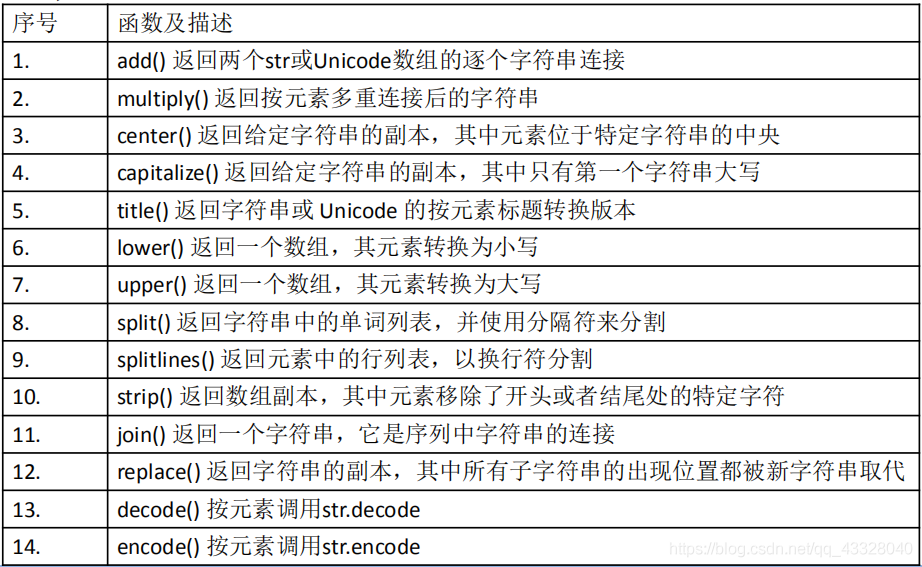

Python Numpy
<a name="Q9j0e"></a>
## 1、数组上的迭代
NumPy 包含一个迭代器对象`numpy.nditer`。它是一个有效的多维迭代器对象，可以用于在数组上进行迭代。数组的每个元素可使用 Python 的标准Iterator接口来访问。
```python
import numpy as np
a = np.arange(0, 60, 5)
a = a.reshape(3, 4)
print(a)
for x in np.nditer(a):
    print(x)
```
```python
[[ 0  5 10 15]
 [20 25 30 35]
 [40 45 50 55]]
0
5
10
15
20
25
30
35
40
45
50
55
```
如果两个数组是可广播的，nditer组合对象能够同时迭代它们。假设数 组a具有维度 3X4，并且存在维度为 1X4 的另一个数组b，则使用以下类型的迭代器(数组b被广播到a的大小)。
```python
import numpy as np
a = np.arange(0, 60, 5)
a = a.reshape(3, 4)
print(a)
b = np.array([1, 2, 3, 4], dtype=int)
print(b)
for x, y in np.nditer([a, b]):
    print(x, y)
```
```python
[[ 0  5 10 15]
 [20 25 30 35]
 [40 45 50 55]]
[1 2 3 4]
0 1
5 2
10 3
15 4
20 1
25 2
30 3
35 4
40 1
45 2
50 3
55 4
```
<a name="gazqw"></a>
## 2、数组形状修改函数
<a name="eFsM2"></a>
### **1、**`**ndarray.reshape**`
函数在不改变数据的条件下修改形状，参数如下：
```python
ndarray.reshape(arr, newshape, order)
```
```python
import numpy as np
a = np.arange(8)
print(a)
b = a.reshape(4, 2)
print(b)
```
```python
[0 1 2 3 4 5 6 7]
[[0 1]
 [2 3]
 [4 5]
 [6 7]]
```
<a name="rWCnz"></a>
### **2、**`**ndarray.flat**`
函数返回数组上的一维迭代器，行为类似 Python 内建的迭代器。
```python
import numpy as np
a = np.arange(0, 16, 2).reshape(2, 4)
print(a)
# 返回展开数组中的下标的对应元素
print(list(a.flat))
```
```python
[[ 0  2  4  6]
 [ 8 10 12 14]]
[0, 2, 4, 6, 8, 10, 12, 14]
```
<a name="cfjnu"></a>
### **3、**`**ndarray.flatten**`
函数返回折叠为一维的数组副本，函数接受下列参数：
```python
ndarray.flatten(order)
```
其中：

- order：‘C’ — 按行，‘F’ — 按列，‘A’ — 原顺序，‘k’ —元素在内存中的出现顺序。
```python
import numpy as np
a = np.arange(8).reshape(2, 4)
print(a)
# default is column-major
print(a.flatten())
print(a.flatten(order='F'))
```
```python
[[0 1 2 3]
 [4 5 6 7]]
[0 1 2 3 4 5 6 7]
[0 4 1 5 2 6 3 7]
```
<a name="ocLj8"></a>
## 3、数组翻转操作函数
<a name="dJ9TC"></a>
### **1、**`**numpy.transpose**`
函数翻转给定数组的维度。如果可能的话它会返回一个视图。函数接受下列参数：
```python
numpy.transpose(arr, axes)
```
其中：

- arr：要转置的数组
- axes：整数的列表，对应维度，通常所有维度都会翻转。
```python
import numpy as np
a = np.arange(24).reshape(2, 3, 4)
print(a)
b = np.array(np.transpose(a))
print(b)
print(b.shape)
```
```python
[[[ 0  1  2  3]
  [ 4  5  6  7]
  [ 8  9 10 11]]

 [[12 13 14 15]
  [16 17 18 19]
  [20 21 22 23]]]
[[[ 0 12]
  [ 4 16]
  [ 8 20]]

 [[ 1 13]
  [ 5 17]
  [ 9 21]]

 [[ 2 14]
  [ 6 18]
  [10 22]]

 [[ 3 15]
  [ 7 19]
  [11 23]]]
(4, 3, 2)
```
```python
b = np.array(np.transpose(a, (1, 0, 2)))
print(b)
print(b.shape
```
```python
[[[ 0  1  2  3]
  [12 13 14 15]]

 [[ 4  5  6  7]
  [16 17 18 19]]

 [[ 8  9 10 11]
  [20 21 22 23]]]
(3, 2, 4)
```
<a name="kK6mN"></a>
### **2、**`**numpy.ndarray.T**`
该函数属于ndarray类，行为类似于`numpy.transpose`。
```python
import numpy as np
a = np.arange(12).reshape(3, 4)
print(a)
print(a.T)
```
```python
[[ 0  1  2  3]
 [ 4  5  6  7]
 [ 8  9 10 11]]
[[ 0  4  8]
 [ 1  5  9]
 [ 2  6 10]
 [ 3  7 11]]
```
<a name="ljZqd"></a>
### **3、**`**numpy.swapaxes**`
函数交换数组的两个轴。这个函数接受下列参数：
```python
numpy.swapaxes(arr, axis1, axis2)
```
其中：

- arr：要交换其轴的输入数组
- axis1：对应第一个轴的整数
- axis2：对应第二个轴的整数
```python
import numpy as np
a = np.arange(8).reshape(2, 2, 2)
print(a)
print(np.swapaxes(a, 2, 0))
```
```python
[[[0 1]
  [2 3]]

 [[4 5]
  [6 7]]]
[[[0 4]
  [2 6]]

 [[1 5]
  [3 7]]]
```
<a name="URhc7"></a>
### **4、**`**numpy.rollaxis**`
`numpy.rollaxis()` 函数向后滚动特定的轴，直到一个特定位置。这个函数接受三个参数：
```python
numpy.rollaxis(arr, axis, start)
```
其中：

- arr：输入数组
- axis：要向后滚动的轴，其它轴的相对位置不会改变
- start：默认为零，表示完整的滚动。会滚动到特定位置。
```python
import numpy as np
a = np.arange(8).reshape(2,2,2)
print(a)
print(np.rollaxis(a,2))
print(np.rollaxis(a,2,1))
```
```python
[[[0 1]
  [2 3]]

 [[4 5]
  [6 7]]]
[[[0 2]
  [4 6]]

 [[1 3]
  [5 7]]]
[[[0 2]
  [1 3]]

 [[4 6]
  [5 7]]]

```
<a name="dkm04"></a>
## 4、数组修改维度函数
<a name="HqQQw"></a>
### **1、**`**numpy.broadcast_to**`
函数将数组广播到新形状。它在原始数组上返回只 读视图。它通常不连续。如果新形状不符合 NumPy 的广播规则，该函数可能会抛出ValueError。该函数接受以下参数：
```python
numpy.broadcast_to(array, shape, subok)
```
```python
import numpy as np
a = np.arange(4).reshape(1,4)
print(a)
print(np.broadcast_to(a,(4,4)))
```
```python
[[0 1 2 3]]
[[0 1 2 3]
 [0 1 2 3]
 [0 1 2 3]
 [0 1 2 3]]
```
<a name="RaAu8"></a>
### **2、**`**numpy.expand_dims**`
函数通过在指定位置插入新的轴来扩展数组形状。该函数需要两个参数：
```python
numpy.expand_dims(arr, axis)
```
其中：

- arr：输入数组
- axis：新轴插入的位置
```python
import numpy as np
x = np.array(([1, 2], [3, 4]))
print(x)
y = np.expand_dims(x, axis=0)
print(y)
print(x.shape, y.shape)
y = np.expand_dims(x, axis=1)
print(y)
print(x.ndim, y.ndim)
print(x.shape, y.shape)
```
```python
[[1 2]
 [3 4]]
[[[1 2]
  [3 4]]]
(2, 2) (1, 2, 2)
[[[1 2]]

 [[3 4]]]
2 3
(2, 2) (2, 1, 2)
```
<a name="cS4Wu"></a>
### **3、**`**numpy.squeeze**`
函数从给定数组的形状中删除一维条目。此函数需要两 个参数。
```python
numpy.squeeze(arr, axis)
```
其中：

- arr：输入数组
- axis：整数或整数元组，用于选择形状中单一维度条目的子集
```python
import numpy as np
x = np.arange(9).reshape(1, 3, 3)
print(x)
y = np.squeeze(x)
print(y)
print(x.shape, y.shape)
```
```python
[[[0 1 2]
  [3 4 5]
  [6 7 8]]]
[[0 1 2]
 [3 4 5]
 [6 7 8]]
(1, 3, 3) (3, 3)
```
<a name="aATLj"></a>
## 5、数组的连接操作
NumPy中数组的连接函数主要有如下四个：

- concatenate 沿着现存的轴连接数据序列
- stack 沿着新轴连接数组序列
- hstack 水平堆叠序列中的数组(列方向)
- vstack 竖直堆叠序列中的数组(行方向)
<a name="SHFcS"></a>
### **1、**`**numpy.stack**`
函数沿新轴连接数组序列，需要提供以下参数：
```python
numpy.stack(arrays, axis)
```
其中：

- `arrays`：相同形状的数组序列
- `axis`：返回数组中的轴，输入数组沿着它来堆叠
```python
import numpy as np
a = np.array([[1,2],[3,4]])
print(a)
b = np.array([[5,6],[7,8]])
print(b)
print(np.stack((a,b),0))
print(np.stack((a,b),1))
```
```python
[[1 2]
 [3 4]]
[[5 6]
 [7 8]]
[[[1 2]
  [3 4]]

 [[5 6]
  [7 8]]]
[[[1 2]
  [5 6]]

 [[3 4]
  [7 8]]]
```
<a name="teazX"></a>
### **2、**`**numpy.hstack**`
是`numpy.stack()`函数的变体，通过堆叠来生成水平的单个数组。
```python
import numpy as np
a = np.array([[1, 2], [3, 4]])
print(a)
b = np.array([[5, 6], [7, 8]])
print(b)
print('水平堆叠：')
c = np.hstack((a, b))
print(c)
```
```python
[[1 2]
 [3 4]]
[[5 6]
 [7 8]]
水平堆叠：
[[1 2 5 6]
 [3 4 7 8]]
```
<a name="WEK1M"></a>
### **3、**`**numpy.vstack**`
是`numpy.stack()`函数的变体，通过堆叠来生成竖直的单个数组。
```python
import numpy as np
a = np.array([[1, 2], [3, 4]])
print(a)
b = np.array([[5, 6], [7, 8]])
print(b)
print('竖直堆叠：')
c = np.vstack((a, b))
print(c)
```
```python
[[1 2]
 [3 4]]
[[5 6]
 [7 8]]
竖直堆叠：
[[1 2]
 [3 4]
 [5 6]
 [7 8]]
```
<a name="Q8Whq"></a>
### **4、**`**numpy.concatenate**`
函数用于沿指定轴连接相同形状的两个或多个数组。该函数接受以下参数。
```python
numpy.concatenate((a1, a2, …), axis)
```
其中：

- a1, a2, ...：相同类型的数组序列
- axis：沿着它连接数组的轴，默认为 0
```python
import numpy as np
a = np.array([[1,2],[3,4]])
print(a)
b = np.array([[5,6],[7,8]])
print(b)
print(np.concatenate((a,b)))
print(np.concatenate((a,b),axis = 1))
```
```python
[[1 2]
 [3 4]]
[[5 6]
 [7 8]]
[[1 2]
 [3 4]
 [5 6]
 [7 8]]
[[1 2 5 6]
 [3 4 7 8]]
```
<a name="Zk8iL"></a>
## 6、数组的分割操作
NumPy中数组的数组分割函数主要如下：

- split 将一个数组分割为多个子数组
- hsplit 将一个数组水平分割为多个子数组(按列)
- vsplit 将一个数组竖直分割为多个子数组(按行)
<a name="P73t0"></a>
### **1、**`**numpy.split**`
该函数沿特定的轴将数组分割为子数组。函数接受三个参数：
```python
numpy.split(ary, indices_or_sections, axis)
```
其中：

- `ary`：被分割的输入数组
- `indices_or_sections`：可以是整数，表明要从输入数组创建的，等大小的子数组的数量。如果此参数是一维数组，则其元素表明要创建新子数组的点。
- `axis`：默认为 0
```python
import numpy as np
a = np.arange(9)
print(a)
print('将数组分为三个大小相等的子数组：')
b = np.split(a,3)
print(b)
print('将数组在一维数组中表明的位置分割：')
b = np.split(a,[4,7])
print(b)
```
```python
[0 1 2 3 4 5 6 7 8]
将数组分为三个大小相等的子数组：
[array([0, 1, 2]), 
array([3, 4, 5]), 
array([6, 7, 8])]
将数组在一维数组中表明的位置分割：
[array([0, 1, 2, 3]), 
array([4, 5, 6]), 
array([7, 8])]
```
<a name="bt8zR"></a>
### **2、**`**numpy.hsplit**`
`split()`函数的特例，其中轴为 1 表示水平分割。
```python
import numpy as np
a = np.arange(16).reshape(4,4)
print(a)
print('水平分割：')
b = np.hsplit(a,2)
print(b)
```
```python
[[ 0  1  2  3]
 [ 4  5  6  7]
 [ 8  9 10 11]
 [12 13 14 15]]
水平分割：
[array([[ 0,  1],
       [ 4,  5],
       [ 8,  9],
       [12, 13]]), 
 array([[ 2,  3],
       [ 6,  7],
       [10, 11],
       [14, 15]])]
```
<a name="WoQsO"></a>
### **3、**`**numpy.vsplit**`
`split()`函数的特例，其中轴为 0 表示竖直分割，无论输入数组的维度是什么。
```python
import numpy as np
a = np.arange(16).reshape(4,4)
print(a)
print('竖直分割：')
b = np.vsplit(a,2)
print(b)
```
```python
[[ 0  1  2  3]
 [ 4  5  6  7]
 [ 8  9 10 11]
 [12 13 14 15]]
竖直分割：
[array([[0, 1, 2, 3],
       [4, 5, 6, 7]]),
 array([[ 8,  9, 10, 11],
       [12, 13, 14, 15]])]
```
<a name="DzOrV"></a>
## 7、数组元素操作
NumPy中数组操作函数主要如下：

- resize 返回指定形状的新数组
- append 将值添加到数组末尾
- insert 沿指定轴将值插入到指定下标之前
- delete 返回删掉某个轴的子数组的新数组
- unique 寻找数组内的唯一元素
<a name="ypPA1"></a>
### **1、**`**numpy.resize**`
函数返回指定大小的新数组。如果新大小大于原始大小，则包含原始数组中的元素的重复副本。如果小于则去掉原始数组的部分数据。该函数接受以下参数：
```python
numpy.resize(arr, shape)
```
其中：

- `arr`：要修改大小的输入数组
- `shape`：返回数组的新形状
```python
import numpy as np
a = np.array([[1,2,3],[4,5,6]])
print(a)
print(a.shape)
b = np.resize(a, (3,2))
print(b)
print(b.shape)
print('修改第二个数组的大小：')
b = np.resize(a,(3,3))
print(b)
print('修改第三个数组的大小：')
b = np.resize(a,(2,2))
print(b)
```
```python
[[1 2 3]
 [4 5 6]]
(2, 3)
[[1 2]
 [3 4]
 [5 6]]
(3, 2)
修改第二个数组的大小：
[[1 2 3]
 [4 5 6]
 [1 2 3]]
修改第三个数组的大小：
[[1 2]
 [3 4]]
```
<a name="MOPvc"></a>
### **2、**`**numpy.append**`
函数在输入数组的末尾添加值。附加操作不是原地的，而是分配新的数组。此外，输入数组的维度必须匹配否则将生成ValueError。函数接受下列函数：
```python
numpy.append(arr, values, axis)
```
其中：

- `arr`：输入数组
- `values`：要向arr添加的值，比如和arr形状相同(除了要添加的轴)
- `axis`：沿着它完成操作的轴。如果没有提供，两个参数都会被展开。
```python
import numpy as np
a = np.array([[1,2,3],[4,5,6]])
print(a)
print(np.append(a, [[7,8,9]],axis = 0))
print(np.append(a, [[5,5,5],[7,8,9]],axis = 1))
```
```python
[[1 2 3]
 [4 5 6]]
[[1 2 3]
 [4 5 6]
 [7 8 9]]
[[1 2 3 5 5 5]
 [4 5 6 7 8 9]]
```
<a name="A674z"></a>
### **3、**`**numpy.insert**`
函数在给定索引之前，沿给定轴在输入数组中插入值。如果值的类型转换为要插入，则它与输入数组不同。插入没有原地的，函数会返回一个新数组。此外，如果未提供轴，则输入数组会被展开。<br />`insert()`函数接受以下参数：
```python
numpy.insert(arr, obj, values, axis)
```
其中：

- `arr`：输入数组
- `obj`：在其之前插入值的索引
- `values`：要插入的值
- `axis`：沿着它插入的轴
```python
import numpy as np
a = np.array([[1,2],[3,4],[5,6]])
print(a)
print(np.insert(a,3,[11,12]))
print(np.insert(a,1,[11],axis = 0))
print(np.insert(a,1,[11],axis = 1))
```
```python
[[1 2]
 [3 4]
 [5 6]]
[ 1  2  3 11 12  4  5  6]
[[ 1  2]
 [11 11]
 [ 3  4]
 [ 5  6]]
[[ 1 11  2]
 [ 3 11  4]
 [ 5 11  6]]
```
<a name="d3uCn"></a>
### **4、**`**numpy.delete**`
函数返回从输入数组中删除指定子数组的新数组。与`insert()`函数的情况一样，如果未提供轴参数，则输入数组将展开。该函 数接受以下参数：
```python
Numpy.delete(arr, obj, axis)
```
其中：

- `arr`：输入数组
- `obj`：可以被切片，整数或者整数数组，表明要从输入数组删除的子数组
- `axis`：沿着它删除给定子数组的轴
```python
import numpy as np
a = np.array([[1,2],[3,4],[5,6]])
print(a)
print(np.delete(a,5))
print(np.delete(a,1,axis = 1))
```
```python
[[1 2]
 [3 4]
 [5 6]]
[1 2 3 4 5]
[[1]
 [3]
 [5]]
```
<a name="O1A6i"></a>
### **5、**`**numpy.unique**`
函数返回输入数组中的去重元素数组。该函数能够返回一个元组，包含去重数组和相关索引的数组。索引的性质取决于函数调用中返回参数的类型。
```python
numpy.unique(arr, return_index, return_inverse, return_counts)
```
其中：<br />• `arr`：输入数组，如果不是一维数组则会展开  <br />• `return_index`：如果为true，返回输入数组中的元素下标  <br />• `return_inverse`：如果为true，返回去重数组的下标，它可以用于重构输入数组  <br />• `return_counts`：如果为true，返回去重数组中的元素在原数组中的出现次数
```python
import numpy as np
a = np.array([5,2,6,2,7,5,6,8,2,9])
u = np.unique(a)
print(u)
u,indices = np.unique(a, return_index = True)
print(u, indices)
u,indices = np.unique(a,return_inverse = True)
print(u, indices)
u,indices = np.unique(a,return_counts = True)
print(u, indices)
```
```python
[2 5 6 7 8 9][2 5 6 7 8 9] 
[1 0 2 4 7 9][2 5 6 7 8 9] 
[1 0 2 0 3 1 2 4 0 5][2 5 6 7 8 9] 
[3 2 2 1 1 1]
```
<a name="LaCd9"></a>
## 8、NumPy - 字符串函数
以下函数用于对`dtype`为`numpy.string_`或`numpy.unicode_`的数组执行向量 化字符串操作。它们基于 Python 内置库中的标准字符串函数。字符数组类(`numpy.char`)中定义<br />
```python
import numpy as np
print(np.char.add(['hello'],[' xyz']))
print(np.char.add(['hello', 'hi'],[' abc', ' xyz']))
print(np.char.multiply('Hello ',3))
print(np.char.center('hello', 20,fillchar = '*'))
print(np.char.capitalize('hello world'))
print(np.char.title('hello how are you?'))
print(np.char.lower(['HELLO','WORLD']))
print(np.char.lower('HELLO'))
print(np.char.upper('hello'))
print(np.char.upper(['hello','world']))
print(np.char.split ('hello how are you?'))
print(np.char.split ('YiibaiPoint,Hyderabad,Telangana', sep = ','))
print(np.char.splitlines('hello\nhow are you?'))
print(np.char.splitlines('hello\rhow are you?'))
print(np.char.strip('ashok arora','a'))
print(np.char.strip(['arora','admin','java'],'a'))
print(np.char.join(':','dmy'))
print(np.char.join([':','-'],['dmy','ymd']))
print(np.char.replace ('He is a good boy', 'is', 'was'))
a = np.char.encode('hello', 'cp500')
print(a)
print(np.char.decode(a,'cp500'))
```
```python
['hello xyz']
['hello abc' 'hi xyz']
Hello Hello Hello 
*******hello********
Hello world
Hello How Are You?
['hello' 'world']
hello
HELLO
['HELLO' 'WORLD']
['hello', 'how', 'are', 'you?']
['YiibaiPoint', 'Hyderabad', 'Telangana']
['hello', 'how are you?']
['hello', 'how are you?']
shok aror
['ror' 'dmin' 'jav']
d:m:y
['d:m:y' 'y-m-d']
He was a good boy
b'\x88\x85\x93\x93\x96'
hello
```
<a name="Tg8it"></a>
## 9、NumPy - 算数函数
NumPy 包含大量的各种数学运算功能。NumPy 提供标准的三角函数，算术运算的函数，复数处理函数等。

- 三角函数
- 舍入函数
- 算数函数
<a name="zwYR2"></a>
### **1、NumPy -三角函数**
NumPy 拥有标准的三角函数，它为弧度制单位的给定角度返回三角函 数比值。`arcsin`，`arccos`，和`arctan`函数返回给定角度的sin，cos和tan的反三角函数。这些函数的结果可以通过 `numpy.degrees()`函数通过将弧度制 转换为角度制来验证。
```python
import numpy as np
a = np.array([0,30,45,60,90])
# 通过乘 pi/180 转化为弧度
print(np.sin(a*np.pi/180))
print(np.cos(a*np.pi/180))
print(np.tan(a*np.pi/180))
```
```python
[ 0.          0.5         0.70710678  0.8660254   1.        ]
[  1.00000000e+00   8.66025404e-01   7.07106781e-01   5.00000000e-01
   6.12323400e-17]
[  0.00000000e+00   5.77350269e-01   1.00000000e+00   1.73205081e+00
   1.63312394e+16]
```
<a name="pv3Cr"></a>
### **2、NumPy -舍入函数**

- `numpy.around()`这个函数返回四舍五入到所需精度的值
   - `numpy.around(a,decimals)` – a 输入数组
   - `decimals` 要舍入的小数位数。默认值为0。如果为负，整数将四舍五入到小数点左侧的位置
- `numpy.floor()` 函数返回不大于输入参数的最大整数。
- `numpy.ceil()` 函数返回输入值的上限，大于输入参数的最小整数
```python
import numpy as np
a = np.array([1.0, 5.55, 123, 0.567, 25.532])
print(np.around(a))
print(np.around(a, decimals=1))
print(np.floor(a))
print(np.ceil(a))
```
```python
[   1.    6.  123.    1.   26.]
[   1.     5.6  123.     0.6   25.5]
[   1.    5.  123.    0.   25.]
[   1.    6.  123.    1.   26.]
```
<a name="S9PUF"></a>
### **3、NumPy - 算数运算**
用于执行算术运算(如`add()`，`subtract()`，`multiply()`和`divide()`)的输入数组必须具有相同的形状或符合数组广播规则。

- `numpy.reciprocal()` 函数返回参数逐元素的倒数。
- `numpy.power()` 函数将第一个输入数组中的元素作为底数，计算它与第二个输入数组中相应元素的幂。
- `numpy.mod()` 函数返回输入数组中相应元素的除法余数
```python
import numpy as np
a = np.array([0.25, 2, 1, 0.2, 100])
print(np.reciprocal(a))
print(np.power(a,2))
a = np.array([10,20,30])
b = np.array([3,5,7])
print(np.mod(a,b))
```
```python
[ 4.    0.5   1.    5.    0.01]
[  6.25000000e-02   4.00000000e+00   1.00000000e+00
   4.00000000e-02.  1.00000000e+04]
[1 0 2]
```
<a name="MbFdG"></a>
### **4、NumPy - 统计函数**
NumPy 有很多有用的统计函数，用于从数组中给定的元素中查找最小，最大，百分标准差和方差等。

- `numpy.amin()` , `numpy.amax()` 从给定数组中的元素沿指定轴返回最小值和最大值。
- `numpy.ptp()` 函数返回沿轴的值的范围(最大值 - 最小值)。
- `numpy.percentile()` 表示小于这个值得观察值占某个百分比
- `numpy.percentile(a, q, axis)`
   - a 输入数组;
   - q 要计算的百分位数，在 0 ~ 100 之间;
   - axis 沿着它计算百分位数的轴
- `numpy.median()` 返回数据样本的中位数。
- `numpy.mean()` 沿轴返回数组中元素的算术平均值。
- `numpy.average()` 返回由每个分量乘以反映其重要性的因子得到的加权平均值
```python
import numpy as np
a = np.array([[3,7,5],[8,4,3],[2,4,9]])
print(np.amin(a,1))
print(np.amax(a,1))
print(np.ptp(a))
print(np.percentile(a,50))
print(np.median(a))
print(np.mean(a))
print(np.average(a))
print(np.std([1,2,3,4])) #返回数组标准差
print(np.var([1,2,3,4])) #返回数组方差
```
```python
[3 3 2]
[7 8 9]
7
4.0
4.0
5.0
5.0
1.11803398875
1.25
```
<a name="Mdoaj"></a>
## 10、排序、搜索和计数函数
NumPy中提供了各种排序相关功能。

- `numpy.sort()` 函数返回输入数组的排序副本。`numpy.sort(a, axis, kind, order)`
   - a 要排序的数组;
   - axis 沿着它排序数组的轴，如果没有数组会被展开，沿着最后的轴排序;
   - kind 默认为'quicksort'(快速排序);
   - order 如果数组包含字段，则是要排序的字段
- `numpy.argsort()` 函数对输入数组沿给定轴执行间接排序，并使用指定排序类型返回数据的索引数组。这个索引数组用于构造排序后的数组。
- `numpy.lexsort()` 函数使用键序列执行间接排序。键可以看作是电子表格中的一列。该函数返回一个索引数组，使用它可以获得排序数据。注意，最后一个键恰好是 sort 的主键。
- `numpy.argmax()` 和 `numpy.argmin()` 这两个函数分别沿给定轴返回最大和最小元素的索引。
- `numpy.nonzero()` 函数返回输入数组中非零元素的索引。
- `numpy.where()` 函数返回输入数组中满足给定条件的元素的索引。
- `numpy.extract()` 函数返回满足任何条件的元素。
```python
import numpy as np
a = np.array([[3, 7, 3, 1], [9, 7, 8, 7]])
print(np.sort(a))
print(np.argsort(a))
print(np.argmax(a))
print(np.argmin(a))
print(np.nonzero(a))
print(np.where(a > 3))
nm = ('raju', 'anil', 'ravi', 'amar')
dv = ('f.y.', 's.y.', 's.y.', 'f.y.')
print(np.lexsort((dv, nm)))
```
```python
[[1 3 3 7]
 [7 7 8 9]]
[[3 0 2 1]
 [1 3 2 0]]
4
3
(array([0, 0, 0, 0, 1, 1, 1, 1], dtype=int64), 
array([0, 1, 2, 3, 0, 1, 2, 3], dtype=int64))
(array([0, 1, 1, 1, 1], dtype=int64), 
array([1, 0, 1, 2, 3], dtype=int64))
[3 1 0 2]
```
<a name="V7k5O"></a>
## 11、IO文件操作
ndarray对象可以保存到磁盘文件并从磁盘文件加载。可用的 IO 功能有：

- `numpy.save()` 文件将输入数组存储在具有npy扩展名的磁盘文件中。
- `numpy.load()` 从npy文件中重建数组。
- `numpy.savetxt()`和`numpy.loadtxt()` 函数以简单文本文件格式存储和获取数组数据。
```python
import numpy as np
a = np.array([1,2,3,4,5])
np.save('outfile',a)
b = np.load('outfile.npy')
print(b)
a = np.array([1,2,3,4,5])
np.savetxt('out.txt',a)
b = np.loadtxt('out.txt')
print(b)
```
```python
[1 2 3 4 5]
[ 1.  2.  3.  4.  5.]
```
