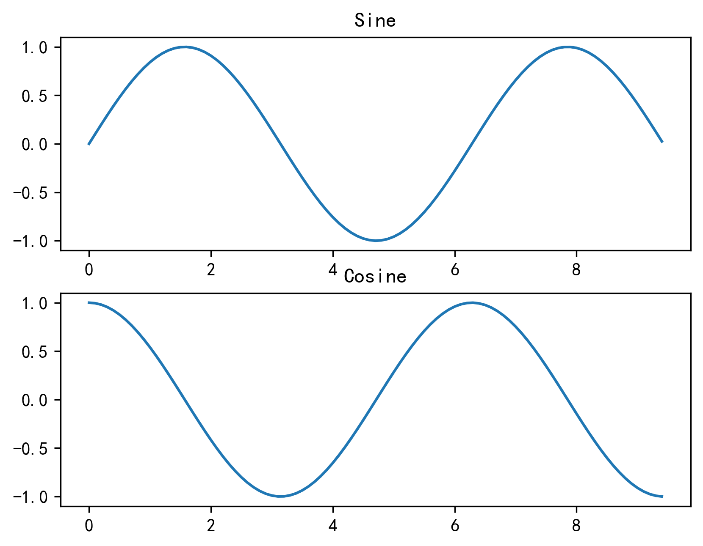

Python Numpy
<a name="wX7O3"></a>
## NumPy - 简介
NumPy 是一个 Python 包。它代表 “Numeric Python”。它是一个由多维数组对象和用于处理数组的例程集合组成的库。<br />Numeric，即 NumPy 的前身，是由 Jim Hugunin 开发的。也开发了另一个包 Numarray ，它拥有一些额外的功能。2005年，Travis Oliphant 通过将 Numarray 的功能集成到 Numeric 包中来创建 NumPy 包。这个开源项目有很多贡献者。
<a name="Prtuu"></a>
### NumPy 操作
使用NumPy，可以执行以下操作：

- 数组的算数和逻辑运算。
- 傅立叶变换和用于图形操作的例程。
- 与线性代数有关的操作。NumPy 拥有线性代数和随机数生成的内置函数。
<a name="gZrbG"></a>
### NumPy – MatLab 的替代之一
NumPy 通常与 SciPy（Scientific Python）和 Matplotlib（绘图库）一起使用。这种组合广泛用于替代 MatLab，是一个流行的技术计算平台。但是，Python 作为 MatLab 的替代方案，现在被视为一种更加现代和完整的编程语言。<br />NumPy 是开源的，这是它的一个额外的优势。
<a name="gLNsL"></a>
## NumPy - 环境
标准的 Python 发行版不会与 NumPy 模块捆绑在一起。一个轻量级的替代方法是使用流行的 Python 包安装程序 pip 来安装 NumPy。
```bash
pip install numpy
```
启用 NumPy 的最佳方法是使用特定于操作系统的可安装的二进制包。这些二进制包含完整的 SciPy 技术栈（包括 NumPy，SciPy，matplotlib，IPython，SymPy 以及 Python 核心自带的其它包）。
<a name="xdzah"></a>
## NumPy - Ndarray 对象
NumPy 中定义的最重要的对象是称为 `ndarray` 的 N 维数组类型。它描述相同类型的元素集合。可以使用基于零的索引访问集合中的项目。<br />`ndarray`中的每个元素在内存中使用相同大小的块。 `ndarray`中的每个元素是数据类型对象的对象（称为 `dtype`）。<br />从`ndarray`对象提取的任何元素（通过切片）由一个数组标量类型的 Python 对象表示。下图显示了`ndarray`，数据类型对象（`dtype`）和数组标量类型之间的关系。<br /><br />`ndarray`类的实例可以通过本教程后面描述的不同的数组创建例程来构造。基本的`ndarray`是使用 NumPy 中的数组函数创建的，如下所示：
```python
numpy.array
```
它从任何暴露数组接口的对象，或从返回数组的任何方法创建一个ndarray。
```python
numpy.array(object, dtype = None, copy = True, order = None, subok = False, ndmin = 0)
```
上面的构造器接受以下参数：

| 序号 | 参数及描述 |
| --- | --- |
| 1. | `object` 任何暴露数组接口方法的对象都会返回一个数组或任何（嵌套）序列。 |
| 2. | `dtype` 数组的所需数据类型，可选。 |
| 3. | `copy` 可选，默认为`true`，对象是否被复制。 |
| 4. | `order` `C`（按行）、`F`（按列）或`A`（任意，默认）。 |
| 5. | `subok` 默认情况下，返回的数组被强制为基类数组。如果为`true`，则返回子类。 |
| 6. | `ndimin` 指定返回数组的最小维数。 |

看看下面的例子来更好地理解。
<a name="Q5193"></a>
### 示例 1
```python
import numpy as np
a = np.array([1,2,3])  
print a
```
输出如下：
```
[1, 2, 3]
```
<a name="IvIIt"></a>
### 示例 2
```python
# 多于一个维度  
import numpy as np
a = np.array([[1,  2],  [3,  4]])  
print a
```
输出如下：
```
[[1, 2]
 [3, 4]]
```
<a name="uc4aG"></a>
### 示例 3
```python
# 最小维度  
import numpy as np
a = np.array([1,  2,  3,4,5], ndmin =  2)  
print a
```
输出如下：
```
[[1, 2, 3, 4, 5]]
```
<a name="rN8OX"></a>
### 示例 4
```python
# dtype 参数  
import numpy as np
a = np.array([1,  2,  3], dtype = complex)  
print a
```
输出如下：
```
[ 1.+0.j,  2.+0.j,  3.+0.j]
```
ndarray  对象由计算机内存中的一维连续区域组成，带有将每个元素映射到内存块中某个位置的索引方案。内存块以按行（C 风格）或按列（FORTRAN 或 MatLab 风格）的方式保存元素。
<a name="MSM60"></a>
## NumPy - 数据类型
NumPy 支持比 Python 更多种类的数值类型。下表显示了 NumPy 中定义的不同标量数据类型。

| 序号 | 数据类型及描述 |
| --- | --- |
| 1. | `bool_` 存储为一个字节的布尔值（真或假） |
| 2. | `int_` 默认整数，相当于 C 的`long`，通常为`int32`或`int64` 【`int_ = long`、`intp = long`、`int64 = long`、`int0 = long`】 |
| 3. | `intc` 相当于 C 的`int`，通常为`int32`或`int64` |
| 4. | `intp` 用于索引的整数，相当于 C 的`size_t`，通常为`int32`或`int64` |
| 5. | `int8` 字节（-128 ~ 127）【`byte = int8`】 |
| 6. | `int16` 16 位整数（-32768 ~ 32767）【`int16 = short`】 |
| 7. | `int32` 32 位整数（-2147483648 ~ 2147483647）【`int32 = intc`】 |
| 8. | `int64` 64 位整数（-9223372036854775808 ~ 9223372036854775807） |
| 9. | `uint8` 8 位无符号整数（0 ~ 255）【`ubyte = uint8`】 |
| 10. | `uint16` 16 位无符号整数（0 ~ 65535）【`uint16 = ushort`】 |
| 11. | `uint32` 32 位无符号整数（0 ~ 4294967295）【`uint32 = uintc`】 |
| 12. | `uint64` 64 位无符号整数（0 ~ 18446744073709551615）【`uint64 = uintp`】 |
| 13. | `float_` `float64`的简写【`float64 = float_`、`double = float_`】 |
| 14. | `float16` 半精度浮点：符号位，5 位指数，10 位尾数 |
| 15. | `float32` 单精度浮点：符号位，8 位指数，23 位尾数 |
| 16. | `float64` 双精度浮点：符号位，11 位指数，52 位尾数 |
| 17. | `complex_` `complex128`的简写【`complex128 = complex_`、`cfloat = complex_`、`cdouble = complex_`】 |
| 18. | `complex64` 复数，由两个 32 位浮点表示（实部和虚部） |
| 19. | `complex128` 复数，由两个 64 位浮点表示（实部和虚部） |

NumPy 数字类型是`dtype`（数据类型）对象的实例，每个对象具有唯一的特征。这些类型可以是`np.bool_`，`np.float32`等。
<a name="OiTct"></a>
### 数据类型对象 (dtype)
数据类型对象描述了对应于数组的固定内存块的解释，取决于以下方面：

- 数据类型（整数、浮点或者 Python 对象）
- 数据大小
- 字节序（小端或大端）
- 在结构化类型的情况下，字段的名称，每个字段的数据类型，和每个字段占用的内存块部分。
- 如果数据类型是子序列，它的形状和数据类型。

字节顺序取决于数据类型的前缀`<`或`>`。 `<`意味着编码是小端（最小有效字节存储在最小地址中）。 `>`意味着编码是大端（最大有效字节存储在最小地址中）。<br />`dtype`可由一下语法构造：
```python
numpy.dtype(object, align, copy)
```
参数为：

- `Object`：被转换为数据类型的对象。
- `Align`：如果为`true`，则向字段添加间隔，使其类似 C 的结构体。
- `Copy`：生成`dtype`对象的新副本，如果为`flase`，结果是内建数据类型对象的引用。
<a name="Tp4Y2"></a>
#### 示例 1
```python
# 使用数组标量类型  
import numpy as np
dt = np.dtype(np.int32)  
print dt
```
输出如下：
```
int32
```
<a name="GOdpI"></a>
#### 示例 2
```python
#int8，int16，int32，int64 可替换为等价的字符串 'i1'，'i2'，'i4'，以及其他。 
import numpy as np
dt = np.dtype('i4')  
print dt
```
输出如下：
```
int32
```
<a name="d67oa"></a>
#### 示例 3
```python
# 使用端记号  
import numpy as np
dt = np.dtype('>i4')  
print dt
```
输出如下：
```
>i4
```
下面的例子展示了结构化数据类型的使用。这里声明了字段名称和相应的标量数据类型。
<a name="LWajm"></a>
#### 示例 4
```python
# 首先创建结构化数据类型。 
import numpy as np
dt = np.dtype([('age',np.int8)])  
print dt
```
输出如下：
```
[('age', 'i1')]
```
<a name="QTnym"></a>
#### 示例 5
```python
# 现在将其应用于 ndarray 对象  
import numpy as np
dt = np.dtype([('age',np.int8)])
a = np.array([(10,),(20,),(30,)], dtype = dt)  
print a
```
输出如下：
```
[(10,) (20,) (30,)]
```
<a name="aeOeH"></a>
#### 示例 6
```python
# 文件名称可用于访问 age 列的内容  
import numpy as np
dt = np.dtype([('age',np.int8)])
a = np.array([(10,),(20,),(30,)], dtype = dt)  
print a['age']
```
输出如下：
```
[10 20 30]
```
<a name="ZUgJm"></a>
#### 示例 7
以下示例定义名为 student 的结构化数据类型，其中包含字符串字段`name`，整数字段`age`和浮点字段`marks`。此`dtype`应用于`ndarray`对象。
```python
import numpy as np
student = np.dtype([('name','S20'),  ('age',  'i1'),  ('marks',  'f4')])  
print student
```
输出如下：
```
[('name', 'S20'), ('age', 'i1'), ('marks', '<f4')]
```
<a name="zBXkC"></a>
#### 示例 8
```python
import numpy as np
student = np.dtype([('name','S20'),  ('age',  'i1'),  ('marks',  'f4')])
a = np.array([('abc',  21,  50),('xyz',  18,  75)], dtype = student)  
print a
```
输出如下：
```
[('abc', 21, 50.0), ('xyz', 18, 75.0)]
```
每个内建类型都有一个唯一定义它的字符代码：

- `'b'`：布尔值
- `'i'`：符号整数
- `'u'`：无符号整数
- `'f'`：浮点
- `'c'`：复数浮点
- `'m'`：时间间隔
- `'M'`：日期时间
- `'O'`：Python 对象
- `'S', 'a'`：字节串
- `'U'`：Unicode
- `'V'`：原始数据（`void`）
<a name="xyS11"></a>
## NumPy - 数组属性
<a name="R18hz"></a>
### `ndarray.shape`
这一数组属性返回一个包含数组维度的元组，它也可以用于调整数组大小。
<a name="ep56Y"></a>
#### 示例 1
```python
import numpy as np
a = np.array([[1,2,3],[4,5,6]])  
print a.shape
```
输出如下：
```
(2, 3)
```
<a name="wbHM3"></a>
#### 示例 2
NumPy 也提供了`reshape`函数来调整数组大小。
```python
import numpy as np
a = np.array([[1,2,3],[4,5,6]])
b = a.reshape(3,2)  
print b
```
输出如下：
```
[[1, 2]
 [3, 4]
 [5, 6]]
```
<a name="IC3cS"></a>
## NumPy - 切片和索引
`ndarray`对象的内容可以通过索引或切片来访问和修改，就像 Python 的内置容器对象一样。<br />如前所述，`ndarray`对象中的元素遵循基于零的索引。有三种可用的索引方法类型：字段访问，基本切片和高级索引。<br />基本切片是 Python 中基本切片概念到 n 维的扩展。通过将`start`，`stop`和`step`参数提供给内置的`slice`函数来构造一个 Python `slice`对象。此`slice`对象被传递给数组来提取数组的一部分。
<a name="goS2H"></a>
### 示例 1
```python
import numpy as np
a = np.arange(10)
s = slice(2,7,2)  
print a[s]
```
输出如下：
```
[2  4  6]
```
在上面的例子中，`ndarray`对象由`arange()`函数创建。然后，分别用起始，终止和步长值`2`，`7`和`2`定义切片对象。当这个切片对象传递给`ndarray`时，会对它的一部分进行切片，从索引`2`到`7`，步长为`2`。<br />通过将由冒号分隔的切片参数（`start:stop:step`）直接提供给`ndarray`对象，也可以获得相同的结果。
<a name="lGlC3"></a>
### 示例 2
```python
import numpy as np
a = np.arange(10)
b = a[2:7:2]  
print b
```
输出如下：
```
[2  4  6]
```
如果只输入一个参数，则将返回与索引对应的单个项目。如果使用a:，则从该索引向后的所有项目将被提取。如果使用两个参数（以:分隔），则对两个索引（不包括停止索引）之间的元素以默认步骤进行切片。
<a name="d80uu"></a>
## NumPy - 高级索引
如果一个`ndarray`是非元组序列，数据类型为整数或布尔值的`ndarray`，或者至少一个元素为序列对象的元组，就能够用它来索引`ndarray`。高级索引始终返回数据的副本。与此相反，切片只提供了一个视图。<br />有两种类型的高级索引：整数和布尔值。
<a name="WQcGe"></a>
### 整数索引
这种机制有助于基于 N 维索引来获取数组中任意元素。每个整数数组表示该维度的下标值。当索引的元素个数就是目标`ndarray`的维度时，会变得相当直接。<br />以下示例获取了`ndarray`对象中每一行指定列的一个元素。因此，行索引包含所有行号，列索引指定要选择的元素。
<a name="WakLA"></a>
#### 示例
```python
import numpy as np
x = np.array([[  0,  1,  2],[  3,  4,  5],[  6,  7,  8],[  9,  10,  11]])  
print  '我们的数组是：'  
print x
print  '\n'  
# 切片
z = x[1:4,1:3]  
print  '切片之后，我们的数组变为：'  
print z
print  '\n'  
# 对列使用高级索引
y = x[1:4,[1,2]]
print  '对列使用高级索引来切片：'  
print y
```
输出如下：
```
我们的数组是：
[[ 0  1  2]
 [ 3  4  5]
 [ 6  7  8]
 [ 9 10 11]]
切片之后，我们的数组变为：
[[ 4  5]
 [ 7  8]
 [10 11]]
对列使用高级索引来切片：
[[ 4  5]
 [ 7  8]
 [10 11]]
```
<a name="IMUQK"></a>
### 布尔索引
当结果对象是布尔运算（例如比较运算符）的结果时，将使用此类型的高级索引。
<a name="svmLb"></a>
#### 示例
这个例子中，大于 5 的元素会作为布尔索引的结果返回。
```python
import numpy as np
x = np.array([[  0,  1,  2],[  3,  4,  5],[  6,  7,  8],[  9,  10,  11]])  
print  '我们的数组是：'  
print x
print  '\n'  
# 现在我们会打印出大于 5 的元素  
print  '大于 5 的元素是：'  
print x[x >  5]
```
输出如下：
```
我们的数组是：
[[ 0  1  2]
 [ 3  4  5]
 [ 6  7  8]
 [ 9 10 11]]
大于 5 的元素是：
[ 6  7  8  9 10 11]
```
<a name="yENlJ"></a>
## NumPy - 广播
术语广播是指 NumPy 在算术运算期间处理不同形状的数组的能力。对数组的算术运算通常在相应的元素上进行。如果两个阵列具有完全相同的形状，则这些操作被无缝执行。
<a name="NOj13"></a>
### 示例
```python
import numpy as np
a = np.array([1,2,3,4])
b = np.array([10,20,30,40])
c = a * b
print c
```
输出如下：
```
[10   40   90   160]
```
如果两个数组的维数不相同，则元素到元素的操作是不可能的。然而，在 NumPy 中仍然可以对形状不相似的数组进行操作，因为它拥有广播功能。较小的数组会广播到较大数组的大小，以便使它们的形状可兼容。<br />如果满足以下规则，可以进行广播：

- `ndim`较小的数组会在前面追加一个长度为 1 的维度。
- 输出数组的每个维度的大小是输入数组该维度大小的最大值。
- 如果输入在每个维度中的大小与输出大小匹配，或其值正好为 1，则在计算中可它。
- 如果输入的某个维度大小为 1，则该维度中的第一个数据元素将用于该维度的所有计算。

如果上述规则产生有效结果，并且满足以下条件之一，那么数组被称为可广播的。

- 数组拥有相同形状。
- 数组拥有相同的维数，每个维度拥有相同长度，或者长度为 1。
- 数组拥有极少的维度，可以在其前面追加长度为 1 的维度，使上述条件成立。
<a name="aPguS"></a>
## NumPy - 数组上的迭代
NumPy 包包含一个迭代器对象`numpy.nditer`。它是一个有效的多维迭代器对象，可以用于在数组上进行迭代。数组的每个元素可使用 Python 的标准`Iterator`接口来访问。<br />使用`arange()`函数创建一个 3X4 数组，并使用`nditer`对它进行迭代。
<a name="WePfQ"></a>
### 示例
```python
import numpy as np
a = np.arange(0,60,5)
a = a.reshape(3,4)  
print  '原始数组是：'  
print a print  '\n'  
print  '修改后的数组是：'  
for x in np.nditer(a):  
    print x,
```
输出如下：
```
原始数组是：
[[ 0 5 10 15]
 [20 25 30 35]
 [40 45 50 55]]
修改后的数组是：
0 5 10 15 20 25 30 35 40 45 50 55
```
<a name="LmIuj"></a>
## NumPy - 数组操作
NumPy包中有几个例程用于处理`ndarray`对象中的元素。它们可以分为以下类型：
<a name="fpnLd"></a>
### 修改形状
| 序号 | 形状及描述 |
| --- | --- |
| 1. | `reshape` 不改变数据的条件下修改形状 |
| 2. | `flat` 数组上的一维迭代器 |
| 3. | `flatten` 返回折叠为一维的数组副本 |
| 4. | `ravel` 返回连续的展开数组 |

<a name="A18Je"></a>
#### `numpy.reshape`
这个函数在不改变数据的条件下修改形状，它接受如下参数：
```python
numpy.reshape(arr, newshape, order)
```
其中：

- `arr`：要修改形状的数组
- `newshape`：整数或者整数数组，新的形状应当兼容原有形状
- `order`：`'C'`为 C 风格顺序，`'F'`为 F 风格顺序，`'A'`为保留原顺序。

例子
```python
import numpy as np
a = np.arange(8)
print '原始数组：'
print a
print '\n'
b = a.reshape(4,2)
print '修改后的数组：'
print b
```
输出如下：
```
原始数组：
[0 1 2 3 4 5 6 7]
修改后的数组：
[[0 1]
 [2 3]
 [4 5]
 [6 7]]
```
<a name="Yhlfi"></a>
#### `numpy.ndarray.flat`
该函数返回数组上的一维迭代器，行为类似 Python 内建的迭代器。<br />例子
```python
import numpy as np
a = np.arange(8).reshape(2,4)
print '原始数组：' 
print a
print '\n' 
print '调用 flat 函数之后：' 
# 返回展开数组中的下标的对应元素
print a.flat[5]
```
输出如下：
```
原始数组：
[[0 1 2 3]
 [4 5 6 7]]
调用 flat 函数之后：
5
```
<a name="hne8o"></a>
#### `numpy.ndarray.flatten`
该函数返回折叠为一维的数组副本，函数接受下列参数：
```python
ndarray.flatten(order)
```
其中：

- `order`：`'C'` -- 按行，`'F'` -- 按列，`'A'` -- 原顺序，`'k'` -- 元素在内存中的出现顺序。

例子
```python
import numpy as np
a = np.arange(8).reshape(2,4)
print '原数组：' 
print a
print '\n'  
# default is column-major
print '展开的数组：' 
print a.flatten()
print '\n'  
print '以 F 风格顺序展开的数组：' 
print a.flatten(order = 'F')
```
输出如下：
```
原数组：
[[0 1 2 3]
 [4 5 6 7]]
展开的数组：
[0 1 2 3 4 5 6 7]
以 F 风格顺序展开的数组：
[0 4 1 5 2 6 3 7]
```
<a name="EZhHs"></a>
#### `numpy.ravel`
这个函数返回展开的一维数组，并且按需生成副本。返回的数组和输入数组拥有相同数据类型。这个函数接受两个参数。
```python
numpy.ravel(a, order)
```
构造器接受下列参数：

- `order`：`'C'` -- 按行，`'F'` -- 按列，`'A'` -- 原顺序，`'k'` -- 元素在内存中的出现顺序。

例子
```python
import numpy as np
a = np.arange(8).reshape(2,4)
print '原数组：' 
print a
print '\n'  
print '调用 ravel 函数之后：' 
print a.ravel()  
print '\n' 
print '以 F 风格顺序调用 ravel 函数之后：' 
print a.ravel(order = 'F')
```
输出如下：
```
原数组：
[[0 1 2 3]
 [4 5 6 7]]
调用 ravel 函数之后：
[0 1 2 3 4 5 6 7]
以 F 风格顺序调用 ravel 函数之后：
[0 4 1 5 2 6 3 7]
```
<a name="pHI3w"></a>
### 翻转操作
| 序号 | 操作及描述 |
| --- | --- |
| 1. | `transpose` 翻转数组的维度 |
| 2. | `ndarray.T` 和`self.transpose()`相同 |
| 3. | `rollaxis` 向后滚动指定的轴 |
| 4. | `swapaxes` 互换数组的两个轴 |

<a name="ijwzH"></a>
### 修改维度
| 序号 | 维度和描述 |
| --- | --- |
| 1. | `broadcast` 产生模仿广播的对象 |
| 2. | `broadcast_to` 将数组广播到新形状 |
| 3. | `expand_dims` 扩展数组的形状 |
| 4. | `squeeze` 从数组的形状中删除单维条目 |

<a name="sbdjr"></a>
### 数组的连接
| 序号 | 数组及描述 |
| --- | --- |
| 1. | `concatenate` 沿着现存的轴连接数据序列 |
| 2. | `stack` 沿着新轴连接数组序列 |
| 3. | `hstack` 水平堆叠序列中的数组（列方向） |
| 4. | `vstack` 竖直堆叠序列中的数组（行方向） |

<a name="yZbFX"></a>
### 数组分割
| 序号 | 数组及操作 |
| --- | --- |
| 1. | `split` 将一个数组分割为多个子数组 |
| 2. | `hsplit` 将一个数组水平分割为多个子数组（按列） |
| 3. | `vsplit` 将一个数组竖直分割为多个子数组（按行） |

<a name="xho8x"></a>
### 添加/删除元素
| 序号 | 元素及描述 |
| --- | --- |
| 1. | `resize` 返回指定形状的新数组 |
| 2. | `append` 将值添加到数组末尾 |
| 3. | `insert` 沿指定轴将值插入到指定下标之前 |
| 4. | `delete` 返回删掉某个轴的子数组的新数组 |
| 5. | `unique` 寻找数组内的唯一元素 |

<a name="KPYPA"></a>
## NumPy - 位操作
下面是 NumPy 包中可用的位操作函数。

| 序号 | 操作及描述 |
| --- | --- |
| 1. | `bitwise_and` 对数组元素执行位与操作 |
| 2. | `bitwise_or` 对数组元素执行位或操作 |
| 3. | `invert` 计算位非 |
| 4. | `left_shift` 向左移动二进制表示的位 |
| 5. | `right_shift` 向右移动二进制表示的位 |

<a name="dMNru"></a>
### 示例
```python
import numpy as np
print '13 和 17 的二进制形式：'
a,b = 13,17
print bin(a), bin(b)
print '\n'
print '13 和 17 的位与：'
print np.bitwise_and(13, 17)
```
输出如下：
```
13 和 17 的二进制形式：
0b1101 0b10001
13 和 17 的位与：
1
```
可以使用下表验证此输出。考虑下面的位与真值表。

| A | B | AND |
| --- | --- | --- |
| 1 | 1 | 1 |
| 1 | 0 | 0 |
| 0 | 1 | 0 |
| 0 | 0 | 0 |

|  |  | 1 | 1 | 0 | 1 |<br />| --- | --- |<br />| AND |<br />| | 1 | 0 | 0 | 0 | 1 |<br />| result | 0 | 0 | 0 | 0 | 1 |
<a name="kimaB"></a>
## NumPy - 字符串函数
以下函数用于对`dtype`为`numpy.string_`或`numpy.unicode_`的数组执行向量化字符串操作。它们基于 Python 内置库中的标准字符串函数。

| 序号 | 函数及描述 |
| --- | --- |
| 1. | `add()` 返回两个`str`或`Unicode`数组的逐个字符串连接 |
| 2. | `multiply()` 返回按元素多重连接后的字符串 |
| 3. | `center()` 返回给定字符串的副本，其中元素位于特定字符串的中央 |
| 4. | `capitalize()` 返回给定字符串的副本，其中只有第一个字符串大写 |
| 5. | `title()` 返回字符串或 Unicode 的按元素标题转换版本 |
| 6. | `lower()` 返回一个数组，其元素转换为小写 |
| 7. | `upper()` 返回一个数组，其元素转换为大写 |
| 8. | `split()` 返回字符串中的单词列表，并使用分隔符来分割 |
| 9. | `splitlines()` 返回元素中的行列表，以换行符分割 |
| 10. | `strip()`<br /> 返回数组副本，其中元素移除了开头或者结尾处的特定字符 |
| 11. | `join()` 返回一个字符串，它是序列中字符串的连接 |
| 12. | `replace()` 返回字符串的副本，其中所有子字符串的出现位置都被新字符串取代 |
| 13. | `decode()` 按元素调用`str.decode` |
| 14. | `encode()` 按元素调用`str.encode` |

这些函数在字符数组类（`numpy.char`）中定义。较旧的 Numarray 包包含`chararray`类。`numpy.char`类中的上述函数在执行向量化字符串操作时非常有用。
<a name="B0B5Y"></a>
### 示例
```python
import numpy as np
print '连接两个字符串：' 
print np.char.add(['hello'],[' xyz'])
print '\n'
print '连接示例：' 
print np.char.add(['hello', 'hi'],[' abc', ' xyz'])
```
输出如下：
```
连接两个字符串：
['hello xyz']
连接示例：
['hello abc' 'hi xyz']
```
<a name="MLjuJ"></a>
## NumPy - 算数函数
很容易理解的是，NumPy 包含大量的各种数学运算功能。NumPy 提供标准的三角函数，算术运算的函数，复数处理函数等。
<a name="J0mVr"></a>
### 三角函数
NumPy 拥有标准的三角函数，它为弧度制单位的给定角度返回三角函数比值。
<a name="k64Fq"></a>
### 舍入函数`numpy.around()`
这个函数返回四舍五入到所需精度的值。该函数接受以下参数。
```python
numpy.around(a,decimals)
```
其中：

| 序号 | 参数及描述 |
| --- | --- |
| 1. | `a` 输入数组 |
| 2. | `decimals` 要舍入的小数位数。默认值为0。如果为负，整数将四舍五入到小数点左侧的位置 |

<a name="xL1N6"></a>
## NumPy - 算数运算
用于执行算术运算（如`add()`，`subtract()`，`multiply()`和`divide()`）的输入数组必须具有相同的形状或符合数组广播规则。
<a name="yuoEf"></a>
### 示例 
```python
import numpy as np
a = np.arange(9, dtype = np.float_).reshape(3,3)  
print  '第一个数组：'  
print a
print  '\n'  
print  '第二个数组：' 
b = np.array([10,10,10])  
print b
print  '\n'  
print  '两个数组相加：'  
print np.add(a,b)  
print  '\n'  
print  '两个数组相减：'  
print np.subtract(a,b)  
print  '\n'  
print  '两个数组相乘：'  
print np.multiply(a,b)  
print  '\n'  
print  '两个数组相除：'  
print np.divide(a,b)
```
输出如下：
```
第一个数组：
[[ 0. 1. 2.]
 [ 3. 4. 5.]
 [ 6. 7. 8.]]
第二个数组：
[10 10 10]
两个数组相加：
[[ 10. 11. 12.]
 [ 13. 14. 15.]
 [ 16. 17. 18.]]
两个数组相减：
[[-10. -9. -8.]
 [ -7. -6. -5.]
 [ -4. -3. -2.]]
两个数组相乘：
[[ 0. 10. 20.]
 [ 30. 40. 50.]
 [ 60. 70. 80.]]
两个数组相除：
[[ 0. 0.1 0.2]
 [ 0.3 0.4 0.5]
 [ 0.6 0.7 0.8]]
```
<a name="cAEFQ"></a>
## NumPy - 统计函数
NumPy 有很多有用的统计函数，用于从数组中给定的元素中查找最小，最大，百分标准差和方差等。函数说明如下：
<a name="ILo25"></a>
### `numpy.amin()` 和 `numpy.amax()`
这些函数从给定数组中的元素沿指定轴返回最小值和最大值。
<a name="Fa17M"></a>
### `numpy.ptp()`
`numpy.ptp()`函数返回沿轴的值的范围（最大值 - 最小值）。
<a name="jaUa8"></a>
### `numpy.percentile()`
百分位数是统计中使用的度量，表示小于这个值得观察值占某个百分比。函数`numpy.percentile()`接受以下参数。
```python
numpy.percentile(a, q, axis)
```
其中：

| 序号 | 参数及描述 |
| --- | --- |
| 1. | `a` 输入数组 |
| 2. | `q` 要计算的百分位数，在 0 ~ 100 之间 |
| 3. | `axis` 沿着它计算百分位数的轴 |

<a name="xGIIp"></a>
### `numpy.median()`
中值定义为将数据样本的上半部分与下半部分分开的值。 `numpy.median()`函数的用法如下面的程序所示。
<a name="fcyIP"></a>
### `numpy.mean()`
算术平均值是沿轴的元素的总和除以元素的数量。 `numpy.mean()`函数返回数组中元素的算术平均值。如果提供了轴，则沿其计算。
<a name="vf1sz"></a>
### `numpy.average()`
加权平均值是由每个分量乘以反映其重要性的因子得到的平均值。 `numpy.average()`函数根据在另一个数组中给出的各自的权重计算数组中元素的加权平均值。该函数可以接受一个轴参数。如果没有指定轴，则数组会被展开。<br />考虑数组`[1,2,3,4]`和相应的权重`[4,3,2,1]`，通过将相应元素的乘积相加，并将和除以权重的和，来计算加权平均值。
```
加权平均值 = (1*4+2*3+3*2+4*1)/(4+3+2+1)
```
<a name="WgMhz"></a>
### 标准差
标准差是与均值的偏差的平方的平均值的平方根。标准差公式如下：
```python
std = sqrt(mean((x - x.mean())**2))
```
如果数组是`[1，2，3，4]`，则其平均值为`2.5`。因此，差的平方是`[2.25,0.25,0.25,2.25]`，并且其平均值的平方根除以4，即`sqrt(5/4)`是`1.1180339887498949`。
<a name="NfC8C"></a>
### 方差
方差是偏差的平方的平均值，即`mean((x - x.mean())** 2)`。换句话说，标准差是方差的平方根。
<a name="xJjog"></a>
## NumPy - 排序、搜索和计数函数
NumPy中提供了各种排序相关功能。这些排序函数实现不同的排序算法，每个排序算法的特征在于执行速度，最坏情况性能，所需的工作空间和算法的稳定性。下表显示了三种排序算法的比较。

| 种类 | 速度 | 最坏情况 | 工作空间 | 稳定性 |
| --- | --- | --- | --- | --- |
| `'quicksort'`（快速排序） | 1 | `O(n^2)` | 0 | 否 |
| `'mergesort'`（归并排序） | 2 | `O(n*log(n))` | ~n/2 | 是 |
| `'heapsort'`（堆排序） | 3 | `O(n*log(n))` | 0 | 否 |

<a name="iN828"></a>
### 示例 
```python
import numpy as np  
a = np.array([[3,7],[9,1]])  
print  '我们的数组是：'  
print a
print  '\n'  
print  '调用 sort() 函数：'  
print np.sort(a)  
print  '\n'  
print  '沿轴 0 排序：'  
print np.sort(a, axis =  0)  
print  '\n'  
# 在 sort 函数中排序字段
dt = np.dtype([('name',  'S10'),('age',  int)])
a = np.array([("raju",21),("anil",25),("ravi",  17),  ("amar",27)], dtype = dt)  
print  '我们的数组是：'  
print a
print  '\n'  
print  '按 name 排序：'  
print np.sort(a, order =  'name')
```
输出如下：
```
我们的数组是：
[[3 7]
 [9 1]]
调用 sort() 函数：
[[3 7]
 [1 9]]
沿轴 0 排序：
[[3 1]
 [9 7]]
我们的数组是：
[('raju', 21) ('anil', 25) ('ravi', 17) ('amar', 27)]
按 name 排序：
[('amar', 27) ('anil', 25) ('raju', 21) ('ravi', 17)]
```
<a name="voR4U"></a>
## NumPy - 线性代数
NumPy 包包含`numpy.linalg`模块，提供线性代数所需的所有功能。此模块中的一些重要功能如下表所述。

| 序号 | 函数及描述 |
| --- | --- |
| 1. | `dot` 两个数组的点积 |
| 2. | `vdot` 两个向量的点积 |
| 3. | `inner` 两个数组的内积 |
| 4. | `matmul` 两个数组的矩阵积 |
| 5. | `determinant` 数组的行列式 |
| 6. | `solve` 求解线性矩阵方程 |
| 7. | `inv` 寻找矩阵的乘法逆矩阵 |

<a name="QGt3I"></a>
### 示例 
```python
import numpy.matlib
import numpy as np
a = np.array([[1,2],[3,4]])
b = np.array([[11,12],[13,14]])
np.dot(a,b)
```
输出如下：
```
[[37  40]
 [85  92]]
```
<a name="D6lev"></a>
## NumPy - Matplotlib
Matplotlib 是 Python 的绘图库。它可与 NumPy 一起使用，提供了一种有效的 MatLab 开源替代方案。它也可以和图形工具包一起使用，如 PyQt 和 wxPython。<br />Matplotlib 模块最初是由 John D. Hunter 编写的。自 2012 年以来，Michael Droettboom 是主要开发者。目前，Matplotlib 1.5.1 是可用的稳定版本。该软件包可以二进制分发，其源代码形式在 www.matplotlib.org 上提供。<br />通常，通过添加以下语句将包导入到 Python 脚本中：
```python
from matplotlib import pyplot as plt
```
这里`pyplot()`是 matplotlib 库中最重要的函数，用于绘制 2D 数据。以下脚本绘制方程`y = 2x + 5`：
<a name="bqzQw"></a>
### 示例 
```python
import numpy as np
from matplotlib import pyplot as plt
x = np.arange(1,11)
y =  2  * x +  5 
plt.title("Matplotlib demo")
plt.xlabel("x axis caption")
plt.ylabel("y axis caption")
plt.plot(x,y)
plt.savefig('outbox_legend.png', dpi = 300, bbox_inches = 'tight', pad_inches = .1)
```
`ndarray`对象`x`由`np.arange()`函数创建为`x`轴上的值。`y`轴上的对应值存储在另一个数组对象`y`中。这些值使用`matplotlib`软件包的`pyplot`子模块的`plot()`函数绘制。<br />图形由`show()`函数展示。<br />上面的代码应该产生以下输出：<br /><br />作为线性图的替代，可以通过向`plot()`函数添加格式字符串来显示离散值。可以使用以下格式化字符。

| 字符 | 描述 |
| --- | --- |
| `'-'` | 实线样式 |
| `'--'` | 短横线样式 |
| `'-.'` | 点划线样式 |
| `':'` | 虚线样式 |
| `'.'` | 点标记 |
| `','` | 像素标记 |
| `'o'` | 圆标记 |
| `'v'` | 倒三角标记 |
| `'^'` | 正三角标记 |
| `'<'` | 左三角标记 |
| `'>'` | 右三角标记 |
| `'1'` | 下箭头标记 |
| `'2'` | 上箭头标记 |
| `'3'` | 左箭头标记 |
| `'4'` | 右箭头标记 |
| `'s'` | 正方形标记 |
| `'p'` | 五边形标记 |
| `'*'` | 星形标记 |
| `'h'` | 六边形标记 1 |
| `'H'` | 六边形标记 2 |
| `'+'` | 加号标记 |
| `'x'` | X 标记 |
| `'D'` | 菱形标记 |
| `'d'` | 窄菱形标记 |
| `'&#124;'` | 竖直线标记 |
| `'_'` | 水平线标记 |

还定义了以下颜色缩写。

| 字符 | 颜色 |
| --- | --- |
| `'b'` | 蓝色 |
| `'g'` | 绿色 |
| `'r'` | 红色 |
| `'c'` | 青色 |
| `'m'` | 品红色 |
| `'y'` | 黄色 |
| `'k'` | 黑色 |
| `'w'` | 白色 |

要显示圆来代表点，而不是上面示例中的线，请使用`ob`作为`plot()`函数中的格式字符串。
<a name="GGL4y"></a>
### 示例 
```python
import numpy as np
from matplotlib import pyplot as plt
x = np.arange(1,11)
y =  2  * x +  5 
plt.title("Matplotlib demo")
plt.xlabel("x axis caption")
plt.ylabel("y axis caption")
plt.plot(x,y,"ob")
plt.savefig('outbox_legend.png', dpi = 300, bbox_inches = 'tight', pad_inches = .1)
```
上面的代码应该产生以下输出：<br />
<a name="vcolJ"></a>
### 绘制正弦波
以下脚本使用 matplotlib 生成正弦波图。
<a name="JWP29"></a>
#### 示例 
```python
import numpy as np
import matplotlib.pyplot as plt
# 计算正弦曲线上点的 x 和 y 坐标
x = np.arange(0,  3  * np.pi,  0.1)
y = np.sin(x)
plt.title("sine wave form")  
# 使用 matplotlib 来绘制点
plt.plot(x, y)
plt.savefig('outbox_legend.png', dpi = 300, bbox_inches = 'tight', pad_inches = .1)
```

<a name="humxe"></a>
### `subplot()`
`subplot()`函数允许在同一图中绘制不同的东西。在下面的脚本中，绘制正弦和余弦值。
<a name="jqqCq"></a>
#### 示例 
```python
import numpy as np
import matplotlib.pyplot as plt
# 计算正弦和余弦曲线上的点的 x 和 y 坐标
x = np.arange(0,  3  * np.pi,  0.1)
y_sin = np.sin(x)
y_cos = np.cos(x)  
# 建立 subplot 网格，高为 2，宽为 1  
# 激活第一个 subplot
plt.subplot(2,  1,  1)  
# 绘制第一个图像
plt.plot(x, y_sin)
plt.title('Sine')  
# 将第二个 subplot 激活，并绘制第二个图像
plt.subplot(2,  1,  2)
plt.plot(x, y_cos)
plt.title('Cosine')  
# 展示图像
plt.savefig('outbox_legend.png', dpi = 300, bbox_inches = 'tight', pad_inches = .1)
```
上面的代码应该产生以下输出：<br />
<a name="aAbs1"></a>
### `bar()`
`pyplot`子模块提供`bar()`函数来生成条形图。以下示例生成两组`x`和`y`数组的条形图。
<a name="F770B"></a>
#### 示例 
```python
from matplotlib import pyplot as plt
x =  [5,8,10]
y =  [12,16,6]
x2 =  [6,9,11]
y2 =  [6,15,7]
plt.bar(x, y, align =  'center')
plt.bar(x2, y2, color =  'g', align =  'center')
plt.title('Bar graph')
plt.ylabel('Y axis')
plt.xlabel('X axis')
plt.savefig('outbox_legend.png', dpi = 300, bbox_inches = 'tight', pad_inches = .1)
```
<a name="RPrMM"></a>
## NumPy - 使用 Matplotlib 绘制直方图
NumPy 有一个`numpy.histogram()`函数，它是数据的频率分布的图形表示。水平尺寸相等的矩形对应于类间隔，称为`bin`，变量`height`对应于频率。
<a name="Kw9kx"></a>
### `numpy.histogram()`
`numpy.histogram()`函数将输入数组和`bin`作为两个参数。 `bin`数组中的连续元素用作每个`bin`的边界。
```python
import numpy as np
a = np.array([22,87,5,43,56,73,55,54,11,20,51,5,79,31,27]) ]
np.histogram(a,bins =  [0,20,40,60,80,100])
hist,bins = np.histogram(a,bins =  [0,20,40,60,80,100])  
print hist
print bins
```
输出如下：
```
[3 4 5 2 1]
[0 20 40 60 80 100]
```
<a name="xQr1L"></a>
### `plt()`
Matplotlib 可以将直方图的数字表示转换为图形。 `pyplot`子模块的`plt()`函数将包含数据和`bin`数组的数组作为参数，并转换为直方图。
```python
from matplotlib import pyplot as plt
import numpy as np  
a = np.array([22,87,5,43,56,73,55,54,11,20,51,5,79,31,27])
plt.hist(a, bins =  [0,20,40,60,80,100])
plt.title("histogram")
plt.savefig('outbox_legend.png', dpi = 300, bbox_inches = 'tight', pad_inches = .1)
```
输出如下：<br />

