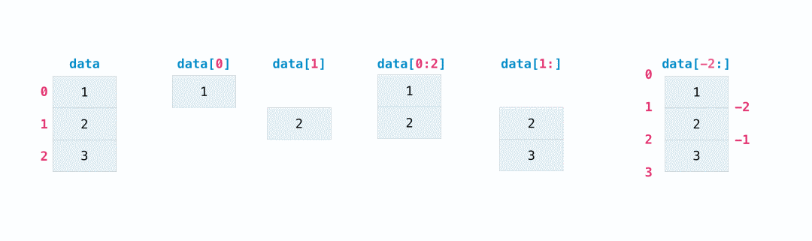

Python Numpy
<a name="jYHNW"></a>
#### 索引和切片
可以使用与切片 Python列表相同的方法，对NumPy数组进行索引和切片。
```python
>>> data = np.array([1, 2, 3])

>>> data[1]
2
>>> data[0:2]
array([1, 2])
>>> data[1:]
array([2, 3])
>>> data[-2:]
array([2, 3])
```
可以这样想象：<br /><br />可能需要获取数组的一部分或特定数组元素，以便在进一步分析或其他操作中使用。为此，需要对数组进行子集、切片和/或索引。<br />如果想从数组中选择满足特定条件的值，那么NumPy很简单。<br />例如，如果从这个数组开始：
```python
>>> a = np.array([[1 , 2, 3, 4], [5, 6, 7, 8], [9, 10, 11, 12]])
```
可以轻松打印数组中小于5的所有值。
```python
>>> print(a[a < 5])
[1 2 3 4]
```
例如，还可以选择等于或大于5的数字，并使用该条件对数组进行索引。
```python
>>> five_up = (a >= 5)
>>> print(a[five_up])
[ 5  6  7  8  9 10 11 12]
```
可以选择可被2整除的元素：
```python
>>> divisible_by_2 = a[a%2==0]
>>> print(divisible_by_2)
[ 2  4  6  8 10 12]
```
或者可以使用`&`和`|`运算符选择满足两个条件的元素：
```python
>>> c = a[(a > 2) & (a < 11)]
>>> print(c)
[ 3  4  5  6  7  8  9 10]
```
还可以使用逻辑运算符`&`和`|`返回布尔值，指定数组中的值是否满足特定条件。这对于包含名称或其他分类值的数组很有用。
```python
>>> five_up = (a > 5) | (a == 5)
>>> print(five_up)
[[False False False False]
 [ True  True  True  True]
 [ True  True  True True]]
```
还可以使用`np.nonzero()`从数组中选择元素或索引。<br />从这个数组开始：
```python
>>> a = np.array([[1, 2, 3, 4], [5, 6, 7, 8], [9, 10, 11, 12]])
```
可以使用`np.nonzero()`打印元素的索引，例如，小于5：
```python
>>> b = np.nonzero(a < 5)
>>> print(b)
(array([0, 0, 0, 0]), array([0, 1, 2, 3]))
```
在本例中，返回了一个数组元组：每个维度一个。第一个数组表示找到这些值的行索引，第二个数组表示找到这些值的列索引。<br />如果要生成元素所在的坐标列表，可以压缩数组，遍历坐标列表，然后打印它们。例如：
```python
>>> list_of_coordinates= list(zip(b[0], b[1]))

>>> for coord in list_of_coordinates:
...     print(coord)
(0, 0)
(0, 1)
(0, 2)
(0, 3)
```
还可以使用`np.nonzero()`打印数组中小于5的元素，并使用：
```python
>>> print(a[b])
[1 2 3 4]
```
如果要查找的元素在数组中不存在，则返回的索引数组将为空。例如：
```python
>>> not_there = np.nonzero(a == 42)
>>> print(not_there)
(array([], dtype=int64), array([], dtype=int64))
```
