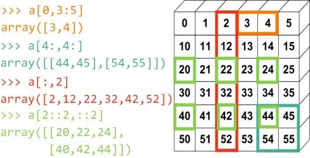
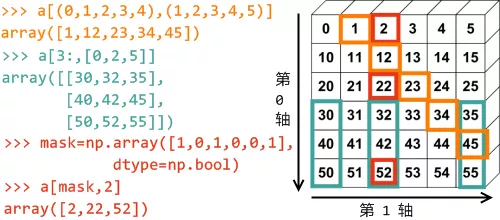

Numpy<br />NumPy是Python数值计算最重要的基础包，大多数提供科学计算的包都是用NumPy的数组作为构建基础。NumPy本身并没有提供多么高级的数据分析功能，理解NumPy数组以及面向数组的计算，将有助于你更加高效地使用诸如Pandas之类的工具。<br />虽然NumPy提供了通用的数值数据处理的计算基础，但大多数人可能还是想将Pandas作为统计和分析工作的基础，尤其是处理表格数据时。<br />Numpy是一个用python实现的科学计算的扩展程序库，包括：

- 一个强大的N维数组对象Array；
- 比较成熟的（广播）函数库；
- 用于整合C/C++和Fortran代码的工具包；
- 实用的线性代数、傅里叶变换和随机数生成函数。numpy和稀疏矩阵运算包scipy配合使用更加方便。

NumPy的部分功能如下：

- ndarray，一个具有矢量算术运算和复杂广播能力的快速且节省空间的多维数组。
- 用于对整组数据进行快速运算的标准数学函数（无需编写循环）。
- 用于读写磁盘数据的工具以及用于操作内存映射文件的工具。
- 线性代数、随机数生成以及傅里叶变换功能。
- 用于集成由C、C++、Fortran等语言编写的代码的A C API。

NumPy之于数值计算特别重要是因为它可以高效处理大数组的数据。这是因为：

- 比起Python的内置序列，NumPy数组使用的内存更少。
- NumPy可以在整个数组上执行复杂的计算，而不需要Python的for循环。
:::info
NumPy（Numeric Python）提供了许多高级的数值编程工具，如：矩阵数据类型、矢量处理，以及精密的运算库。专为进行严格的数字处理而产生。多为很多大型金融公司使用，以及核心的科学计算组织如：Lawrence Livermore，NASA用其处理一些本来使用C++，Fortran或Matlab等所做的任务。
:::
<a name="a25561ee"></a>
## 1、安装Numpy
可以通过 pip 或者 Anaconda安装Numpy:
```bash
$ pip install numpy
```
或
```bash
$ conda install numpy
```
<a name="3351904d"></a>
## 2、基础
NumPy最常用的功能之一就是NumPy数组：列表和NumPy数组的最主要区别在于功能性和速度。<br />列表提供基本操作，但NumPy添加了FTTs、卷积、快速搜索、基本统计、线性代数、直方图等。<br />两者数据科学最重要的区别是能够用NumPy数组进行元素级计算。

- axis 0：通常指行
- axis 1：通常指列
| 操作 | 描述 | 文档 |
| --- | --- | --- |
| `np.array([1.2,3])` | 一维数组 | [https://numpy.org/doc/stable/reference/generated/numpy.array.html](https://numpy.org/doc/stable/reference/generated/numpy.array.html) |
| `np.array([(1,2,3)，(4,5,6)])` | 二维数组 |  |
| `np.arange(start, stop, step)` | 等差数组 | [https://numpy.org/doc/stable/reference/generated/numpy.arange.html](https://numpy.org/doc/stable/reference/generated/numpy.arange.html) |

<a name="d39546f1"></a>
### 1.占位符
| 操作 | 描述 | 文档 |
| --- | --- | --- |
| `np.linspace(0,2,9)` | 数组中添加等差的值 | [https://numpy.org/doc/stable/reference/generated/numpy.linspace.html](https://numpy.org/doc/stable/reference/generated/numpy.linspace.html) |
| `np.zeros((1,2))` | 创建全0数组 | [https://numpy.org/doc/stable/reference/generated/numpy.zeros.html](https://numpy.org/doc/stable/reference/generated/numpy.zeros.html) |
| `np.ones((1.2))` | 创建全1数组 | [https://numpy.org/doc/stable/reference/generated/numpy.ones.html](https://numpy.org/doc/stable/reference/generated/numpy.ones.html) |
| `np.random.random( (5,5))` | 创建随机数的数组 | [https://docs.scipy.org/doc/numpy-1.15.0/reference/generated/numpy.random.random.html](https://docs.scipy.org/doc/numpy-1.15.0/reference/generated/numpy.random.random.html) |
| `np. empty((2,2))` | 创建空数组 | [https://numpy.org/doc/stable/reference/generated/numpy.empty.html](https://numpy.org/doc/stable/reference/generated/numpy.empty.html) |

举例：
```python
import numpy as np
# 1 dimensional
x = np.array([1,2,3])
# 2 dimensional
y = np.array([(1,2,3),(4,5,6)])
x = np.arange(3)
>>> array([0, 1, 2])
y = np.arange(3.0)
>>> array([ 0., 1., 2.])
x = np.arange(3,7)
>>> array([3, 4, 5, 6])
y = np.arange(3,7,2)
>>> array([3, 5])
```
<a name="G7B9s"></a>
### 2.数组属性
| 语法 | 描述 | 文档 |
| --- | --- | --- |
| `array.shape` | 维度（行，列） |  |
| `len(array)` | 数组长度 |  |
| `array.ndim` | 数组的维度数 |  |
| `array.size` | 数组的元素数 |  |
| `array. dtype` | 数组类型 | [https://numpy.org/doc/stable/reference/arrays.dtypes.html](https://numpy.org/doc/stable/reference/arrays.dtypes.html) |
| `array.astype(type)` | 转换数组类型 | [https://numpy.org/doc/stable/reference/generated/numpy.ndarray.astype.html](https://numpy.org/doc/stable/reference/generated/numpy.ndarray.astype.html) |
| `type(array)` | 显示数组类型 | [https://numpy.org/doc/stable/user/basics.types.html](https://numpy.org/doc/stable/user/basics.types.html) |

<a name="1f061b14"></a>
### 3.拷贝 /排序
| 操作 | 描述 | 文档 |
| --- | --- | --- |
| `np.copy(array)` | 创建数组拷贝 | [https://numpy.org/doc/stable/reference/generated/numpy.copy.html](https://numpy.org/doc/stable/reference/generated/numpy.copy.html) |
| `other=array.copy()` | 创建数组深拷贝 |  |
| `array.sort()` | 排序—个数组 | [https://numpy.org/doc/stable/reference/generated/numpy.sort.html](https://numpy.org/doc/stable/reference/generated/numpy.sort.html) |
| `array.sort(axis=0)` | 按照指定轴排<br />序一个数组 |  |

举例：
```python
import numpy as np
# Sort sorts in ascending order
y = np.array([10, 9, 8, 7, 6, 5, 4, 3, 2, 1])
y.sort()
print(y)
>>> [ 1  2  3  4  5  6  7  8  9  10]
```
<a name="RGDDJ"></a>
### 4.数组操作例程
<a name="d65fafd9"></a>
#### 增加或减少元素 
| 操作 | 描述 | 文档 |
| --- | --- | --- |
| `np.append(a,b)` | 增加数据项到数组 | [https://numpy.org/doc/stable/reference/generated/numpy.append.html](https://numpy.org/doc/stable/reference/generated/numpy.append.html) |
| `np.insert(array,1,2,axis)` | 沿着数组0轴或者1轴插入数据项 | [https://numpy.org/doc/stable/reference/generated/numpy.insert.html](https://numpy.org/doc/stable/reference/generated/numpy.insert.html) |
| `np.resize((2,4))` | 将数组调整为（2,4） | [https://numpy.org/doc/stable/reference/generated/numpy.resize.html](https://numpy.org/doc/stable/reference/generated/numpy.resize.html) |
| `np.delete(array,1,axis)` | 从数组里删除数据项 | [https://numpy.org/doc/stable/reference/generated/numpy.delete.html](https://numpy.org/doc/stable/reference/generated/numpy.delete.html) |

举例：
```python
import numpy as np
# Append items to array
a = np.array([(1, 2, 3),(4, 5, 6)])
b = np.append(a, [(7, 8, 9)])
print(b)
>>> [1 2 3 4 5 6 7 8 9]
# Remove index 2 from previous array
print(np.delete(b, 2))
>>> [1 2 4 5 6 7 8 9]
```
<a name="8922df2f"></a>
#### 组合数组 
| 操作 | 描述 | 文档 |
| --- | --- | --- |
| `np.concatenate((a,b) , axis=0)` | 连接2个数组，添加到末尾 | [https://numpy.org/doc/stable/reference/generated/numpy.concatenate.html](https://numpy.org/doc/stable/reference/generated/numpy.concatenate.html) |
| `np.vstack((a, b))` | 按照行堆叠数组 | [https://numpy.org/doc/stable/reference/generated/numpy.vstack.html](https://numpy.org/doc/stable/reference/generated/numpy.vstack.html) |
| `np. hstack ((a,b))` | 按照列堆叠数组 | [https://numpy.org/doc/stable/reference/generated/numpy.hstack.html](https://numpy.org/doc/stable/reference/generated/numpy.hstack.html) |

举例：
```python
import numpy as np
a = np.array([1, 3, 5])
b = np.array([2, 4, 6])
# Stack two arrays row-wise
print(np.vstack((a,b)))
>>> [[1 3 5]
     [2 4 6]]
# Stack two arrays column-wise
print(np.hstack((a,b)))
>>> [1 3 5 2 4 6]
```
<a name="rzZqb"></a>
#### 分割数组 
| 操作 | 描述 | 文档 |
| --- | --- | --- |
| `numpy.split()` | 分割数组 | [https://numpy.org/doc/stable/reference/generated/numpy.split.html](https://numpy.org/doc/stable/reference/generated/numpy.split.html) |
| `np.array_split(array，3)` | 将数组拆分为大小(几乎)相同的子数组 | [https://numpy.org/doc/stable/reference/generated/numpy.array_split.html](https://numpy.org/doc/stable/reference/generated/numpy.array_split.html) |
| `numpy.hsplit(array，3)` | 在第3个索引处水平拆分数组 | [https://numpy.org/doc/stable/reference/generated/numpy.hsplit.html](https://numpy.org/doc/stable/reference/generated/numpy.hsplit.html) |

举例：
```python
# Split array into groups of ~3
a = np.array([1, 2, 3, 4, 5, 6, 7, 8])
print(np.array_split(a, 3))
>>> [array([1, 2, 3]), array([4, 5, 6]), array([7, 8])]
```
<a name="XmT6g"></a>
#### 数组形状变化 

- 操作
| 操作 | 描述 | 文档 |
| --- | --- | --- |
| `other=ndarray.flatten()` | 平铺一个二维数组到一维数组 | [https://numpy.org/doc/stable/reference/generated/numpy.ndarray.flatten.html](https://numpy.org/doc/stable/reference/generated/numpy.ndarray.flatten.html) |
| `numpy.flip()` | 翻转一维数组中元素的顺序 | [https://numpy.org/doc/stable/reference/generated/numpy.flip.html](https://numpy.org/doc/stable/reference/generated/numpy.flip.html) |
| `np.ndarray[::-1]` | 翻转一维数组中元素的顺序 | [https://numpy.org/doc/stable/reference/generated/numpy.ndarray.html](https://numpy.org/doc/stable/reference/generated/numpy.ndarray.html) |
| `reshape` | 改变数组的维数 | [https://numpy.org/doc/stable/reference/generated/numpy.reshape.html](https://numpy.org/doc/stable/reference/generated/numpy.reshape.html) |
| `squeeze` | 从数组的形状中删除单维度条目 | [https://numpy.org/doc/stable/reference/generated/numpy.squeeze.html](https://numpy.org/doc/stable/reference/generated/numpy.squeeze.html) |
| `expand_dims` | 扩展数组维度 | [https://numpy.org/doc/stable/reference/generated/numpy.expand_dims.html](https://numpy.org/doc/stable/reference/generated/numpy.expand_dims.html) |

<a name="4LfIb"></a>
#### 其他
| 操作 | 描述 | 文档 |
| --- | --- | --- |
| `other=ndarray.flatten()` | 平铺一个二维数组到一维数组 | [https://numpy.org/doc/stable/reference/generated/numpy.ndarray.flatten.html](https://numpy.org/doc/stable/reference/generated/numpy.ndarray.flatten.html) |
| `array=np.transpose(other) array.T` | 转置数组 | [https://numpy.org/doc/stable/reference/generated/numpy.transpose.html](https://numpy.org/doc/stable/reference/generated/numpy.transpose.html) |
| `inverse=np.linalg.inv(matrix)` | 求矩阵的逆矩阵 | [https://numpy.org/doc/stable/reference/generated/numpy.linalg.inv.html](https://numpy.org/doc/stable/reference/generated/numpy.linalg.inv.html) |

举例：
```python
# Find inverse of a given matrix
>>> np.linalg.inv([[3,1],[2,4]])
array([[ 0.4, -0.1],
       [-0.2, 0.3]])
```
<a name="iowqw"></a>
### 5.数学计算操作 
| 操作 | 描述 | 文档 |
| --- | --- | --- |
| `np.add (x,y)x + y` | 加 | [https://numpy.org/doc/stable/reference/generated/numpy.add.html](https://numpy.org/doc/stable/reference/generated/numpy.add.html) |
| `np.substract(x, y)x - y` | 减 | [https://numpy.org/doc/stable/reference/generated/numpy.subtract.html](https://numpy.org/doc/stable/reference/generated/numpy.subtract.html) |
| `np. divide(x, y)x / y` | 除 | [https://numpy.org/doc/stable/reference/generated/numpy.divide.html](https://numpy.org/doc/stable/reference/generated/numpy.divide.html) |
| `np.multiply(x,y)x * y` | 乘 | [https://numpy.org/doc/stable/reference/generated/numpy.multiply.html](https://numpy.org/doc/stable/reference/generated/numpy.multiply.html) |
| `np.sqrt(x)` | 平方根 | [https://numpy.org/doc/stable/reference/generated/numpy.sqrt.html](https://numpy.org/doc/stable/reference/generated/numpy.sqrt.html) |
| `np.sin(x)` | 元素正弦 | [https://numpy.org/doc/stable/reference/generated/numpy.sin.html](https://numpy.org/doc/stable/reference/generated/numpy.sin.html) |
| `np.cos(x)` | 元素余弦 | [https://numpy.org/doc/stable/reference/generated/numpy.cos.html](https://numpy.org/doc/stable/reference/generated/numpy.cos.html) |
| `np.log(x)` | 元素自然对数 | [https://numpy.org/doc/stable/reference/generated/numpy.log.html](https://numpy.org/doc/stable/reference/generated/numpy.log.html) |
| `np. dot(x, y)` | 点积 | [https://numpy.org/doc/stable/reference/generated/numpy.dot.html](https://numpy.org/doc/stable/reference/generated/numpy.dot.html) |
| `np.roots([1,0,-4])` | 给定多项式系数的根 | [https://numpy.org/doc/stable/reference/generated/numpy.roots.html](https://numpy.org/doc/stable/reference/generated/numpy.roots.html) |

举例:
```python
# If a 1d array is added to a 2d array (or the other way), NumPy
# chooses the array with smaller dimension and adds it to the one
# with bigger dimension
a = np.array([1, 2, 3])
b = np.array([(1, 2, 3), (4, 5, 6)])
print(np.add(a, b))
>>> [[2 4 6]
     [5 7 9]]
     
# Example of np.roots
# Consider a polynomial function (x-1)^2 = x^2 - 2*x + 1
# Whose roots are 1,1
>>> np.roots([1,-2,1])
array([1., 1.])
# Similarly x^2 - 4 = 0 has roots as x=±2
>>> np.roots([1,0,-4])
array([-2., 2.])
```
<a name="Isoqv"></a>
#### 比较
| 操作 | 描述 |
| --- | --- |
| == | 等于 |
| != | 不等于 |
| < | 小于 |
| > | 大于 |
| <= | 小于等于 |
| >= | 大于等于 |
| np.array_equal(x,y) | 数组比较 |

举例：
```python
# Using comparison operators will create boolean NumPy arrays
z = np.array([1, 2, 3, 4, 5, 6, 7, 8, 9, 10])
c = z < 6
print(c)
>>> [ True  True  True  True  True False False False False False]
```
<a name="rKfmy"></a>
#### 基本的统计
| 操作 | 描述 | 文档 |
| --- | --- | --- |
| `np. mean(array)` | 计算数组的平均数 | [https://numpy.org/doc/stable/reference/generated/numpy.mean.html](https://numpy.org/doc/stable/reference/generated/numpy.mean.html) |
| `np.median(array)` | 计算数组的中位数 | [https://numpy.org/doc/stable/reference/generated/numpy.median.html](https://numpy.org/doc/stable/reference/generated/numpy.median.html) |
| `array.corrcoef()` | Correlation Coefficient<br />相关系数 | [https://numpy.org/doc/stable/reference/generated/numpy.corrcoef.html?highlight=corrcoef#numpy.corrcoef](https://numpy.org/doc/stable/reference/generated/numpy.corrcoef.html?highlight=corrcoef#numpy.corrcoef) |
| `np.std(array)` | 计算数组的标准差 | [https://numpy.org/doc/stable/reference/generated/numpy.std.html](https://numpy.org/doc/stable/reference/generated/numpy.std.html) |

举例:
```python
# Statistics of an array
a = np.array([1, 1, 2, 5, 8, 10, 11, 12])
# Standard deviation
print(np.std(a))
>>> 4.2938910093294167
# Median
print(np.median(a))
>>> 6.5
```
<a name="0ec9eaf9"></a>
#### 更多
| 操作 | 描述 | 文档 |
| --- | --- | --- |
| `array.sum()` | 数组求和 | [https://numpy.org/doc/stable/reference/generated/numpy.sum.html](https://numpy.org/doc/stable/reference/generated/numpy.sum.html) |
| `array.min()` | 数组求最小值 |  |
| `array.max(axis=0)` | 数组求最大值（沿着0轴） |  |
| `array.cumsum(axis=0)` | 指定轴求累积和 | [https://numpy.org/doc/stable/reference/generated/numpy.cumsum.html](https://numpy.org/doc/stable/reference/generated/numpy.cumsum.html) |

<a name="uwSmk"></a>
### 6.切片和子集
| 操作 | 描述 | 文档 |
| --- | --- | --- |
| `array[i]` | 索引i处的—维数组 | [https://numpy.org/doc/stable/reference/arrays.indexing.html](https://numpy.org/doc/stable/reference/arrays.indexing.html) |
| `array[i, j]` | 索引在[i][j]处的二维数组 |  |
| `array[i<4]` | 布尔索引 |  |
| `array[0:3]` | 选择索引为0,1和2 |  |
| `array[0:2,1]` | 选择第0,1行，第1列 |  |
| `array[:1]` | 选择第0行数据项(与[0:1,:]相同) |  |
| `array[1:2,:]` | 选择第1行 |  |
| `[comment] <>"` | `array[1, …]` | 等同于`array[1,:,:]` |
| `array[::-1]` | 反转数组 | 同上 |

举例:
```python
b = np.array([(1, 2, 3), (4, 5, 6)])
# The index *before* the comma refers to *rows*,
# the index *after* the comma refers to *columns*
print(b[0:1, 2])
>>> [3]
print(b[:len(b), 2])
>>> [3 6]
print(b[0, :])
>>> [1 2 3]
print(b[0, 2:])
>>> [3]
print(b[:, 0])
>>> [1 4]
c = np.array([(1, 2, 3), (4, 5, 6)])
d = c[1:2, 0:2]
print(d)
>>> [[4 5]]
```
切片举例:
```python
import numpy as np
a1 = np.arange(0, 6)
a2 = np.arange(10, 16)
a3 = np.arange(20, 26)
a4 = np.arange(30, 36)
a5 = np.arange(40, 46)
a6 = np.arange(50, 56)
a = np.vstack((a1, a2, a3, a4, a5, a6))
```
生成矩阵和切片图示<br /><br />
<a name="pmcgw"></a>
### 7.小技巧
<a name="65798258"></a>
#### 布尔索引
```python
# Index trick when working with two np-arrays
a = np.array([1,2,3,6,1,4,1])
b = np.array([5,6,7,8,3,1,2])
# Only saves a at index where b == 1
other_a = a[b == 1]
#Saves every spot in a except at index where b != 1
other_other_a = a[b != 1]
```
```python
import numpy as np
x = np.array([4,6,8,1,2,6,9])
y = x > 5
print(x[y])
>>> [6 8 6 9]
# Even shorter
x = np.array([1, 2, 3, 4, 4, 35, 212, 5, 5, 6])
print(x[x < 5])
>>> [1 2 3 4 4]
```
<a name="9vBNu"></a>
## 3、NumPy的ndarray：N维数组对象
NumPy最重要的是其N维数组对象（即ndarray），其中的所有元素必须是相同类型的。该对象是一个快速而灵活的大数据集容器，可以利用这种数组对整块数据执行数学运算，其语法跟标量元素之间的运算一样。
<a name="ynuF8"></a>
### 创建ndarray
<a name="pAvI4"></a>
#### 使用`np.array(list/tuple, dtype=np.float32)`函数，产生一个新的含有传入数据的ndarray对象。
第一个参数为元组、列表（相同数据类型），第二个参数为ndarray数组中的数据类型。当第二个参数为空时，NumPy将根据数据情况指定一个类型。<br />返回值为[ ]形式，元素间由空格分割。
```python
In [20]: arr1 = np.array([6, 7.5, 8, 0, 1])   #从列表创建
In [21]: pring(arr1)
Out[21]: [ 6. ,  7.5,  8. ,  0. ,  1. ]     #NumPy根据数据情况，指定了float类型
In [23]: arr2 = np.array([[1, 2, 3, 4], [5, 6, 7, 8],(1.2 , 2.3)])
In [24]: pring(arr2)
Out[24]: [[1, 2, 3, 4] [5, 6, 7, 8] (1.2 , 2.3)]
```
<a name="9yKoK"></a>
#### 使用NumPy中的内置函数
`np.arange(begin,end,step,dtype=np.float32)`：begin为元素起始值（包含），end为元素结束值（不包含），step为步长（默认值为1），dtype为元素类型。如果只有一个参数n，则为从0到n-1；如有有两个参数n和m，则为从n到m-1；<br />`np.linspace(begin,end,number)`：创建包含number个元素的数组，并在指定的开始值（包含）和结束值（包含）之间平均间隔；<br />`np.ones(shape)`：根据shape生成一个全1数组，shape是元组类型，比如(2,3)；<br />`np.zeros(shape)`：根据shape生成一个全0数组，shape是元组类型，比如(2,3,4)；<br />`np.full(shape,val)`：根据shape生成一个数组，每个元素值都是val；<br />`np.eye(n)`：创建一个正方的n*n单位矩阵，对角线为1，其余为0；<br />`np.ones_like(a)`：根据数组a的形状生成一个全1数组；<br />`np.zeros_like(a)`：根据数组a的形状生成一个全0数组；<br />`np.full_like(a,val)`：根据数组a的形状生成一个每个元素值都是val的数组；<br />`np.concatenate()` ：将两个或多个数组合并成一个新的数组。
```python
In [30]: arr3 = np.zeros((3, 6))
In [31]: print(arr3)
Out[30]: [[ 0.,  0.,  0.,  0.,  0.,  0.] [ 0.,  0.,  0.,  0.,  0.,  0.] [ 0.,  0.,  0.,  0.,  0.,  0.]]
```

- 从磁盘读取数据创建ndarray数组，将ndarray数组保存到磁盘（大部分情况会使用pandas或其它工具加载文本或表格数据）

`np.load(fname)`<br />• `fname` : 文件名，以`.npy`为扩展名，压缩扩展名为`.npz`<br />`np.save(fname, array)` 或 `np.savez(fname, array)`<br />• `fname` : 文件名，以`.npy`为扩展名，压缩扩展名为`.npz`<br />• `array` : 数组变量
<a name="hhFwI"></a>
### ndarray数组对象的属性

- `.ndim`：秩，即轴的数量或维度的数量
- `.shape`：ndarray对象的尺度，对于矩阵，n行m列
- `.size`：ndarray对象元素的个数，相当于`.shape`中n*m的值
- `.dtype`：ndarray对象的元素类型
- `.itemsize`：ndarray对象中每个元素的大小，以字节为单位
<a name="eFzXQ"></a>
### ndarray数组对象的类型和维度变换

- `.astype(np.float64)`：将ndarray数组元素从一个类型转换成另一个类型，返回一个新数组。如果将浮点数转换成整数，则小数部分将会被截取删除。（类型变换）
- `.reshape(shape)`：不改变原数组元素，返回一个新的shape维度的数组（维度变换）
- `.resize(shape)`：与.reshape()功能一致，但修改原数组（维度变换）
- `.swapaxes(ax1,ax2)`：将数组n个维度中两个维度进行调换（维度变换）
- `.flatten()`：对数组进行降维，返回折叠后的一维数组，原数组不变（维度变换）
- `.tolist()`：将N维数组转换成列表（维度变换）
<a name="MyAaw"></a>
### ndarray数组的索引和切片
<a name="5f53f3e1"></a>
#### 1、基本的索引和切片
基本索引与切片与Python列表操作类似
```python
arr = [1,2,3,4,5]
arr[2:4]  #[3,4]
```
当把标量值赋予给一个切片时（如`arr[2:4]=12`），该值会广播到整个选区。注意数组切片是原始数组的视图。这意味着数据不会被复制，视图上的任何修改都会直接反映到源数据上。<br />多维数据索引中，索引位置上的元素不是标量，而是一维数组了
```python
arr2=np.array([[1,2,3],[4,5,6],[7,8,9]])
arr2[2] #array(7,8,9)
```
多维数组的递归访问
```python
arr2[0][2]  #3
arr2[0,2]   #3在pandas中不提倡递归访问，这样速度回慢
```
切片索引
```python
arr2[:2,1:] #array([[2,3],[5,6])
```
<a name="MQG38"></a>
#### 2、布尔索引
即根据布尔型数组进行数组索引，布尔型数组的长度必须与被索引的轴的长度一致
```python
arr3 = np.array([1,2,3,4,5])
char= np.array(['A','B','A','C','D'])
char == 'A'
#array([True,False,True,False,False])
arr3[char == 'A']
#array([1,3])
```
<a name="6ae70b93"></a>
#### 3、花式索引
是指利用整数数组进行索引，为了以特定的顺序选取行子集，只需传入一个用于指定顺序的整数列表或ndarray即可：
```python
arr = np.empty((8,4))
for i in range(8):
    arr[i]=i
arr
Out[23]: 
array([[ 0.,  0.,  0.,  0.],
       [ 1.,  1.,  1.,  1.],
       [ 2.,  2.,  2.,  2.],
       ..., 
       [ 5.,  5.,  5.,  5.],
       [ 6.,  6.,  6.,  6.],
       [ 7.,  7.,  7.,  7.]])
arr[[4,3,0,6]]
Out[24]: 
array([[ 4.,  4.,  4.,  4.],
       [ 3.,  3.,  3.,  3.],
       [ 0.,  0.,  0.,  0.],
       [ 6.,  6.,  6.,  6.]])
```

花式索引跟切片不一样，它总是将数据复制到新数组中
<a name="xGMpw"></a>
### ndarray数组的运算

- 数组与标量之间的运算，都会作用于数组的每一个元素；
- 大小相同的数组之间的任何算术运算，都会将运算应用到元素级；
- 大小相同的数组之间的比较运算，都会将运算应用到元素级并生成布尔值数组；
- `np.abs(arr)\np.fabs(arr)`：计算数组arr各元素的绝对值
- `np.sqrt(arr)`：计算数组arr各元素的平方根
- `np.square(arr)`：计算数组arr各元素的平方
- `np.log(arr)\np.log10(arr)\np.log2(arr)`：计算数组arr各元素的自然对数、10底对数和2底对数
- `np.ceil(arr)\np.floor(arr)`：计算数组arr各元素的ceiling值 或 floor值
- `np.rint(arr)` ：计算数组arr各元素的四舍五入值
- `np.modf(arr)`：将数组arr各元素的小数和整数部分以两个独立数组形式返回
- `np.cos(arr)\np.cosh(arr)\np.sin(arr)\np.sinh(arr)\np.tan(arr)\np.tanh(arr)`：计算数组arr各元素的普通型和双曲型三角函数
- `np.exp(arr)` ：计算数组arr各元素的指数值
- `np.sign(arr)` ：计算数组arr各元素的符号值，1(+), 0, ‐1(‐)
<a name="5cbL5"></a>
### 利用ndarray进行数据处理
<a name="qCglQ"></a>
#### 排序
ndarray数组通过`.sort()`函数排序，多维数组时传入轴编号
<a name="vc3Uh"></a>
### NumPy的随机数函数

- `np.random.rand(d0,d1,..,dn)`：根据d0‐dn创建随机数数组，浮点数，[0,1)，均匀分布
- `np.random.randn(d0,d1,..,dn)`：根据d0‐dn创建随机数数组，标准正态分布
- `np.random.randint(low[,high,shape])`：根据shape创建随机整数或整数数组，范围是[low, high)
- `np.random.seed(s)`：随机数种子，s是给定的种
- `np.random.shuffle(a)`：根据数组a的第1轴进行随排列，改变数组x
- `np.random.permutation(a)`：根据数组a的第1轴产生一个新的乱序数组，不改变数组x
- `np.random.choice(a[,size,replace,p])`：从一维数组a中以概率p抽取元素，形成size形状新数组 replace表示是否可以重用元素，默认为False
- `np.random.uniform(low,high,size)`：产生具有均匀分布的数组,low起始值,high结束值,size形状
- `np.random.normal(loc,scale,size)`：产生具有正态分布的数组,loc均值,scale标准差,size形状
- `np.random.poisson(lam,size)`：产生具有泊松分布的数组,lam随机事件发生率,size形状
<a name="kMO08"></a>
### NumPy的统计类函数

- `np.sum(a, axis=None)`：根据给定轴axis计算数组a相关元素之和，axis整数或元组
- `np.mean(a, axis=None)`：根据给定轴axis计算数组a相关元素的期望，axis整数或元组
- `np.average(a,axis=None,weights=None)`：根据给定轴axis计算数组a相关元素的加权平均值
- `np.std(a, axis=None)`：根据给定轴axis计算数组a相关元素的标准差
- `np.var(a, axis=None)`：根据给定轴axis计算数组a相关元素的方差
- `np.min(a)\max(a)`：计算数组a中元素的最小值、最大值
- `np.argmin(a)\argmax(a)`：计算数组a中元素最小值、最大值的降一维后下标
- `np.unravel_index(index, shape)`：根据shape将一维下标index转换成多维下标
- `np.ptp(a)`：计算数组a中元素最大值与最小值的差
- `np.median(a)`：计算数组a中元素的中位数（中值）
<a name="aPu3G"></a>
### NumPy的梯度函数
梯度：连续值之间的变化率，即斜率<br />XY坐标轴连续三个X坐标对应的Y轴值：a, b, c，其中，b的梯度是：(c‐a)/2

- `np.gradient(f)`：计算数组f中元素的梯度，当f为多维时，返回每个维度梯度
