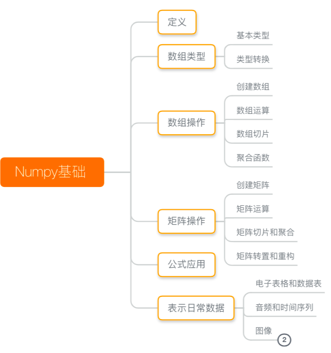
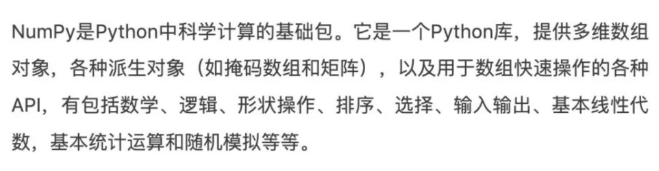
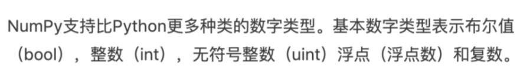
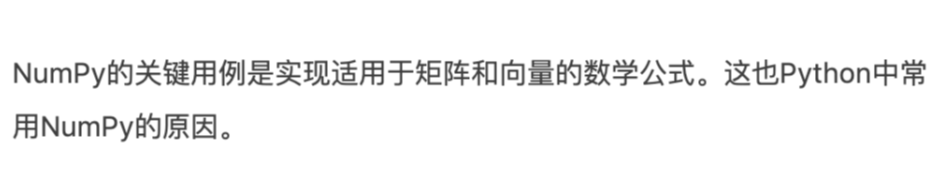
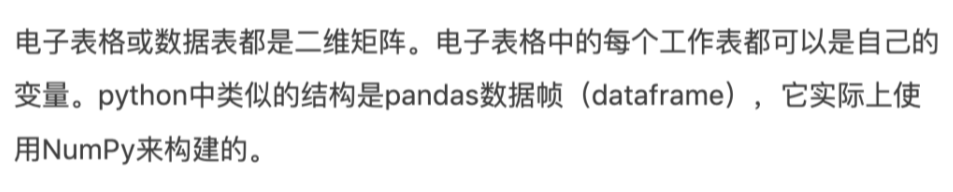
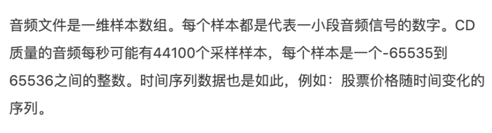
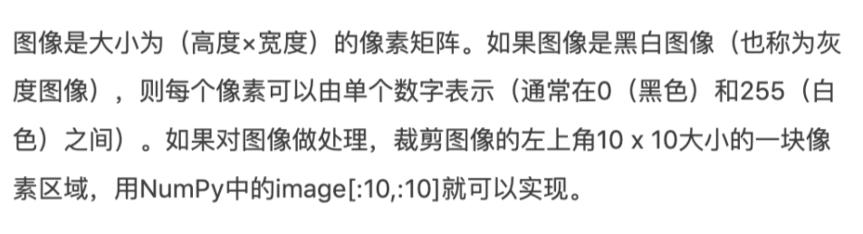
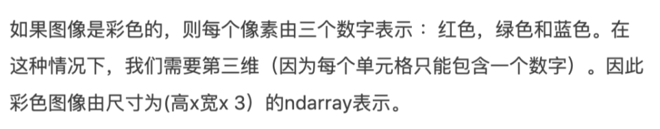

Python Numpy<br />
<a name="yDMLR"></a>
## 定义

<a name="UA4Rx"></a>
## 数组类型
<a name="Qg1Lw"></a>
### 基本类型

<a name="ZESNi"></a>
### 类型转换
In:
```python
j = np.arange(3)  
print(j)
print('查看数据类型：\n',j.dtype)
print('-'*20)
g = j.astype('float') #转换为float类型
print('查看转换后类型：\n',g.dtype)
```
Out:
```python
[0 1 2]
查看数据类型：
 int64
--------------------
查看转换后类型：
 float64
```
<a name="S8wFt"></a>
## 数组操作
<a name="nIfLQ"></a>
### 创建数组
In:
```python
#方法一、将列表或元组传入np.array()来创建
print(np.array([1,2,3])) 
#方法二、初始化数组的值,只需传入元素个数即可
print(np.ones(3))
print(np.zeros(3))
print(np.random.random(3))
```
Out:
```python
[1 2 3]
[1. 1. 1.]
[0. 0. 0.]
[0.71318806 0.95903425 0.75384478]
```
<a name="FNEUF"></a>
### 数组运算
In:
```python
#首先创建两个数组
data1 = np.array([1,2])
data2 = np.ones(2)
print(data1,data2)
```
Out:
```python
[1 2] [1. 1.]
```
In:
```python
#数组间加减乘除
jia = data1+data2
jian = data1-data2
cheng = data1*data2
chu = data1/data2
#数组与单个数值的操作
shuzhi1 = data1*100
shuzhi2 = data1/100
print(jia,jian,cheng,chu,shuzhi1,shuzhi2)
```
Out:
```python
[2. 3.] [0. 1.] [1. 2.] [1. 2.] [100 200] [0.01 0.02]
```
<a name="tAgVq"></a>
### 数组切片
In:
```python
#类似列表操作进行索引和切片
data3 = np.array([1,2,3,4,5])
print(data3)
print(data3[0])
print(data3[2:4])
print(data3[2:])
print(data3[:4])
```
Out:
```python
[1 2 3 4 5]
1
[3 4]
[3 4 5]
[1 2 3 4]
```
<a name="Uxoxp"></a>
### 聚合函数
In:
```python
data4 = np.array([1,2,3,4,5])
print(data4.max()) #最大值
print(data4.min()) #最小值
print(data4.mean()) #均值
print(data4.sum()) #求和
print(data4.std()) #标准差
```
Out:
```python
5
1
3.0
15
1.4142135623730951
```
<a name="UTQpV"></a>
## 矩阵操作
<a name="PnCmR"></a>
### 创建矩阵
In:
```python
#方法一、通过将二维列表传给Numpy来创建矩阵
print(np.array([[1,2],[3,4]]))
#方法二、传入一个元组来描述矩阵的维度
print(np.ones((3,2))) #3行2列矩阵
print(np.zeros((3,2))) 
print(np.random.random((3,2))) 
```
Out:
```python
[[1 2]
 [3 4]]
[[1. 1.]
 [1. 1.]
 [1. 1.]]
[[0. 0.]
 [0. 0.]
 [0. 0.]]
[[0.2928769  0.24093443]
 [0.06189287 0.62359846]
 [0.80539105 0.81706549]]
```
<a name="NButv"></a>
### 矩阵运算
In:
```python
#相同大小矩阵的加减乘除
data5 = np.array([[1,2],[3,4]])
data6 = np.ones((2,2))
jia1 = data5 + data6
cheng1 = data5 * data6
print(jia1,'\n',cheng1)
```
Out:
```python
[[2. 3.]
 [4. 5.]] 
 [[1. 2.]
 [3. 4.]]
```
In:
```python
#不同大小矩阵的加减乘除（仅两个矩阵秩数为1时）
data7 = np.array([[1,2],[3,4],[5,6]])
data8_1 = np.ones((1,2)) #行秩为1
data8_2 = np.ones((3,1)) #列秩为1
print(data7 + data8_1)
print('-'*20)
print(data7 + data8_2)
```
Out:
```python
[[2. 3.]
 [4. 5.]
 [6. 7.]]
--------------------
[[2. 3.]
 [4. 5.]
 [6. 7.]]
```
In:
```python
#矩阵乘法，dot()方法
data9 = np.array([[1,2,3]]) #1*3的矩阵
data10 = np.array([[1,2],[3,4],[5,6]]) #3*2的矩阵
data11 = data9.dot(data10) #1*2的矩阵
print(data11)
```
Out:
```python
[[22 28]]
```
<a name="BId8j"></a>
### 矩阵切片和聚合
In:
```python
#可以在不同维度上使用索引操作来对数据进行切片
data12 = np.array([[1,2],[3,4],[5,6]])
print(data12)
print(data12[0,1]) #1行2列数据
print(data12[1:3]) #2-3行
print(data12[0:2,0]) #1-2行，1列
```
Out:
```python
[[1 2]
 [3 4]
 [5 6]]
2
[[3 4]
 [5 6]]
[1 3]
```
In:
```python
#可以像聚合向量一样聚合矩阵
print(data12.max())
print(data12.min())
print(data12.sum())
print(data12.mean())
print(data12.std())
#还可以使用axis参数指定行和列的聚合
print(data12.max(axis = 0)) #纵向执行
print(data12.max(axis = 1)) #横向执行
```
Out:
```python
6
1
21
3.5
1.707825127659933
[5 6]
[2 4 6]
```
<a name="LSk4Y"></a>
### 矩阵转置和重构
In:
```python
#NumPy数组的属性T可用于获取矩阵的转置
print('转置前：\n',data12)
print('转置后：\n',data12.T)
```
Out:
```python
转置前：
 [[1 2]
 [3 4]
 [5 6]]
转置后：
 [[1 3 5]
 [2 4 6]]
```
In:
```python
#在较为复杂的用例中，可能需要使用NumPy的reshape()方法改变某个矩阵的维度
data13 = np.array([1,2,3,4,5,6])
print('重构前：\n',data13)
print('重构后：\n',data13.reshape(2,3))
print('重构后：\n',data13.reshape(3,2))
```
Out:
```python
重构前：
 [1 2 3 4 5 6]
重构后：
 [[1 2 3]
 [4 5 6]]
重构后：
 [[1 2]
 [3 4]
 [5 6]]
```
In:
```python
#上文中的所有功能都适用于多维数据,其中心数据结构称为ndarray（N维数组）
data14 = np.array([[[1,2],[3,4]],[[5,6],[7,8]]])
print(data14)
print('-'*20)
#改变维度只需在NumPy函数的参数中添加一个逗号和维度
print(np.ones((4,3,2)))
print('-'*20)
print(np.zeros((4,3,2)))
print('-'*20)
print(np.random.random((4,3,2)))
```
Out:
```python
[[[1 2]
  [3 4]]

 [[5 6]
  [7 8]]]
--------------------
[[[1. 1.]
  [1. 1.]
  [1. 1.]]

 [[1. 1.]
  [1. 1.]
  [1. 1.]]

 [[1. 1.]
  [1. 1.]
  [1. 1.]]

 [[1. 1.]
  [1. 1.]
  [1. 1.]]]
--------------------
[[[0. 0.]
  [0. 0.]
  [0. 0.]]

 [[0. 0.]
  [0. 0.]
  [0. 0.]]

 [[0. 0.]
  [0. 0.]
  [0. 0.]]

 [[0. 0.]
  [0. 0.]
  [0. 0.]]]
--------------------
[[[0.37593802 0.42651876]
  [0.74639264 0.19783467]
  [0.787414   0.63820259]]

 [[0.84871262 0.46467497]
  [0.54633954 0.4376995 ]
  [0.71988166 0.9306682 ]]

 [[0.6384108  0.74196991]
  [0.73857164 0.38450555]
  [0.68579442 0.64018511]]

 [[0.60382775 0.35889667]
  [0.8625612  0.86523028]
  [0.83701853 0.08289658]]]
```
<a name="jGCpy"></a>
## 公式应用
<br />In:
```python
#在NumPy中可以很容易地实现均方误差。
np_1 = np.ones(3)
np_2 = np.array([1,2,3])
error = (1/3) * np.sum(np.square(np_1 - np_2))
print(error)
```
Out:
```python
1.6666666666666665
```
<a name="TCaAf"></a>
## 表示日常数据
<a name="DJiGg"></a>
### 电子表格和数据表

<a name="g4Wxy"></a>
### 音频和时间序列

<a name="CmCKy"></a>
### 图像
<a name="n3AdQ"></a>
#### 黑白图像

<a name="wEjCc"></a>
#### 彩色图像

