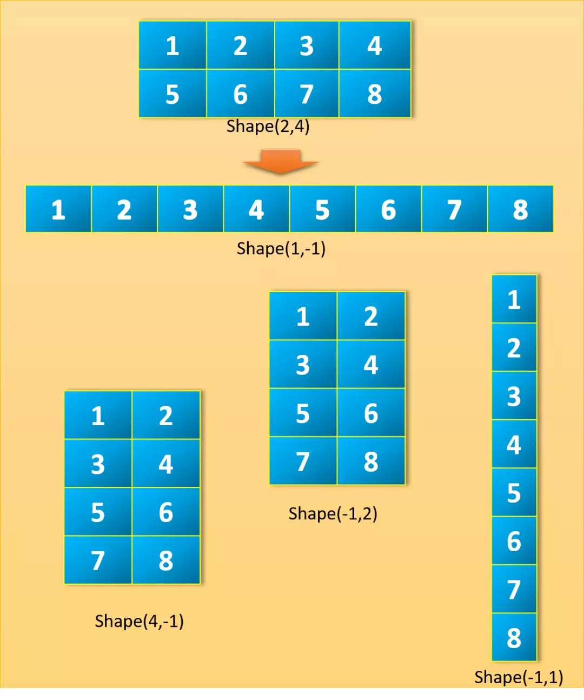
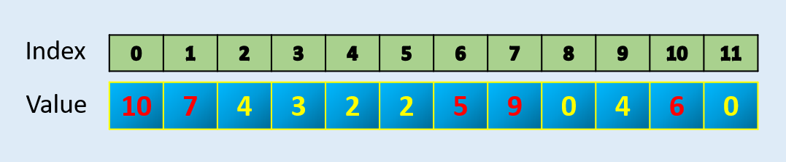
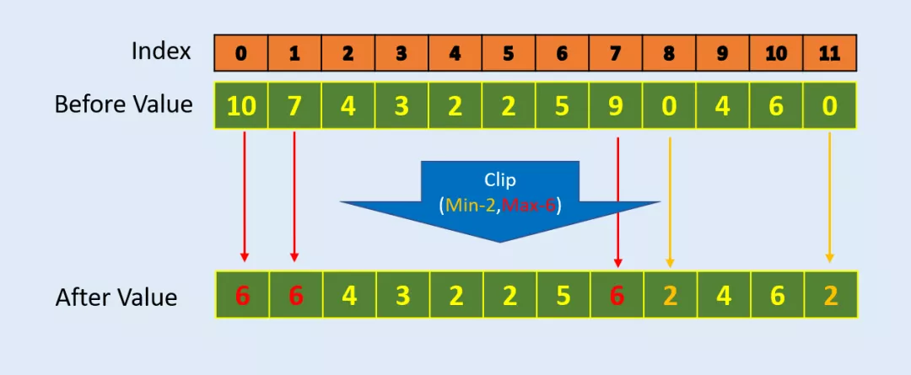
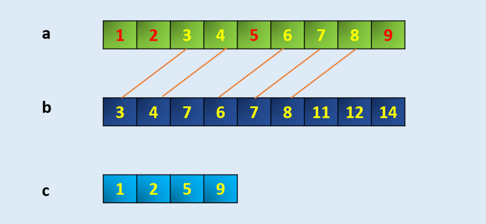

Python Numpy
<a name="jCvzu"></a>
## 在 reshape 函数中使用参数-1
Numpy 允许根据给定的新形状重塑矩阵，新形状应该和原形状兼容。有意思的是，可以将新形状中的一个参数赋值为-1。这仅仅表明它是一个未知的维度，希望 Numpy 来算出这个未知的维度应该是多少：Numpy 将通过查看数组的长度和剩余维度来确保它满足上述标准。来看以下例子： <br /><br />_维度为-1 的不同 reshape 操作图示。_
```python
a = np.array([[1, 2, 3, 4],
              [5, 6, 7, 8]])
a.shape
(2, 4)
```
假设给定行参数为 1，列参数为-1，那么 Numpy 将计算出 reshape 后的列数为 8。
```python
a.reshape(1,-1)
array([[1, 2, 3, 4, 5, 6, 7, 8]])
```
假设给定行参数为-1，列参数为 1，那么 Numpy 将计算出 reshape 后的行数为 8。
```python
a.reshape(-1,1)
array([[1],
       [2],
       [3],
       [4],
       [5],
       [6],
       [7],
       [8]])
```
下面的代码也是一样的道理。
```python
a.reshape(-1,4)
array([[1, 2, 3, 4],
       [5, 6, 7, 8]])a.reshape(-1,2)
array([[1, 2],
       [3, 4],
       [5, 6],
       [7, 8]])a.reshape(2,-1)
array([[1, 2, 3, 4],
       [5, 6, 7, 8]])a.reshape(4,-1)
array([[1, 2],
       [3, 4],
       [5, 6],
       [7, 8]])
```
这也适用于任何更高维度张量的 reshape，但是只有一个维度的参数能赋值为-1。
```python
a.reshape(2,2,-1)
array([[[1, 2],
        [3, 4]],
       [[5, 6],
        [7, 8]]])a.reshape(2,-1,1)
array([[[1],
        [2],
        [3],
        [4]],
       [[5],
        [6],
        [7],
        [8]]])
```
如果尝试 reshape 不兼容的形状或者是给定的未知维度参数多于 1 个，那么将会报错。
```
a.reshape(-1,-1)
ValueError: can only specify one unknown dimensiona.reshape(3,-1)
ValueError: cannot reshape array of size 8 into shape (3,newaxis)
```
总而言之，当试图对一个张量进行 `reshape` 操作时，新的形状必须包含与旧的形状相同数量的元素，这意味着两个形状的维度乘积必须相等。当使用 -1 参数时，与-1 相对应的维数将是原始数组的维数除以新形状中已给出维数的乘积，以便维持相同数量的元素。
<a name="P4QW6"></a>
## Argpartition：在数组中找到最大的 N 个元素。
<br />Numpy 的 `argpartion` 函数可以高效地找到 N 个最大值的索引并返回 N 个值。在给出索引后，可以根据需要进行值排序。
```python
array = np.array([10, 7, 4, 3, 2, 2, 5, 9, 0, 4, 6, 0])index = np.argpartition*(array, -5)[-5:]
index
array([ 6,  1, 10,  7,  0], dtype=int64)np.sort(array[index])
array([ 5,  6,  7,  9, 10])
```
<a name="8vB1E"></a>
## Clip：如何使数组中的值保持在一定区间内
在很多数据处理和算法中（比如强化学习中的 PPO），需要使得所有的值保持在一个上下限区间内。Numpy 内置的 Clip 函数可以解决这个问题。Numpy clip () 函数用于对数组中的值进行限制。给定一个区间范围，区间范围外的值将被截断到区间的边界上。例如，如果指定的区间是 [-1,1]，小于-1 的值将变为-1，而大于 1 的值将变为 1。<br /><br />Clip 示例：限制数组中的最小值为 2，最大值为 6。
```python
#Example-1
array = np.array([10, 7, 4, 3, 2, 2, 5, 9, 0, 4, 6, 0])
print (np.clip(array,2,6))[6 6 4 3 2 2 5 6 2 4 6 2]#Example-2
array = np.array([10, -1, 4, -3, 2, 2, 5, 9, 0, 4, 6, 0])
print (np.clip(array,2,5))[5 2 4 2 2 2 5 5 2 4 5 2]
```
<a name="5ca924b0"></a>
## Extract：从数组中提取符合条件的元素
可以使用 Numpy `extract()` 函数从数组中提取符合条件的特定元素。<br />
```python
arr = np.arange(10)
arrarray([0, 1, 2, 3, 4, 5, 6, 7, 8, 9])# Define the codition, here we take MOD 3 if zero
condition = np.mod(arr, 3)==0
conditionarray([ True, False, False,  True, False, False,  True, False, False,True])np.extract(condition, arr)
array([0, 3, 6, 9])
```
同样地，如果有需要，可以用 AND 和 OR 组合的直接条件，如下所示：
```python
np.extract(((arr > 2) & (arr < 8)), arr)array([3, 4, 5, 6, 7])
```
<a name="fYyfJ"></a>
## setdiff1d：如何找到仅在 A 数组中有而 B 数组没有的元素
返回数组中不在另一个数组中的独有元素。这等价于两个数组元素集合的差集。<br />
```python
a = np.array([1, 2, 3, 4, 5, 6, 7, 8, 9])
b = np.array([3,4,7,6,7,8,11,12,14])
c = np.setdiff1d(a,b)
carray([1, 2, 5, 9])
```
