Python Numpy

- ① `np.random.random`：生成指定形状的0-1之间的随机数；
- ② `np.random.rand`：生成指定形状的0-1之间的随机数；
- ③ `np.random.randint`：生成指定数值范围内的随机整数；
- ④ `np.random.randn`：生成服从均值为0，标准差为1的标准正态分布随机数；
- ⑤ `np.random.normal`：生成指定均值和标准差的正态分布随机数；
- ⑥ `np.random.uniform`：生成均匀分布随机数；
- ⑦ `np.random.seed`：按照种子来生成随机数，种子一样，生成的随机数也一样；
- ⑧ `np.random.shuffle`：打乱数组元素顺序；
- ⑨ `np.random.choice`：按照指定概率从指定数组中，随机抽出某个数；
<a name="RDyRq"></a>
### ① 生成指定形状的0-1之间的随机数：`np.random.random()`和`np.random.rand()`
```python
array1 = np.random.random((3))
print(array1)

array2 = np.random.random((3,4))
print(array2)

# -----------------------------------
array3 = np.random.rand(3)
print(array3)

array4 = np.random.rand(2,3)
print(array4)
```
结果如下：<br />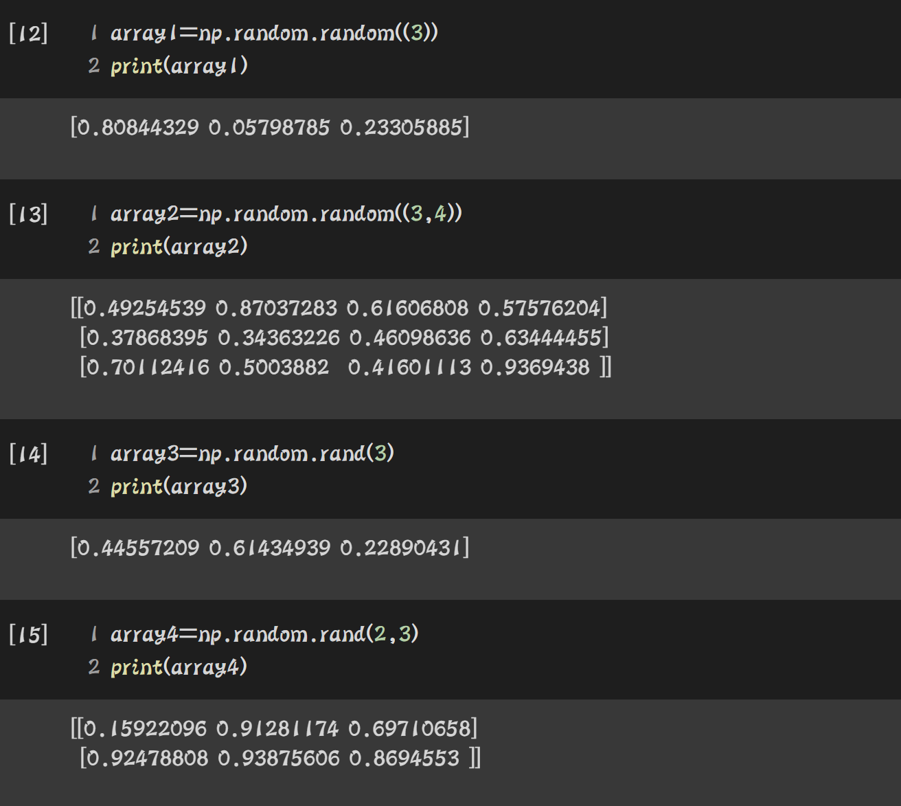<br />但是呢，这两种函数经常容易写错，比如下面这种写法：
```python
array5 = np.random.random(3,4)
print(array5)

array6 = np.random.rand((2,3))
print(array6)
```
结果如下：<br />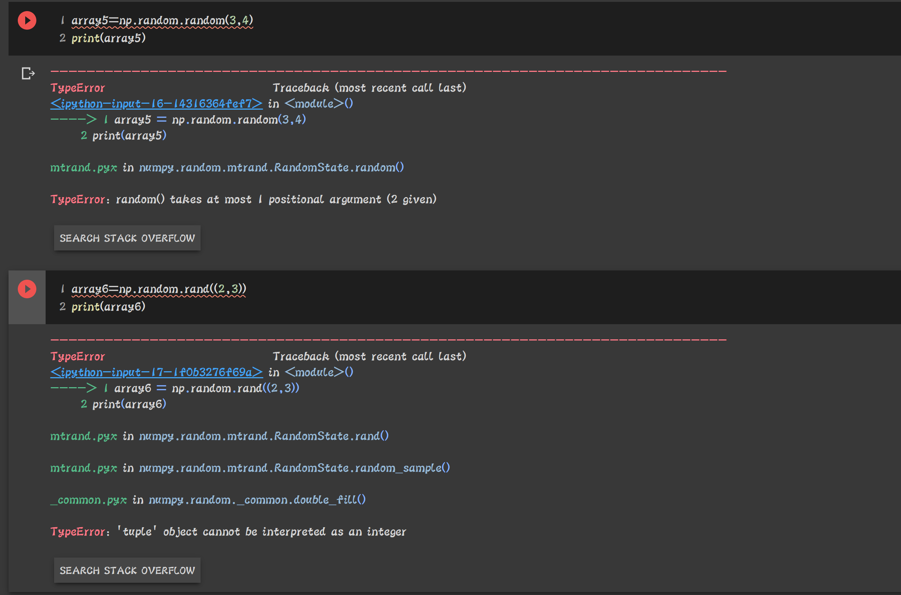<br />所以，大家应该注意它们的区别：<br />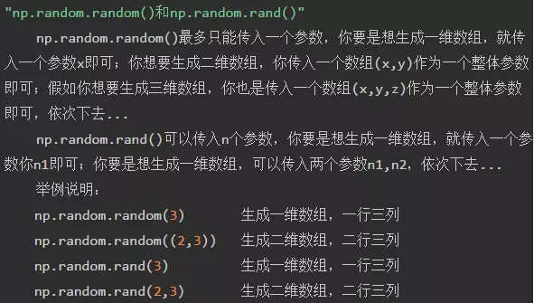
<a name="UBp56"></a>
### ② 生成指定数值范围内的随机整数：`np.random.randint()`
先给大家介绍这个函数的语法和参数含义：

- 语法：`np.random.randint(low=, high=1, size=, dtype=)`
- `low`和`high`表示指定范围的最大值和最小值。
- `size`既可以体现生成数组的元素个数，又可以体现生成数组的维数，当`size`等于某个数x的时候，代表生成的是一维数组，数组元素个数为`x`；当size等于某个元组`(x,y)`的时候，代表生成的是二维数组，数组元素个数为`x * y`，其中x表示行数，`y`表示列数。当然`size=(x,y,z)`的时候，生成的就是一个三维数组。
- `dtype`表示可以指定生成数组的数据类型，注意此函数生成的是整数，因此这里只能指定是`np.int32`或`np.int64`，肯定不能写成`float`。
```python
array7 = np.random.randint(low=1, high=10, size=6, dtype=np.int32)
print(array7)

array8 = np.random.randint(low=1, high=10, size=(2,3), dtype=np.int64)
print(array8)

array9 = np.random.randint(low=1, high=10, size=(2,3,4), dtype=np.int32)
print(array9)
```
结果如下：<br />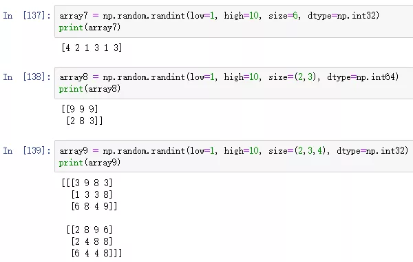
<a name="EajTa"></a>
### ③ 与正态分布有关的几个随机函数：`np.random.randn()`和`np.random.normal()`

- `np.random.randn`：生成服从均值为0，标准差为1的标准正态分布随机数；
- `np.random.normal` ：生成指定均值和标准差的正态分布随机数；
```python
array10 = np.random.randn(3)
print(array10)

array11 = np.random.randn(2,3)
print(array11)

array12 = np.random.normal(loc=2,scale=0.5,size=6)
print(array12)

array13 = np.random.normal(loc=2,scale=0.5,size=6).reshape(2,3)
print(array13)
```
结果如下：<br />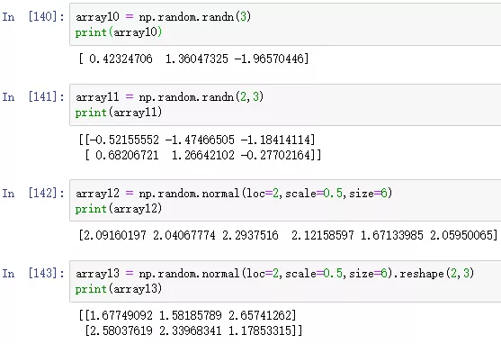<br />关于上述两个函数，这里有如下知识点要介绍：<br />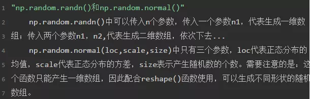
<a name="T4vv0"></a>
### ④ 均匀分布随机函数：`np.random.uniform()`

- 用法：生成指定范围内的服从均匀分布的随机数；
```python
array14 = np.random.uniform(1,10,5)
print(array14)

array15 = np.random.uniform(1,10,(2,3))
print(array15)
```
结果如下：<br />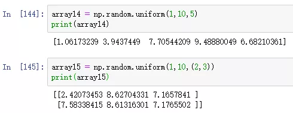
<a name="AryQ9"></a>
### ⑤ `np.random.seed()`：按照种子来生成随机数，种子一样，则生成的随机数结果必一致
该函数可以传入任意一个整数值，作为一颗种子。就把这个整数值想象成一可桃树种子，当然这棵种子得到的结果肯定是桃树，当要再生成一棵桃树，肯定还要设置相同的整数值作为桃树种子，这样长出来的才会是一样的桃树。<br />类比产生随机数数组，也是同样的道理，当设置了一个随机种子，那么会产生一个随机数组。如果要生成相同的随机数组，就必须设置相同的随机种子，这样最终产生的随机数组才会是一样。<br />当不传入任何数字的时候，代表默认传入的是系统的默认事件，每一刻传入的值都是不一样的。<br />当函数中，传入同一个随机种子，会产生相同的随机数。
```python
np.random.seed(3)
a = np.random.rand(3)
print(a)
np.random.seed(3)
b = np.random.rand(3)
print(b)
```
结果如下：<br />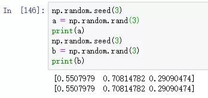<br />当不传入任何数字的时候，系统会随机传入不同的值，此时产生的随机数，就不一定相同了。
```python
np.random.seed()
a = np.random.rand(3)
print(a)
np.random.seed()
b = np.random.rand(3)
print(b)
```
结果如下：<br />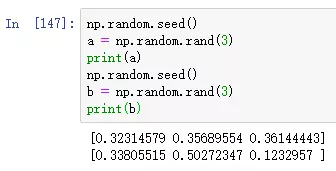
<a name="XSwwy"></a>
### ⑥ `np.random.shuffle()`：打乱数组元素顺序(原地操作数组)
```python
c = np.arange(10)
print(c)
np.random.shuffle(c)
print(c)
```
结果如下：<br />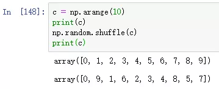
<a name="Tez58"></a>
### ⑦ `np.random.choice()`：按照指定概率从指定数组中，生成随机数
```python
d = np.random.choice([1,2,3,4], p=[0.1, 0.2, 0.3, 0.4])
print(d)
```
结果如下：<br />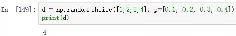<br />这个函数的含义：上述函数第一个参数表示的是数组，第二个参数表示的是概率值。上述函数的含义是当进行n多次重复实验的时候，抽取1的概率为0.1，抽取2的概率为0.2，抽取3的概率为0.3，抽取4的概率为0.4。<br />案例一：随即进行10000次重复实验，检测每一个数，被抽取到的概率；
```python
list1 = [0,0,0,0]
for i in range(100000):
    f = np.random.choice([1,2,3,4], p=[0.1, 0.2, 0.3, 0.4])
    list1[f-1] = list1[f-1] + 1
print(list1)

result_list = [value/sum(list1) for value in list1]
print(result_list)
```
结果如下：<br />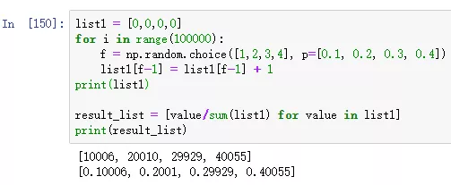<br />案例二：模拟进行100000次掷硬币重复实验，检测每一面，被抽取到的概率；
```python
list1 = [0,0]
for i in range(100000):
    f = np.random.choice([0,1], p=[0.5,0.5])
    list1[f] = list1[f] + 1
print(list1)

result_list = [value/sum(list1) for value in list1]
print(result_list)
```
结果如下：<br />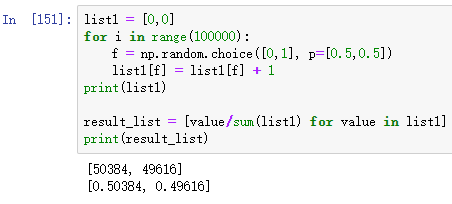
