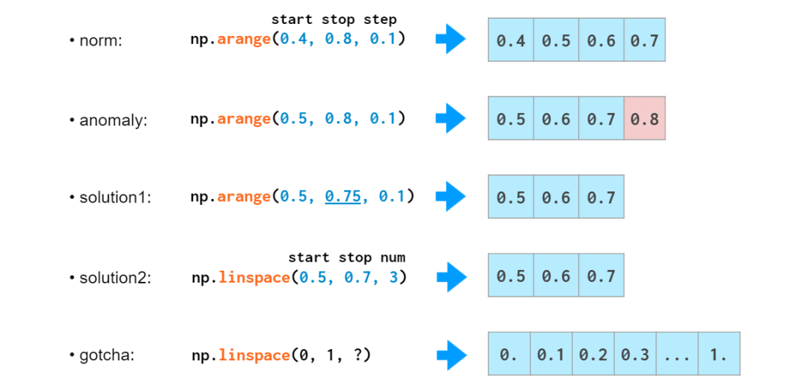
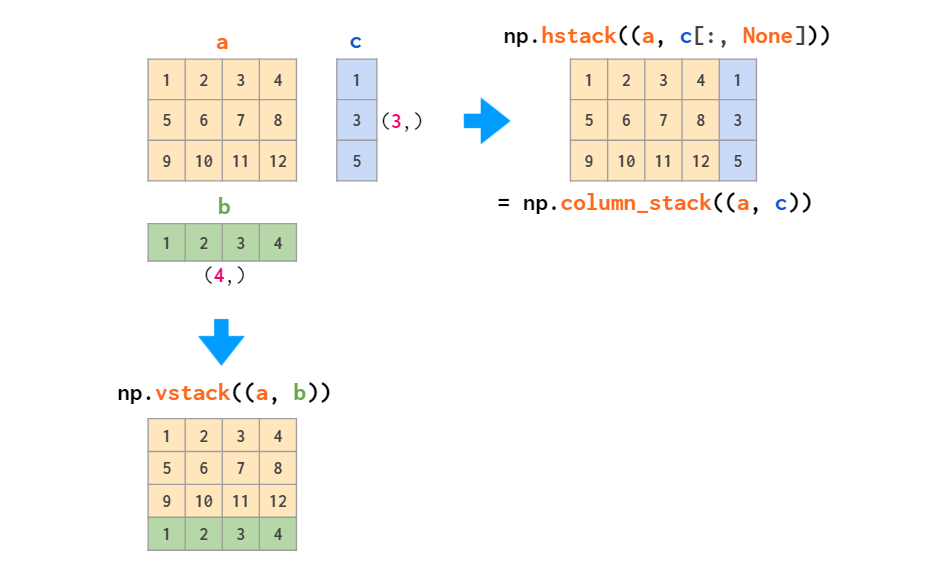

Python NumPy<br />NumPy是Python的最重要的扩展程序库之一，也是入门机器学习编程的必备工具。然而对初学者来说，NumPy的大量运算方法非常难记。<br /><br />最近，国外有位程序员讲NumPy的基本运算以图解的方式写下来，让学习过程变得轻松有趣。在Reddit机器学习社区发布不到半天就收获了500+赞。<br /><br />教程内容分为向量（一维数组）、矩阵（二维数组）、三维与更高维数组3个部分。
<a name="lUGni"></a>
## Numpy数组与Python列表
在介绍正式内容之前，先来了解一下Numpy数组与Python列表的区别。<br />乍一看，NumPy数组类似于Python列表。它们都可以用作容器，具有获取（getting）和设置（setting）元素以及插入和移除元素的功能。<br />两者有很多相似之处，以下是二者在运算时的一个示例：<br /><br />和Python列表相比，Numpy数组具有以下特点：<br />更紧凑，尤其是在一维以上的维度；向量化操作时比Python列表快，但在末尾添加元素比Python列表慢。<br />
<a name="lUSgc"></a>
###### △在末尾添加元素时，Python列表复杂度为O(1)，NumPy复杂度为O(N)
<a name="FGIyn"></a>
## 向量运算
<a name="tCOc7"></a>
#### 向量初始化
创建NumPy数组的一种方法是从Python列表直接转换，数组元素的类型与列表元素类型相同。<br /><br />NumPy数组无法像Python列表那样加长，因为在数组末尾没有保留空间。<br />因此，常见的做法是定义一个Python列表，对它进行操作，然后再转换为NumPy数组，或者用np.zeros和np.empty初始化数组，预分配必要的空间：<br /><br />有时需要创建一个空数组，大小和元素类型与现有数组相同：<br /><br />实际上，所有用常量填充创建的数组的函数都有一个`_like`对应项，来创建相同类型的常数数组：<br /><br />在NumPy中，可以用`arange`或者`linspace`来初始化单调序列数组：<br /><br />如果需要类似[0., 1., 2.]的浮点数组，可以更改`arange`输出的类型：`arange(3)`.`astype(float)`。<br />但是有更好的方法：`arange`函数对数据类型敏感，如果将整数作为参数，生成整数数组；如果输入浮点数（例如`arange(3.)`），则生成浮点数组。<br />但是arange在处理浮点数方面并不是特别擅长：<br /><br />这是因为0.1是一个有限的十进制数，但对计算机而言却不是。在二进制下，0.1是一个无穷小数，必须在某处截断。<br />这就是为什么将小数部分加到步骤`arange`通常是一个不太好的方法：可能会遇到一个bug，导致数组的元素个数不是想要的数，这会降低代码的可读性和可维护性。<br />这时候，`linspace`会派上用场。它不受舍入错误的影响，并始终生成要求的元素数。<br />出于测试目的，通常需要生成随机数组，NumPy提供随机整数、均匀分布、正态分布等几种随机数形式：<br />
<a name="tACzh"></a>
#### 向量索引
一旦将数据存储在数组中，NumPy便会提供简单的方法将其取出：<br /><br />上面展示了各式各样的索引，例如取出某个特定区间，从右往左索引、只取出奇数位等等。<br />但它们都是所谓的view，也就是不存储原始数据。并且如果原始数组在被索引后进行更改，则不会反映原始数组的改变。<br />这些索引方法允许分配修改原始数组的内容，因此需要特别注意：只有下面最后一种方法才是复制数组，如果用其他方法都可能破坏原始数据：<br /><br />从NumPy数组中获取数据的另一种超级有用的方法是布尔索引，它允许使用各种逻辑运算符，来检索符合条件的元素：<br /><br />注意：Python中的三元比较3<=a<=5在NumPy数组中不起作用。<br />如上所述，布尔索引也会改写数组。它有两个常见的函数，分别是`np.where`和`np.clip`：<br />
<a name="SV8hu"></a>
#### 向量运算
算术运算是NumPy速度最引入注目的地方之一。NumPy的向量运算符已达到C++级别，避免了Python的慢循环。<br />NumPy允许像普通数字一样操作整个数组（加减乘除、整除、幂）：<br />
<a name="wZUBy"></a>
###### △ 和Python中一样，a//b表示div b（整除），x**n表示xⁿ
向量还可以与标量进行类似的运算，方法相同：<br /><br />大多数的数学函数都有NumPy对应项用于处理向量：<br /><br />向量的点积、叉积也有运算符：<br /><br />也可以进行三角函数、反三角函数、求斜边运算：<br /><br />数组可以四舍五入为整数：<br />
<a name="GABsU"></a>
###### △ `floor`取下界；`ceil`取上界；`round`为四舍六入五取偶
NumPy还可以执行以下基本的统计运算（最大最小值、平均值、方差、标准差）：<br /><br />不过排序函数的功能比Python列表对应函数更少：<br />
<a name="Pcoxl"></a>
#### 搜索向量中的元素
与Python列表相反，NumPy数组没有`index`方法。<br />

- 查找元素的一种方法是`np.where(a==x)[0][0]`，它既不优雅也不快速，因为要查找的项需要从开头遍历数组的所有元素。
- 更快的方式是通过Numba中的`next((i[0] for i, v in np.ndenumerate(a) if v==x), -1)`来加速。
- 一旦对数组进行排序，情况就会变得更好：`v = np.searchsorted(a, x); return v if a[v]==x else -1`的复杂度为O(log N)，确实非常快，但是首先需要O(N log N)的排序时间。
<a name="S96Tj"></a>
#### 比较浮点数
函数`np.allclose(a, b)`用于比较具有给定公差的浮点数组：<br />

- `np.allclose`假设所有的比较数字的等级是1个单位。例如在上图中，它就认为1e-9和2e-9相同，如果要进行更细致的比较，需要通过atol指定比较等级1：`np.allclose(1e-9, 2e-9, atol=1e-17) == False`。
- `math.isclose`进行比较没有假设前提，而是基于用户给出的一个合理abs_tol值：`math.isclose(0.1+0.2–0.3, abs_tol=1e-8) == True`。

除此之外np.allclose在绝对和相对公差公式中还存在一些小问题，例如，对某些数存在`allclose(a, b) != allclose(b, a)`。这些问题已在`math.isclose`函数中得到解决。
<a name="GiKER"></a>
## 矩阵运算
NumPy中曾经有一个专用的类`matrix`，但现在已弃用，因此下面将交替使用矩阵和2D数组两个词。<br />矩阵初始化语法与向量相似：<br /><br />这里需要双括号，因为第二个位置参数是为dtype保留的。<br />随机矩阵的生成也类似于向量的生成：<br /><br />二维索引语法比嵌套列表更方便：<br /><br />和一维数组一样，上图的view表示，切片数组实际上并未进行任何复制。修改数组后，更改也将反映在切片中。
<a name="zkCVG"></a>
#### axis参数
在许多操作（例如求和）中，需要告诉NumPy是否要跨行或跨列进行操作。为了使用任意维数的通用表示法，NumPy引入了`axis`的概念：`axis`参数实际上是所讨论索引的数量：第一个索引是`axis=0`，第二个索引是`axis=1`，等等。<br />因此在二维数组中，如果axis=0是按列，那么`axis=1`就是按行。<br />
<a name="Q70xZ"></a>
#### 矩阵运算
除了普通的运算符（如+，-，*，/，//和**）以元素方式计算外，还有一个`@`运算符可计算矩阵乘积：<br /><br />在第一部分中，已经看到向量乘积的运算，NumPy允许向量和矩阵之间，甚至两个向量之间进行元素的混合运算：<br />
<a name="jsGdP"></a>
#### 行向量与列向量
从上面的示例可以看出，在二维数组中，行向量和列向量被不同地对待。<br />默认情况下，一维数组在二维操作中被视为行向量。因此，将矩阵乘以行向量时，可以使用(n，)或(1，n)，结果将相同。<br />如果需要列向量，则有转置方法对其进行操作：<br /><br />能够从一维数组中生成二位数组列向量的两个操作是使用命令`reshape`重排和`newaxis`建立新索引：<br /><br />这里的-1参数表示`reshape`自动计算第二个维度上的数组长度，None在方括号中充当`np.newaxis`的快捷方式，该快捷方式在指定位置添加了一个空`axis`。<br />因此，NumPy中总共有三种类型的向量：一维数组，二维行向量和二维列向量。这是两者之间显式转换的示意图：<br /><br />根据规则，一维数组被隐式解释为二维行向量，因此通常不必在这两个数组之间进行转换，相应区域用灰色标出。
<a name="M1cfb"></a>
#### 矩阵操作
连接矩阵有两个主要函数：<br /><br />这两个函数只堆叠矩阵或只堆叠向量时，都可以正常工作。但是当涉及一维数组与矩阵之间的混合堆叠时，`vstack`可以正常工作：`hstack`会出现尺寸不匹配错误。<br />因为如上所述，一维数组被解释为行向量，而不是列向量。解决方法是将其转换为列向量，或者使用`column_stack`自动执行：<br /><br />堆叠的逆向操作是分裂：<br /><br />矩阵可以通过两种方式完成复制：`tile`类似于复制粘贴，`repeat`类似于分页打印。<br /><br />特定的列和行可以用`delete`进行删除：<br /><br />逆运算为插入：<br /><br />`append`就像`hstack`一样，该函数无法自动转置一维数组，因此再次需要对向量进行转置或添加长度，或者使用`column_stack`代替：<br /><br />实际上，如果需要做的就是向数组的边界添加常量值，那么`pad`函数就足够了：<br />
<a name="VsgaY"></a>
#### Meshgrid
如果要创建以下矩阵：<br /><br />两种方法都很慢，因为它们使用的是Python循环。在MATLAB处理这类问题的方法是创建一个`meshgrid`：<br /><br />该`meshgrid`函数接受任意一组索引，`mgrid`仅是切片，`indices`只能生成完整的索引范围。`fromfunction`如上所述，仅使用I和J参数一次调用提供的函数。<br />但是实际上，在NumPy中有一种更好的方法。无需在整个矩阵上耗费存储空间。仅存储大小正确的矢量就足够了，运算规则将处理其余的内容：<br /><br />在没有`indexing='ij'`参数的情况下，`meshgrid`将更改参数的顺序：`J, I= np.meshgrid(j, i)`—这是一种“ xy”模式，用于可视化3D图。<br />除了在二维或三维数组上初始化外，`meshgrid`还可以用于索引数组：<br />
<a name="jZnqe"></a>
#### 矩阵统计
就像之前提到的统计函数一样，二维数组接受到`axis`参数后，会采取相应的统计运算：<br /><br />二维及更高维度中，`argmin`和`argmax`函数返回最大最小值的索引：<br /><br />`all`和`any`两个函数也能使用`axis`参数：<br />
<a name="X1nFY"></a>
#### 矩阵排序
尽管`axis`参数对上面列出的函数很有用，但对二维排序却没有帮助：<br /><br />`axis`绝不是Python列表key参数的替代。不过NumPy具有多个函数，允许按列进行排序：<br />1、按第一列对数组排序：`a[a[:,0].argsort()]`<br /><br />`argsort`排序后，此处返回原始数组的索引数组。<br />此技巧可以重复，但是必须小心，以免下一个排序混淆前一个排序的结果：
```python
a = a[a[:,2].argsort()]
a = a[a[:,1].argsort(kind='stable')]
a = a[a[:,0].argsort(kind='stable')]
```
<br />2、有一个辅助函数`lexsort`，该函数按上述方式对所有可用列进行排序，但始终按行执行，例如：

- `a[np.lexsort(np.flipud(a[2,5].T))]`：先通过第2列排序，再通过第5列排序；
- `a[np.lexsort(np.flipud(a.T))]`：按从左到右所有列依次进行排序。

<br />3、还有一个参数`order`，但是如果从普通（非结构化）数组开始，则既不快速也不容易使用。<br />4、因为这个特殊的操作方式更具可读性和它可能是一个更好的选择，这样做的pandas不易出错：

- `pd.DataFrame(a).sort_values(by=[2,5]).to_numpy()`：通过第2列再通过第5列进行排序。
- `pd.DataFrame(a).sort_values().to_numpy()`：通过从左向右所有列进行排序
<a name="HD8jH"></a>
## 高维数组运算
通过重排一维向量或转换嵌套的Python列表来创建3D数组时，索引的含义为（z，y，x）。<br />第一个索引是平面的编号，然后才是在该平面上的移动：<br /><br />这种索引顺序很方便，例如用于保留一堆灰度图像：这a[i]是引用第i个图像的快捷方式。<br />但是此索引顺序不是通用的。处理RGB图像时，通常使用（y，x，z）顺序：前两个是像素坐标，最后一个是颜色坐标（Matplotlib中是RGB ，OpenCV中是BGR ）：<br /><br />这样，可以方便地引用特定像素：`a[i,j]`给出像素的RGB元组(i,j)。<br />因此，创建特定几何形状的实际命令取决于正在处理的域的约定：<br /><br />显然，NumPy函数像`hstack`、`vstack`或`dstack`不知道这些约定。其中硬编码的索引顺序是（y，x，z），RGB图像顺序是：<br />
<a name="bR1F1"></a>
###### △RGB图像数组（为简便起见，上图仅2种颜色）
如果数据的布局不同，则使用`concatenate`命令堆叠图像，并在axis参数中提供显式索引数会更方便：<br /><br />如果不方便使用`axis`，可以将数组转换硬编码为`hstack`的形式：<br /><br />这种转换没有实际的复制发生。它只是混合索引的顺序。<br />混合索引顺序的另一个操作是数组转置。检查它可能会让我们对三维数组更加熟悉。<br />根据决定的`axis`顺序，转置数组所有平面的实际命令将有所不同：对于通用数组，它交换索引1和2，对于RGB图像，它交换0和1：<br /><br />有趣的是，（和唯一的操作模式）默认的`axis`参数颠倒了索引顺序，这与上述两个索引顺序约定都不相符。<br />最后，还有一个函数，可以在处理多维数组时节省很多Python循环，并使代码更简洁，这就是爱因斯坦求和函数`einsum`：<br />它将沿重复索引的数组求和。
