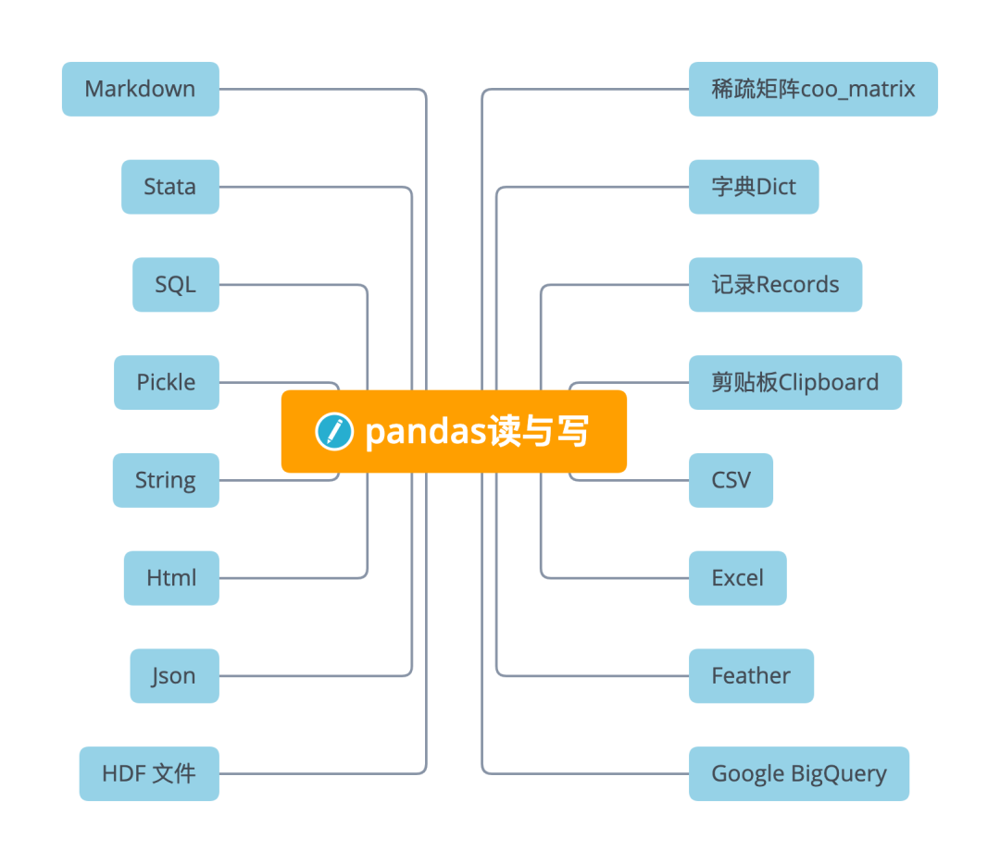

Python Pandas<br />
<a name="RKBwE"></a>
## 稀疏矩阵`coo_matrix`
稀疏矩阵(sparse matrix)，在数值分析中，是其元素大部分为零的矩阵。反之，如果大部分元素都非零，则这个矩阵是稠密的。在科学与工程领域中求解线性模型时经常出现大型的稀疏矩阵。<br />在使用计算机存储和操作稀疏矩阵时，经常需要修改标准算法以利用矩阵的稀疏结构。由于其自身的稀疏特性，通过压缩可以大大节省稀疏矩阵的内存代价。更为重要的是，由于过大的尺寸，标准的算法经常无法操作这些稀疏矩阵。
<a name="BogNk"></a>
### `coo_matrix`
A sparse matrix in COOrdinate format.是一种坐标格式的稀疏矩阵。<br />关于稀疏矩阵的一些特点，其可用于算术运算：它们支持加法、减法、乘法、除法和矩阵幂。

- COO格式的优点是促进稀疏格式之间的快速转换允许重复条目与 CSR/CSC 格式之间的快速转换。但不直接支持算术运算切片。
- COO 的预期用途是一种构建稀疏矩阵的快速格式构建矩阵后，转换为 CSR 或 CSC 格式以进行快速算术和矩阵向量运算。
<a name="vGmqG"></a>
### `coo_matrix`的创建
```python
row  = np.array([0, 3, 1, 0])
col  = np.array([0, 3, 1, 2])
data = np.array([4, 5, 7, 9])
coo_matrix((data, (row, col)), shape=(4, 4)).toarray()

array([[4, 0, 9, 0],
       [0, 7, 0, 0],
       [0, 0, 0, 0],
       [0, 0, 0, 5]])

coo_matrix((data, (i, j)), [shape=(M, N)])
```
这里有三个参数：<br />`data[:]` 就是原始矩阵中的数据，例如上面的4,5,7,9。<br />`i[:]` 就是行的指示符号；例如上面row的第0个元素是0，就代表data中第一个数据在第0行。<br />`j[:]` 就是列的指示符号；例如上面col的第0个元素是0，就代表data中第一个数据在第0列。
<a name="VblXL"></a>
### 读
```python
DataFrame.sparse.from_spmatrix(data, 
            index=None, columns=None)
```
参数<br />`data`：`scipy.sparse.spmatrix` 可转换为csc格式。<br />`index`, `columns`：可选参数，用于结果DataFrame的行和列标签。默认为`RangeIndex`。<br />返回的DataFrame的每一列都存储为`arrays.SparseArray`。
```python
import scipy.sparse
mat = scipy.sparse.eye(3)
pd.DataFrame.sparse.from_spmatrix(mat)

     0    1    2
0  1.0  0.0  0.0
1  0.0  1.0  0.0
2  0.0  0.0  1.0
```
<a name="g1RQS"></a>
### 写
```python
DataFrame.sparse.to_coo()
```
将DataFrame的内容作为以共存格式的稀疏矩阵COO 矩阵返回。<br />返回 `coo_matrix`: `scipy.sparse.spmatrix`
<a name="XNMSn"></a>
## 字典Dict
在Python 的字典中，每一个元素都由键(key) 和值(value) 构成，结构为`key: value` 。不同的元素之间会以逗号分隔，并且以大括号 `{}`。
<a name="MoDsu"></a>
### 读
从类数组的字典或字典构造DataFrame。通过按列或允许`dtype`规范的索引从字典创建DataFrame对象。
```python
DataFrame.from_dict(data, orient='columns', 
                    dtype=None, columns=None)
```
这里重要的参数是`orient`，用来指定字典的键来作为`DataFrame`的列活索引。下面分别用两个例子来看看。
<a name="I4ITO"></a>
### `orient='columns'`
默认情况下，字典的键成为DataFrame列。
```python
data = {'col_1': [3, 2, 1, 0], 
       'col_2': ['a', 'b', 'c', 'd']}
pd.DataFrame.from_dict(data, 
            orient='columns')


   col_1 col_2
0      3     a
1      2     b
2      1     c
3      0     d
```
<a name="ZItXC"></a>
### `orient='index'`
使用字典键作为创建DataFrame行。
```python
data = {'row_1': [3, 2, 1, 0], 
        'row_2': ['a', 'b', 'c', 'd']}
pd.DataFrame.from_dict(data, 
             orient='index')

       0  1  2  3
row_1  3  2  1  0
row_2  a  b  c  d
```
<a name="IlCvO"></a>
### 写
```python
DataFrame.to_dict(orient='dict', into=<class 'dict'>)
```
写与读同样有重要的orient参数，读有两个参数，而读有六个参数，更加灵活。<br />参数orient 是字符串`{'dict', 'list', 'series', 'split', 'records', 'index'}`<br />确定字典值的类型。

- 'dict'(默认)：字典形状如`{column : {index : value}}`
- 'list'：字典形状如 `{column : [values]}`
- 'series'：字典形状如 `{column : Series(values)}`
- 'split'：字典形状如 `{index : [index], columns : [columns], data : [values]}`
- 'records'：列表内容如`[{column : value}, … , {column : value}]`
- 'index'：字典形状如 `{index : {column : value}}`

另外，还可以通过缩写来表示，如 's'表示 'series', 'sp' 表示 'split'。
```python
>>> df = pd.DataFrame({'col1': [1, 2],
...                    'col2': [0.5, 0.75]},
...                    index=['row1', 'row2'])
>>> df
      col1  col2
row1     1  0.50
row2     2  0.75
>>> df.to_dict()
{'col1': {'row1': 1, 'row2': 2}, 'col2': {'row1': 0.5, 'row2': 0.75}}
>>> df.to_dict('records')
[{'col1': 1, 'col2': 0.5}, {'col1': 2, 'col2': 0.75}]
```
<a name="bedfA"></a>
## 记录Records
<a name="gRtal"></a>
### 读
将结构化数据的记录的 ndarray 转换为dataFrame。
```python
DataFrame.from_records(data, index=None, 
                       exclude=None, 
                       columns=None, 
                       coerce_float=False, 
                       nrows=None)
```
<a name="Vv7Uj"></a>
### 字典、元组或 `ndarray`类型的记录
```python
data = [{'col_1': 3, 'col_2': 'a'},
        {'col_1': 2, 'col_2': 'b'}]
data = np.array([(3, 'a'), (2, 'b')],
                dtype=[('col_1', 'i4'),
                           ('col_2', 'U1')])
data = [(3, 'a'), (2, 'b')]
# 上面三种形式的data，转换成如下的dataFrame
pd.DataFrame.from_records(data)

   col_1 col_2
0      3     a
1      2     b
```
<a name="cZXHY"></a>
## 剪贴板Clipboard
剪贴板是一种软件功能，通常由操作系统提供，作用是使用复制和粘贴操作短期存储数据和在文档或应用程序间转移数据。<br />有时候数据获取不太方便，需要通过复制粘贴过来。通常的方法是先复制到特定的文件，如txt或Excel等，再通过一定的方法读取文件。<br />但如果只需要临时获取某些信息，还是那样做未免有点麻烦。下面来介绍方便快捷的从剪贴板直接读取数据的方法。
<a name="dsshF"></a>
### 读
从剪贴板读取文本并传递到`read_csv`。
```python
pandas.read_clipboard(sep='\\s+', **kwargs)
```
参数<br />`sep` :字符串或正则表达式分隔符。`'s+'`的默认值表示一个或多个空格字符。<br />该方法是通过先从剪贴板读取文本，再将其传到`read_csv`，因此其他参数可以参见`read_csv`。
<a name="vBHi8"></a>
### 写
复制对象到系统剪贴板。
```python
DataFrame.to_clipboard(excel=True, 
                       sep=None, **kwargs)
```
参数<br />`excel`：bool, default True<br />生产输出在csv格式，方便粘贴到excel。

- True，使用提供的分隔符进行csv粘贴。
- False，将对象的字符串表示形式写入剪贴板。

将对象的文本表示形式写入系统剪贴板。例如将其粘贴到Excel中。
<a name="PWZmW"></a>
## CSV
<a name="lOCVs"></a>
### 读
最常用的数据读取莫过于`read_csv`读取了。之前文章有写过，这里直接拿过来引用下。
```python
pandas.read_csv(filepath_or_buffer, ...)
```
读取一个逗号分隔的值(csv)文件到`DataFrame`。
```python
pd.read_csv('data.csv')  
```
<a name="Xyc5P"></a>
### 写
```python
DataFrame.to_csv()
```
将对象写入逗号分隔值(csv)文件。
<a name="Wxc1D"></a>
#### 保存为csv
```python
df = pd.DataFrame({'name': ['Raphael', 'Donatello'],
                  'mask': ['red', 'purple'],
                  'weapon': ['sai', 'bo staff']})
df.to_csv(index=False)
```
<a name="fMXwc"></a>
#### 保存为zip
```python
compression_opts = dict(method='zip',
                        archive_name='out.csv')  
df.to_csv('out.zip', index=False,
          compression=compression_opts)  
```
<a name="NpvyI"></a>
## Excel
<a name="X0qv5"></a>
### 读
读取Excel到pandas DataFrame。
```python
pandas.read_excel(io,sheet_name=0,header=0,
                  names=None,index_col=None,...)
```
支持从本地文件系统或URL读取xls, xlsx, xlsm, xlsb, odf, ods和odt文件扩展名。支持读取单个工作表或工作表列表。
```python
pd.read_excel(open('tmp.xlsx', 'rb'),
               sheet_name='Sheet3')
pd.read_excel('tmp.xlsx', index_col=None, 
              header=None)  
pd.read_excel('tmp.xlsx', index_col=0,
              dtype={'Name': str, 
              'Value': float}) 
```
<a name="jKtk6"></a>
### 写
将对象写入Excel表格。
```python
DataFrame.to_excel(excel_writer, 
                   sheet_name='Sheet1')
```
常用参数

- `excel_writer`：ExcelWriter目标路径。
- `sheet_name`：excel表名命。
- `na_rep`：缺失值填充 ，可以设置为字符串。
- `columns`：选择输出的的列存入。
- `header`: 指定作为列名的行，默认0，即取第一行，数据为列名行以下的数据；若数据不含列名，则设定 header = None。
- `index`: 默认为True，显示index，当index=False 则不显示行索引（名字）。
- `index_label`: 设置索引列的列名。

要将单个对象写入Excel .xlsx文件，只需要指定目标文件名。要写入多个工作表，需要创建一个带有目标文件名的ExcelWriter对象，并在文件中指定要写入的工作表。<br />可以通过指定惟一的sheet_name写入多个表。将所有数据写入文件后，需要保存更改。
<a name="SsHKF"></a>
#### 创建、编写并保存工作簿
```python
df1 = pd.DataFrame([['a', 'b'], ['c', 'd']],
                   index=['row 1', 'row 2'],
                   columns=['col 1', 'col 2'])
df1.to_excel("output.xlsx") 
```
写到工作簿中的多个sheet，则需要指定 ExcelWriter 对象。
```python
df2 = df1.copy()
with pd.ExcelWriter('output.xlsx') as writer:  
   df1.to_excel(writer, 
                sheet_name='Sheet_name_1')
   df2.to_excel(writer, 
                sheet_name='Sheet_name_2')
```
Excel 编写器还可用于在现有 Excel 文件中附加。
```python
with pd.ExcelWriter('output.xlsx',
                    mode='a') as writer:  
    df.to_excel(writer, 
                sheet_name='Sheet_name_3')
```
<a name="X5c72"></a>
## Feather
Feather是小众但是很实用的文件格式，一句话定位它：高速读写压缩二进制文件。<br />Feather其实是Apache Arrow 项目中包含的一种数据格式。Feather 为DataFrame提供二进制列序列化。它旨在提高读写数据帧的效率，并使跨数据分析语言的数据共享变得容易。
<a name="PNDoM"></a>
### 读
从文件路径加载Feather格式对象。
```python
pandas.read_feather(path, columns=None, 
                    use_threads=True, 
                    storage_options=None)
```
参数：<br />`path`：str，路径对象或类似文件的对象。<br />`use_threads`：布尔值，默认为True，是否使用多线程并行阅读。
```python
train_data = pd.read_csv("train.csv")
train_data = pd.read_feather("train.feather")
```
<a name="NA6uG"></a>
### 写
调用`to_feather`函数将读取的dataframe保存为feather文件。<br />在参加各种机器学习比赛的时候，有时候要读取几百M甚至几个G 的表格数据，为了使读取速度加快，通常会选用这种方法，把.csv格式格式的文件转存为.feather格式，再用`read_feather`读取，速度可以大大提升。
```python
DataFrame.to_feather(**kwargs)
```

- `path`：需要保存的Feather文件路径。
- `compression`：是否压缩，以及如何压缩，支持`{'zstd', 'uncompressed', 'lz4'}`三个选项。
- `compression_level`：压缩水平，注意lz4 不支持该参数。
```python
train_data.to_feather("train.feather")
```
Feather 相比于csv在性能上有明显的优势：

- 它适合于中型数据（GB为单位的数据），比如4GB的csv文件，feather文件可能只占用700M。
- 读写速度远胜于csv，而且相比于数据库又具有便携的优势，可以作为很好的中间媒介来传输数据，比如从某个大型数据库中导出部分数据。
- Feather也支持从源文件中仅仅读取所需的列，这样可以减少内存的使用。这对于中型数据（GB)分析是非常有用的。
<a name="u91M9"></a>
## Google BigQuery
```python
DataFrame.to_gbq(destination_table, ...)
```
向谷歌BigQuery表写入一个DataFrame。<br />该功能需要pandas_gbq模块。该模块为 Google 的 BigQuery 分析 Web 服务提供了一个包装，用于使用类似 SQL 的查询来简化从 BigQuery 表中检索结果。<br />结果集被解析成`pandas.DataFrame`从源表中提取的形状和数据类型的数据框架。此外，数据帧可以插入到新的大查询表或附加到现有表中。<br />具体使用可参见官网。
<a name="qcKUx"></a>
## HDF 文件
HDF5（Hierarchical Data Formal）是用于存储大规模数值数据的较为理想的存储格式，文件后缀名为h5，存储读取速度非常快，且可在文件内部按照明确的层次存储数据，同一个HDF5可以看做一个高度整合的文件夹，其内部可存放不同类型的数据。<br />在Python中操纵HDF5文件的方式主要有两种，

- 一是利用pandas中内建的一系列HDF5文件操作相关的方法来将pandas中的数据结构保存在HDF5文件中；
- 二是利用h5py模块来完成从Python原生数据结构向HDF5格式的保存。

Pandas的`HDFStore`类可以将`DataFrame`存储在HDF5文件中，以便可以有效地访问它，同时仍保留列类型和其他元数据。它是一个类似字典的类，因此可以像读取Python dict对象一样进行读写。
```python
pandas.HDFStore(path, mode='a', 
                complevel=0, complib=None,
                fletcher32=False)
```
Pandas中的`HDFStore()`用于生成管理HDF5文件IO操作的对象。<br />其主要参数如下：<br />`path`：字符型输入，用于指定h5文件的名称（不在当前工作目录时需要带上完整路径信息）。<br />`mode`：用于指定IO操作的模式，与Python内建的open()中的参数一致。

- 默认为'a'，即当指定文件已存在时不影响原有数据写入，指定文件不存在时则新建文件；
- 'r'，只读模式；
- 'w'，创建新文件（会覆盖同名旧文件）；
- 'r+'，与'a'作用相似，但要求文件必须已经存在。

`complevel`：int型，用于控制h5文件的压缩水平，取值范围在0-9之间，越大则文件的压缩程度越大，占用的空间越小，但相对应的在读取文件时需要付出更多解压缩的时间成本，默认为0，代表不压缩。
```python
import numpy as np
import pandas as pd
# 打开一个hdf文件
hdf = pd.HDFStore('test.hdf','w')
df1 = pd.DataFrame(np.random.standard_normal((3,2)), 
                   columns=['A','B'])
hdf.put(key='key1', value=df1, 
        format='table', data_columns=True)
print(hdf.keys())

['/key1']
```
在pandas中读入HDF5文件的方式主要有两种，一是通过上术方式创建与本地h5文件连接的IO对象，接着使用键索引或者`store`对象的`get()`方法传入要提取数据的key来读入指定数据：
```python
print(hdf['key1']) # 方法一
print(hdf.get('key1')) # 方法二

          A         B    
0  0.257239  1.684300 
1  0.076235 -0.071744 
2 -0.266105 -0.874081
```
<a name="XUZsc"></a>
### 使用压缩格式存储
```python
large_data = pd.DataFrame(np.random.standard_normal((90000000,4)))
# 普通格式存储：
hdf1 = pd.HDFStore('test1.h5','w')
hdf1.put(key='data', value=large_data)
hdf1.close()
# 压缩格式存储
hdf2 = pd.HDFStore('test2.h5','w', complevel=4, complib='blosc')
hdf2.put(key='data', value=large_data)
hdf2.close()
```
从结果上看，test2.h5比test1.h5小了700mb，节省了存储空间。
<a name="fgf1D"></a>
### 读
第二种读入h5格式文件中数据的方法是pandas中的`read_hdf()`。
```python
pandas.read_hdf(path_or_buf, 
                key=None, mode='r', ...)
```
参数：<br />`path_or_buf`：str或`pandas.HDFStore`，文件路径或`HDFStore`对象。<br />`key`：str存储中组的标识符。<br />`mode`：`{'a', 'w', 'r+'}`, 默认为'a'打开文件的方式。具体与`HDFStore`类类似。
```python
df = pd.DataFrame([[1, 1.0, 'a']], 
                  columns=['x', 'y', 'z'])
df.to_hdf('./store.h5', 'data')
reread = pd.read_hdf('./store.h5')
```
<a name="axS9G"></a>
### 写
使用 HDF存储 将包含的数据写入 HDF5 文件。
```python
DataFrame.to_hdf(path_or_buf, 
                 key, mode='a', ...)
```
分层数据格式 （HDF） 是自我描述的，允许应用程序在没有外部信息的文件中解释文件的结构和内容。一个 HDF 文件可以包含可作为组或单独对象访问的相关对象的组合。<br />为了在现有的 HDF 文件中添加其他数据帧或系列，请使用附加模式和不同的密钥。
```python
df_tl = pd.DataFrame({"A": list(range(5)), 
                      "B": list(range(5))})
df_tl.to_hdf("store_tl.h5", "table", 
              append=True)
pd.read_hdf("store_tl.h5", 
            "table", where=["index>2"])


   A  B
3  3  3
4  4  4
```
<a name="HA1UT"></a>
## Json
JSON（JavaScript Object Notation，JavaScript 对象表示法），是存储和交换文本信息的语法，类似 XML。JSON 比 XML 更小、更快，更易解析，Pandas 可以很方便的处理 JSON 数据。
<a name="b3Pkp"></a>
### 读
```python
pandas.io.json.read_json(path_or_buf=None,
                         orient=None,...)
```
JSON字符串转为pandas 对象<br />参数<br />`path_or_buf`：有效的 JSON 字符串、路径对象或类文件对象<br />`orient`：指预期的 JSON 字符串格式。可以`to_json()`使用相应的 orient 值生成兼容的 JSON 字符串。可能的方向集是：

- `'split'` : 字典类型 `{index: [index], columns: [columns], data: [values]}`
- `'records'` : 列表类型 `[{column: value}, ... , {column: value}]`
- `'index'` : 字典类型 `{index: {column: value}}`
- `'columns'` : 字典类型 `{column: {index: value}}`
- `'values'` : 值是数组。

允许值和默认值取决于`typ`参数的值。<br />当`typ == 'series'`

- 允许的方向是 `{'split','records','index'}`
- 默认是 `'index'`
- Series 索引对于 orient 必须是唯一的`'index'`。

当`typ == 'frame'`

- 允许的方向是 `{'split','records','index', 'columns','values', 'table'}`
- 默认是 `'columns'`
- DataFrame 索引对于 orients'index'和` 'columns'`。
- 数据框列必须是唯一的取向'index'，`'columns'`和`'records'`。

`keep_default_dates bool`，默认为 True<br />如果解析日期（`convert_dates` 不是 False），如下情况的列标签是类似日期的，则尝试解析默认的类似日期的列。

- 它以`'_at'`结尾，
- 它以`'_time'`结尾，
- 它以`'timestamp'`开始，
- 它是`'modified'`，或`'date'`。
```python
df = pd.DataFrame([['a', 'b'], ['c', 'd']],
                  index=['row 1', 'row 2'],
                  columns=['col 1', 'col 2'])
df.to_json(orient='split')


'{"columns":["col 1","col 2"], 
  "index":["row 1","row 2"], 
  "data":[["a","b"],["c","d"]]}'

 pd.read_json(_, orient='split')   

      col 1 col 2
row 1     a     b
row 2     c     d
```
<a name="VjsCv"></a>
#### 用`'index'`编解码DataFrame
```python
df.to_json(orient='index')

'{"row 1":{"col 1":"a","col 2":"b"},
  "row 2":{"col 1":"c","col 2":"d"}}'

pd.read_json(_, orient='index')

      col 1 col 2
row 1     a     b
row 2     c     d
```
<a name="FwMwQ"></a>
#### 用`'records'`编解码DataFrame
```python
df.to_json(orient='records')

'[{"col 1":"a","col 2":"b"},
  {"col 1":"c","col 2":"d"}]'

pd.read_json(_, orient='records')

  col 1 col 2
0     a     b
1     c     d
```
<a name="M1CHB"></a>
### 写
```python
DataFrame.to_json(path_or_buf=None, 
                  orient=None, ...)
```
指示预期的 JSON 字符串格式。<br />参数orient：参数为 JSON 字符串格式与读一样外，还有如下两个<br />Series：

- 默认为`'index'`
- 允许的值为：`{'split'、'records'、'index'、'table'}`。

DataFrame：

- 默认为`'columns'`
- 允许的值为：`{'split'、'records'、'index'、'columns'、'values'、'table'}`。
```python
import json
df = pd.DataFrame(
     [["a", "b"], ["c", "d"]],
     index=["row 1", "row 2"],
     columns=["col 1", "col 2"],)
result = df.to_json(orient="split")
parsed = json.loads(result)
json.dumps(parsed, indent=4) 

{
    "columns": [
        "col 1",
        "col 2"
    ],
    "index": [
        "row 1",
        "row 2"
    ],
    "data": [
        [
            "a",
            "b"
        ],
        [
            "c",
            "d"
        ]
    ]
}
```
<a name="abTut"></a>
#### 用`'records'`格式化的 JSON编解码DataFrame
```python
result = df.to_json(orient="records")
parsed = json.loads(result)
json.dumps(parsed, indent=4)  

[
    {
        "col 1": "a",
        "col 2": "b"
    },
    {
        "col 1": "c",
        "col 2": "d"
    }
]
```
<a name="m3yhQ"></a>
#### 用`'columns'`格式化的 JSON编解码DataFrame
```python
result = df.to_json(orient="columns")
parsed = json.loads(result)
json.dumps(parsed, indent=4) 

{
    "col 1": {
        "row 1": "a",
        "row 2": "c"
    },
    "col 2": {
        "row 1": "b",
        "row 2": "d"
    }
}
```
<a name="jj45N"></a>
## Html
<a name="AEWij"></a>
### 读
```python
pandas.read_html( io , match = '.+' ,...) 
```
参数<br />`io` 字符串、路径对象或类文件对象。<br />`match` 字符串或编译的正则表达式。<br />将返回包含与此正则表达式或字符串匹配的文本的表集。默认为“.+”（匹配任何非空字符串）。默认值将返回页面上包含的所有表。<br />`Read_html()` 方法的 io 参数默认了多种形式，URL 便是其中一种。然后函数默认调用 lxml 解析 table 标签里的每个 td 的数据，最后生成一个包含 Dataframe 对象的列表。通过索引获取到 DataFrame 对象即可。<br />`read_html`返回`list`的`DataFrame`对象，即使只有包含在HTML内容的单个表。
```python
>>> url = ("https://raw.githubusercontent.com/pandas-dev/pandas/master/"
...        "pandas/tests/io/data/html/spam.html")
 pd.read_html(url)
[      Nutrient        Unit Value per 100.0g
 0   Proximates  Proximates       Proximates
 1        Water           g            51.70   
 2       Energy        kcal              315           
 ..         ...         ...              ...
[37 rows x 6 columns]]
```
读入"banklist.html"文件的内容并将其`read_html` 作为字符串传递。
```python
with open(file_path, "r") as f:
    dfs = pd.read_html(f.read())
# 可以传入一个StringIO实例
with open(file_path, "r") as f:
    sio = StringIO(f.read())
dfs = pd.read_html(sio)
```
安装了 bs4 和 html5lib ，并且传入`['lxml', 'bs4']`，则很容易解析成功。
```python
dfs = pd.read_html(url, "Metcalf Bank", 
                  index_col=0, 
                  flavor=["lxml", "bs4"])
```
`Read_html()` 仅支持静态网页解析。可以通过其他方法获取动态页面加载后`response.text` 传入 `read_html()` 再获取表格数据。
<a name="FmUOH"></a>
### 写
`DataFrame`对象有一个实例方法`to_html`，它将 的内容呈现`DataFrame`为 HTML 表格。
```python
DataFrame.to_html(buf=None,...)
df = pd.DataFrame(np.random.randn(2, 2))

          0         1
0 -0.184744  0.496971
1 -0.856240  1.857977

print(df.to_html())  # raw html

<table border="1" class="dataframe">
  <thead>
    <tr style="text-align: right;">
      <th></th>
      <th>0</th>
      <th>1</th>
    </tr>
  </thead>
  <tbody>
    <tr>
      <th>0</th>
      <td>-0.184744</td>
      <td>0.496971</td>
    </tr>
    <tr>
      <th>1</th>
      <td>-0.856240</td>
      <td>1.857977</td>
    </tr>
  </tbody>
</table>
```
HTML：

| <br /> | 0 | 1 |
| --- | --- | --- |
| 0 | -0.184744 | 0.496971 |
| 1 | -0.856240 | 1.857977 |

`float_format` 使用 Python 可调用来控制浮点值的精度：
```python
df.to_html(float_format="{0:.10f}".format)
```
参数<br />`classes`参数提供了为结果 HTML 表提供 CSS 类的能力。<br />`render_links=True`参数提供了向包含 URL 的单元格添加超链接的功能。
<a name="yUxPP"></a>
## String
```python
DataFrame.to_string()
```
将 DataFrame 转换为字符串。
```python
d = {'col1': [1, 2, 3], 'col2': [4, 5, 6]}
df = pd.DataFrame(d)
print(df.to_string())

   col1  col2
0     1     4
1     2     5
2     3     6
```
<a name="hkW40"></a>
## Pickle
Python的pickle模块，用来对数据进行序列化及反序列化。对数据进行反序列化一个重要的作用就是便于存储。<br />序列化过程将文本信息转变为二进制数据流，同时保存数据类型。比如，数据处理过程中，突然有事要走，可以直接将数据序列化到本地，这时候数据是什么类型，保存到本地也是同样的数据类型，再次打开的时候同样也是该数据类型，而不是从头开始再处理。<br />存储数据使用`pickle.dump(obj, file, [,protocol])`将对象obj保存到文件file中去。使用`pickle.load(file)`从file中读取一个字符串，并将它重构为原来的python对象，反序列化出对象过程。
<a name="wlte1"></a>
### 使用pandas库进行pickle更加简单
使用pandas库的`pd.read_pickle`读取`pickle`数据。<br />`read_pickle()`，`DataFrame.to_pickle()`和`Series.to_pickle()`可以读取和写入压缩的腌制文件。支持读写gzip，bz2，xz压缩类型。zip文件格式仅支持读取，并且只能包含一个要读取的数据文件。<br />压缩类型可以是显式参数，也可以从文件扩展名推断出来。如果为"infer"，则文件名分别以 ".gz"，".bz2"，".zip"或".xz" 结尾。
<a name="ZQ7i4"></a>
### 读
```python
pandas.read_pickle(filepath_or_buffer, 
                   compression='infer', 
                   storage_options=None)
```
参数 `compression：{'infer', 'gzip', 'bz2', 'zip', 'xz', None}`，默认为 'infer'<br />可以是一个dict以便将选项传递给压缩协议。它必须是 `{ 'zip'、'gzip'、'bz2'}` 之一。<br />如果解缩模式是`'infer'`并且 `path_or_buf` 是类似路径的，则从以下扩展名中检测压缩模式：'.gz'、'.bz2'、'.zip' 或 '.xz'。（否则不解缩）。<br />如果给出的 dict 和模式为'zip'或推断为'zip'，则其他条目作为附加压缩选项传递。<br />`read_pickle`函数pandas可用于从文件加载任何 pickled 的pandas对象。
```python
df 

c1         a   
c2         b  d
lvl1 lvl2      
a    c     1  5
     d     2  6
b    c     3  7
     d     4  8

df.to_pickle("foo.pkl")
pd.read_pickle("foo.pkl")

c1         a   
c2         b  d
lvl1 lvl2      
a    c     1  5
     d     2  6
b    c     3  7
     d     4  8
```
<a name="WWEEn"></a>
### 写
使用DataFrame的`to_pickle`属性就可以生成pickle文件对数据进行永久储存。<br />所有 Pandas 对象都配备了to_pickle，即使用 Python cPickle模块以 pickle 格式将数据结构保存到磁盘的方法。
```python
DataFrame.to_pickle(path, 
                    compression='infer', 
                    protocol=5, 
                    storage_options=None)
```
参数compression：`{'infer', 'gzip', 'bz2', 'zip', 'xz', None}`，默认为 'infer'<br />表示在输出文件中使用的压缩的字符串。默认情况下，从指定路径中的文件扩展名推断。压缩模式可以是以下任何可能的值：`{'infer', 'gzip', 'bz2', 'zip', 'xz', None}`。<br />如果压缩模式是 'infer' 并且 path_or_buf 是类似路径的，则从以下扩展名中检测压缩模式：'.gz'、'.bz2'、'.zip' 或 '.xz'。（否则不压缩）。<br />如果给出的 dict 和模式为'zip'或推断为'zip'，则其他条目作为附加压缩选项传递。
<a name="KguFu"></a>
## SQL
<a name="DTiqq"></a>
### 读
```python
pandas.read_sql( sql , con , index_col = None , 
                coerce_float = True , params = None , 
                parse_dates = None , columns = None , 
                chunksize = None )
```
参数<br />`sql` str 或 SQLAlchemy Selectable, 要执行的 SQL 查询或表名。<br />`con` SQLAlchemy connectable、str 或 sqlite3 连接 使用 SQLAlchemy 可以使用该库支持的任何数据库。<br />`index_col`：选择某一列作为index。<br />`coerce_float`：非常有用，将数字形式的字符串直接以float型读入。<br />`parse_dates`：将某一列日期型字符串转换为`datetime`型数据，与`pd.to_datetime`函数功能类似。可以直接提供需要转换的列名以默认的日期形式转换，也可以用字典的格式提供列名和转换的日期格式，比如`{column_name: format string}（format string："%Y:%m:%H:%M:%S"）`。<br />`columns`：要选取的列。一般没啥用，因为在sql命令里面一般就指定要选择的列了。<br />`chunksize`：如果提供了一个整数值，那么就会返回一个generator，每次输出的行数就是提供的值的大小。
<a name="VoHaE"></a>
#### 设置参数can创建数据库链接的两种方式
<a name="Y5XtD"></a>
##### 1. 用sqlalchemy构建数据库链接
```python
import pandas as pd
import sqlalchemy
from sqlalchemy import create_engine

# 用sqlalchemy构建数据库链接engine
connect_info = 'mysql+pymysql://{}:{}@{}:{}/{}?charset=utf8'
engine = create_engine(connect_info)
# sql 命令
sql_cmd = "SELECT * FROM table"
df = pd.read_sql(sql=sql_cmd, con=engine)
```
<a name="ZyMG0"></a>
##### 2. 用DBAPI构建数据库链接
```python
import pandas as pd
import pymysql
# sql 命令
sql_cmd = "SELECT * FROM table"
# 用DBAPI构建数据库链接engine
con = pymysql.connect(host=localhost, user=username, 
                      password=password, database=dbname, 
                      charset='utf8', use_unicode=True)
df = pd.read_sql(sql_cmd, con)
```
<a name="cOVe9"></a>
#### 将 SQL 查询或数据库表读入 DataFrame
这个函数是将`read_sql_table`和 `read_sql_query`做了个包装。该还输根据输入，指向特定的功能。如SQL 查询将被路由到`read_sql_query`，而数据库表名将被路由到`read_sql_table`。
```python
from sqlite3 import connect
conn = connect(':memory:')
df = pd.DataFrame(data=[[0, '10/11/12'], 
                        [1, '12/11/10']],
                  columns=['int_column', 
                  'date_column'])
df.to_sql('test_data', conn)
pd.read_sql('SELECT int_column, 
             date_column FROM test_data', conn)

   int_column date_column
0           0    10/11/12
1           1    12/11/10
```
通过`parse_dates`参数将日期解析应用于列。
```python
pd.read_sql('SELECT int_column, 
             date_column FROM test_data',
            conn,
            parse_dates=["date_column"])

   int_column date_column
0           0  2012-11-10
1           1  2010-11-12
```
在日期解析“date_column”的值时应用自定义格式。
```python
parse_dates={"date_column": {"format": "%d/%m/%y"}})
```
对“date_column”的值应用 dayfirst 日期解析顺序。
```python
parse_dates={"date_column": {"dayfirst": True}}
```
<a name="Ifx68"></a>
### 写
```python
DataFrame.to_sql(name, con, schema=None, if_exists='fail', 
                 index=True, index_label=None, chunksize=None,
                 dtype=None, method=None)[source]
```
将存储在 DataFrame 中的记录写入 SQL 数据库。<br />支持 SQLAlchemy 支持的数据库。可以新建、追加或覆盖表。
```python
from sqlalchemy import create_engine
engine = create_engine('sqlite://', echo=False)
df = pd.DataFrame({'name' : ['User 1', 'User 2', 'User 3']})
df.to_sql('users', con=engine)
engine.execute("SELECT * FROM users").fetchall()

[(0, 'User 1'), (1, 'User 2'), (2, 'User 3')]
```
<a name="CejMA"></a>
## Stata
pandas还可以由Stata程序所导出的stata统计文件文件。
<a name="lYmq8"></a>
### 读
将Stata文件读入DataFrame。
```python
pandas.read_stata( filepath_or_buffer ,...)
```
参数<br />`filepath_or_buffer` str 或 Path文件路径。<br />`usecols` 类似列表，可选。返回列的子集。如果没有，则返回所有列。<br />`convert_categoricals` bool，默认为 True。将分类列转换为 `pd.Categorical`。
```python
df = pd.read_stata('filename.dta')
```
<a name="IXlIk"></a>
### 写
```python
DataFrame.to_stata( path , ...)
```
将 DataFrame 写入 Stata 数据集文件
```python
df = pd.DataFrame({'animal': ['falcon', 'parrot',
                              'falcon','parrot'],
                   'speed': [350, 18, 361, 15]})
df.to_stata('animals.dta') 
```
很多时候，用`pandas.read_stata()`读取文件是，容易出现中文乱发，当该情况发生时，可以使用如下方法。其中 `load_large_dta`用于读取`stata`文件，`decode_str`用于编译中文字符串。
```python
def load_large_dta(fname):
    import sys
    reader = pd.read_stata(fname,iterator=True)
    df = pd.DataFrame()
    try:
        chunk = reader.get_chunk(100*1000)
        while len(chunk) > 0:
            df = df.append(chunk, ignore_index=True)
            chunk = reader.get_chunk(100*1000)
            print ('.')
            sys.stdout.flush()
    except (StopIteration, KeyboardInterrupt):
        pass
 
    print('\nloaded {} rows'.format(len(df)))
    return df
 
def deconde_str(string):
    """
    解码 dta文件防止乱码
    """
    re = string.encode('latin-1').decode('utf-8')
    return re
```
<a name="KjCdh"></a>
## Markdown
```python
DataFrame.to_markdown(buf = None , mode = 'wt' , index = True , 
                      storage_options = None , ** kwargs )
```
以 Markdown 格式打印 DataFrame。
```python
>>> s = pd.Series(["elk", "pig", "dog", "quetzal"], name="animal")
>>> print(s.to_markdown())
|    | animal   |
|---:|:---------|
|  0 | elk      |
|  1 | pig      |
|  2 | dog      |
|  3 | quetzal  |

# 使用制表选项输出
>>> print(s.to_markdown(tablefmt="grid"))
+----+----------+
|    | animal   |
+====+==========+
|  0 | elk      |
+----+----------+
|  1 | pig      |
+----+----------+
|  2 | dog      |
+----+----------+
|  3 | quetzal  |
+----+----------+
```
