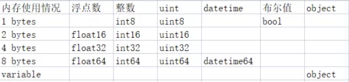

Python Pandas<br />一般会用**Pandas**模块来对数据集进行进一步的分析与挖掘关键信息，但是当遇到数据集特别特别大的时候，内存就会爆掉，分享几个技巧，来避免遇到上述提到的这个情况。
<a name="HGZta"></a>
## `read_csv()`方法当中的`chunksize`参数
`**read_csv()**`方法当中的`**chunksize**`参数顾名思义就是对于超大**csv**文件，可以分块来进行读取，例如文件当中有7000万行的数据，将`**chunksize**`参数设置为100万，每次分100万来分批读取，代码如下
```python
# read the large csv file with specified chunksize 
df_chunk = pd.read_csv(r'data.csv', chunksize=1000000)
```
这时得到的`**df_chunk**`并非是一个`**DataFrame**`对象，而是一个可迭代的对象。接下来使用`**for**`循环并且将自己创立数据预处理的函数方法作用于每块的DataFrame数据集上面，代码如下
```python
chunk_list = []  # 创建一个列表chunk_list 

# for循环遍历df_chunk当中的每一个DataFrame对象
for chunk in df_chunk:  
    # 将自己创建的数据预处理的方法作用于每个DataFrame对象上
    chunk_filter = chunk_preprocessing(chunk)
    
    # 将处理过后的结果append到上面建立的空列表当中
    chunk_list.append(chunk_filter)
    
# 然后将列表concat到一块儿
df_concat = pd.concat(chunk_list)
```
<a name="uLSTz"></a>
## 将不重要的列都去除掉
当然我们还可以进一步将不重要的列都给去除掉，例如某一列当中存在较大比例的空值，那么我们就可以将该列去除掉，代码如下
```python
# Filter out unimportant columns
df = df[['col_1','col_2', 'col_3', 'col_4', 'col_5', 'col_6','col_7', 'col_8', 'col_9', 'col_10']]
```
当然要去除掉空值可以调用`**df.dropna()**`方法，一般也可以提高数据的准确性以及减少内存的消耗
<a name="KfhDO"></a>
## 转变数据格式
最后可以通过改变数据类型来压缩内存空间，一般情况下，**Pandas**模块会给数据列自动设置默认的数据类型，很多数据类型里面还有**子类型**，而这些子类型可以用**更加少的字节数**来表示，下表给出了各子类型所占的字节数<br /><br />对于内存当中的数据，可以这么来理解，内存相当于是仓库，而数据则相当于是货物，货物在入仓库之前呢需要将其装入箱子当中，现在有着大、中、小三种箱子，<br /><br />现在Pandas在读取数据的时候是将这些数据**无论其类型**，都是**装到大箱子当中**去，因此会在很快的时间里仓库也就是内存**就满了**。<br />因此优化的思路就在于是**遍历每一列，然后找出该列的最大值与最小值，将这些最大最小值与子类型当中的最大最小值去做比较，挑选字节数最小的子类型**。<br />举个例子，**Pandas**默认是`**int64**`类型的某一列最大值与最小值分别是0和100，而`**int8**`类型是可以存储数值在-128~127之间的，因此可以将该列从`**int64**`类型转换成`**int8**`类型，也就同时节省了不少内存的空间。<br />将上面的思路整理成代码，就是如下所示
```python
def reduce_mem_usage(df):
    """ 遍历DataFrame数据集中的每列数据集
    并且更改它们的数据类型        
    """
    start_memory = df.memory_usage().sum() / 1024**2
    print('DataFrame所占用的数据集有: {:.2f} MB'.format(start_memory))

    for col in df.columns:
        col_type = df[col].dtype

        if col_type != object:
            col_min = df[col].min()
            col_max = df[col].max()
            if str(col_type)[:3] == 'int':
                if col_min > np.iinfo(np.int8).min and col_max < np.iinfo(np.int8).max:
                    df[col] = df[col].astype(np.int8)
                elif col_min > np.iinfo(np.int16).min and col_max < np.iinfo(np.int16).max:
                    df[col] = df[col].astype(np.int16)
                elif col_min > np.iinfo(np.int32).min and col_max < np.iinfo(np.int32).max:
                    df[col] = df[col].astype(np.int32)
                elif col_min > np.iinfo(np.int64).min and col_max < np.iinfo(np.int64).max:
                    df[col] = df[col].astype(np.int64)  
            else:
                if col_min > np.finfo(np.float16).min and col_max < np.finfo(np.float16).max:
                    df[col] = df[col].astype(np.float16)
                elif col_min > np.finfo(np.float32).min and col_max < np.finfo(np.float32).max:
                    df[col] = df[col].astype(np.float32)
                else:
                    df[col] = df[col].astype(np.float64)

    end_memory = df.memory_usage().sum() / 1024**2
    print('优化过之后数据集的内存占有: {:.2f} MB'.format(end_memory))
    print('减少了大约有: {:.1f}%'.format(100 * (start_memory - end_memory) / start_memory))

    return df
```
可以用这个函数方法尝试一下，看一下效果如何！
