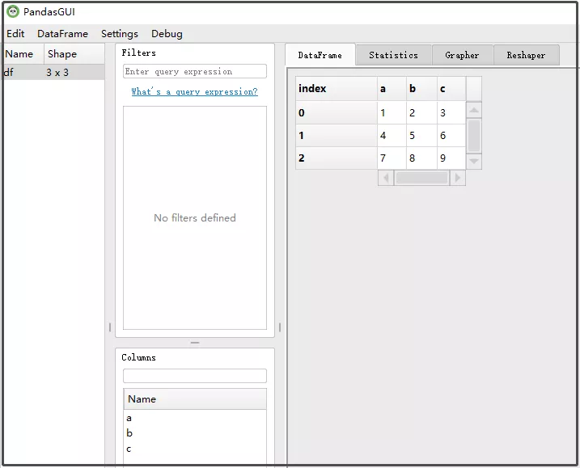
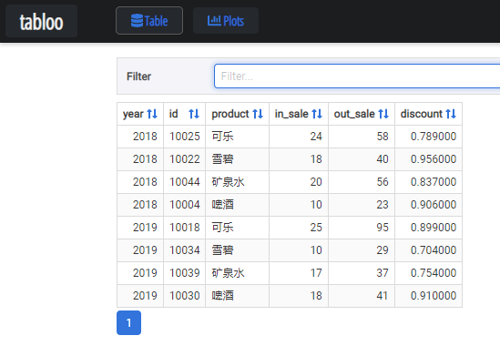
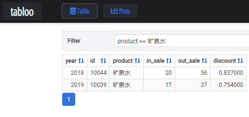
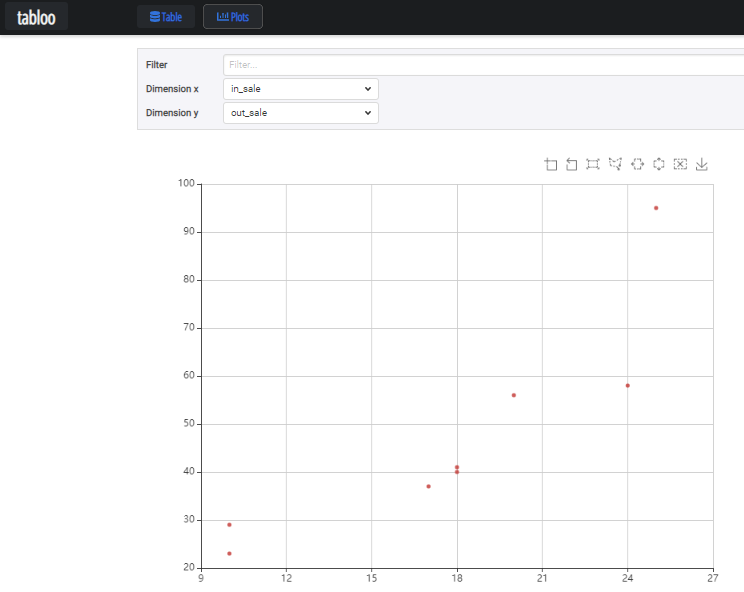
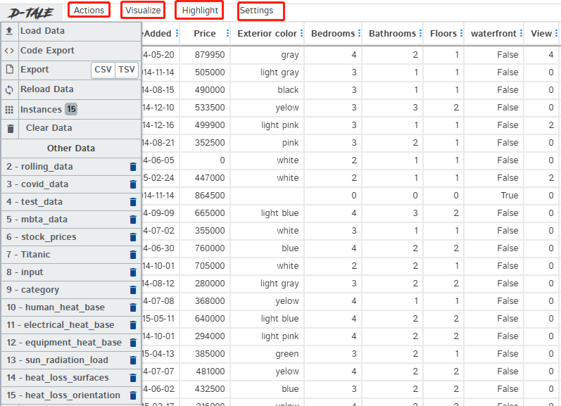
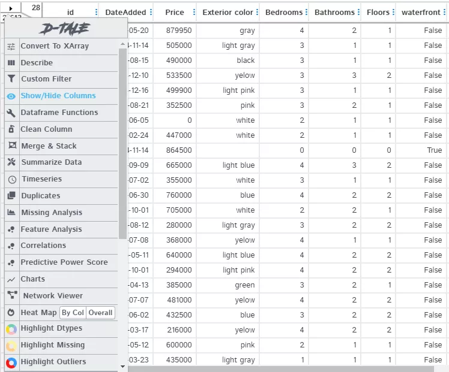
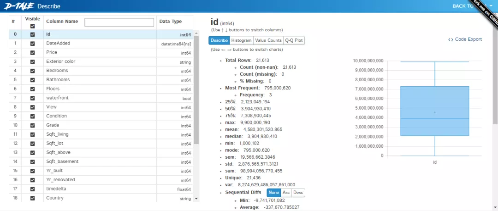

Python Pandas
<a name="HHU60"></a>
## 概述
Excel是数据分析人员，使用最基本的数据分析工具。而Python中用来操作Excel最牛逼的工具，那非Pandas莫属了。<br />对比这两款工具，Excel的优势在于它提供了一个直观且功能强大的图形界面，来查看您的数据，通过点选，就可以实现各种各样的操作。<br />为了弥补这一空白，Python中出现了很多这样的工具。它们的共同点是：都提供了一种以图形格式查看和选择性过滤数据的方法。<br />这里介绍几款这样的Pandas可视化GUI界面工具，根据自己的需求，选择合适的工具。
<a name="ajlJI"></a>
## 1、PandasGUI
第一个要说的就是PandasGUI，该应用程序的独特之处在于它是一个用 Qt 构建的独立应用程序，可以从 Jupyter notebook 调用。
```python
from pandasgui import show

show(df)
```
当安装了该库以后，使用上述程序，会在后台驱动，打开一个GUI界面程序。<br /><br />pandasgui一共有如下6大特征：

- Ⅰ 查看数据帧和系列（支持多索引）；
- Ⅱ 统计汇总；
- Ⅲ 过滤；
- Ⅳ 交互式绘图；
- Ⅴ 重塑功能；
- Ⅵ 支持csv文件的导入、导出；
<a name="GLr6v"></a>
## 2、Tabloo
Tabloo使用Flask后端为DataFrames提供简单的可视化工具，以及类似于 PandasGUI的绘图功能。<br />使用Tabloo与PandasGUI非常相似。
```python
import tabloo

tabloo.show(df)
```
这个GUI界面，有两个按钮，一个是Table，一个是Plots。<br /><br />对于Table栏，可以进行数据的筛选。
```python
product == '矿泉水'
```
结果如下：<br /><br />对于Plots栏，可以进行图形的绘制。<br /><br />这个库的功能貌似没有那么强大，大家了解即可。
<a name="ZmhJq"></a>
## 3、Dtale
D-Tale库可以进行可视化，它可以生成交互式图形界面，支持在其中定义所需的数据外观，并根据需要对数据进行探索性分析。<br />同样是相似的代码：
```python
import dtale

dtale.show(df)
```
这里直接以官方的一个demo为准，用于讲解。<br />[http://alphatechadmin.pythonanywhere.com/dtale/main/1](http://alphatechadmin.pythonanywhere.com/dtale/main/1)<br /><br />一进去就可以可以直接看到数据，并可以手动进行包括排序、重命名、筛选和锁定列等功能，就像是Excel操作一样。<br />单击左上角的三角形来打开主菜单，则会显示更多选项，如下图所示。<br /><br />不仅可以用于数据探索，导入导出数据、图表等各种功能应有尽有。<br />直接点击Describe，看看有什么效果。<br /><br />上图就是对这一份数据的描述统计，能够帮助我们快速的认识数据。

- 最小值，四分位点25%点，中位数，均值，方差，四分位点75%点，缺失值，众数等；

综上所述：pandasgui和dtale库值得大家去尝试一下，更多功能也等着大家去开发。
