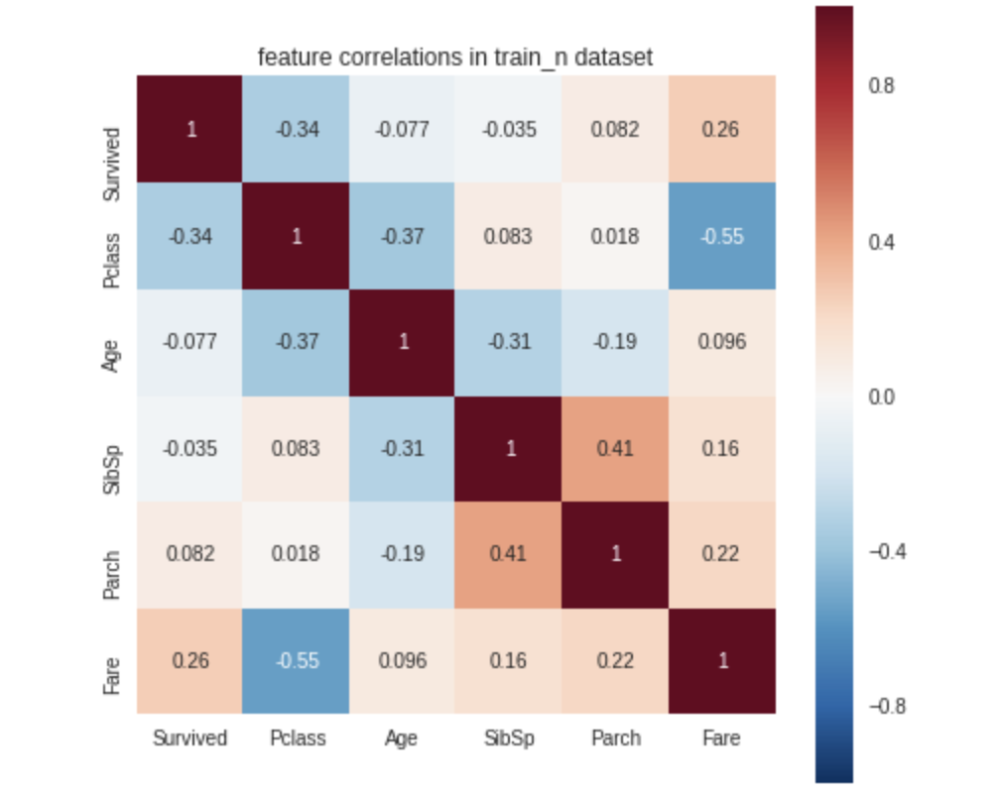

**探索性数据分析是数据科学模型开发和数据集研究的重要组成部分之一。在拿到一个新数据集时首先就需要花费大量时间进行EDA来研究数据集中内在的信息。自动化的EDA Python包可以用几行Python代码执行EDA。**<br />**在本文中整理了10个可以自动执行EDA并生成有关数据的见解的Python包，看看他们都有什么功能，能在多大程度上自动化解决EDA的需求。**

1. DTale
2. Pandas-profiling
3. sweetviz
4. autoviz
5. dataprep
6. KLib
7. dabl
8. speedML
9. datatile
10. edaviz
<a name="MSVv8"></a>
## 1、D-Tale
D-Tale使用Flask作为后端、React前端并且可以与ipython notebook和终端无缝集成。D-Tale可以支持Pandas的DataFrame, Series, MultiIndex, DatetimeIndex和RangeIndex。
```python
import dtale
import pandas as pd
dtale.show(pd.read_csv("titanic.csv"))
```
<br />D-Tale库用一行代码就可以生成一个报告，其中包含数据集、相关性、图表和热图的总体总结，并突出显示缺失的值等。D-Tale还可以为报告中的每个图表进行分析，上面截图中可以看到图表是可以进行交互操作的。
<a name="QZCel"></a>
## 2、Pandas-Profiling
Pandas-Profiling可以生成Pandas DataFrame的概要报告。panda-profiling扩展了pandas DataFrame `df.profile_report()`，并且在大型数据集上工作得非常好，它可以在几秒钟内创建报告。
```python
#Install the below libaries before importing
import pandas as pd
from pandas_profiling import ProfileReport

#EDA using pandas-profiling
profile = ProfileReport(pd.read_csv('titanic.csv'), explorative=True)

#Saving results to a HTML file
profile.to_file("output.html")
```

<a name="fcZUf"></a>
## 3、Sweetviz
<br />Sweetviz是一个开源的Python库，只需要两行Python代码就可以生成漂亮的可视化图，将EDA(探索性数据分析)作为一个HTML应用程序启动。Sweetviz包是围绕快速可视化目标值和比较数据集构建的。
```python
import pandas as pd
import sweetviz as sv

#EDA using Autoviz
sweet_report = sv.analyze(pd.read_csv("titanic.csv"))

#Saving results to HTML file
sweet_report.show_html('sweet_report.html')
```
Sweetviz库生成的报告包含数据集、相关性、分类和数字特征关联等的总体总结。<br />
<a name="Vl7wh"></a>
## 4、AutoViz
Autoviz包可以用一行代码自动可视化任何大小的数据集，并自动生成HTML、bokeh等报告。用户可以与AutoViz包生成的HTML报告进行交互。
```python
import pandas as pd
from autoviz.AutoViz_Class import AutoViz_Class

#EDA using Autoviz
autoviz = AutoViz_Class().AutoViz('train.csv')
```


<a name="daW48"></a>
## 5、Dataprep
<br />Dataprep是一个用于分析、准备和处理数据的开源Python包。DataPrep构建在Pandas和Dask DataFrame之上，可以很容易地与其他Python库集成。<br />DataPrep的运行速度这10个包中最快的，他在几秒钟内就可以为Pandas/Dask DataFrame生成报告。
```python
from dataprep.datasets import load_dataset
from dataprep.eda import create_report

df = load_dataset("titanic.csv")
create_report(df).show_browser()
```
<a name="DWt8e"></a>
## 6、Klib
klib是一个用于导入、清理、分析和预处理数据的Python库。
```python
import klib
import pandas as pd

df = pd.read_csv('DATASET.csv')
klib.missingval_plot(df)
```
```python
klib.corr_plot(df_cleaned, annot=False)
```

```python
klib.dist_plot(df_cleaned['Win_Prob'])
```
```python
klib.cat_plot(df, figsize=(50,15))
```
klibe虽然提供了很多的分析函数，但是对于每一个分析需要手动的编写代码，所以只能说是半自动化的操作，但是如果需要更定制化的分析，他是非常方便的。<br />
<a name="ATHAt"></a>
## 7、Dabl
Dabl不太关注单个列的统计度量，而是更多地关注通过可视化提供快速概述，以及方便的机器学习预处理和模型搜索。<br />dabl中的`Plot()`函数可以通过绘制各种图来实现可视化，包括:

- 目标分布图
- 散点图
- 线性判别分析
```python
import pandas as pd
import dabl

df = pd.read_csv("titanic.csv")
dabl.plot(df, target_col="Survived")
```

<a name="nu96f"></a>
## 8、Speedml
SpeedML是用于快速启动机器学习管道的Python包。SpeedML整合了一些常用的ML包，包括 Pandas，Numpy，Sklearn，Xgboost 和 Matplotlib，所以说其实SpeedML不仅仅包含自动化EDA的功能。<br />SpeedML官方说，使用它可以基于迭代进行开发，将编码时间缩短了70％。
```python
from speedml import Speedml

sml = Speedml('../input/train.csv', '../input/test.csv',
            target = 'Survived', uid = 'PassengerId')
sml.train.head()
```
```python
sml.plot.correlate()
```

```python
sml.plot.distribute()
```

```python
sml.plot.ordinal('Parch')
```

```python
sml.plot.ordinal('SibSp')
```

```python
sml.plot.continuous('Age')
```
<a name="fx759"></a>
## 9、DataTile
DataTile（以前称为Pandas-Summary）是一个开源的Python软件包，负责管理，汇总和可视化数据。DataTile基本上是PANDAS DataFrame `describe()`函数的扩展。
```python
import pandas as pd
from datatile.summary.df import DataFrameSummary

df = pd.read_csv('titanic.csv')
dfs = DataFrameSummary(df)
dfs.summary()
```
<a name="GZna6"></a>
## 10、edaviz
edaviz是一个可以在Jupyter Notebook和Jupyter Lab中进行数据探索和可视化的python库，他本来是非常好用的，但是后来被砖厂(Databricks)收购并且整合到bamboolib 中，所以这里就简单的给个演示。<br />
<a name="Bg25U"></a>
## 总结
在本文中，介绍了10个自动探索性数据分析Python软件包，这些软件包可以在几行Python代码中生成数据摘要并进行可视化。通过自动化的工作可以节省很多时间。<br />Dataprep是最常用的EDA包，AutoViz和D-table也是不错的选择，如果你需要定制化分析可以使用Klib，SpeedML整合的东西比较多，单独使用它啊进行EDA分析不是特别的适用，其他的包可以根据个人喜好选择，其实都还是很好用的，最后edaviz就不要考虑了，因为已经不开源了。
