Python Pandas 
<a name="sd8hQ"></a>
## 1、Pandas_Profiling
这个属于三个中最轻便、简单的了。它可以快速生成报告，一览变量概况。首先，需要安装该软件包。
```bash
# 安装Jupyter扩展widget 
jupyter nbextension enable --py widgetsnbextension
# 或者通过conda安装
conda env create -n pandas-profiling
conda activate pandas-profiling
conda install -c conda-forge pandas-profiling
# 或者直接从源地址安装
pip install https://github.com/pandas-profiling/pandas-profiling/archive/master.zip
```
安装成功后即可导入数据直接生成报告了。
```python
import pandas as pd
import seaborn as sns
mpg = sns.load_dataset('mpg')
mpg.head()

from pandas_profiling import ProfileReport
profile = ProfileReport(mpg, title='MPG Pandas Profiling Report', explorative = True)
profile
```
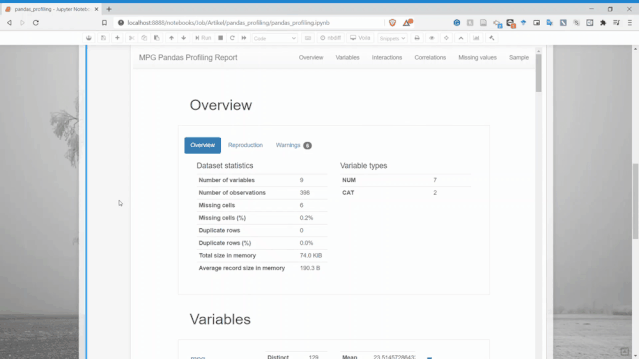<br />使用Pandas Profiling生成了一个快速的报告，具有很好的可视化效果。报告结果直接显示在notebook中，而不是在单独的文件中打开。<br />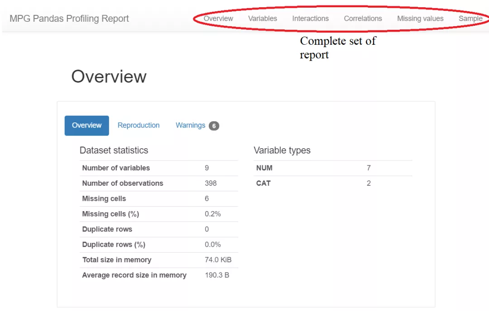<br />总共提供了六个部分：概述、变量、交互、相关性，缺失值和样本。<br />Pandas profiling的变量部分是完整的，它为每个变量都生成了详细的报告。<br />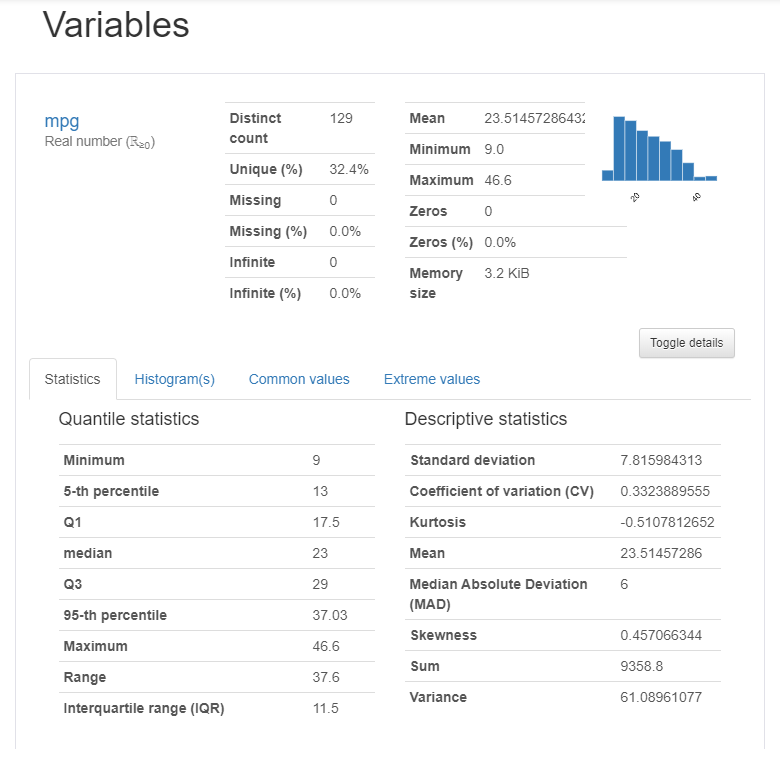<br />从上图可以看出，仅一个变量就有太多信息，比如可以获得描述性信息和分位数信息。
<a name="aBkzW"></a>
### 交互
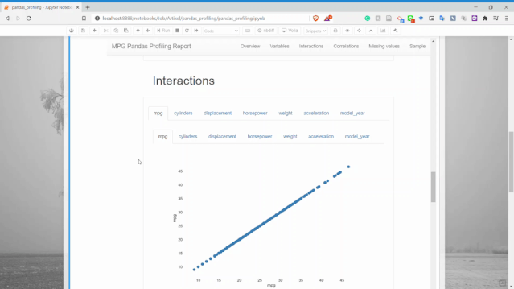<br />交互部分可以获取两个数值变量之间的散点图。
<a name="CEo68"></a>
### 相关性
可以获得两个变量之间的关系信息。<br />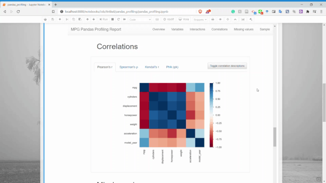
<a name="im9gn"></a>
### 缺失值
可以获取每个变量的缺失值计数信息。<br />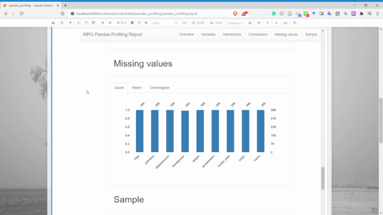
<a name="NfCv5"></a>
### 样本
可以显示了数据集中的样本行，用于了解数据。<br />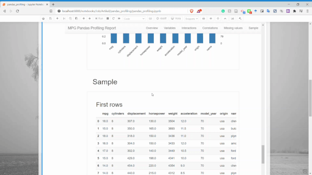
<a name="DZ0z2"></a>
## 2、Sweetviz
Sweetviz是另一个Python的开源代码包，仅用一行代码即可生成漂亮的EDA报告。与Pandas Profiling的区别在于它输出的是一个完全独立的HTML应用程序。<br />使用pip安装该软件包
```bash
pip install sweetviz
```
安装完成后，可以使用Sweetviz生成报告，下面尝试一下。
```python
import sweetviz as sv
# 可以选择目标特征
my_report = sv.analyze(mpg, target_feat ='mpg')
my_report.show_html()
```
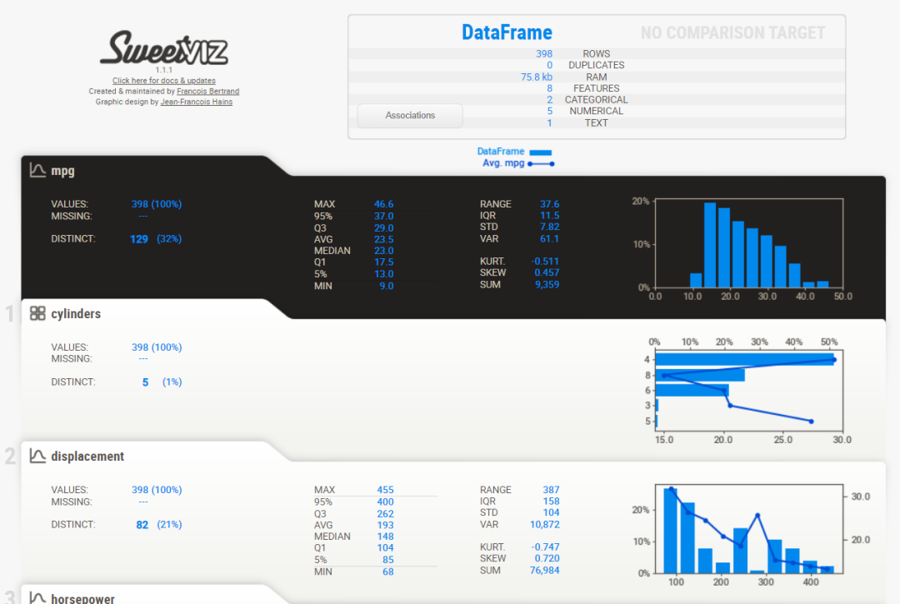<br />从上图可以看到，Sweetviz报告生成的内容与之前的Pandas Profiling类似，但具有不同的UI。<br />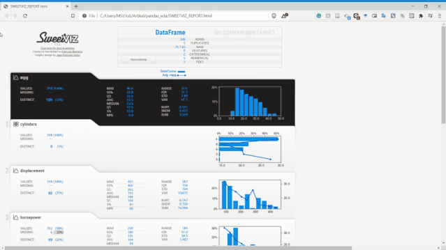<br />Sweetviz不仅可以查看单变量的分布、统计特性，它还可以设置目标标量，将变量和目标变量进行关联分析。如上面报告最右侧，它获得了所有现有变量的数值关联和类别关联的相关性信息。<br />Sweetviz的优势不在于单个数据集上的EDA报告，而在于数据集的比较。<br />可以通过两种方式比较数据集：将其拆分（例如训练和测试数据集），或者使用一些过滤器对总体进行细分。<br />比如下面这个例子，有USA和NOT-USA两个数据集。
```python
# 设置需要分析的变量
my_report = sv.compare_intra（mpg,mpg [" origin"] ==" usa",[" USA"," NOT-USA"],target_feat ='mpg'）
my_report.show_html()
```
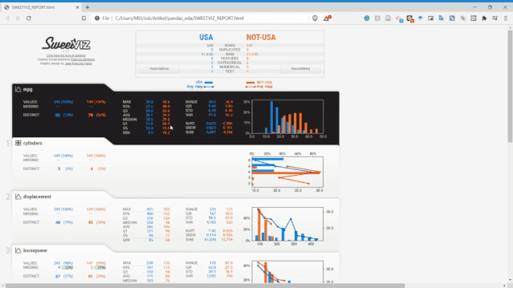<br />不需要敲太多的代码就可以快速分析这些变量，这在EDA环节会减少很多工作量，而把时间留给变量的分析和筛选上。<br />Sweetviz的一些优势在于：

- 分析有关目标值的数据集的能力
- 两个数据集之间的比较能力

但也有一些缺点：

- 变量之间没有可视化，例如散点图
- 报告在另一个标签中打开

个人是比较喜欢Sweetviz的。
<a name="Nqpxo"></a>
## 3、pandasGUI
PandasGUI与前面的两个不同，PandasGUI不会生成报告，而是生成一个GUI（图形用户界面）的数据框，可以使用它来更详细地分析Dataframe。<br />首先，安装PandasGUI。
```bash
# pip安装
pip install pandasgui
# 或者通过源下载
pip install git+https://github.com/adamerose/pandasgui.git
```
然后，运行几行代码试一下。
```python
from pandasgui import show
# 部署GUI的数据集
gui = show(mpg)
```
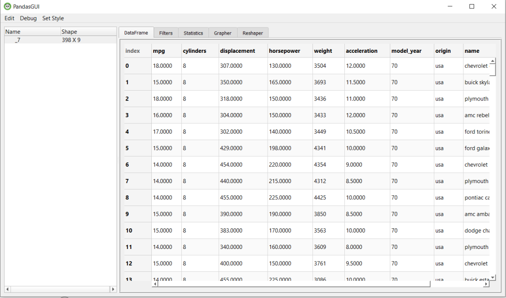<br />在此GUI中，可以做很多事情，比如过滤、统计信息、在变量之间创建图表、以及重塑数据。这些操作可以根据需求拖动选项卡来完成。<br />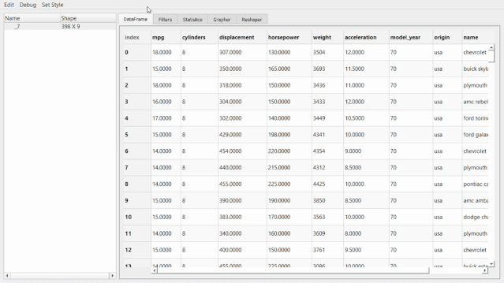<br />比如像下面这个统计信息。<br />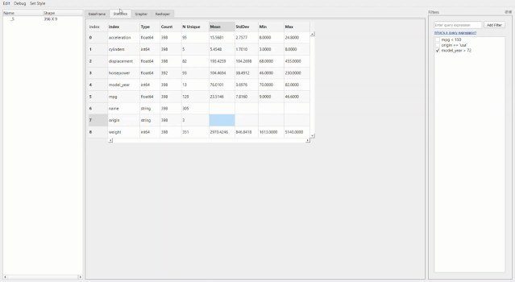<br />最牛X的就是绘图器功能了。用它进行拖拽操作简直和excel没有啥区别了，操作难度和门槛几乎为零。<br /><br />还可以通过创建新的数据透视表或者融合数据集来进行重塑。<br />然后，处理好的数据集可以直接导出成csv。<br />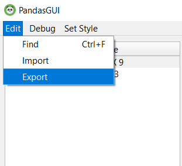<br />pandasGUI的一些优势在于：

- 可以拖拽
- 快速过滤数据
- 快速绘图

缺点在于：

- 没有完整的统计信息
- 不能生成报告
<a name="vKXl2"></a>
## 4. 结论
Pandas Profiling、Sweetviz和PandasGUI都很不错，旨在简化EDA处理。在不同的工作流程中，每个都有自己的优势和适用性，三个工具具体优势如下：

- Pandas Profiling 适用于快速生成单个变量的分析。
- Sweetviz 适用于数据集之间和目标变量之间的分析。
- PandasGUI适用于具有手动拖放功能的深度分析。

参考：<br />[https://github.com/adamerose/pandasgui](https://github.com/adamerose/pandasgui)<br />[https://github.com/pandas-profiling/pandas-profiling](https://github.com/pandas-profiling/pandas-profiling)<br />[https://github.com/fbdesignpro/sweetviz](https://github.com/fbdesignpro/sweetviz)<br />[https://towardsdatascience.com/](https://towardsdatascience.com/)
