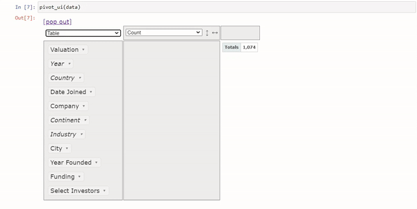
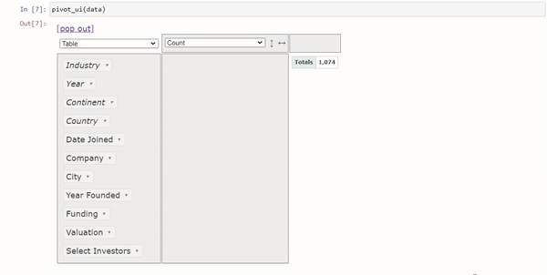
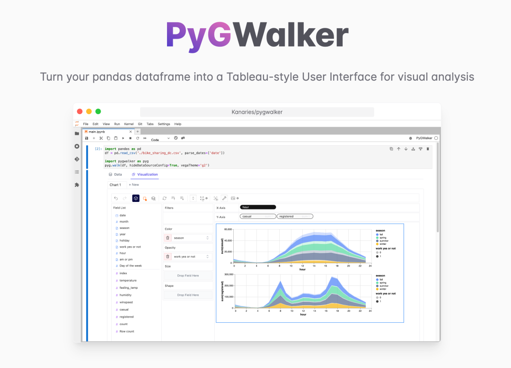
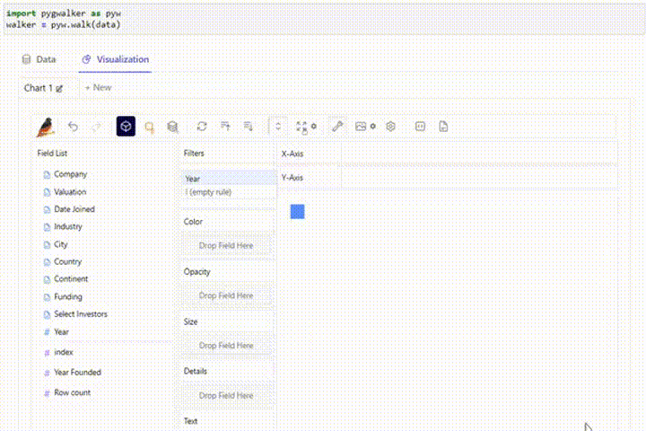
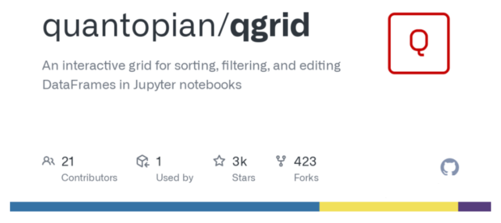
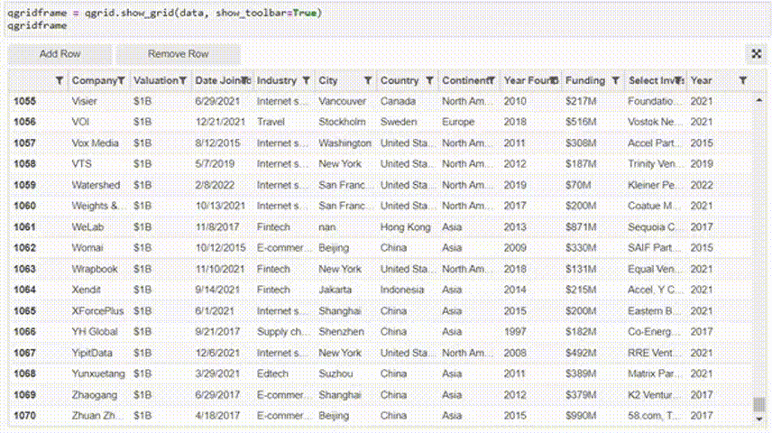
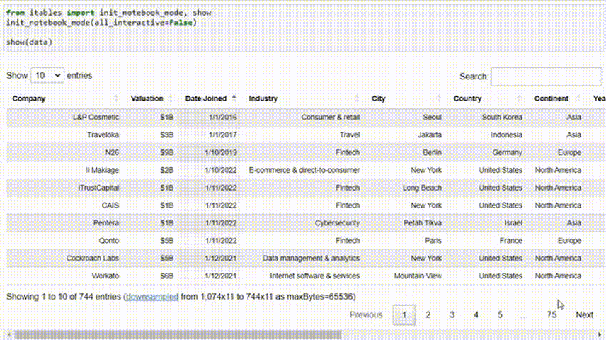

Pandas是日常处理表格数据最常用的包，但是对于数据分析来说，Pandas的DataFrame还不够直观，所以这里介绍4个和Pandas相关的Python包，可以将Pandas的DataFrame转换交互式表格，可以直接在上面进行数据分析的操作。
<a name="mivI1"></a>
## Pivottablejs
Pivottablejs是一个通过IPython widgets集成到Python中的JavaScript库，允许用户直接从DataFrame数据创建交互式和灵活的汇总报表。可以进行高效、清晰的数据分析和表示，帮助将数据从Pandas DataFrame转换为易于观察的交互式数据透视表。<br /><br />pivot_ui函数可以自动从DataFrame生成交互式用户界面，使用户可以简单地修改，检查聚合项，并快速轻松地更改数据结构。
```python
!pip install pivottablejs

from pivottablejs import pivot_ui
import pandas as pd

data = pd.read_csv("D:\Data\company_unicorn.csv")
data["Year"] = pd.to_datetime(data["Date Joined"]).dt.year
pivot_ui(data)
```
如下图所示，可以直接在notebook中对DataFrame进行筛选，生成图表<br /><br />还可以快速生成数据透视表<br />
<a name="FgM6z"></a>
## Pygwalker
PyGWalker可以把DataFrame变成一个表格风格的用户界面，直观有效地探索数据。<br /><br />这个包的用户界面对Tableau用户来说很熟悉，如果用过Tableau那么上手起来就很容易
```python
!pip install pygwalker

import pygwalker as pyw
walker = pyw.walk(data)
```
<br />通过一些简单的拖拽，可以进行筛选和可视化，这是非常方便的。
<a name="G60Yc"></a>
## Qgrid
<br />除了PyGWalker之外，Qgrid也是一个很好的工具，它可以很容易地将DataFrame架转换为视觉上直观的交互式数据表。
```python
import qgrid
qgridframe = qgrid.show_grid(data, show_toolbar=True)
qgridframe
```
<br />还可以直接在表上添加、删除数据。
<a name="RM8dx"></a>
## Itables
<br />与上面提到的qgrid包一样，Itables提供了一个简单的接口。可以进行简单的操作，如过滤、搜索、排序等。
```python
from itables import init_notebook_mode, show
init_notebook_mode(all_interactive=False)

show(data)
```
<br />tables和Qgrid包对于快速查看数据模式是必要的。然而，如果想要进一步理解数据并进行数据转换，它们的特征是不够的。因此，在获得更复杂的见解的情况下，使用透视表js和Pygwalker是可取的。
<a name="mQbUJ"></a>
## 总结
上面的这些包可以在Jupyter Notebook中将dataframe转换为交互式表。<br />Itables 和Qgrid比较轻量，可以快速的查看数据，但是如果想进行更多的操作，例如生成一些简单的可视化图表，那么Pivottablejs和Pygwalker是一个很好的工具。
