Python Pandas<br />了解列数、行数、取值分布、缺失值、列之间的相关关系等等，这个过程叫做 EDA（Exploratory Data Analysis，探索性数据分析）。<br />如果现在做EDA还在用pandas一行行写代码，那么福音来了！<br />目前已经有很多EDA工具可以自动产出基础的统计数据和图表，能节省大量时间。<br />先来加载数据集
```python
import numpy as np
import pandas as pd
iris = pd.read_csv('iris.csv')
iris
```
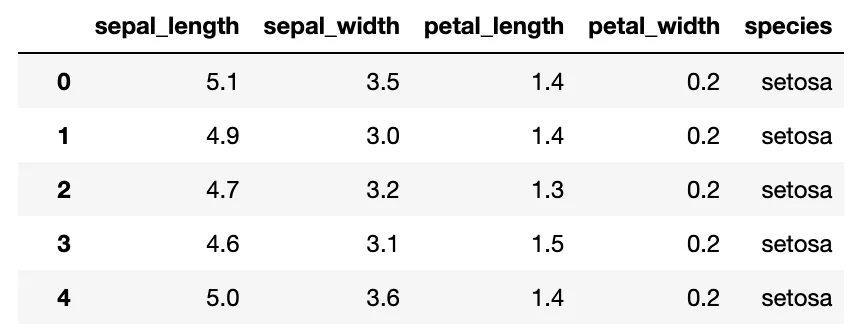<br />iris是下面用到的数据集，是一个150行 * 4列的 DataFrame。
<a name="JmcIf"></a>
### 1、PandasGUI
PandasGUI提供数据预览、筛选、统计、多种图表展示以及数据转换。
```bash
# 安装
# pip install pandasgui
```
```python
from pandasgui import show

show(iris)
```
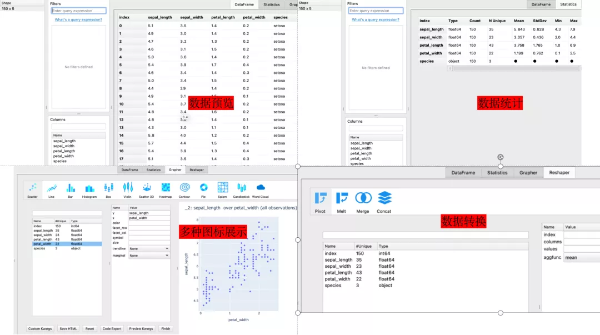<br />PandasGUI更侧重数据展示，提供了10多种图表，通过可视的方式配置。<br />但数据统计做的比较简单，没有提供缺失值、相关系数等指标，数据转换部分也只开放了一小部分接口。
<a name="lL9Tj"></a>
### 2、Pandas Profiling
Pandas Profiling 提供了整体数据概况、每列的详情、列之间的关图、列之间的相关系数。
```bash
# 安装：
# pip install -U pandas-profiling
# jupyter nbextension enable --py widgetsnbextension
```
在导入数据之后使用`df.profile_report()`一行命令即可快速生成描述性分析报告👇<br />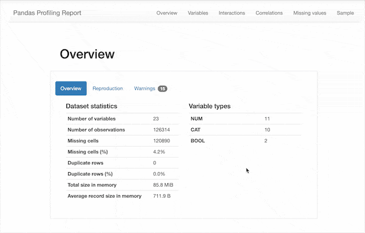<br />可以看到，除了之前需要的一些描述性统计数据，该报告还包含以下信息：

- 类型推断：检测数据帧中列的数据类型。
- 要点：类型，唯一值，缺失值
- 分位数统计信息，例如最小值，Q1，中位数，Q3，最大值，范围，四分位数范围
- 描述性统计数据，例如均值，众数，标准偏差，总和，中位数绝对偏差，变异系数，峰度，偏度
- 最常使用的值
- 直方图
- 相关性矩阵
- 缺失值矩阵，计数，热图和缺失值树状图
- 文本分析：了解文本数据的类别（大写，空格），脚本（拉丁，西里尔字母）和块（ASCII）

进一步还可以将该报告保存为html格式，方便后续的查看。
```python
from pandas_profiling import ProfileReport

profile = ProfileReport(iris, title='iris Pandas Profiling Report', explorative=True)
profile
```
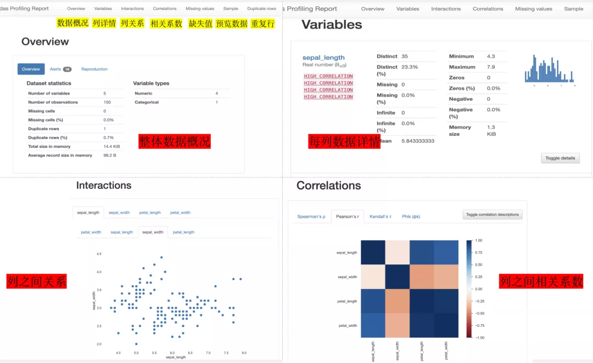<br />每列的详情包括：缺失值统计、去重计数、最值、平均值等统计指标和取值分布的柱状图。<br />列之间的相关系数支持Spearman、Pearson、Kendall 和 Phik 4 种相关系数算法。<br />与 PandasGUI 相反，Pandas Profiling没有丰富的图表，但提供了非常多的统计指标以及相关系数。
<a name="TJNaB"></a>
### 3、Sweetviz
Sweetviz与Pandas Profiling类似，提供了每列详细的统计指标、取值分布、缺失值统计以及列之间的相关系数。<br />该插件围绕快速可视化目标值和比较数据集而构建。它的目标是帮助快速分析目标特征、训练与测试数据以及其他此类数据特征任务。
```bash
# 安装
# pip install sweetviz
```
```python
import sweetviz as sv

sv_report = sv.analyze(iris)
sv_report.show_html()
```
和 pandas_profiling 不一样的是，现在只能得到一个html文件，打开即可看到相关 EDA 报告👇<br />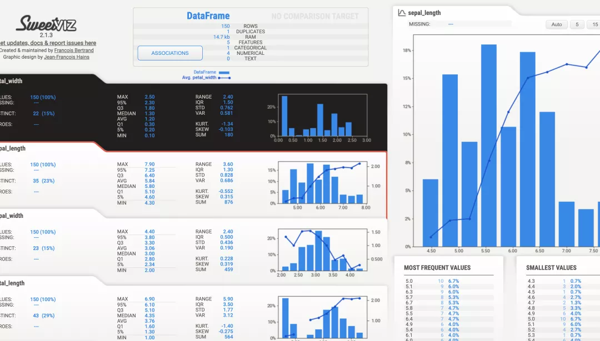<br />Sweetviz还有有一个非常好的特性是支持不同数据集的对比，如：训练数据集和测试数据集的对比。<br />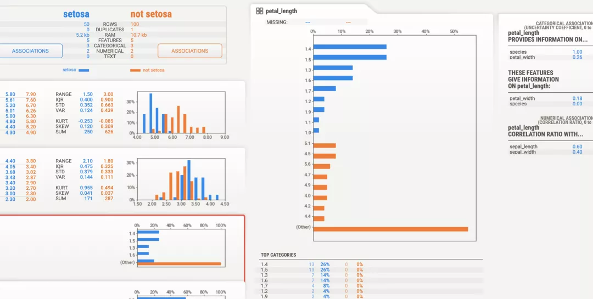<br />蓝色和橙色代表不同的数据集，通过对比可以清晰发现数据集之前的差异。<br />可以看到，自动生成的报告主要有以下几个部分

1. **目标分析**
   - 显示目标值，例如泰坦尼克号数据集中的“幸存”，与其他特征的关系）
2. **可视化和比较**
   - 不同的数据集（例如训练与测试数据）
   - 组内特征（例如男性与女性）
3. **混合型联想**
   - Sweetviz 无缝集成了数值（Pearson 相关）、分类（不确定系数）和分类-数值（相关比）数据类型的关联，为所有数据类型提供最大的信息。
4. **类型推断**
   - 自动检测数字、分类和文本特征，可选择手动覆盖
5. **概要信息**
   - 类型、唯一值、缺失值、重复行、最常见值
   - 数值分析：最小值/最大值/范围、四分位数、平均值、众数、标准偏差、总和、中值绝对偏差、变异系数、峰态、偏度
<a name="Ndsyu"></a>
### 4、dtale
最后重磅介绍dtale，它不仅提供丰富图表展示数据，还提供了很多交互式的接口，对数据进行操作、转换。<br />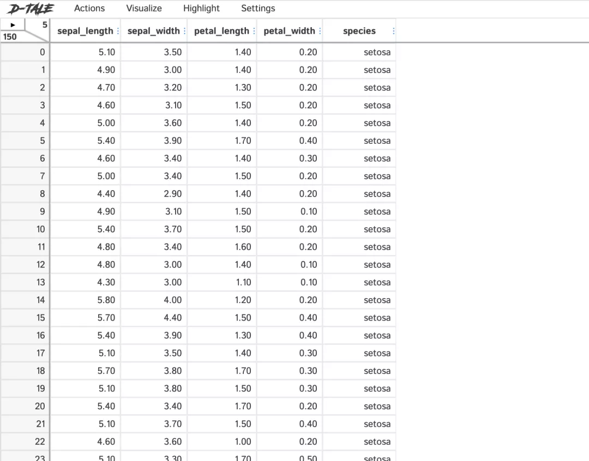<br />dtale的功能主要分为三部分：数据操作、数据可视化、高亮显示。
<a name="BxaEz"></a>
#### 4.1 数据操作（Actions）
dtale将pandas的函数包装成可视化接口，可以通过图形界面方式来操作数据。
```bash
# pip install dtale
```
```python
import dtale

d = dtale.show(iris)
d.open_browser()
```
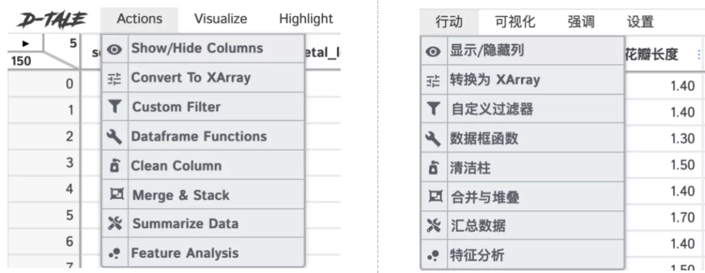<br />右半部分图是左边图的中文翻译，用的是 Chrome 自动翻译，有些不是很准确。<br />举一个数据操作的例子。<br />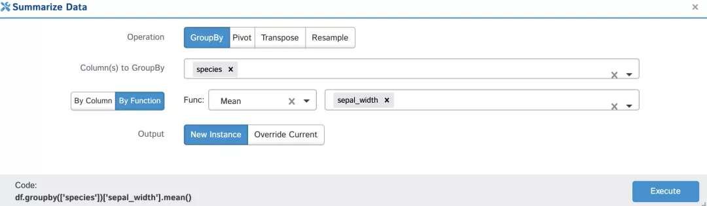<br />上图是Actions菜单中Summarize Data的功能，它提供了对数据集汇总操作的接口。<br />上图选择按照species列分组，计算sepal_width列的平均值，同时可以看到左下角dtale已经自动为该操作生成了pandas代码。
<a name="FeDMd"></a>
#### 4.2 数据可视化（Visualize）
提供比较丰富的图表，对每列数据概况、重复行、缺失值、相关系数进行统计和展示。<br />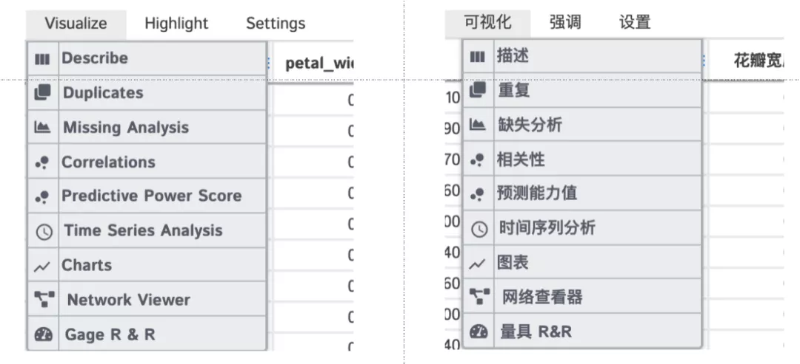<br />举一个数据可视化的例子。<br />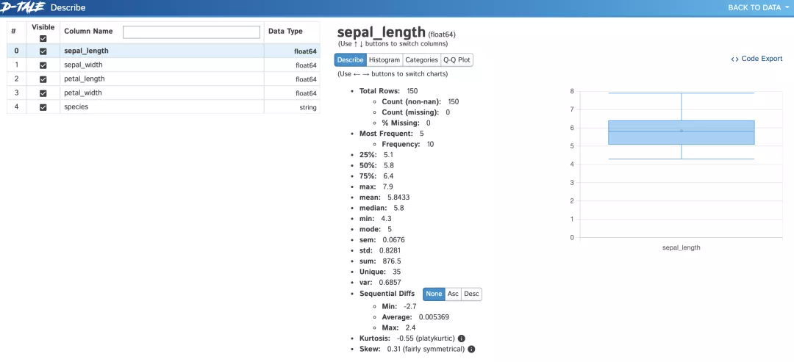<br />上图是Visualize菜单中Describe的功能，它可以统计每列的最值、均值、标准差等指标，并提供图表展示。<br />右侧的Code Export可以查看生成这些数据的代码。
<a name="LLNol"></a>
#### 4.3 高亮显示（Highlight）
对缺失值、异常值做高亮显示，方便快速定位到异常的数据。<br />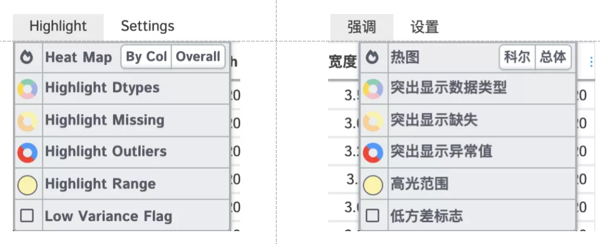<br />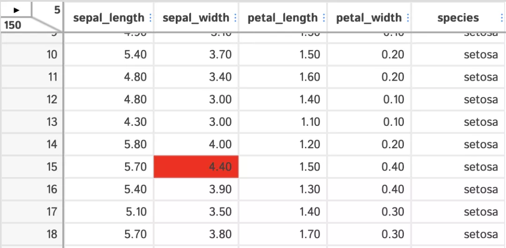<br />上图显示了将`sepal_width`字段的异常值。<br />dtale非常强大，功能也非常多，大家可以多多探索、挖掘。<br />最后，简单总结一下。如果探索的数据集侧重数据展示，可以选PandasGUI；如果只是简单了解基本统计指标，可以选择Pandas Profiling和Sweetviz；如果需要做深度的数据探索，那就选择dtale。
