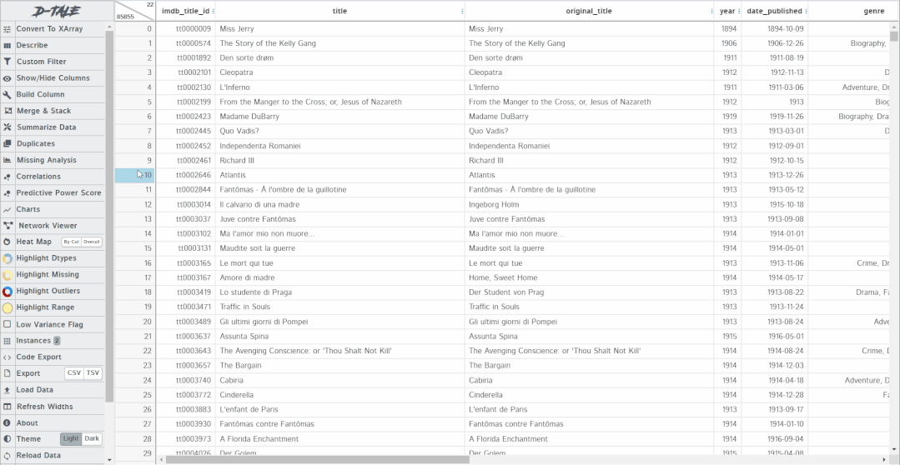

Python Pandas
<a name="D1Io4"></a>
## 启动、数据加载
D-Tale支持多种文件格式，包括CSV、TSV、XLS、XLSX。它是一个以Flask 为后端，React 作为前端构建的，通过pip安装即可。
```bash
pip install dtale
```
两种启动 D-Tale 的方式：

- 将DataFrame对象传递给 D-Tale 函数，在 Jupyter 单元中实例化 GUI。
- 不导入DataFrame对象的情况下初始化 D-Tale，显示为一个带有 GUI 的交互菜单来加载数据并提供各种其他选项。

为了更好地演示，这里选择第二种。
```python
import dtale
dtale.show(open_browser=True)
```
运行代码后，将获得下面的 GUI 菜单：<br /><br />数据的导入有几种方式，

1. 从文件加载数据
2. 从网站加载数据。需要传递网站的链接，可以从中获取 CSV、JSON、TSV 或 Excel 等文件。
3. 加载示例数据集。这些数据集可能需要一些后台下载才能从服务器获取数据集。

本文以一个电影的示例数据集展示如何使用。加载数据集后，就会像 pandas一样呈现一个表格。表里的所有单元格都可以编辑，就像在 excel 中一样直接更改值。<br />
<a name="eXOH9"></a>
## 列菜单功能
当单击列标题时，可以获得一个选项列表，选项的内容取决于该列的数据类型。比如下面3个类型：datatime64、int64、str，3个选项列表的共同点是按升序或降序排序。除此之外，对于不同类型的数据会有不同的过滤方法。<br /><br />具体探索一下项目里的功能。
<a name="uHOdA"></a>
### 1、冻结
锁定功能类似于excel中的首行冻结，将列锁定在最左侧，这样可以自由地滚动表格同时看到锁定的列了。<br />
<a name="E6yfD"></a>
### 2、隐藏和删除
隐藏选项将会去掉表格中的某列，但它不会从实际地删除。当然，也可以从右上角的条中取消隐藏列。<br />删除选项将从数据框中永久删除列。它类似于 pandas 的 drop 函数。<br />
<a name="dWRkh"></a>
### 3、替换和类型转换
替换选项可以替换表中某些固定值或者填充空值。可以inplace=True替换某列或者创建一个新列。同时，替换类型可以定义为：特定值、空格或特定字符串的替换。<br />例如下面，date_published列应包含所有日期类型的字符串，但存在了不应存在的文本 TV Movie 2019，这时候可以用 numpy nan 来替换这个异常值。<br /><br />现在，可以使用类型转换选项轻松地将date_published列的数据类型从字符串更改为日期时间，同时提供了`inplace`或new columns更改的选项：<br />
<a name="g7CQs"></a>
### 4、描述性统计
pandas 中的describe函数有助于提供列或数据集的统计摘要。这里的 describe 一样，并且提供的信息比普通的 pandas 函数更多，它为每种数据类型提供了唯一的describe摘要。<br />对于日期时间类型 column，它提供以下详细信息：<br /><br />另外，它还为特征生成了histogram和 value_counts 图：<br /><br />对于整数类型的列，它提供了中心性、频率、峰度和偏度。它还表示箱线图、直方图、value_count 图和 QQ 图中的数据。<br />对于字符串类型的列，它提供最常用的词及其频率、字符的详细摘要、词值计数图和值计数图。
<a name="nZ2dx"></a>
### 5、筛选过滤
在 D-Tale 中过滤数据非常简单，只需要指定所需的过滤器类型。下面的示例显示按年份 > 2000 和年份 == 2001 过滤数据集：<br /><br />在筛选日期时间类型列中的数据时，也可以按日期范围筛选数据。对于字符串类型的列，可以通过以下方式过滤数据：<br />
<a name="pHdFk"></a>
### 6、方差报告
这个选项不适用于字符串类型值。方差报告基于以下两点来决定特征是否具有低方差：

- 特征中的唯一值计数/样本大小 < 10%
- 最常用值的计数/第二常用值的计数 > 20

显示计算结果，并用直方图以呈现结果。<br />
<a name="Vcdgg"></a>
### 7、文本清洗
这个选项仅适用于字符串类型的值。文本清洗是数据科学项目的主要部分，如果使用正确的类型，它可以提高模型性能。D-Tale 提供了可以应用于文本的所有可能的文本清理方法，只需选择要应用于文本的方法，工作将在后端即可完成。<br />
<a name="EyTPR"></a>
## 主菜单选项
在主菜单中，其实包含了列菜单的全部功能，但在主菜单中使用时，更加普适。比如，可以在单个或者多个列，而非手动选择了。下面是几个核心功能介绍。
<a name="SwliG"></a>
### 1、创建列
可以创建新列或者从已有的列中创建列。像建模前的特征工程也可以使用它来实现，比如使用两列执行算数运算来创建新列。同时，可以给创建的新列提供名称，以及设置数据类型。<br />
<a name="koJb9"></a>
### 2、汇总数据
在 pandas 中，通过分组或数据透视表汇总数据。也可以用 D-Tale 做同样的事情。直接可以选择列、聚合函数以及最终数据集中所需的列即可，无需任何代码。下面是一个例子。<br />
<a name="ELCdr"></a>
### 3、缺失率分析
缺失数据是所有数据集中都会经常出现的问题，因为没有数据集是完美的，它有意或无意地有很多缺失值。D-Tale 集成了 missingno 库来可视化数据集中存在的缺失值，同时它也提供矩阵、条形图、热图和树状图。<br />
<a name="Hp4Lj"></a>
### 4、绘图
绘图是数据科学EDA探索性分析阶段的重要步骤。D-Tale 集成 plotly 来创建交互式绘图。它可以提供折线图、条形图、散点图、饼图、词云图、热图、3D 散点图、表面图、地图、烛台图、树状图和漏斗图。不同类型的数据支持不同类型的绘图，像下面这样。<br />
<a name="ckCLr"></a>
### 5、高亮功能
用于突出显示数据集的某些部分，就像在 pandas 中使用 stylers 来显示特殊值一样，highlighters 也可以完成同样的功能。比如，可以高亮缺失值、数据类型、异常值或者范围。下面的示例显示了如何高亮显示缺失值和异常值：<br />
<a name="GvBBu"></a>
### 6、代码导出、数据导出
在 D-Tale 中对数据框执行的所有操作都会自动转换为它们的 python/pandas/plotly 等效代码。可以通过单击每个操作和图表 GUI 中出现的导出代码选项来查看它们。下面是自动生成的一些代码。
```python
import pandas as pd
from dtale.datasets import {dataset}
df = {dataset}()
if isinstance(df, (pd.DatetimeIndex, pd.MultiIndex)):
 df = df.to_frame(index=False)
# remove any pre-existing indices for ease of use in the D-Tale code, but this is not required
df = df.reset_index().drop('index', axis=1, errors='ignore')
df.columns = [str(c) for c in df.columns]  # update columns to strings in case they are numbers
df = df[[c for c in df.columns if c != 'imdb_title_id']]
df = df.rename(columns={'title': 'Movie_title'})
s = df['date_published']
s = df['date_published']
s = s.replace({
 'TV Movie 2019': np.nan})
df.loc[:, 'date_published'] = s
df.loc[:, 'date_published'] = pd.Series(pd.to_datetime(df['date_published'], infer_datetime_format=True), name='date_published', index=df['date_published'].index)
```
最后，也可以使用导出选项更改为 CSV 或 TSV 后导出数据集。
