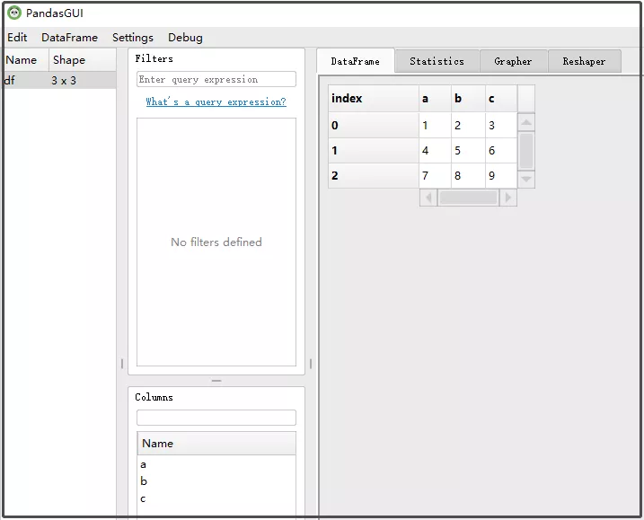
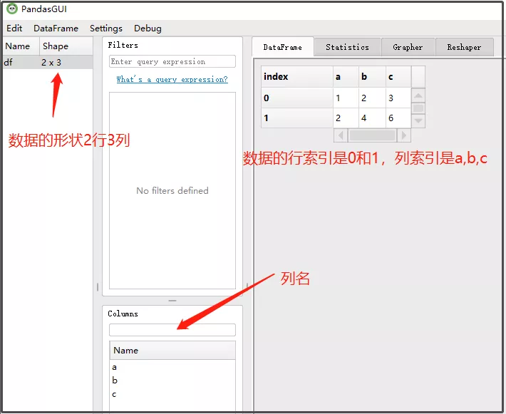
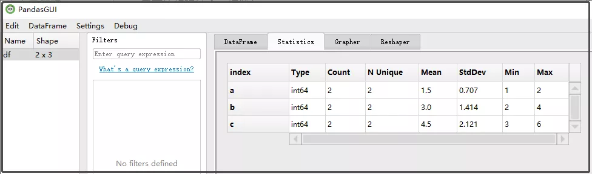
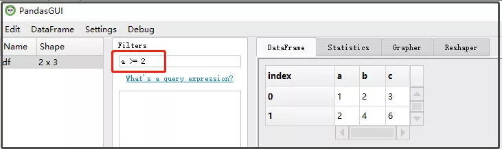
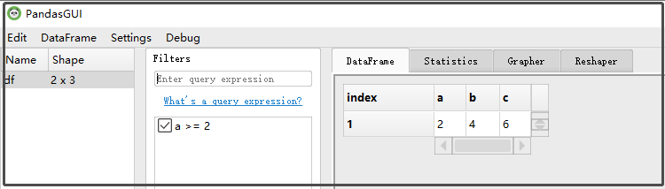
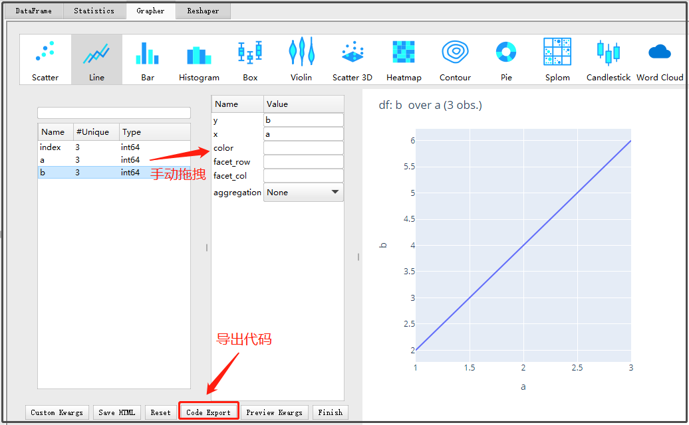
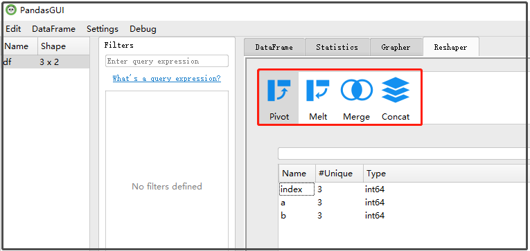
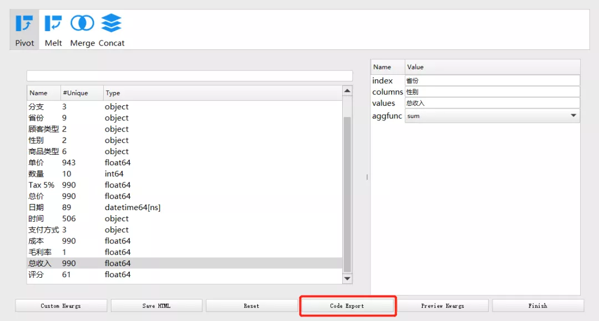
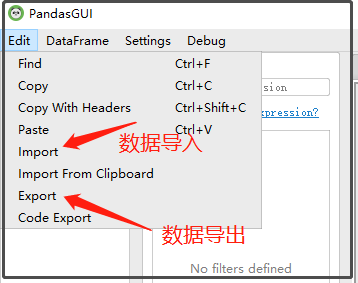

Python Pandas PandasGUI
<a name="e655a410"></a>
## 1、安装
安装步骤其安装步骤十分简单，只需要使用pip命令安装即可。
```bash
pip3 install pandasgui
#清华镜像
pip3 install -i https://pypi.tuna.tsinghua.edu.cn/simple pandasgui
```
建议大家用清华镜像安装，这样会稳定而且快很多。
<a name="W4uOR"></a>
## 2、功能特点
PandasGUI是一个交互式的数据操作界面，类似于Excel，但是其对于数据处理更加方便快捷，共拥有7项功能特点：

- 查看DataFrames和Series数据
- 交互式绘图
- 数据筛选
- 统计摘要
- 数据编辑和复制/粘贴
- 拖放导入CSV文件
- 搜索工具栏
<a name="nBctR"></a>
## 3、使用方式
启动PandasGUI的方式，代码也十分简单,只需要导入相关库，获取DataFrames数据并显示就好了。示例代码如下：
```bash
import pandas as pd
from pandasgui import show
df = pd.read_csv("train.csv")
show(df, setting={'block':True})
```
然后就可以看到一个图像化的界面了。然后在里面就可以数据分析，以及生成分析图像。
<a name="l9K3t"></a>
##### 创建并查看一个简单的 DataFrame。
```python
import pandas as pd
from pandasgui import show

df = pd.DataFrame(([[1, 2, 3], [4, 5, 6], [7, 8, 9]]), columns=['a', 'b', 'c'])
show(df)
```
上述代码会驱动后台打开一个GUI界面。<br />
<a name="tUfIX"></a>
## 4、pandasgui的6大特征
pandasgui一共有如下6大特征：<br />Ⅰ 查看数据帧和系列（支持多索引）；<br />Ⅱ 统计汇总；<br />Ⅲ 过滤；<br />Ⅳ 交互式绘图；<br />Ⅴ 重塑功能；<br />Ⅵ 支持csv文件的导入、导出；
<a name="GvrPZ"></a>
### 1. 查看数据帧和系列
运行下方代码，可以清晰看到数据集的shape，行列索引名。
```python
import pandas as pd
from pandasgui import show

df = pd.DataFrame(([[1, 2, 3], [4, 5, 6], [7, 8, 9]]), columns=['a', 'b', 'c'])
show(df)
```
结果如下：<br />
<a name="YgthU"></a>
### 2. 统计汇总
仔细观察下图，pandasgui会自动按列统计每列的数据类型、行数、非重复值、均值、方差、标准差 、最小值、最大值。<br />
<a name="RgUL2"></a>
### 3. 过滤
直接在`Filters`输入框中，输入a>=2，如下图所示。<br /><br />输入公式后，接着点击Enter，即可完成对列的筛选。<br />
<a name="qb5Ad"></a>
### 4. 交互式绘图
这里定义了一个3行2列的DataFrame，以a为横坐标，b为纵坐标进行绘图。
```python
import pandas as pd
from pandasgui import show

df = pd.DataFrame({"a":[1,2,3],"b":[2,4,6]})
show(df)
```
效果如下：<br /><br />这个界面功能丰富，可以导出绘图代码，还可以保存成html，还有一些其他按钮，大家自行探索。
<a name="tO3fC"></a>
### 5. 重塑功能
pandasgui还支持数据重塑，像数据透视表`pivot`、纵向拼接`concat`、横向拼接`merge`、宽表转换为长表`melt`等函数。<br /><br />还可以将以上的操作转换成代码的形式，通过点击Code Export这个按钮<br />
<a name="cocpw"></a>
### 6. 支持csv文件的导入、导出
支持数据导入、导出，更加便捷的操作数据集。同时这里还有一些其他的菜单，等着大家仔细研究。<br />
