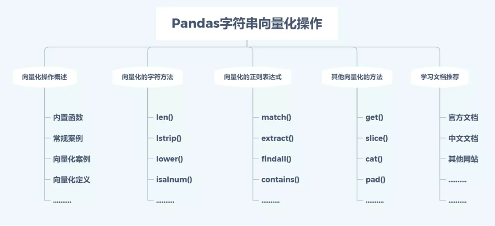

PythonPandas<br /><br />数据处理，也是风控非常重要的一个环节，甚至说是模型成败的关键环节。因此，娴熟简洁的数据处理技巧，是提高建模效率和建模质量的必要能力。
<a name="kOiNM"></a>
## 一、向量化操作的概述
对于文本数据的处理(清洗)，是现实工作中的数据时不可或缺的功能，在这一节中，将介绍Pandas的字符串操作。Python内置一系列强大的字符串处理方法，但这些方法**只能处理单个字符串**，处理一个序列的字符串时，需要用到for循环。<br />那么，有没有办法，不用循环就能同时处理多个字符串呢，Pandas的向量化操作（vectorized string operation）就提供了这样的方法。Pandas为可能存在字符串的Series和Index对象提供了str属性，不仅能够进行向量化操作，还能够处理缺失值。<br />向量化的操作使我们不必担心数组的长度和维度，只需要关系操作功能，尤为强大的是，除了支持常用的字符串操作方法，还集成了正则表达式的大部分功能，这使得pandas在处理字符串列时，具有非常大的魔力。<br />例如，要计算每个单词中‘a’的个数，下面一行代码就可以搞定，非常高效
```python
s = pd.Series(['amazon','alibaba','baidu'])
s.str.count('a')
0    2
1    3
2    1
```
假如用内置的字符串函数进行操作，需要进行遍历，且Python原生的遍历操作无法处理缺失值。
```python
#用循环进行处理
s = ['amazon','alibaba','baidu']
[i.count('a') for i in s]
[2, 3, 1]

#存在缺失值时，打印报错
s = ['amazon','alibaba','baidu',None]
[i.count('a') for i in s]
AttributeError: 'NoneType' object has no attribute 'lower'
```
Pandas的向量化操作，能够正确的处理缺失值，无报错信息，如下
```python
s = pd.Series(['amazon','alibaba','baidu',None])
s.str.count('a')
Out[36]: 
0    2.0
1    3.0
2    1.0
3    NaN
dtype: float64
```
通过上面的例子，对向量化进行简单总结，向量化是一种同时操作整个数组而不是一次操作一个元素的方法，下面从看看具体怎么应用。
<a name="k6a93"></a>
## 二、向量化的字符串处理方法
Pandas的字符串属的方法几乎包括了大部分Python的内置字符串方法（内置共有45个方法），下面将列举一些常见的方法的用法，例如上面的`count()`方法将会返回某个字符的个数，而len方法将会返回整个字符的长度。

| **方法** | **说明** |
| --- | --- |
| `len()` | 计算字符串长度 |
| `strip()` | 等价于`str.strip`，去除字符串开头和结尾处指定的字符 |
| `rstrip()` | 等价于`str.rstrip`，删除字符串末尾的指定字符（默认为空格） |
| `lstrip()` | 等价于`str.lstrip`，截掉字符串左边的空格或指定字符 |
| `partition()` | 等价于`str.partition`，根据指定的分隔符(sep)将字符串进行分割，从左边开始 |
| `rpartition()` | 等价于`str.rpartition`，根据指定的分隔符(sep)将字符串进行分割，从右边开始 |
| `lower()` | 等价于`str.lower`，所有大写字母转换为小写字母，仅限英文 |
| `casefold()` | 等价于`str.casefold`，所有大写字母转换为小写字母，包括非英文 |
| `upper()` | 等价于`str.upper`，小写字母转换为大写字母 |
| `find()` | 等价于`str.find`，查找字符串中指定的子字符串sub第一次出现的位置 |
| `rfind()` | 等价于`str.rfind`，查找字符串中指定的子字符串sub最后一次出现的位置 |
| `index()` | 等价于`str.index`，查找字符串中第一次出现的子字符串的位置 |
| `rindex()` | 等价于`str.rindex`，返回子字符串最后一次出现在字符串中的索引位置 |
| `capitalize()` | 等价于`str.capitalize`，将字符串的第一个字母变成大写，其余字母变为小写 |
| `swapcase()` | 等价于`str.swapcase`，将字符串str中的大小写字母同时进行互换 |
| `normalize()` | 返回Unicode 标注格式。等价于 `unicodedata.normalize` |
| `translate()` | 等价于`str.translate`，根据`maketrans()`函数给出的字符映射表来转换字符 |
| `isalnum()` | 等价于`str.isalnum`，检测字符串是否由字母和数字组成 |
| `isalpha()` | 等价于`str.isalpha`，检测字符串是否只由字母组成 |
| `isdigit()` | 等价于`str.isdigit`，检测字符串是否只由数字组成 |
| `isspace()` | 等价于`str.isspace`，检测字符串是否只由空格组成 |
| `islower()` | 等价于`str.islower`，检测字符串中的字母是否全由小写字母组成 |
| `isupper()` | 等价于`str.isupper`，检测字符串中的字母是否全由大写字母组成 |
| `istitle()` | 等价于`str.istitle`，检测所有单词首字母是否为大写，且其它字母是否为小写 |
| `isnumeric()` | 等价于`str.isnumeric`，测字符串是否只由数字组成 |
| `isdecimal()` | 等价于`str.isdecimal`，检查字符串是否只包含十进制字符 |
| `startswith()` | 等价于`str.startswith(pat)`，判断字符串是否以指定字符或子字符串开头 |
| `endswith()` | 等价于`str.endswith(pat)`，判断字符串是否以指定字符或子字符串结尾 |
| `center()` | 等价于`str.center`，即字符串str居中，两边用字符填充 |
| `ljust()` | 等价于`str.ljust`，左对齐填充，并使用fillchar填充(默认为空格) |
| `rjust()` | 等价于`str.rjust`，右对齐填充，默认为空格 |
| `zfill()` | 等价于`str.zfill`，右对齐，前面用0填充到指定字符串长度 |

下面选取部分函数举例，其他函数参考字符串模块
<a name="FUOD6"></a>
### 1、`len()`
```python
import pandas as pd
import numpy as np 

s = pd.Series(['amazon','alibaba','Baidu'])
s.str.len()
0    6
1    7
2    5
```
<a name="ryHQO"></a>
### 2、`lower()`
大小写转换，转换成小写字母
```python
s = pd.Series(['Amazon','alibaba','Baidu'])
s.str.lower()
0     amazon
1    alibaba
2      baidu
```
**3、**`**zfill()**`<br />右对齐，前面用0填充到指定字符串长度
```python
s = pd.Series(['56783','34','987766721','326'])
s.str.zfill(10) 
0    0000056783
1    0000000034
2    0987766721
3    0000000326
```
字符串的方法很多，这里就不一一举例了，大家可以参考字符串处理的文章。
<a name="cBwTw"></a>
## 三、向量化的正则表达式
Pandas的字符串方法根据Python标准库的re模块实现了正则表达式，下面将介绍Pandas的str属性内置的正则表达式相关方法

| 方法 | 说明 |
| --- | --- |
| `match()` | 对每个元素调用`re.match()`，将会返回一个布尔数组 |
| `extract()` | 对每个元素调用`re.match()`，将会返回所有结果构成的字符串数组 |
| `findall()` | 对每个元素用`re.findall()` |
| `replace()` | 用正则模式替换字符串 |
| `contains()` | 对每个元素调用`re.search()`返回布尔类型 |
| `count()` | 计算符合正则表达式的字符串数量 |
| `split()` | 等价于`str.spilt()`，支持正则表达式 |
| `rsplit()` | 等价于`str.rsplit()`支持正则表达式 |

<a name="hs8CG"></a>
### 1、`split()`
split，按指定字符或表达式分割字符串，类似split的方法返回一个列表类型的序列
<a name="uYKQJ"></a>
#### 1）基本用法
[https://pandas.pydata.org/pandas-docs/stable/reference/api/pandas.Series.str.split.html](https://pandas.pydata.org/pandas-docs/stable/reference/api/pandas.Series.str.split.html)
```python
Series.str.split(pat=None,
                 n=- 1, 
                 expand=False, *, 
                 regex=None )
```
<a name="Q2BFO"></a>
#### 2）参数解释
`**pat**`**：**str 或编译的正则表达式，可选。要拆分的字符串或正则表达式。如果未指定，则在空格处拆分。<br />`**n**`**：**int，默认 -1(全部)。限制输出中的拆分数量， None，0 和 -1 将被解释为返回所有拆分。<br />`**expand**`**：**布尔值，默认为 False。将拆分的字符串展开为单独的列。

- 如果 True ，返回 DataFrame/MultiIndex 扩展维度。
- 如果 False ，则返回包含字符串列表的系列/索引。

`**regex**`**：**布尔值，默认无。确定 passed-in 模式是否为正则表达式：

- 如果 True ，假设 passed-in 模式是正则表达式
- 如果 False ，则将模式视为文字字符串。
- 如果 None 和 pat 长度为 1，则将 pat 视为文字字符串。
- 如果 None 和 pat 长度不为 1，则将 pat 视为正则表达式。
- 如果 pat 是已编译的正则表达式，则不能设置为 False

**注 意：**n 关键字的处理取决于找到的拆分数量：

- 如果发现拆分 > n ，请先进行 n 拆分
- 如果发现拆分 n ，则进行所有拆分
- 如果对于某一行，找到的拆分数 n ，则追加 None 以填充到 n if expand=True

如果使用 `expand=True` ，Series 和 Index 调用者分别返回 DataFrame 和 MultiIndex 对象。使用带有pat 的`regex=False` 作为编译的正则表达式会引发错误。
<a name="AhfYz"></a>
#### 3）案例分析
```python
#按数字分割
s = pd.Series(['QQ1252号码','QQ1353加我','我389的'])
s.str.split('\d+')
0    [QQ, 号码]
1    [QQ, 加我]
2     [我, 的]

# 按固定字符分割
s = pd.Series(['a_b_c', 'c_d_e', np.nan, 'f_g_h'])
s.str.split('_')

0    [a, b, c]
1    [c, d, e]
2          NaN
3    [f, g, h]


#切分后的列表中的元素可以通过get方法或者 [] 方法进行读取
s.str.split('_').str.get(1)
Out[96]: 
0      b
1      d
2    NaN
3      g

#使用expand方法可以轻易地将这种返回展开为一个数据表
s.str.split('_', expand=True)
0    1    2
0    a    b    c
1    c    d    e
2  NaN  NaN  NaN
3    f    g    h

#同样，我们也可以限制切分的次数：
s.str.split('_', expand=True, n=1)
0    1
0    a  b_c
1    c  d_e
2  NaN  NaN
3    f  g_h
```
<a name="hdnGY"></a>
### 2、`rsplit()`
`rsplit`与`split`相似，不同的是，这个切分的方向是反的，即，从字串的尾端向首段切分
<a name="Tdlrn"></a>
#### 1）基础用法
[https://pandas.pydata.org/pandas-docs/stable/reference/api/pandas.Series.str.rsplit.html](https://pandas.pydata.org/pandas-docs/stable/reference/api/pandas.Series.str.rsplit.html)
```python
Series.str.rsplit(pat=None, n=- 1, expand=False)
```
<a name="wZVHs"></a>
#### 2）参数解释
`**pat**`**：**str 或编译的正则表达式，可选。要拆分的字符串或正则表达式。如果未指定，则在空格处拆分。<br />`**n**`**：**int，默认 -1(全部)。限制输出中的拆分数量。None，0 和 -1 将被解释为返回所有拆分。<br />`**expand**`**：**布尔值，默认为 False。将拆分的字符串展开为单独的列。

- 如果 True ，返回 DataFrame/MultiIndex 扩展维度。
- 如果 False ，则返回包含字符串列表的系列/索引。
<a name="jRswM"></a>
#### 3）案例分析
```python
s = pd.Series(['QQ1252号码','QQ1353加我','我389的'])
s.str.rsplit('_', expand=True, n=1)
     0    1
0  a_b    c
1  c_d    e
2  NaN  NaN
3  f_g    h
```
<a name="Rn26Y"></a>
### 3、`replace()`
<a name="y1IwF"></a>
#### 1）基本用法
[https://pandas.pydata.org/pandas-docs/stable/reference/api/pandas.Series.str.replace.html](https://pandas.pydata.org/pandas-docs/stable/reference/api/pandas.Series.str.replace.html)
```python
Series.str.replace(pat, repl, n=- 1, case=None, flags=0, regex=None)
```
<a name="gvE08"></a>
#### 2）参数解释
`**pat**`**：**str 或编译的正则表达式，字符串可以是字符序列或正则表达式。<br />`**repl**`**：**str 或可调用，替换字符串或可调用对象。可调用对象传递正则表达式匹配对象，并且必须返回要使用的替换字符串。<br />`**n**`**：**int，默认 -1(全部)从一开始就更换的数量。<br />`**case**`**：**布尔值，默认无。确定替换是否区分大小写：

- 如果为 True，则区分大小写(如果 pat 是字符串，则默认为)
- 设置为 False 不区分大小写
- 如果 pat 是已编译的正则表达式，则无法设置。

`**flags**`**：**int，默认 0(无标志)。正则表达式模块标志，例如重新忽略。如果 pat 是已编译的正则表达式，则无法设置。<br />`**regex**`**：**布尔值，默认为真。确定 passed-in 模式是否为正则表达式：

- 如果为 True，则假定 passed-in 模式是正则表达式。
- 如果为 False，则将模式视为文字字符串
- 如果 pat 是已编译的正则表达式或 repl 是可调用的，则不能设置为 False。
<a name="vXJmO"></a>
#### 3）案例分析
replace方法默认使用正则表达式
```python
s = pd.Series(['A', 'B', 'C', 'Aaba', 'Baca','', np.nan, 'CABA', 'dog', 'cat'])

s.str.replace('^.a|dog', 'XX-XX ', case=False)
Out[27]: 
0           A
1           B
2           C
3    XX-XX ba
4    XX-XX ca
5            
6         NaN
7    XX-XX BA
8      XX-XX 
9     XX-XX t

pd.Series(['foo', 'fuz', np.nan]).str.replace('f.', 'ba', regex=True)
0    bao
1    baz
2    NaN


pd.Series(['f.o', 'fuz', np.nan]).str.replace('f.', 'ba', regex=False)
0    bao
1    fuz
2    NaN
```
<a name="znnDP"></a>
### 4、`findall()`
<a name="wp40t"></a>
#### 1)基础用法
```python
Series.str.findall(pat, flags=0)
```
<a name="aWFXE"></a>
#### 2）参数解释
`**pat**`**：**正则表达式<br />`**flags**`**：**Flags from re module, e.g. re.IGNORECASE (default is 0, which means no flags)，是否忽略大小写。
<a name="DCrwV"></a>
#### 3）案例分析
```python
import re
#提取聊天记录中的QQ号
s=pd.Series(['QQ号码123452124','QQ123356123','我的Q123356189','Q号123356111注意','加我Q号123356124有惊喜'])
s.str.findall('\d+')
0    [123452124]
1    [123356123]
2    [123356189]
3    [123356111]
4    [123356124]


s.str.findall('Q')
0    [Q, Q]
1    [Q, Q]
2       [Q]
3       [Q]
4       [Q]

s.str.findall('q')
0    []
1    []
2    []
3    []
4    []

s.str.findall('q', flags=re.IGNORECASE)

0    [Q, Q]
1    [Q, Q]
2       [Q]
3       [Q]
4       [Q]
```
<a name="HHmbL"></a>
## 四、其他向量化的方法
除了上面介绍的Pandas字符串的正常操作和正则表达式外，Pandas的str属性还提供了其他的一些方法，这些方法非常的有用，在进行特征提取或者数据清洗时，非常高效，具体如下：

| 方法 | 说明 |
| --- | --- |
| `get()` | 获取元素索引位置上的值，索引从0开始 |
| `slice()` | 对元素进行切片取值 |
| `slice_replace()` | 对元素进行切片替换 |
| `cat()` | 连接字符串 |
| `repeat()` | 重复元素 |
| `normalize()` | 将字符串转换为Unicode规范形式 |
| `pad()` | 在字符串的左边右边或者两边增加空格 |
| `wrap()` | 将字符串按照指定的宽度换行 |
| `join()` | 用分隔符连接Series对象的每个元素 |
| `get_dummies()` | 按照分隔符提取每个元素的dummy变量，转换为one-hot编码的DataFrame |

<a name="Nm5w5"></a>
### 1、`wrap()`
处理长文本数据(段落或消息)时，Pandas `str.wrap()`是一种重要的方法。当它超过传递的宽度时，用于将长文本数据分发到新行中或处理制表符空间。
<a name="A7E2t"></a>
#### 1）基本用法
[https://pandas.pydata.org/pandas-docs/stable/reference/api/pandas.Series.str.wrap.html](https://pandas.pydata.org/pandas-docs/stable/reference/api/pandas.Series.str.wrap.html)
```python
Series.str.wrap(width, **kwargs)
```
<a name="CsZhN"></a>
#### 2）参数解释
`**width**`**：**整数值，定义最大线宽<br />`****kwargs**`<br />`expand_tabs`：布尔值，如果为True，则将制表符扩展为空格<br />`replace_whitespace`：布尔值(如果为true)，则每个空格字符均被单个空格替换。<br />`drop_whitespace`：布尔值，如果为true，则在新行的开头删除空白(如果有)<br />`break_long_words`：布尔值(如果为True)会打断比传递的宽度长的单词。<br />`break_on_hyphens`：布尔值(如果为true)会在字符串长度小于宽度的连字符处中断字符串。
<a name="yn1i1"></a>
#### 3）案例分析
```python
s = pd.Series(['0000056783','0000000034','0987766721'])
s.str.wrap(5)
0    00000\n56783
1    00000\n00034
2    09877\n66721


print('09877\n66721')
09877
66721
```
<a name="N4X1X"></a>
### 2、`pad()`
Pandas 提供了一种向系列中的每个字符串元素添加填充(空格或其他字符)的方法。每次调用.str时都必须加上前缀，以区别于Python的默认函数，否则会引发错误。
<a name="Ivmcw"></a>
#### 1）基本用法
[https://pandas.pydata.org/pandas-docs/stable/reference/api/pandas.Series.str.pad.html](https://pandas.pydata.org/pandas-docs/stable/reference/api/pandas.Series.str.pad.html)
```python
Series.str.pad(width, side='left', fillchar=' ')
```
<a name="IJjqN"></a>
#### 2）参数解释
`**width**`：结果字符串的最小宽度。

- 如果width小于或等于字符串的长度，则不添加填充。
- 如果width大于字符串长度，则多余的空格将用空格或传递的字符填充。

`**side**`**：_{'left', 'right', 'both'}, default 'left'。_**字符串输入(“左”，“右”或“两者”)。默认值为“左”。填充将在各侧平均添加。<br />`**fillchar**`**：**要填充的字符，默认值为‘(空白)。
```python
# 默认从左边开始填充
s = pd.Series(['A','E','C','D','E'])
s.str.pad(5 ,fillchar='x')
0    xxxxA
1    xxxxE
2    xxxxC
3    xxxxD
4    xxxxE

# 从右边开始填充
s.str.pad(5 ,side='right',fillchar='x')
0    Axxxx
1    Exxxx
2    Cxxxx
3    Dxxxx
4    Exxxx

# 默认为空格
s.str.pad(5)
Out[65]: 
0        A
1        E
2        C
3        D
4        E
```
<a name="zADu5"></a>
### 3、`slice()`
Pandas `str.slice()`方法用于从Pandas系列对象中存在的字符串中分割子字符串。它非常类似于Python在[start: stop: step]上进行切片的基本原理，这意味着它需要三个参数，即开始位置，结束位置和要跳过的元素数量。
<a name="nZITQ"></a>
#### 1）基本用法
```python
Series.str.slice(start=None, stop=None, step=None)
```
<a name="Mq2PG"></a>
#### 2）参数解释
start:int值，告诉从哪里开始切片<br />stop:int值，告诉在哪里结束切片<br />step:int值，指示切片期间要步进多少个字符
<a name="OWyR7"></a>
#### 3） 案例讲解
```python
s = pd.Series(['马 云：2000亿','马化腾：1800亿','王健林：1200亿','小伍哥：0.000012亿'])
s.str.slice(0,3)
0    马 云
1    马化腾
2    王健林
3    小伍哥

s = pd.Series(["koala", "dog", "chameleon"])
s
0        koala
1          dog
2    chameleon

s.str.slice(start=1)
0        oala
1          og
2    hameleon

s.str.slice(start=-1)
0           a
1           g
2           n
s.str.slice(stop=2)
0    ko
1    do
2    ch

s.str.slice(step=2)
0      kaa
1       dg
2    caeen

s.str.slice(start=0, stop=5, step=3)
0    kl
1     d
2    cm

s.str[0:5:3]
0    kl
1     d
2    cm
```
<a name="Ak3kY"></a>
### 4、`get()`
使用Pandas `str.get()`方法获取通过位置的元素。此方法适用于整个系列中的字符串，数值甚至列表。每次都必须给.str加上前缀，以使其与Python的默认`get()`方法区分开。
<a name="rXtdM"></a>
#### 1)基础用法
```python
Series.str.get(i)
```
<a name="eHtd7"></a>
#### 2）参数解释
**i：**要提取的元素的位置，仅整数值。
<a name="ZjEWO"></a>
#### 3）案例分析
```python
s = pd.Series(['马 云：2000亿','马化腾：1800亿','王健林：1200亿','小伍哥：0.000012亿'])
s.str.get(0)
0    马
1    马
2    王
3    小


s = pd.Series(["String",
               (1, 2, 3),
               ["a", "b", "c"],
               123,
               -456,
               {1: "Hello", "2": "World"}])

s.str.get(1)
0        t
1        2
2        b
3      NaN
4      NaN
5    Hello
```
<a name="KIFjK"></a>
### 5、`slice_replace()`
用另一个值替换字符串的位置切片
<a name="sTbj8"></a>
#### 1）基本用法
```python
Series.str.slice_replace(start=None, stop=None, repl=None)
```
<a name="GfxfJ"></a>
#### 2）参数解释
`**start**`**：**整数，可选<br />用于切片的左索引位置。如果未指定 (None)，则切片在左侧是无界的，即从字符串的开头切片。<br />`**stop**`**：**整数，可选<br />用于切片的右索引位置。如果未指定 (None)，则切片在右侧是无界的，即切片直到字符串的末尾。<br />`**repl**`**：**str，可选<br />用于替换的字符串。如果未指定 (None)，则切片区域将替换为空字符串。
<a name="cCqbm"></a>
#### 3）案例分析
```python
s = pd.Series(['马 云：2000亿','马化腾：1800亿','王健林：1200亿','小伍哥：0.000012亿'])
#切片替换
s.str.slice_replace(0,3,'小伍哥')
0        小伍哥：2000亿
1        小伍哥：1800亿
2        小伍哥：1200亿
3    小伍哥：0.000012亿


s.str.join('-')
0            马- -云-：-2-0-0-0-亿
1            马-化-腾-：-1-8-0-0-亿
2            王-健-林-：-1-2-0-0-亿
3    小-伍-哥-：-0-.-0-0-0-0-1-2-亿


s = pd.Series(['A','E','C','D','E'])
s.str.get_dummies()
   A  C  D  E
0  1  0  0  0
1  0  0  0  1
2  0  1  0  0
3  0  0  1  0
4  0  0  0  1
```
<a name="Zg0yG"></a>
### 6、`get_dummies()`
Series 中的每个字符串都由 sep 拆分，并作为虚拟/指标变量的 DataFrame 返回。
<a name="HqEqc"></a>
#### 1）基础用法
```python
Series.str.get_dummies(sep='|')
```
<a name="ErSgr"></a>
#### 2）参数解释
`**sep**`**：str，默认 “|”**<br />要拆分的字符串。
<a name="UGIbX"></a>
#### 3）案例分析
```python
pd.Series(['a|b', 'a', 'a|c']).str.get_dummies()
a  b  c
0  1  1  0
1  1  0  0
2  1  0  1


pd.Series(['a|b', np.nan, 'a|c']).str.get_dummies()
a  b  c
0  1  1  0
1  0  0  0
2  1  0  1
```
另一个需要好好解释的是`get_dummies()`方法，举个例子：假如用A，B，C，D来表示一个人的某个特征：
```python
monte = pd.Series(['Graham Chapman', 'John Cleese', 'Terry Gilliam',
                   'Eric Idle', 'Terry Jones', 'Michael Palin'])
full_monte = pd.DataFrame({'name': monte,
                           'info': ['B|C|D', 'B|D', 'A|C',
                                    'B|D', 'B|C', 'B|C|D']})
full_monte
             name   info
0  Graham Chapman  B|C|D
1     John Cleese    B|D
2   Terry Gilliam    A|C
3       Eric Idle    B|D
4     Terry Jones    B|C
5   Michael Palin  B|C|D
```
可以看到比如Graham Chapman有B，C，D三种特征，而John Cleese有B和D两种特征。这时可以用`get_dummies('|')`以|作为分隔符，将这些特征进行one-hot
```python
full_monte['info'].str.get_dummies('|')
   A  B  C  D
0  0  1  1  1
1  0  1  0  1
2  1  0  1  0
3  0  1  0  1
4  0  1  1  0
5  0  1  1  1
```
<a name="lboK7"></a>
### 7、`repeat()`
Pandas `str.repeat()`方法用于在传递的系列本身的相同位置重复字符串值。如果定义每个元素应重复重复的次数，也可以传递一个数组。在这种情况下，数组的长度必须与Series的长度相同。
<a name="MAxEI"></a>
#### 1）基本用法
[https://pandas.pydata.org/pandas-docs/stable/reference/api/pandas.Series.str.repeat.html](https://pandas.pydata.org/pandas-docs/stable/reference/api/pandas.Series.str.repeat.html)
```python
Series.str.repeat(repeats)
```
<a name="RmqmD"></a>
#### 2）参数解释
`**repeats**`**：**int或int列表，用于定义必须重复字符串的次数。(列表的大小必须等于系列)
<a name="FbbGT"></a>
#### 3）案例分析
```python
s = pd.Series(['A','E','C','D','E'])
s.str.repeat(2) 
0    AA
1    EE
2    CC
3    DD
4    EE

# 不同的行重复不同的次数
s.str.repeat(repeats=[1, 2, 3])
0      a
1     bb
2    ccc
```
<a name="AYVCC"></a>
### 8、`cat()`
连接字符串，对于不同对象的作用结果并不相同，其中的对象包括：单列、双列、多列
<a name="h80pT"></a>
#### 1）基本用法
```python
Series.str.cat(others=None, sep=None, na_rep=None, join='left')
```
<a name="Ny1iU"></a>
#### 2）参数解释
`**others**`**：系列、索引、数据帧、np.ndarray 或 list-like**<br />Series、Index、DataFrame、np.ndarray(一维或二维)和其他 list-likes 的字符串必须与调用 Series/Index 的长度相同，但索引对象除外(即 Series/Index/DataFrame)如果join 不是无。<br />如果其他是包含 Series、Index 或 np.ndarray (1-dim) 组合的 list-like，则所有元素都将被解包并且必须单独满足上述条件。<br />如果其他为 None，则该方法返回调用 Series/Index 中所有字符串的串联。<br />`**sep**`**：**str，默认“”<br />不同元素/列之间的分隔符。默认情况下使用空字符串‘’。<br />`**na_rep**`**：**str 或无，默认无，为所有缺失值插入的表示：

- 如果na_rep 为None，并且others 为None，则从结果中省略系列/索引中的缺失值。
- 如果na_rep 为None，并且others 不是None，则在任何列(连接之前)中包含缺失值的行将在结果中具有缺失值。

`**join**`**：**{'left', 'right', 'outer', 'inner'}，默认 ‘left’<br />确定调用 Series/Index 和 others 中的任何 Series/Index/DataFrame 之间的 join-style(没有索引的对象需要匹配调用 Series/Index 的长度)。要禁用对齐，请在 others 中的任何系列/索引/数据帧上使用 `.values`。
<a name="eD6bo"></a>
#### 3) 案例分析
```python
#如果连接的是两个序列，则会一一对应连接
s1 = pd.Series(['A','E','C','D','E'])
s2 = pd.Series(['1','2','3','4','5'])
s1.str.cat(s2)
0    A1
1    E2
2    C3
3    D4
4    E5
#只提供一个序列，则只连接自己，默认为空格
s1.str.cat()
'AECDE'
s1.str.cat(sep='-')
'A-E-C-D-E'

#也可以同时复核连接，参数可以是二维的
d = pd.concat([s1, s2], axis=1)
s3 = pd.Series(['x','x','y','y','y'])

s3.str.cat(d, na_rep='-')
0    xA1
1    xE2
2    yC3
3    yD4
4    yE5

# 缺失值处理
s = pd.Series(['a', 'b', np.nan, 'd'])
s.str.cat(sep=' ')
'a b d'

s.str.cat(sep=' ', na_rep='?')
'a b ? d'
```
