PythonPandas<br />当在处理包含某种序列（例如时间序列数据）的变量的数据集时，数据通常需要进行重塑。<br />Pandas 提供了各种用于重塑 DataFrame 的内置方法。其中，`stack()` 和 `unstack()` 是最流行的 2 种重组列和行的方法：

- `stack()`：从列到行堆叠
- `unstack()`：从行到列取消堆叠

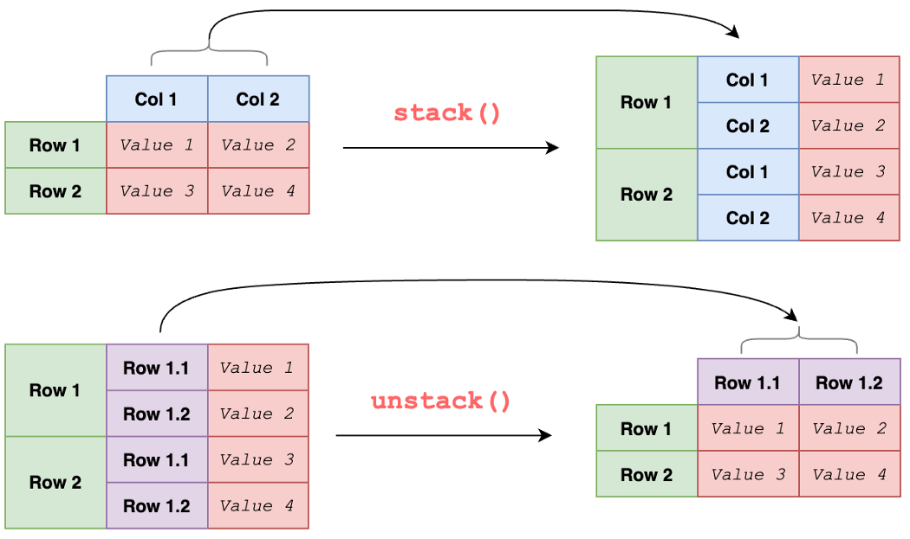<br />`stack()` 和 `unstack()` 似乎使用起来相当简单，但仍然应该知道一些技巧来加快数据分析。<br />分享 Pandas 的几个技巧：

- 单层
- 多层次：简单案例
- 多层次：缺失值
- 多个级别：指定要堆叠的级别
- 多个级别：删除缺失值
- `unstack`：简单案例
- `unstack`：更多用法
<a name="odZFz"></a>
### 1、单层
最简单的 `stack()`可以应用于具有单层列的 DataFrame。它只是将标签从列堆叠到行并输出一个系列。
```python
df_single_level = pd.DataFrame(
    [['Mostly cloudy', 10], ['Sunny', 12]],
    index=['London', 'Oxford'],
    columns=['Weather', 'Wind']
)
df_single_level.stack()
```
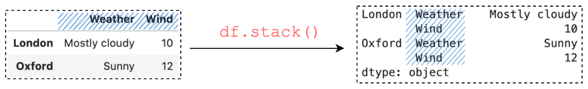
<a name="jJMef"></a>
### 2、多层次：简单案例
通常会在具有多级列的 DataFrame 上使用 `stack()`。<br />创建一个 DataFrame。有多种方法可以创建具有多级列的 DataFrame，最简单的方法之一是创建 MultiIndex 对象 `MultiIndex.from_tuples()` 并将结果传递给 `pd.DataFrame()` 中的 columns 参数：
```python
multi_col_1 = pd.MultiIndex.from_tuples(
    [('Wind', 'mph'), ('Wind', 'm/s')]
)
df_multi_level_1 = pd.DataFrame(
    [[13, 5.5], [19, 8.5]],
    index=['London', 'Oxford'],
    columns=multi_col_1
)
```
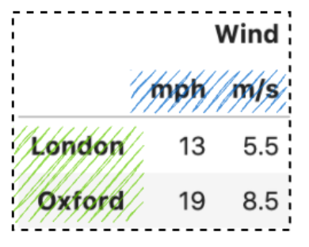<br />通过调用 `stack()`，它将获取列级别(mph, m/s) 并将其堆叠到行轴上。
```python
df_multi_level_1.stack()
# Same as 
df_multi_level_1.stack(level=-1)
df_multi_level_1.stack(-1)
```
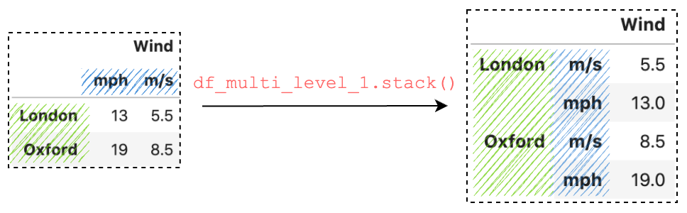<br />在幕后，它根据参数 level 运行操作。参数 level 默认为 -1 ，它采用最内层并将其从列轴堆叠到行轴上。
<a name="uJfVb"></a>
### 3、多层次：缺失值
在堆叠具有多级列的 DataFrame 时，通常会出现缺失值。创建另一个 DataFrame 示例：
```python
multi_col_2 = pd.MultiIndex.from_tuples(
    [('Wind', 'mph'), ('Temperature', '°C')]
)
df_multi_level_2 = pd.DataFrame(
    [[13, 8], [19, 6]],
    index=['London', 'Oxford'],
    columns=multi_col_2
)
df_multi_level_2.stack()
```
与前面的示例 multi_col_1 在第一级中具有相同的值“Wind”不同，multi_col_2 具有 2 个不同的值“Wind”和“Temperature”。现在得到了缺失值，因为堆叠的 DataFrame 比原始 DataFrame 有更多的值，并且缺失值用 NaN 填充。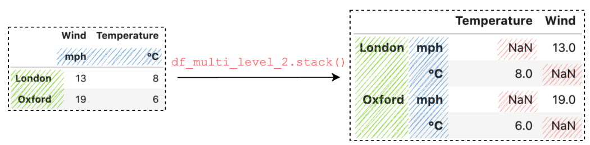
<a name="q7GPf"></a>
### 4、多层次：规定要堆叠的层次
`stack()` 中的第一个参数是 level，它控制堆叠的级别。创建一个具有 2 个不同级别的 MultiIndex：
```python
multi_col_2 = pd.MultiIndex.from_tuples(
    [('Wind', 'mph'), ('Temperature', '°C')]
)
# Level 0
multi_col_2.get_level_values(0)
# Index(['Wind', 'Temperature'], dtype='object')
# Level 1
multi_col_2.get_level_values(1)
# Index(['mph', '°C'], dtype='object')
```
可以传递一个数字来规定要堆叠的级别。要规定要堆叠的多个级别，可以传递一个列表：
```python
df_multi_level_2.stack(0)
df_multi_level_2.stack([0, 1])
df_multi_level_2.stack([1, 0])
```
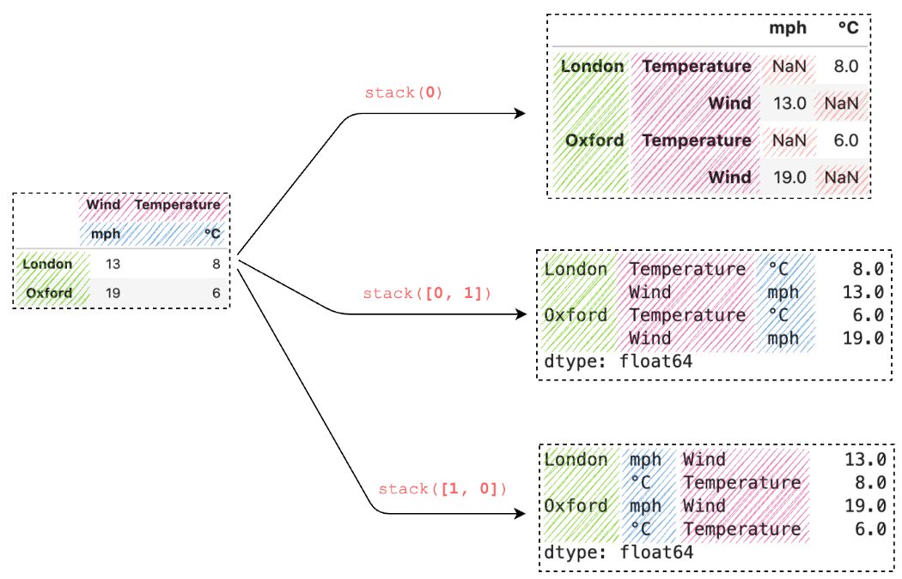
<a name="eHIIJ"></a>
### 5、多层次：删除缺失值
默认情况下，调用 `stack()` 时会删除所有值缺失的行，可以通过将 dropna 设置为 False 来控制此行为：
```python
df_multi_level_3 = pd.DataFrame(
    [[None, 10], [11, 7.0]],
    index=['London', 'Oxford'],
    columns=multi_col_2
)
df_multi_level_3.stack()
df_multi_level_3.stack(dropna=False)
```
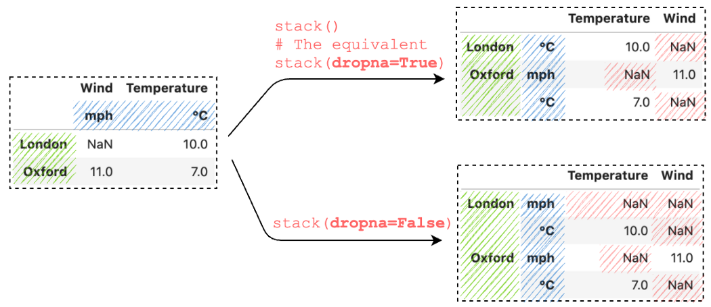
<a name="r5OQd"></a>
### 6、`unstack`：简单案例
同样，Pandas `unstack()` 也支持参数级别，默认为 -1，它将对最内层索引应用操作。
```python
index = pd.MultiIndex.from_tuples([
    ('Oxford', 'Temperature'), 
    ('Oxford', 'Wind'),
    ('London', 'Temperature'), 
    ('London', 'Wind')
])
s = pd.Series([1,2,3,4], index=index)
```
通过在具有 MultiIndex 的 Series 上调用 `unstack()`，它会将最内层的索引取消堆叠到列上。要指定要取消堆叠的级别，可以传递级别编号：
```python
s.unstack()
# It's equivalent to
s.unstack(level=-1)
# Unstack a specific level
s.unstack(level=0)
```
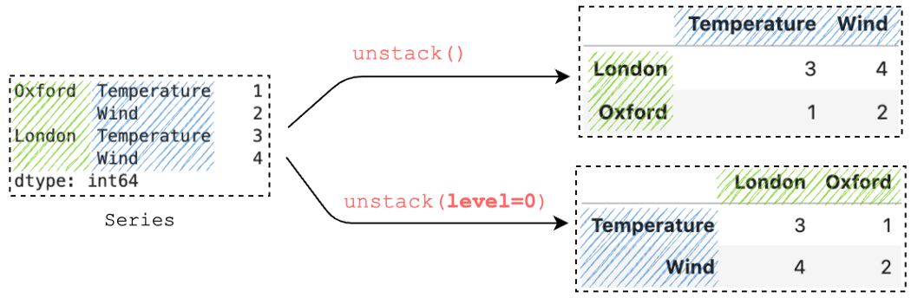
<a name="zUWHP"></a>
### 7、`unstack`：更多用法
通常，会在更多级别上使用 `unstack()`。<br />看一个具有 3 个级别的示例：
```python
index = pd.MultiIndex.from_tuples([
    ('Oxford', 'Weather', '01-01-2022'), 
    ('Oxford', 'Temperature', '01-01-2022'), 
    ('Oxford', 'Weather', '02-01-2022'),
    ('Oxford', 'Temperature', '02-01-2022'),
    ('London', 'Weather', '01-01-2022'), 
    ('London', 'Temperature', '01-01-2022'),
    ('London', 'Weather', '02-01-2022'),
    ('London', 'Temperature', '02-01-2022'),
])
s = pd.Series(
    ['Sunny', 10, 'Shower', 7, 'Shower', 5, 'Sunny', 8], 
    index=index
)
```
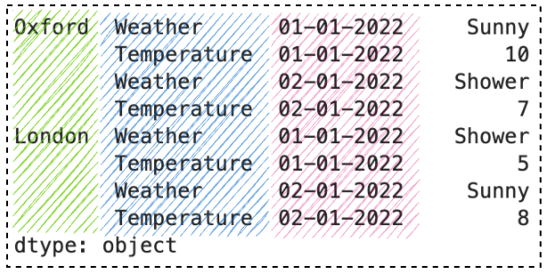<br />通过调用 `unstack()`，它将最里面的索引解栈到列中。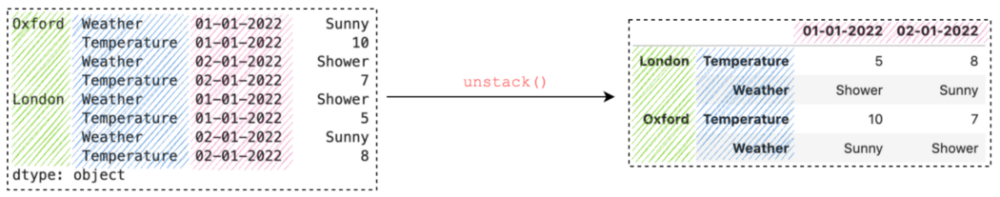例如，可以使用方法链来运行另一个 `unstack()` 或传递一个列表
```python
# Method chaining
df.unstack().unstack()
df.unstack().unstack().unstack()
# The equivalent
df.unstack([2,1])
df.unstack([2,1,0])
```
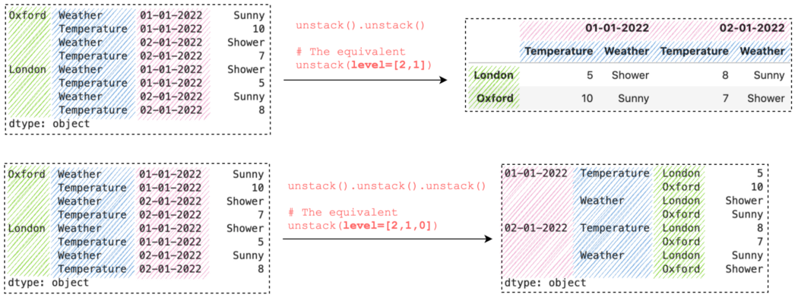<br />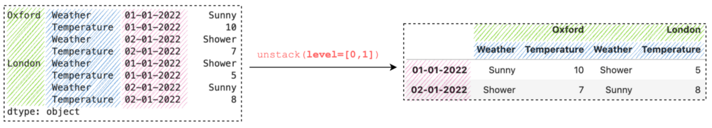
