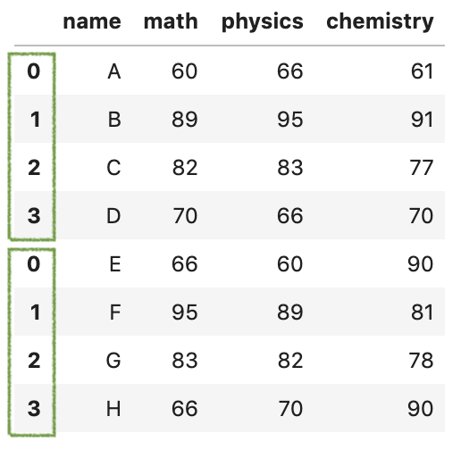
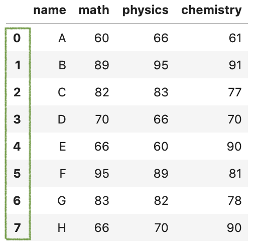
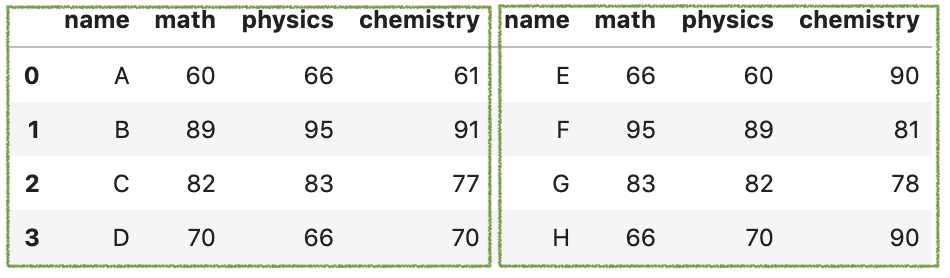
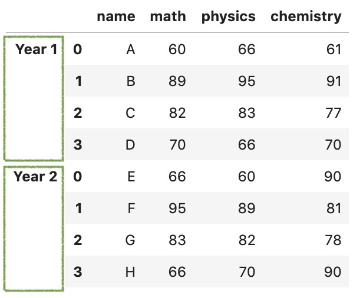
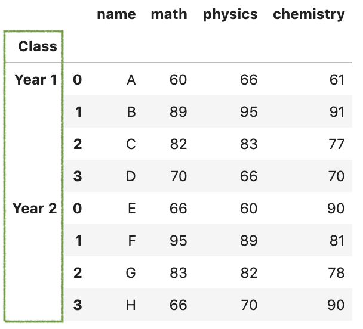
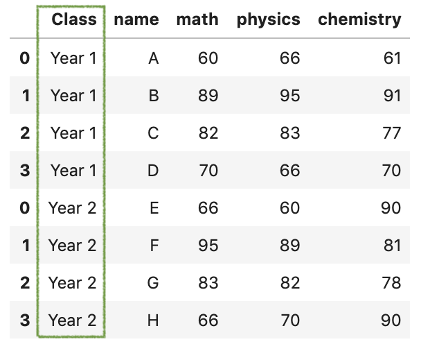
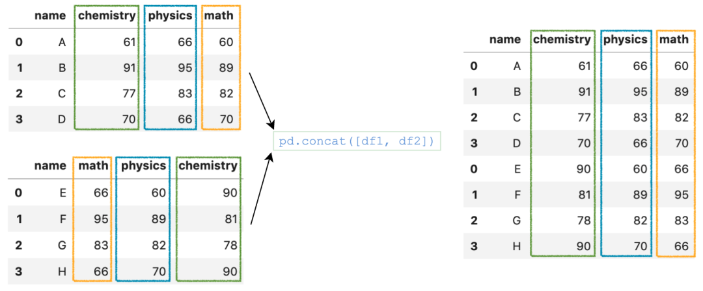
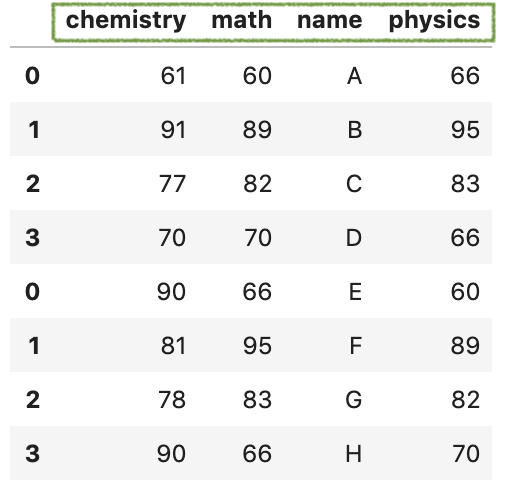
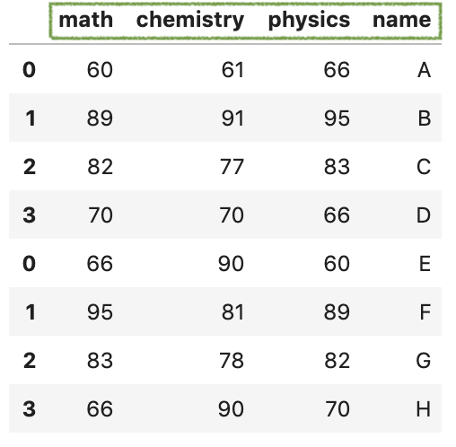

Python Pandas<br />`pandas`提供了很多功能可组合合并`DataFrame`，`concat()`函数就是其中之一。<br />这里介绍`concat`常用的5个操作技巧：

- 处理索引和轴
- 避免重复索引
- 使用keys和names选项添加层次结构索引
- 列匹配和排序
- 连接CSV文件数据集
<a name="OWxYS"></a>
## 1、处理索引和轴
假设有2个关于考试成绩的数据集。
```python
df1 = pd.DataFrame（{ 
    'name'：['A'，'B'，'C'，'D']，
    'math'：[60,89,82,70]，
    'physics'：[66， 95,83,66]，
    'chemistry'：[61,91,77,70] 
}）
df2 = pd.DataFrame（{ 
    'name'：['E'，'F'，'G'，'H']，
    'math'：[66,95,83,66]，
    'physics'：[60， 89,82,70]，
    'chemistry'：[90,81,78,90] 
}）
```
最简单的用法就是传递一个含有`DataFrames`的列表，例如`[df1, df2]`。默认情况下，它是沿`axis=0`垂直连接的，并且默认情况下会保留df1和df2原来的索引。
```python
pd.concat（[df1，df2]）
```
<br />如果想要合并后忽略原来的索引，可以通过设置参数`ignore_index=True`，这样索引就可以从0到n-1自动排序了。
```python
pd.concat（[df1，df2]，ignore_index = True）
```
<br />如果想要沿水平轴连接两个`DataFrame`，可以设置参数`axis=1`。
```python
pd.concat（[df1，df2]，axis = 1）
```
<br />以上是一些基本操作，继续往下看。
<a name="pEHCn"></a>
## 2、避免重复索引
`concat()`函数会默认保留原`dataframe`的索引。那有些情况，保留原来的索引，并且还想验证合并后的结果是否有重复的索引，该怎么办呢？<br />可以通过设置参数`verify_integrity=True`，将此设置`True`为时，如果存在重复的索引，将会报错。比如下面这样。
```python
try:
    pd.concat([df1,df2], verify_integrity=True)
except ValueError as e:
    print('ValueError', e)
ValueError: Indexes have overlapping values: Int64Index([0, 1, 2, 3], dtype='int64')
```
<a name="igtC9"></a>
## 3、使用`keys`和`names`选项添加层次结构索引
添加层次结构索引非常的有用，可以进行更多层的数据分析。<br />举个例子，某些情况下并不想合并两个`dataframe`的索引，而是想为两个数据集贴上标签。比如分别为`df1`和`df2`添加标签`Year 1`和`Year 2`。<br />这种情况，只需指定`keys`参数即可。
```python
res = pd.concat（[df1，df2]，keys = ['Year 1'，'Year 2']）
res
```
<br />如果想要获取`Year 1`的数据集，可以直接使用`loc`像下面这样操作：
```python
res.loc['Year 1']
```
另外，参数`names`可用于为所得的层次索引添加名称。例如，将名称`Class`添加到刚创建的的标签上。
```python
pd.concat(
    [df1，df2]，
    keys = ['Year 1'，'Year 2']，
    names = ['Class'，None]，
)
```
<br />如果要重置索引并将其转换为数据列，可以使用`reset_index()`，这一步操作也是非常的实用。
```python
pd.concat(
    [df1, df2], 
    keys=['Year 1', 'Year 2'],
    names=['Class', None],
).reset_index(level=0)   
# reset_index(level='Class')
```

<a name="PeENf"></a>
## 4、列匹配和排序
`concat()`函数还可以将合并后的列按不同顺序排序。虽然，它会自动将两个df的列对齐合并。但默认情况下，生成的`DataFrame`与第一个`DataFrame`具有相同的列排序。例如，在以下示例中，其顺序与`df1`相同。<br /><br />如果想要按字母顺序对结果`DataFrame`进行排序，则可以设置参数`sort=True`。
```python
pd.concat([df1, df2], sort=True)
```
<br />或者也可以自定义排序，像下面这样：
```python
custom_sort = ['math', 'chemistry', 'physics', 'name']
res = pd.concat([df1, df2])
res[custom_sort]
```

<a name="aKhP6"></a>
## 5、连接CSV文件数据集
假设需要从一堆CSV文件中加载并连接数据集。常规做法，可能会使用`for`循环解决，比如下面这样。
```python
import pathlib2 as pl2
ps = pl2.Path('data/sp3')
res = None
for p in ps.glob('*.csv'):
    if res is None:
        res = pd.read_csv(p)
    else:
        res = pd.concat([res, pd.read_csv(p)])
```
但上面`pd.concat()`在每次for循环迭代中都会被调用一次，效率不高，推荐使用列表推导式的写法。
```python
import pathlib2 as pl2
ps = pl2.Path('data/sp3')
dfs = (
    pd.read_csv(p, encoding='utf8') for p in ps.glob('*.csv')
)
res = pd.concat(dfs)
res
```
这样就可以用一行代码读取所有CSV文件并生成`DataFrames`的列表`dfs`。然后只需要调用`pd.concat(dfs)`一次即可获得相同的结果，简洁高效。<br />使用`%%timeit`测试下上面两种写法的时间，第二种列表推导式大概省了一半时间。
```python
# for-loop solution
298 ms ± 11.8 ms per loop (mean ± std. dev. of 7 runs, 1 loop each)
# list comprehension solution
153 ms ± 6 ms per loop (mean ± std. dev. of 7 runs, 1 loop each)
```
